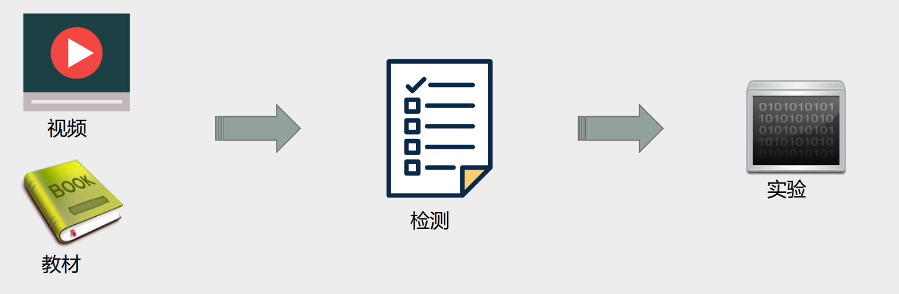
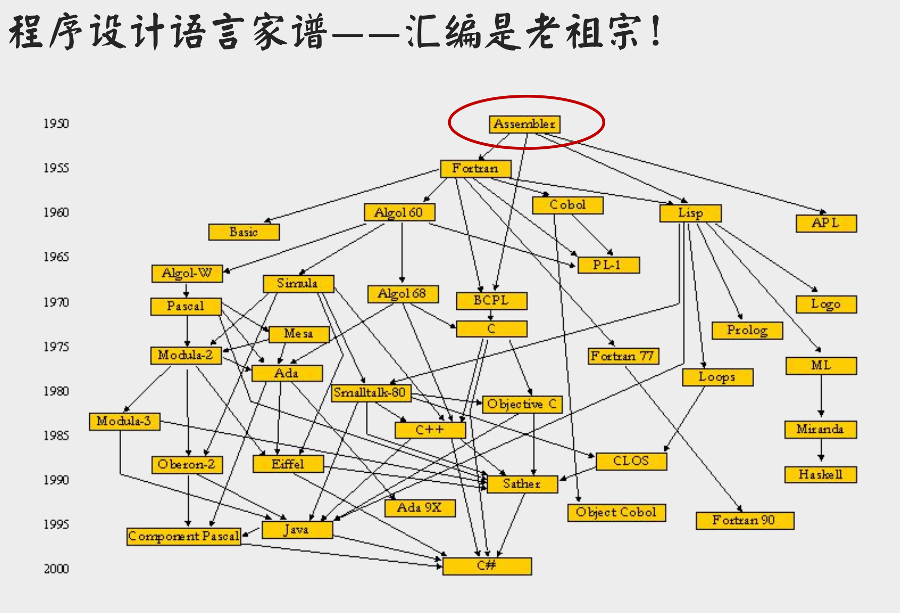
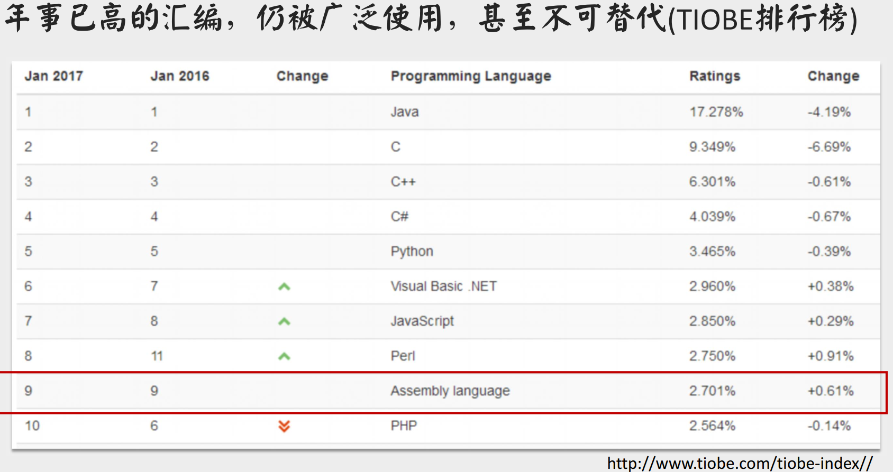

# 0101 为什么要学汇编语言

## 学习汇编语言的理由

- 汇编语言仍在发挥不可替代的作用
  - 效率
    - 运行效率：开发软件的核心部件，快速执行和实时响应。
    - 开发效率：做合适的事，开发效率无敌
  - 底层：计算机及外围设备的驱动程序
    - 操作系统的内核
    - 嵌入式系统：家用电器、仪器仪表、物联网……
- 汇编语言在学习计算机中起到的独特作用——直击计算机系统的核心
  - 便于加深对计算机原理和操作系统等课程的理解
  - 通过学习和使用汇编语言，能够感知、体会和理解机器的逻辑功能
  - 向上为理解各种软件系统的原理，打下技术理论基础
  - 向下为掌握硬件系统的原理，打下实践应用基础。
  - 学会底层的程序调试和错误分析方法  

## 这门课程学什么

课名：汇编语言程序设计

定位：理解硬件结构，掌握指令集，理解程序的运行过程

内容：8088、8086指令集与汇编语言程序设计

教材：王爽 汇编语言

本课只解决入门

- 降低入门难度

- 关注核心思维与方法

进一步延伸

- lnter 80x86汇编
- Linux汇编
- ARM汇编

## 学习方法

- 贯穿实践方法

- 学会观察及其内部状态

- 学习进程如下图：视频/教材——教材检测点——教材实验/课程实验

  

## 汇编语言简介

- - - 