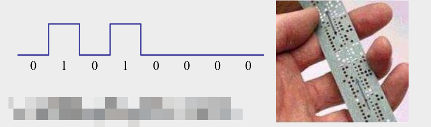
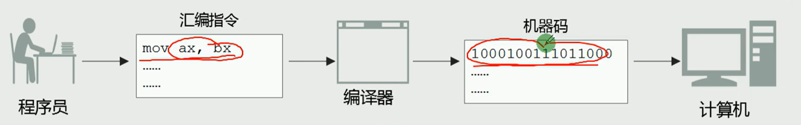

# 0102 由机器语言到汇编语言

## 机器语言与机器指令

**机器语言**：机器指令的集合

**机器指令**：一台机器可以正确执行的命令

机器指令由一串二进制数表示，如01010000

计算机使用高低电平表示0/1二进制



早期程序员的工作形态：将0、1数字编程的程序代码打在纸袋或卡片上，1打孔，0不打孔，再将程序通过纸带机或卡片机输入计算机，进行运算

例：计算S = 768 + 12288 - 1280的程序

机器码：

101100000000000000000011

000001010000000000110000

00**1**011010000000000000101  

机器码不易纠错

101100000000000000000011

000001010000000000110000

00**0**101101000000000000101  多了一个0

## 汇编语言与汇编指令

**汇编语言**的主体是汇编指令

汇编指令和机器指令的**差别在于指令的表示方式**上

- 汇编指令是机器指令便于记忆的书写格式
- 汇编指令是机器指令的**助记符**

例如

- 机器指令： 1000100111011000
- 表示操作：将寄存器BX的内容送到AX中
- 汇编指令：MOV AX, BX  

## 用汇编语言编写程序的工作过程  



汇编语言程序示例

```assembly
assume cs:codesg     
codesg segment
start:
	mov ax,0123H
	mov bx,0456H
	add ax,bx
	add ax,ax
	
	mov ax,4c00h
	int 21h
codesg ends
end
```

汇编指令：即机器码的助记符

伪指令：由编译器执行，机器不会执行该指令

其他符号：由编译器识别

