# 0103 计算机的组成

## 计算机逻辑组成

主板上有

- CPU
- 总线
- 内存
- 扩展槽（接外部设备）

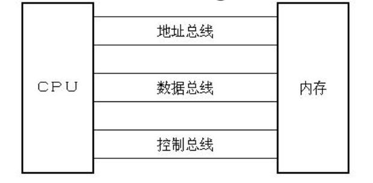

## 计算机的组成

CPU：CPU 是计算机的核心部件，它控制整个计算机的运作并进行运算。要想让一个CPU工作，就必须向它提供指令和数据  

指令和数据本身存储在外存，但是从CPU的角度来看，指令和数据在**存储器（内存）**中存放。离开了内存，性能再好的CPU也无法工作 （即CPU只能直接和内存打交道）

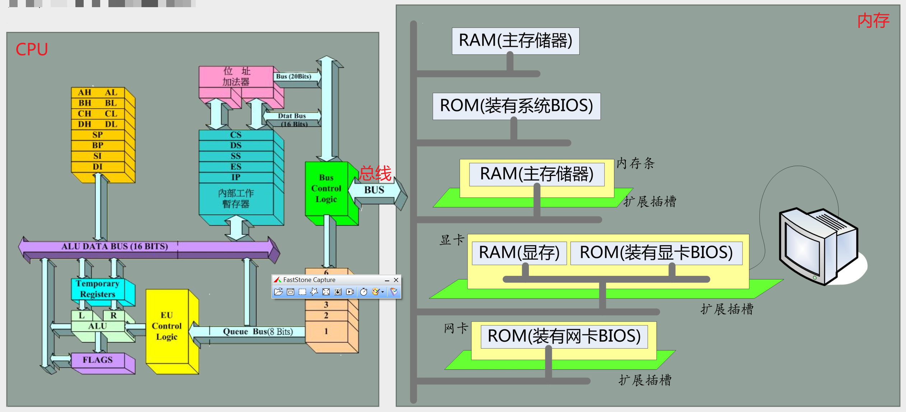

## 指令和数据的表示

计算机中的数据和指令，存储在内存或磁盘上。使用时，读取到内存，CPU直接和内存打交道

数据和指令，都是二进制信息

问题：如何区分该二进制信息是数据还是指令

答案：取决于**CPU如何用**该二进制信息

- 1000100111011000 ─> 89D8H （数据）

- 1000100111011000 ─> MOV AX,BX （程序）  

汇编语言中数据的表示由4种方式：

- 1000100111011000**B** （二进制）
- 89D8**H** （十六进制）最常用
- 104730**O**（八进制）
- 35288**D**（十进制）  

## 计算机中的存储单元

构成：存储器（内存）被划分为若干个存储单元，每个存储单元中放一个字节数据，存储单元从0开始顺序编号；  

例如：

一个存储器有128个存储单元，则编号为0~127，如下图所示

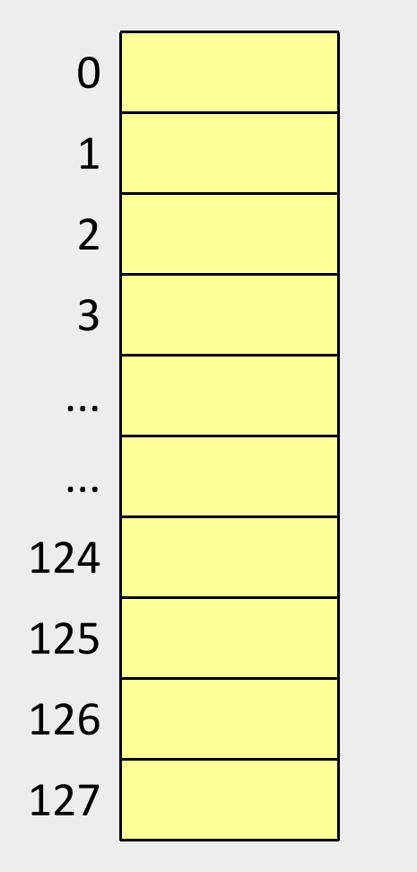

实际上，内存空间很大，8086有20条数据线，寻址空间（笔者暂理解为编号数量）为2^20^，则其内存单元共计即1MB，从0开始编号，直到2^20-1^

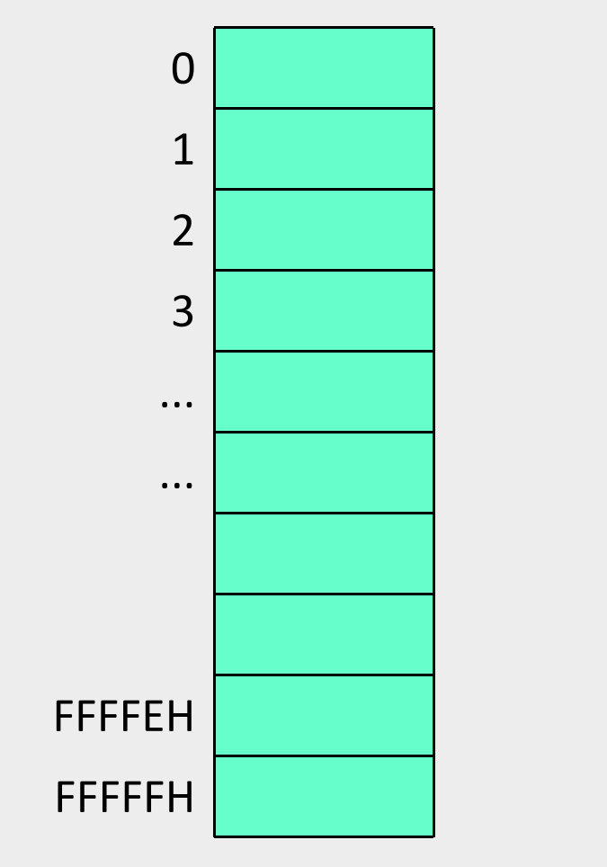

## 计算机中的总线

在计算机中专门有连接CPU和其他芯片的导线，通常称为总线(BUS)。

- 物理上：一根根导线的集合（CPU上即为引脚的集合，引脚的定义不必理解，汇编语言学习只需从逻辑上理解为3类总线即可）；
- 逻辑上划分为
  - 地址总线
  - 数据总线
  - 控制总线  

​	如下图所示为8086CPU及其引脚

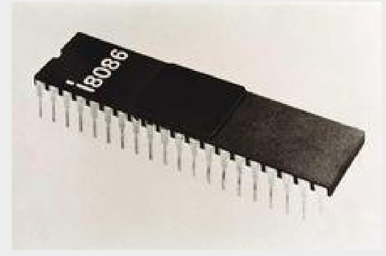

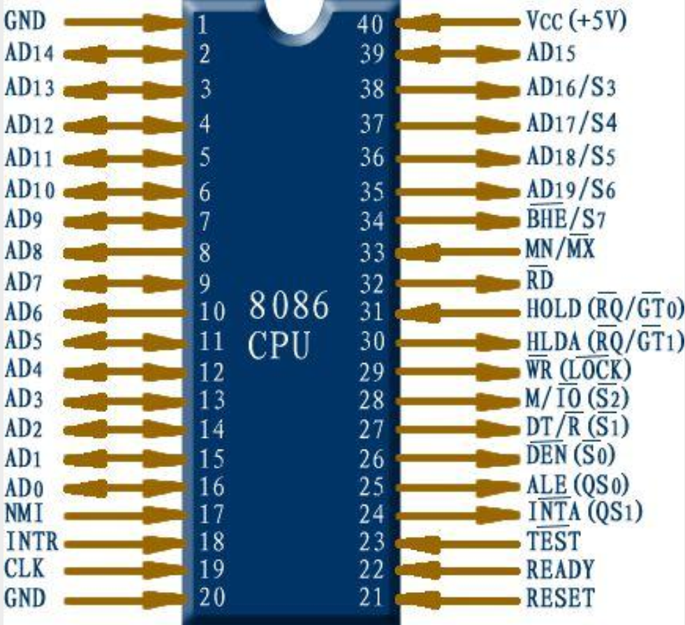

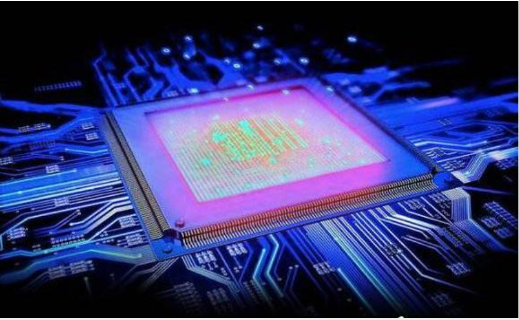

## 三类总线

### 地址总线

CPU通过地址总线来**指定存储单元**

地址总线的宽度，决定了可寻址（即能够表示的地址空间大小）的存储单元的大小

N跟地址总线（宽度为N），对应的寻址空间为2^N^

地址总线作用：将指令或数据的**地址**传输到内存中即可定位该指令或数据的位置

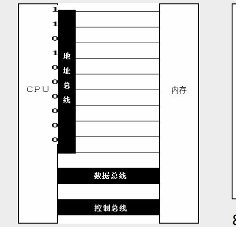

### 数据总线

CPU与内存或其他器件之间的**数据传送**是通过数据总线来进行的

数据总线的宽度决定了CUP和外界的数据传输速度，即越宽数据传输速度越快

例如：8088、8086向内存中写入数据89D8H时的数据传送

8088CPU有8位数据总线，对于16位（即2字节）的数据则需要传输2遍

8086CPU有16位数据总线，对于16位的数据只需传输1遍

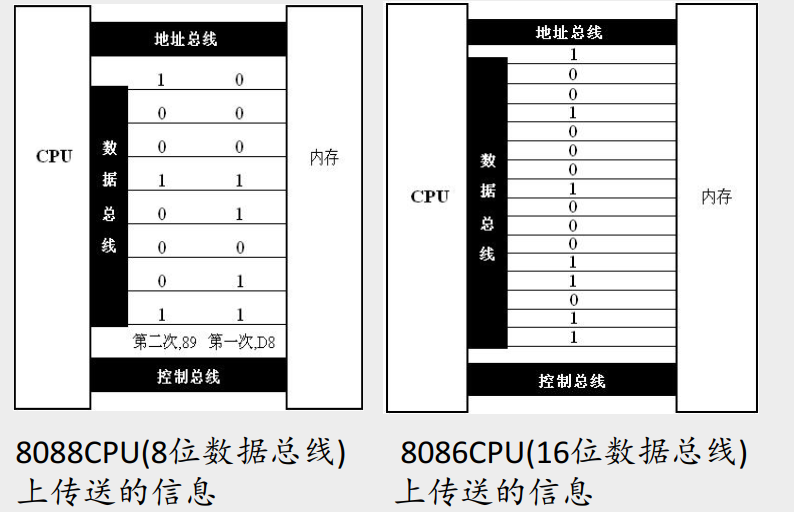

### 控制总线

CPU通过控制总线**对外部器件进行控制**

控制总线是一些不同控制线的集合

控制总线的宽度决定了CPU对外部器件的控制能力，宽度越大，控制信号越丰富，控制能力越强

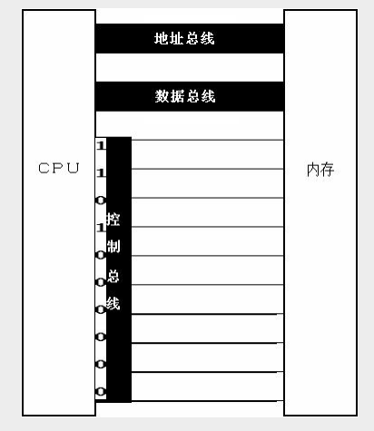

## x86CPU性能一览

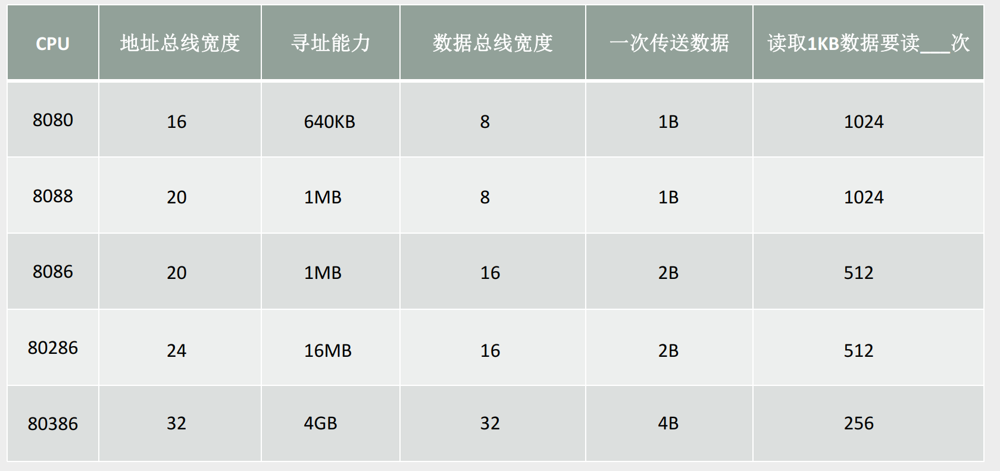

 