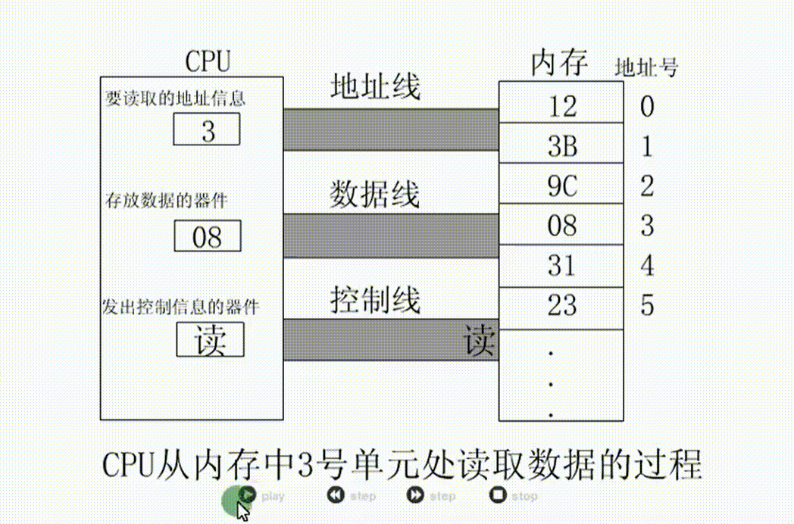
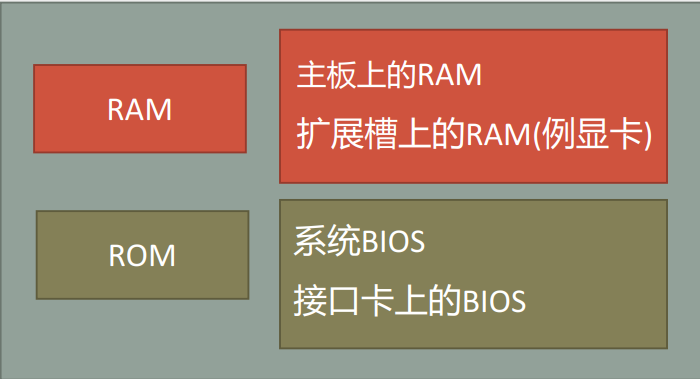
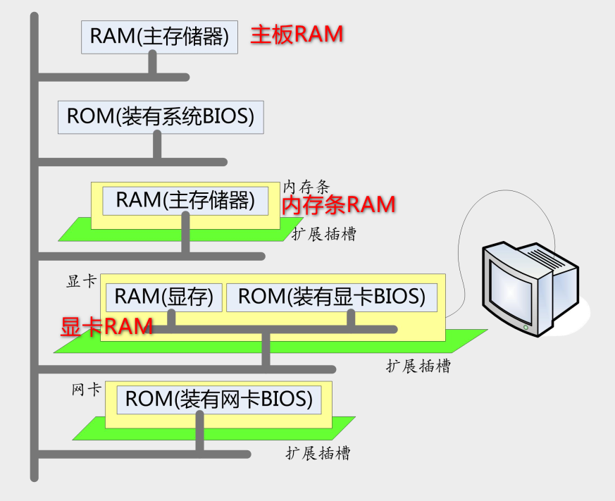
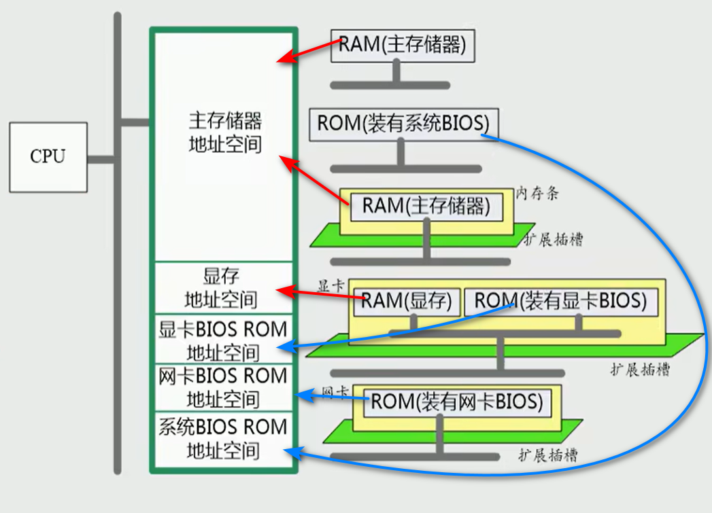
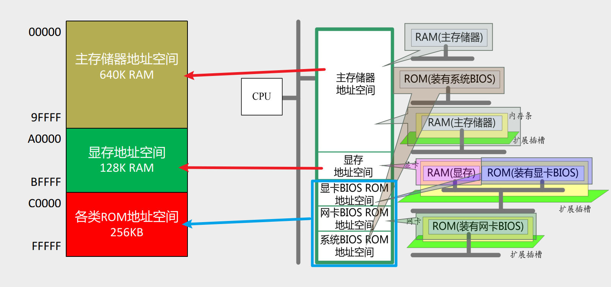

# 0105 内存的读写与地址空间

## CPU对存储器的读写

CPU要想进行数据的读写，必须和外部器件进行三类信息的交互：

- 存储单元的地址——地址信息
- 器件的选择(选择寄存器、内存、端口等)，执行的是读或写命令——控制信息
- 读或写的数据——数据信息

### 演示

机器码： 101000000000001100000000

16进制：A00300

对应得汇编指令：MOV AL,[3]

含义：从3号单元读取数据送入寄存器AL  

步骤：

1、地址信息通过地址线传递到内存；

2、内存寻址找到数据存放位置：[3]

3、控制信息通过控制线传递到内存：读取该数据到AL寄存器

## 内存地址空间

如何找到地址号对应的内存地址——内存地址空间

什么是内存地址空间

- CPU地址总线宽度为N，寻址空间为2^N^ 个Byte

- 8086CPU的地址总线宽度为20，那么可以寻址1MB个内存单元，其内存地址空间为1MB  

从CPU角度看地址空间分配：如何从0到2^N^-1进行编址

### 存储器分类

RAM(Random-access memory)：

- 特性：随机存储器，能读能写，但具有易时性（断电后就没有了）。

- 功能：RAM用来存放计算机运行时一些动态变化的数据
- 硬件：主板RAM、扩展槽上的RAM（如显卡RAM）

ROM(Read-only memory)：

- 特性：只读存储器，其内容在制造计算机时已经写好。

- 功能：ROM中存放计算机启动时就要用到的数据如BIOS，或者计算机运行时固定不变的数据
- 硬件：系统BIOS、接口卡BIOS

如上图所示，主板RAM、内存条RAM、显卡RAM等**共同构成整个计算机的RAM空间**，主板ROM（装有系统BIOS）、显卡ROM（装有显卡BIOS）、网卡ROM（装有网卡BIOS）**共同构成整个计算机的ROM空间**

## 将各类存储器看做一个逻辑存储器——统一编址

统一编址之后即不在考虑各个地址在哪个硬件设备上面，忽略地址在硬件分布上的差别，只需考虑地址即可

- 所有的**物理存储器**被看作**一个**由若干存储单元组成的**逻辑存储器**；

- 每个物理存储器在这个逻辑存储器中占有一个地址段，即一段地址空间；

- CPU在这段地址空间中读写数据，实际上就是在相对应的物理存储器中读写数据  

如上图所示

- 各类硬件的RAM和ROM统一编址
- 主存储器地址空间：主板RAM、内存条RAM共同构成主存储器地址空间
- 显存地址空间：显卡RAM
- 显卡BIOS ROM地址空间：显卡ROM
- 网卡BIOS ROM地址空间：网卡ROM
- 系统BIOS ROM地址空间：主板ROM

## 内存地址空间的分配方案——以8086PC机为例

