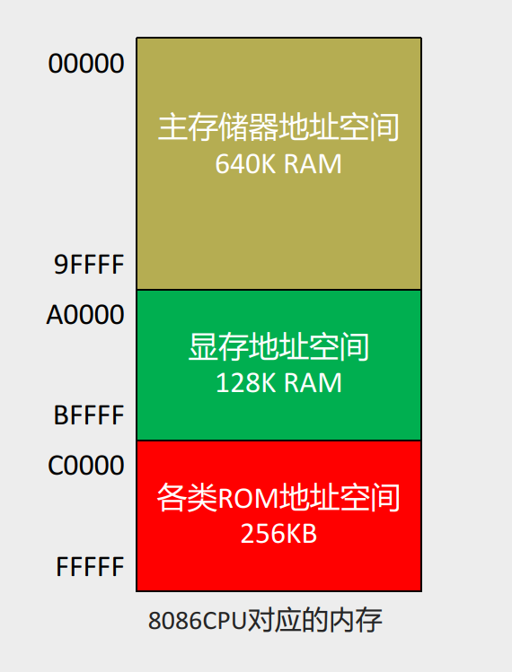
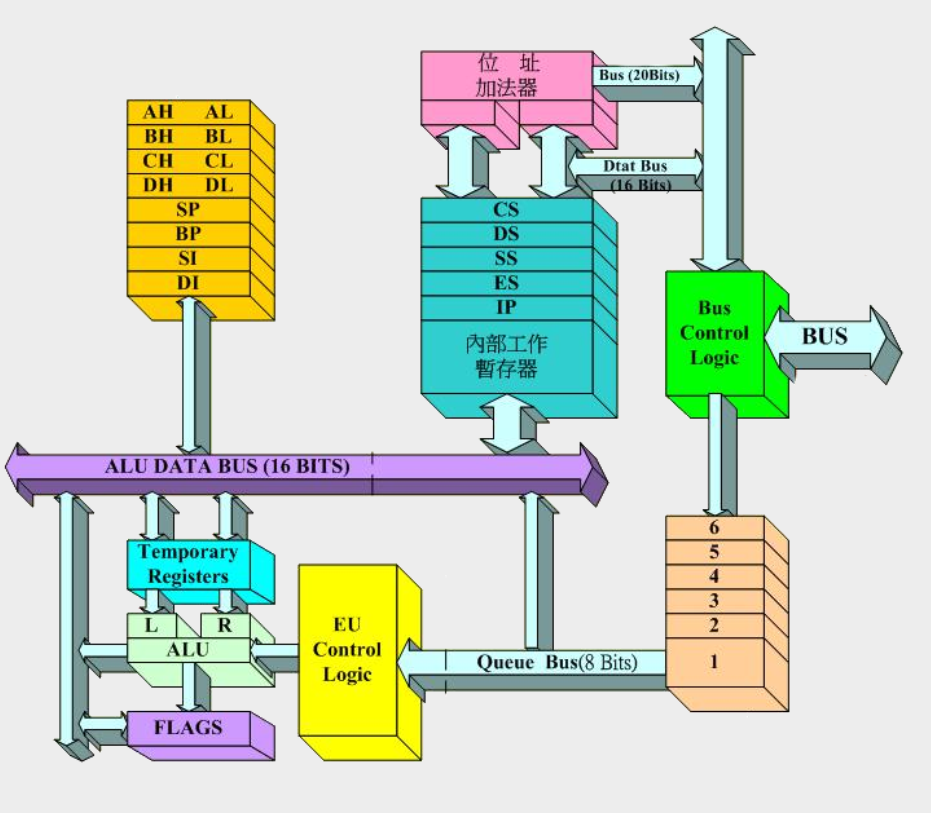
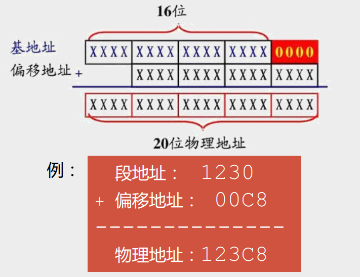
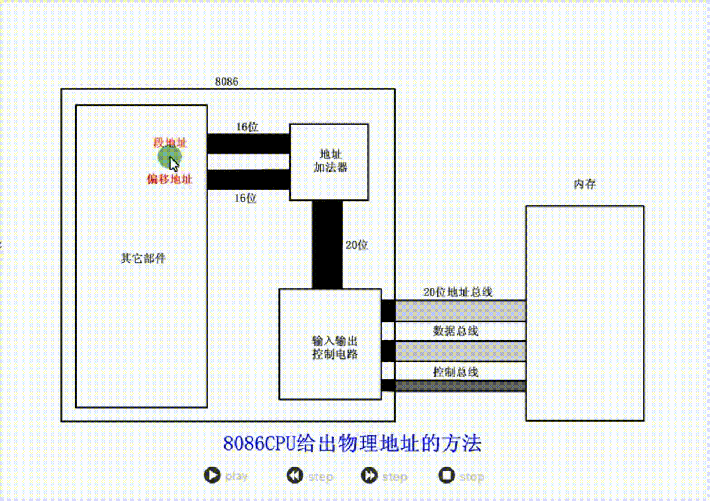
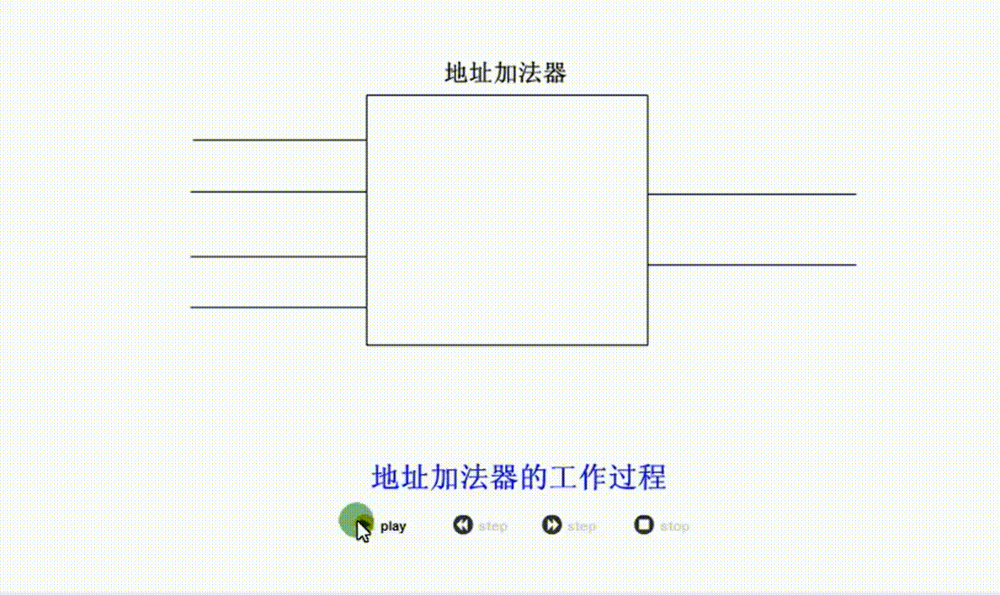
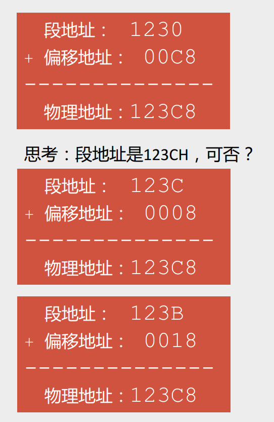

# 0203 确定物理地址的方法

## 物理地址

CPU访问内存单元时要给出内存单元的地址

所有的内存单元构成的存储空间是一个一维的线性空间

每一个内存单元在这个空间中都有唯一的地址，这个唯一地址称为物理地址

下图给出了8086CPU能够访问的1M的地址空间

### 8086的地址总线和寄存器位数的矛盾

8086有20位地址总线，可以传送20位地址，**寻址能力为1M**（即地址总线能够寻址编号为0~2^20^-1的地址单元）

8086是16位结构的CPU（即寄存器为16位）

- 运算器一次最多可以处理16位的数据，寄存器最大宽度为16位
- 在8086内部处理、传输、暂存的地址也是16位，**寻址能力只有64KB**（即能够寻址编号为0~2^16^-1的地址单元）

问题：8086如何处理在寻址空间上的矛盾？

解决：引入段地址和偏移地址

## 8086CPU给出物理地址的方法

8086CPU的解决方法：用2个16位地址（段地址、偏移地址，分别来自2个16位寄存器），合成一个20位的物理地址

在如下的CPU逻辑结构图中可以看到，某数据总线(ALU DATA BUS)、数据总线(Data Bus)都是16位的，唯独右上角CPU输出了1个20位的地址总线

**地址加法器（位址加法器）合成物理地址的方法：物理地址 = 段地址 x 16 + 偏移地址**

注释：地址 x 16 相当于将该地址左移4个二进制位，而后连个地址即错开相加，得到一个20位的地址，如下图所示

演示：段地址和偏移地址生成物理地址的过程

例：8086CPU访问地址为123C8的内存单元

思考：段地址和偏移地址的如何确定？

由此可见，对于一个内存的物理地址，其段地址和偏移地址并不固定。确定段地址之后，适当调整偏移地址，可以生成同一个物理地址

## "物理地址 = 段地址 x 16 + 偏移地址" 的本质含义

要解决的问题：用两个16位的地址（段地址、偏移地址），相加得到一个20位的物理地址

本质含义：CPU在访问内存时，用一个**基础地址**（段地址×16）和一个相对于基础地址的**偏移地址**相加，给出内存单元的物理地址  
