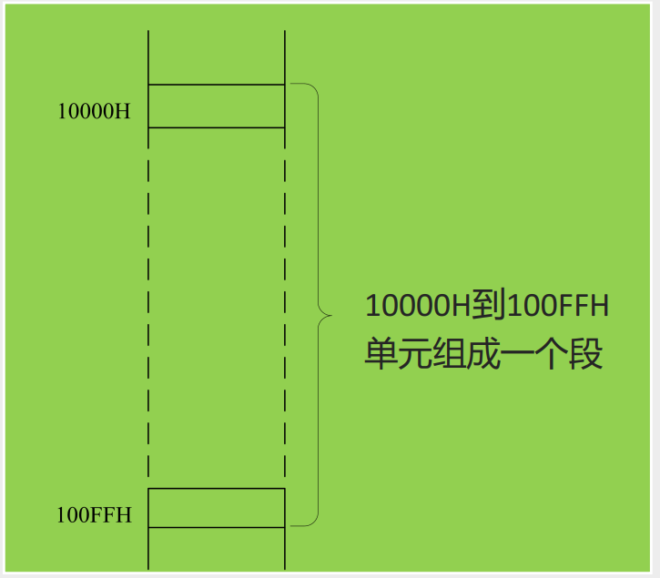
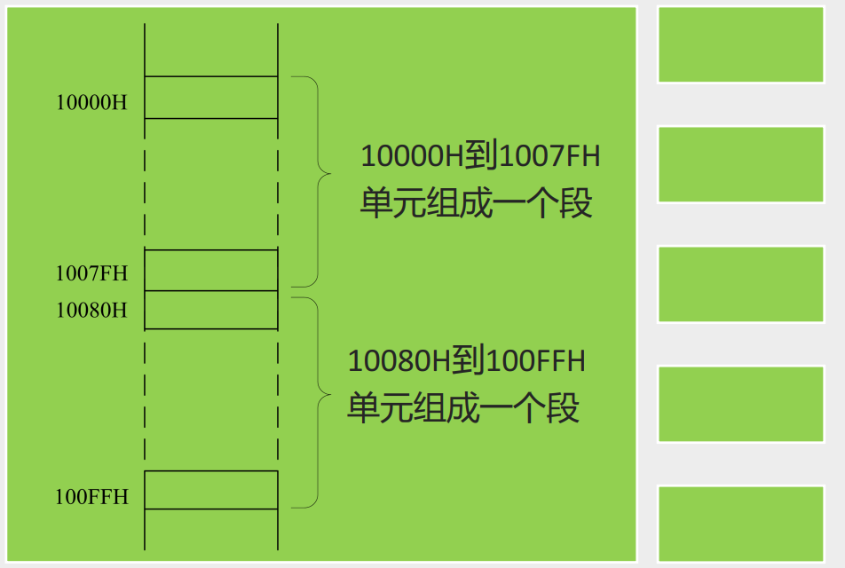
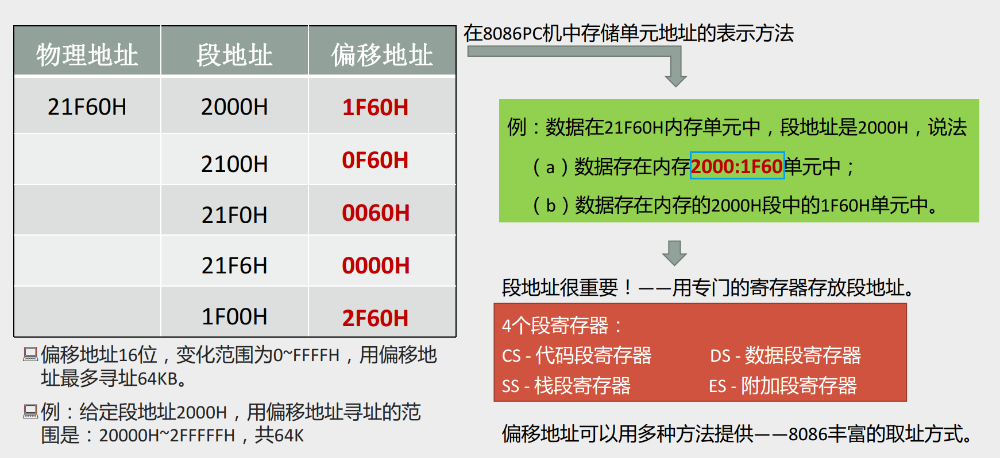

# 0204 内存的分段表示方法

## 用分段的方式管理内存

8086CPU用“（段地址×16）+偏移地址=物理地址”的方式给出内存单元的物理地址。

注意：内存本身是连续编址的线性空间，并没有分段，段的划分来自于CPU；8086在使用过程中按自己意愿来分段

## 同一段内存，多种分段方案

### 方案1

该段内存起始地址（基础地址）为10000H，是20位地址，我们取其高16位作为段地址及1000H，段大小为100H

### 方案2

该段内存起始地址（基础地址）为10000H，是20位地址，我们将其又分为2个段。

10000H~1007FH取起始地址高16位作为段地址及1000H，段大小为80H

10080H~100FFH取起始地址高16位作为段地址及1008H，段大小为80H

### 注意

- 段地址×16 必然是 16的倍数，所以一个段的起始地址也一定是16的倍数（本质上是因为一个段地址后补4个0必为一个真实的起始物理地址）；
- 偏移地址为16位，16 位地址的寻址能力为 64K，所以一个段的长度最大即为64K。  

## 用不同的段地址和偏移地址可以形成同一个物理地址

段地址很重要，在CPU中使用专门的寄存器来存放段地址，存在4个段（地址）寄存器

- CS：代码段寄存器
- DS：数据段寄存器
- SS：栈段寄存器
- ES：附加段寄存器

偏移地址可以使用多种方法提供——8086提供丰富的取址方式
