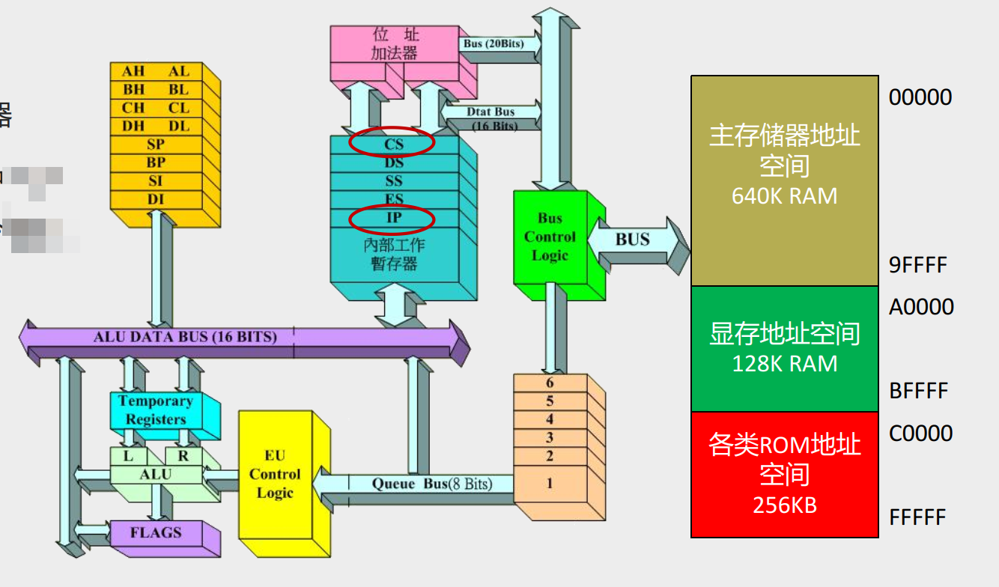
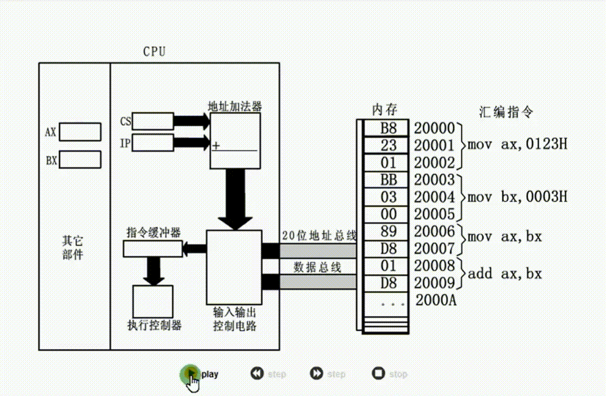
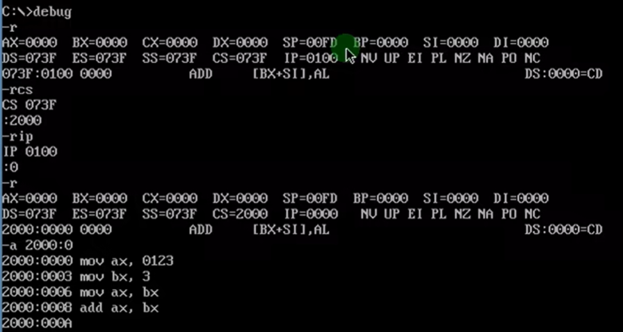
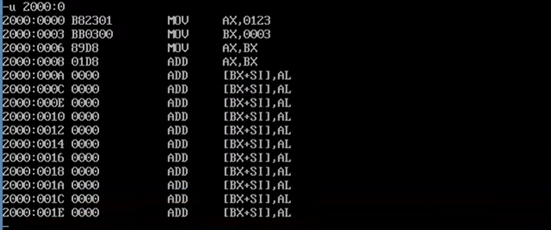
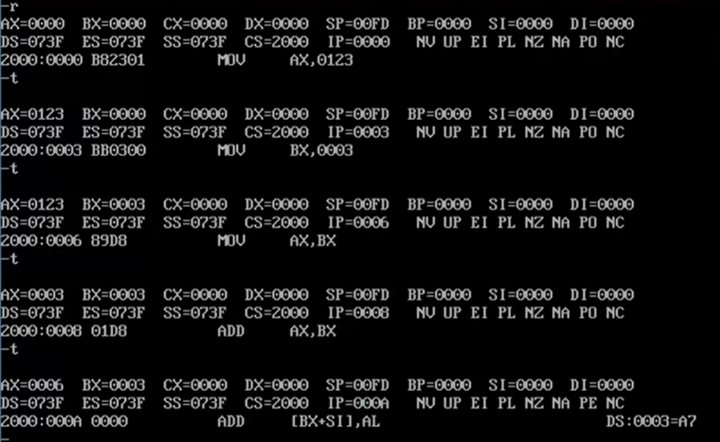

# 0206 CS、IP与代码段

## 两个关键的寄存器

CS：代码段寄存器，其内容作为段地址

IP： 指令指针寄存器，其内容作为偏移地址

CS:IP：CPU将内存中CS:IP指向的内存物理地址当作指令执行  

## 示例：在CS和IP指示下代码的执行

8086CPU当前状态

- CS中内容为2000H
- IP中内容为0000H

内存20000H~20009H处存放着可执行的机器代码，其执行过程如下图所示

### 8086PC工作过程的简要描述：

（1）从CS:IP指向内存单元读取指令，读取的指令进入指令缓冲器；

（2）**IP = IP + 所读取指令的长度**，从而指向下一条指令（指令长度的确定有其规定，比如操作数只涉及寄存器的指令，指令长度为2字节）；

（3）执行指令。 转到步骤（1），重复这个过程。  

## 指令读取和执行的实证演示-Debug验证8086CPU的工作过程

1、a命令：往CS:IP  = 2000:0000处写入汇编指令

2、u命令：查看CS:IP  = 2000:0000汇编指令

3、t命令：逐条单步执行CS:IP  = 2000:0000处汇编指令

## CPU会把CS:IP指向的内存单元中的内容作为指令而非狭义的数据

问：内存中有数据 B8 23 01 BB 03 00 89 D8 01 D8，究竟用作一般数据，还是用作指令？

**答：CPU将CS:IP指向的内存单元中的内容看作指令！**  