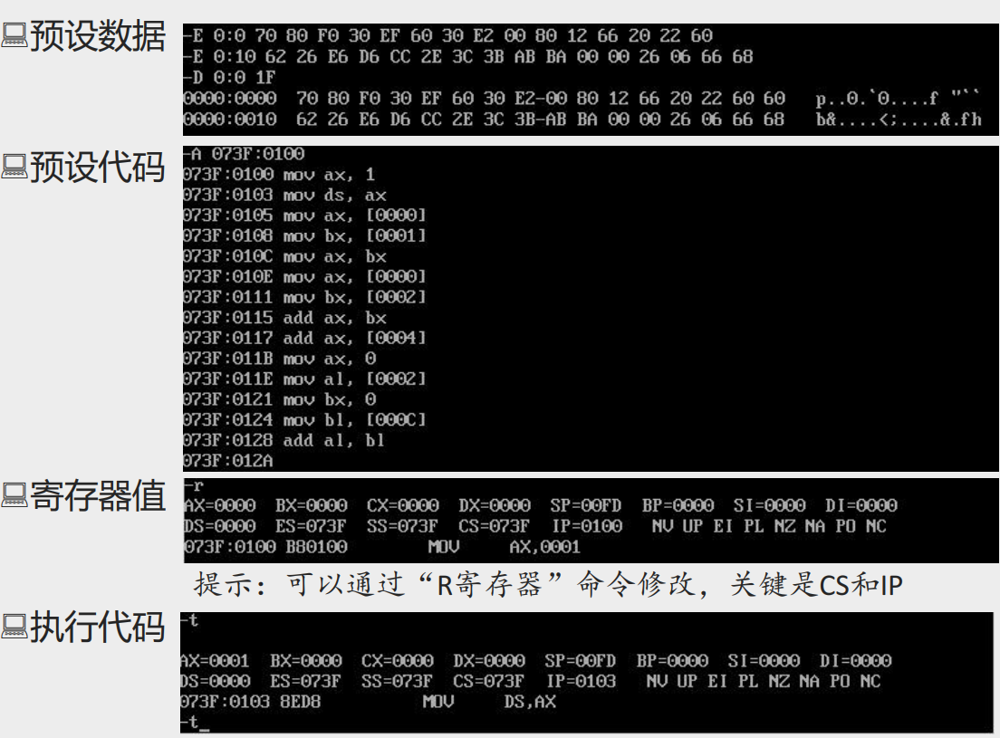
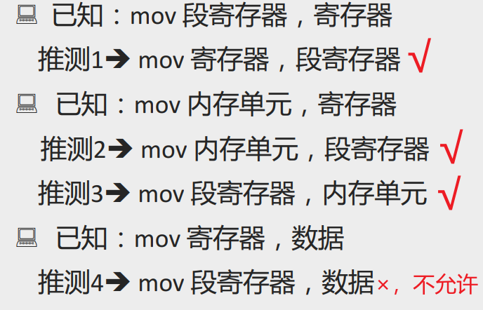

# 0303 DS与数据段

## 对内存单元中数据的访问

对于8086PC机，可以根据需要将一组内存单元定义为一个段。

- 物理地址=段地址×16+偏移地址

- 将一组长度为N（N≤64K）、地址连续、起始地址为16的倍数的内存单元当作专门存储数据的内存空间，从而定义了一个数据段  

示例：假设我们需要用123B0H~123B9H的空间来存放数据:

| 定义                  | 段地址 | 偏移地址 | 长度   |
| --------------------- | ------ | -------- | ------ |
| 定义方法1：**123B**0H | 123BH  | 0000H    | 10字节 |
| 定义方法2：**123**B0H | 1230H  | 00B0H    | 10字节 |
| 定义方法3             | ……     | ……       | ……     |

笔者注：

1、段地址×16 的值是一个起始物理地址，即段地址左移4位（即右侧补一个十六进制0）是一个起始物理地址，那么这个起始物理地址一定是地址为16的倍数的内存单元。在十六进制数中，这样的内存单元的地址值末位一定是0。

2、将哪段内存当做数据段，段地址如何定，在编程时由程序员安排

### 对内存单元访问的处理方法：(DS):([address])  

- 用DS存放数据段的段地址

- 用相关指令访问数据段中的具体单元，单元地址由[address]指出  

## 示例：将123B0H~123BAH的内存单元定义为数据段

### 累加数据段中前3个单元中的数据

```assembly
mov ax, 123BH
mov ds, ax
mov al, 0  ;al寄存器内容清零
add al, [0]  ;使用al而非ax，说明我们是按字节去取内存中的数据
add al, [1]
add al, [2]
```

### 累加数据段中的前3个字型数据

```assembly
mov ax, 123BH
mov ds, ax
mov ax, 0  ;al寄存器内容清零
add ax, [0]  ;使用ax，说明我们是按字（16位）而非字节去取内存中的数据
add ax, [2]
add ax, [4]
```

## 练习：

给出00000H-0001F的数据， 请写出下面代码的执行结果：

预设00000H-0001F值共计32个内存单元：

0:00~000F   70 80 F0 30 EF 60 30 E2-00 80 12 66 20 22 60 60

0:10~001F   62 26 E6 D6 CC 2E 3C 3B-AB BA 00 00 26 06 66 68

| 代码           | AX   | BX   |
| -------------- | ---- | ---- |
| mov ax,[0000]  |      |      |
| mov bx,[0001]  |      |      |
| mov ax,bx      |      |      |
| mov ax,[0000]  |      |      |
| mov bx,[0002]  |      |      |
| add ax, bx     |      |      |
| add ax,[0004]  |      |      |
| mov ax,0       |      |      |
| mov al,[0002]  |      |      |
| mov bx, 0      |      |      |
| mov bl, [000C] |      |      |
| add al,bl      |      |      |



## 用mov指令操作数据

| 指令形式             | 例示        |
| -------------------- | ----------- |
| mov 寄存器，数据     | mov ax, 8   |
| mov 寄存器，寄存器   | mov ax, bx  |
| mov 寄存器，内存单元 | mov ax, [0] |
| mov 内存单元，寄存器 | mov [0], ax |
| mov 段寄存器，寄存器 | mov ds, ax  |



## 加法add和减法sub命令

### add指令

| add指令形式          | 例示        |
| -------------------- | ----------- |
| add 寄存器，数据     | add ax, 8   |
| add 寄存器，寄存器   | add ax, bx  |
| add 寄存器，内存单元 | add ax, [0] |
| add 内存单元，寄存器 | add [0], ax |

### sub指令

| sub指令形式          | 例示        |
| -------------------- | ----------- |
| sub 寄存器，数据     | sub ax, 8   |
| sub 寄存器，寄存器   | sub ax, bx  |
| sub 寄存器，内存单元 | sub ax, [0] |
| sub 内存单元，寄存器 | sub [0], ax |

## 用DS和[address]形式访问内存中数据段方法小结

结合体验品味

（1）**字**在内存中存储时 ，要用**两个地址连续的内存单元**来存放，字的**低位字节**存放在**低地址单元**中，**高位字节**存放再**高地址单元**中。

（2）用 mov 指令要访问内存单元，可以在mov指令中**只给出单元的偏移地址**，此时，**段地址默认在DS寄存器**中。

（3）**[address]**表示一个偏移地址为address的内存单元。

（4）在内存和寄存器之间传送**字型数据**时，**高地址单元**和**高8位寄存器**、**低地址单元**和**低8位寄存器**相对应。

（5）mov、add、sub是具有两个操作对象的指令，访问内存中的数据段（对照：jmp是具有一个操作对象的指令，对应内存中的代码段）。

（6）可以根据自己的推测，在Debug中实验指令的新格式。  