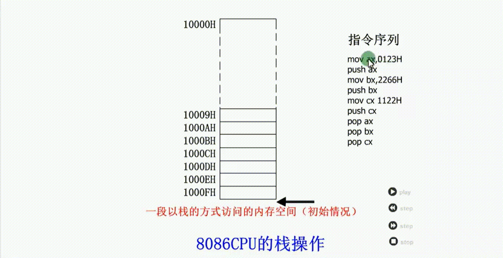
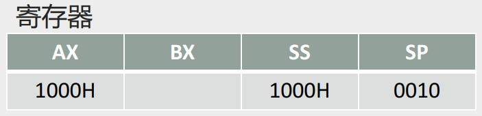
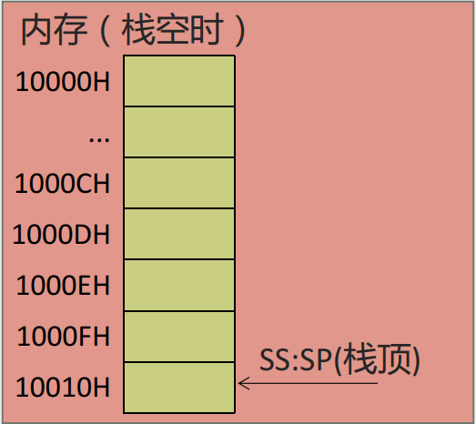
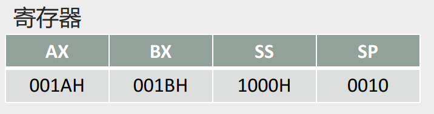
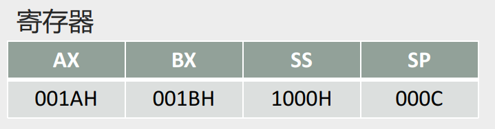
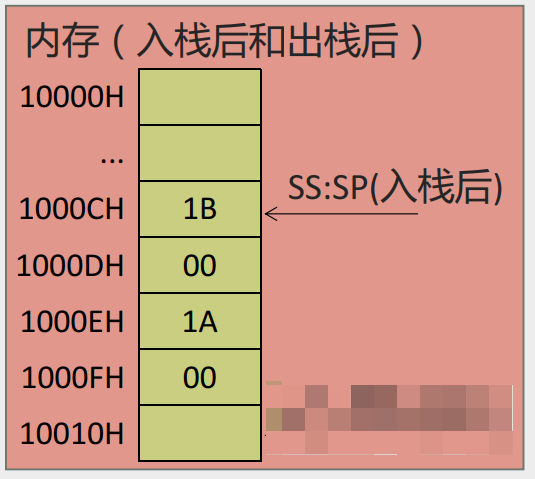
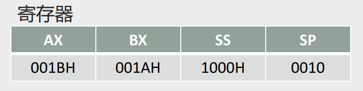
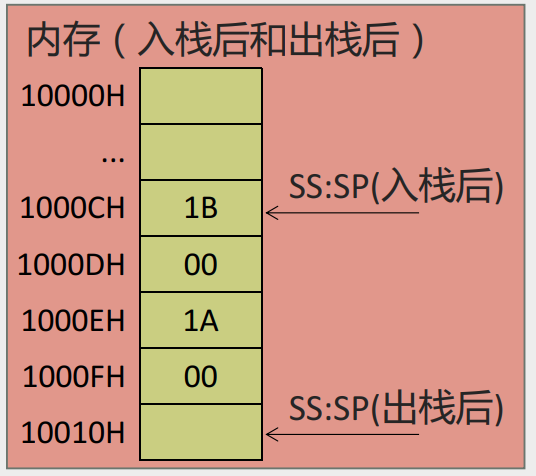
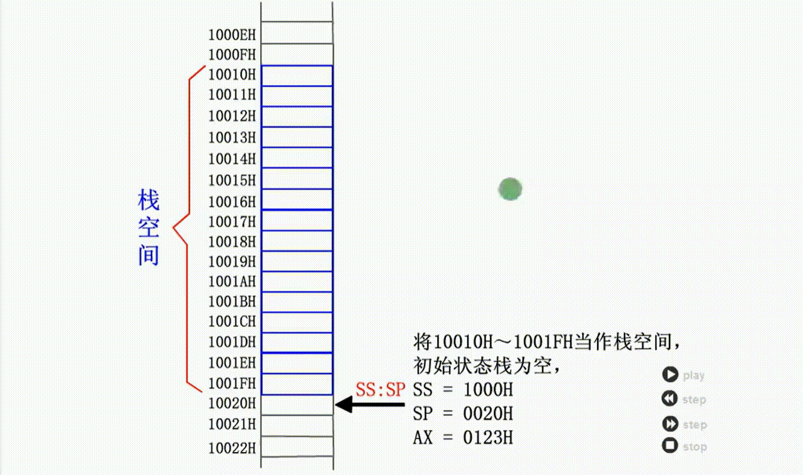
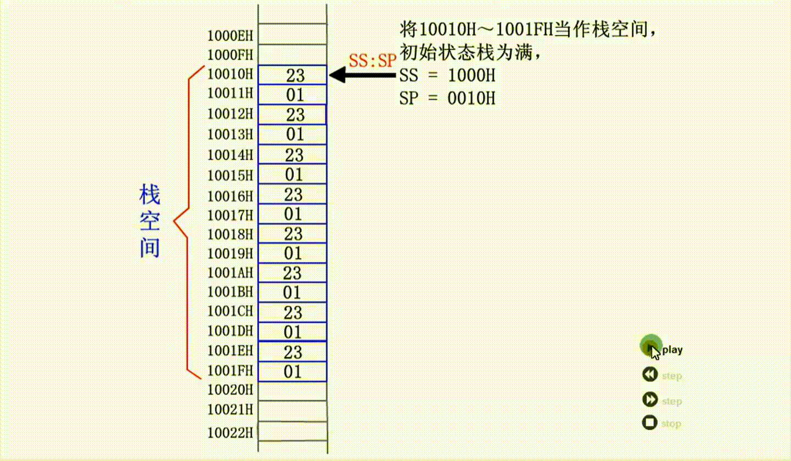

# 0304 栈及操作的实现

## 栈结构

栈是一种只能在一端进行插入或删除操作的数据结构。

栈有两个基本的操作：入栈和出栈。

- 入栈：将一个新的元素放到栈顶；

- 出栈：从栈顶取出一个元素。

栈顶的元素总是最后入栈，需要出栈时，又最先被从栈中取出。

栈的操作规则：LIFO（Last In First Out，后进先出）

CPU提供的栈机制

- 现今的CPU中都有栈的设计。

- 8086CPU提供相关的指令，支持用栈的方式访问内存空间。

- 基于8086CPU的编程，可以将一段内存当作栈来使用  

## PUSH(入栈)和(POP)出栈指令

**注意：出栈入栈操作都是以字为单位对栈进行操作**  

| 指令格式 | 含义                 |
| -------- | -------------------- |
| push ax  | 将ax中的数据送入栈中 |
| pop ax   | 从栈顶取出数据送入ax |

### push和pop命令的实现机制

#### push ax

（1）SP=SP–2；

（2）将ax中的内容送入SS:SP指向的内存单元处，SS:SP此时指向新栈顶  

**注意push是先变动SP指针，再进行入栈，因此SP指针移动之后，入栈数据从`SP=SP–2`这个低位栈地址开始入栈**

#### pop ax

（1）将SS:SP指向的内存单元处的数据送入ax中；

（2）SP = SP+2，SS:SP指向当前栈顶下面的单元，以当前栈顶下面的单元为新的栈顶  

**注意pop是先出栈，再变动SP指针，因此出栈数据从`SP`这个高位栈地址开始出栈之后，才变动`SP = SP+2`指针**

## 例：设将10000H~1000FH内存当作栈来使用

指令序列

```assembly
mov ax,0123H
push ax
mov bx,2266H
push bx
mov cx,1122H
push cx
pop ax
pop bx
pop cx
```

执行过程



## SS:SP确定栈顶元素地址

问题：

1、CPU如何知道哪一段内存空间被当做栈来使用？

2、执行push和pop的时候，如何知道哪个单元是栈顶单元？

回答：

8086CPU中，有两个与栈相关的寄存器：

- **栈段寄存器SS** - 存放栈顶的段地址

- **栈顶指针寄存器SP** - 存放栈顶的偏移地址

在任意时刻，SS:SP指向栈顶元素  

## 栈的操作

### Step1 修改SS:SP

定义一段内存为栈：把10000H到10010H作为一个栈来使用

```assembly
//把10000H到10010H作为一个栈来使用
mov ax, 1000H
mov ss, ax   
mov sp, 0010H
```

寄存器状态



内存状态



### Step2 对栈操作

```assembly
mov ax, 001AH
mov bx, 001BH
```



```assembly
push ax
push bx
```



内存状态



```assembly
pop ax
pop bx
```



内存状态



## 执行入栈时，栈顶超出栈空间问题

### 当栈满的时候再使用push指令入栈， 将发生栈顶超界问题



### 当栈空的时候再使用pop指令出栈，将发生栈顶超界问题



问题：如何能够保证在入栈、出栈时，栈顶不会超出栈空间  ？

答案：遗憾的是，**8086CPU不保证对栈的操作不会超界。8086CPU 只知道栈顶在何处（由SS:SP指示），不知道程序安排的空间有多大。**

我们在编程的时候要自己操心栈顶超界的问题 ，**要根据可能用到的最大栈空间，来安排栈的大小**，防止入栈的数据太多而导致的超界；防止出栈时栈空了仍然继续出栈而导致的超界  

## 栈的小结

push、pop 实质上就是一种内存传送指令，可以在寄存器和内存之间传送数据，与mov指令不同的是，push和pop指令访问的内存单元的地址不是在指令中给出的，而是由SS:SP指出的。

执行push和pop指令时，SP 中的内容自动改变。

8086CPU提供的栈操作机制：

- 在SS，SP中存放栈顶的段地址和偏移地址，入栈和出栈指令根据SS:SP指示的地址，按照栈的方式访问内存单元。

- push指令的执行步骤：
  - 1）SP=SP-2；
  - 2）向SS:SP指向的字单元中送入数据。

- pop指令的执行步骤：
  - 1）从SS:SP指向的字单元中读取数据；
  - 2）SP=SP-2  