# 物理层下面的传输媒体

注意，传输媒体不属于计算机网络体系结构的任何一层，如果非要将它添加到体系结构中，那只能将其放在**物理层之下**。传输媒体可分为两类，一类是导引型传输媒体，另一类是非导引型传输媒体。

在导引型传输媒体中，电磁波被导引，沿着固体媒体传播。常见的导引型传输媒体有同轴电缆、双绞线、光纤、电力线，而非导引型传输媒体是指自由空间可使用的电磁波，有无线电波、微波、红外线、可见光。

## 导引型传输媒体

### 同轴电缆

#### 同轴电缆的结构

这是一根同轴电缆的示意图

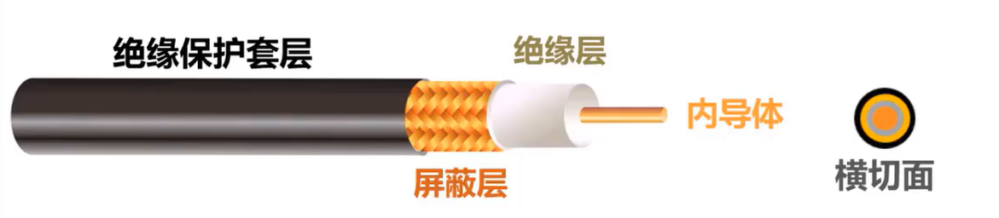

- 内导体铜质心线：可以是单股实心线或者是多股的绞合线。

- 绝缘层

- 这是网状编织的外导体屏蔽层

- 绝缘保护套层

  上图还有同轴电缆的横切面，可以看出各层都是共圆心的，也就是同轴心的，这就是同轴电缆名称的由来。

#### 同轴电缆的分类

同轴电缆有两类，一类是 50 欧阻抗的基带同轴电缆，用于数字传输，在早期局域网中广泛使用。另一类是 75 欧阻抗的宽带同轴电缆，用于模拟传输，目前主要用于有线电视的入户线。

##### 50 Ω阻抗的基带同轴电缆

50 欧阻抗的基带同轴电缆，用于数字传输，在早期局域网中广泛使用

##### 75 Ω阻抗的宽带同轴电缆

75 欧阻抗的宽带同轴电缆，用于模拟传输，目前主要用于有线电视的入户线

**同轴电缆价格较贵，且布线不够灵活和方便。随着集线器的出现，在局域网领域，双绞线取代了同轴电缆。**

### 双绞线

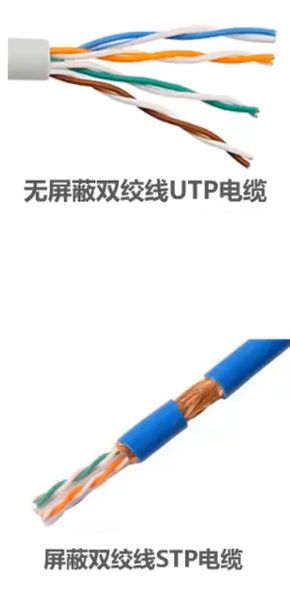

我们来看双绞线，这是无屏蔽双绞线电缆的示意图，这是屏蔽双绞线电缆的示意图。

#### 双绞线的分类

##### 无屏蔽双绞线

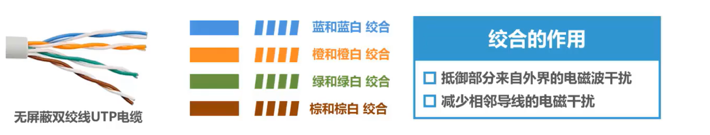

双绞线是最古老又最常用的传输媒体，把两根互相绝缘的同导线并排放在一起，然后按照一定规则绞合起来，就构成了双绞线。例如图中所示的这根无屏蔽双绞线电缆包含 8 根通导线，每两根搅合成一条双绞线，蓝色线和蓝白双色线进行绞合，橙色线和橙白双色线进行绞合，绿色线和绿白双色线进行绞合，棕色线和棕白双色线进行绞合。

绞合有两个作用：

- 抵御部分来自外界的电磁干扰
- 减少相邻导线的电磁干扰。

##### 屏蔽双绞线

屏蔽双绞线电缆比无屏蔽双绞线电缆增加了金属丝编织的屏蔽层，提高了抗电磁干扰的能力，价格也要更贵一些

#### 常用的绞合线的类别、带宽和典型应用

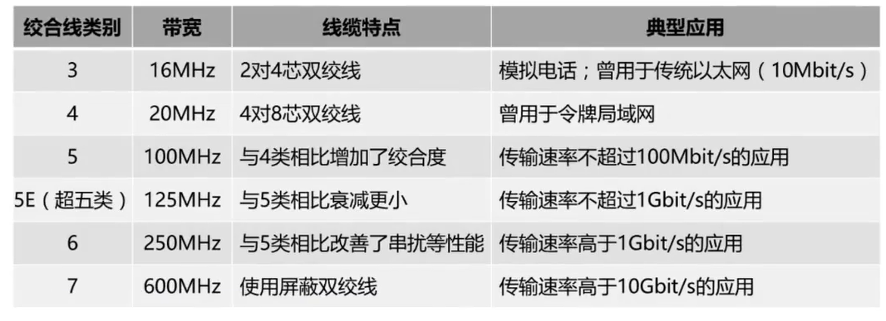

这是常用的绞合线的类别、带宽和典型应用，目前家庭局域网主流带宽为 1Gbit/s。选用大品牌、质量好的**超5类**双绞线电缆可以满足。考虑到未来发展，在经济条件允许的情况下，建议选用 **6A 类**双绞线电缆，以满足万兆局域网的需求。

### 光纤

#### 光纤的结构

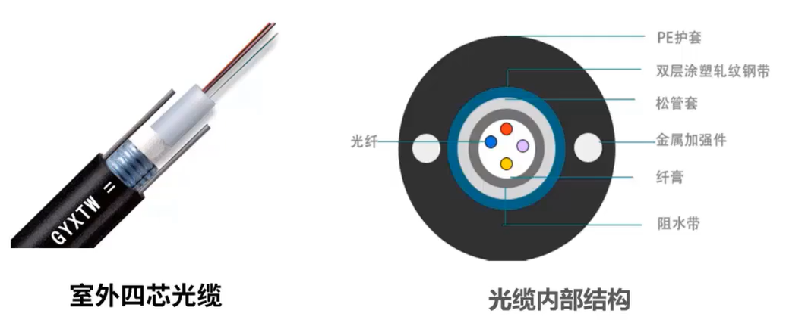

这是一根室外四芯光缆的示意图，这是它的内部结构图，由于光纤非常细，因此必须将它做成很结实的光缆。一根光缆少则只有一根光纤，多则可包括数十甚至是数百根光纤，再加上加强芯和填充物，就可以大大提高机械强度，必要时还可放入远供电源线。最后加上包袋层和外护套，就可以使炕拉强度达到几千克，完全可以满足工程施工的强度要求。

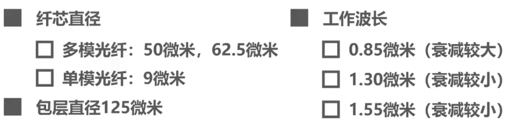

光纤的纤芯非常细，多模光纤的纤芯直径有 50 微米和 62.5 微米。单模光纤的纤芯直径为 9 微米，而纤芯外面的包层也非常细，直径不超过 125 微米。

在光纤通信中，常用三个**波段的中心（工作波长）**分别位于 0. 85 微米、 1. 3 微米和 1. 55 微米。

#### 光纤的优点和缺点

##### 光纤的优点

- 通信容量非常大
- 传输损耗小，在远距离传输时更加经济
- 抗雷电和电磁干扰性能好，这在有大电流脉冲干扰的环境下尤为重要
- 无串音干扰，保密性好，不易被窃听
- 体积小，重量轻：例如一公里长的 1000 对双绞线电缆约重 8000 公斤，而同样长度但容量大得多的一段两芯光缆仅壮 100 公斤。

##### 光纤的缺点

- 例如割接光纤需要专用设备
- 光电接口的价格还比较贵。

#### 光纤传输的基本原理

纤芯：由非常透明的石英玻璃拉成的细丝

包裹在纤芯外层的包层：它是折射率比纤纤低的玻璃封套

在发送端可以采用发光二极管或半导体激光器作为光源

在接收端可以采用光电二极管获激光检波器检测光脉冲。

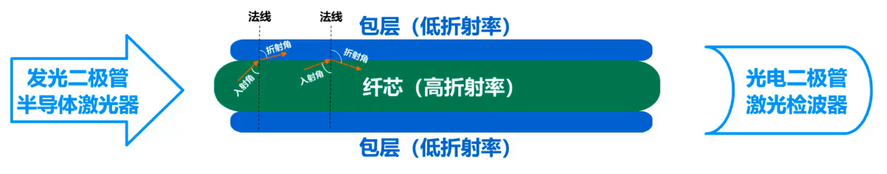

如图所示，当光从**高折射率**的媒体射向**低折射率**的媒体时，其**折射角将大于入射角**。

因此，如果**入射角足够大**，就会出现**全反射**，也就是**光碰到包层时就会反射回铅芯**，该过程反复进行，光也就沿着光纤传输下去。

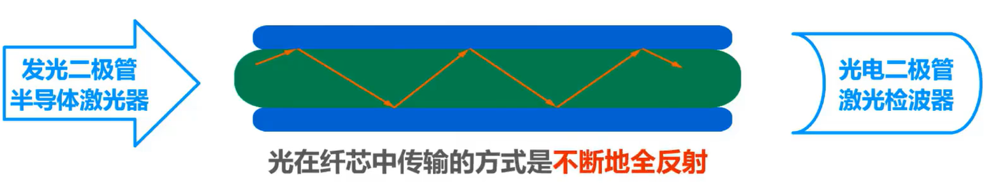

#### 多模光纤和单模光纤

##### 多模光纤

实际上，只要从纤芯中射到纤芯表面的光线的入射角大于某一个临界角度，就可产生全反射。因此，可以存在许多条不同角度入射的光线在一条光纤中进行传输，这种光纤称为**多模光纤**。

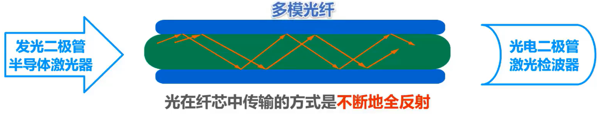

###### 衰减性

由于光的色散问题，光在多么光纤中传输一定距离后，必然产生信号失真，也就是**脉冲展宽**，如图所示。

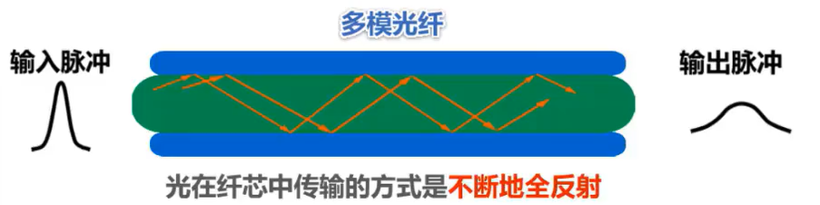

###### 适用性

- **多模光纤只适合近距离传输**，例如，在建筑物内。

- 多模光纤对光源的要求不高，可以使用比较便宜的发光二极管，相应的可采用光电二极管检测光脉冲。
  - 即发送光源：发光二极管；接受检测：光电二极管

##### 单模光纤

若光纤的直径减小到只有一个光的波长，则光纤就像一根波导那样，它可使光线一直向前传播，而不会产生多次反射，这样的光纤称为单模光纤

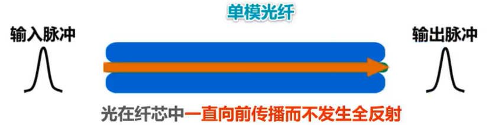

###### 衰减性

**单模光纤没有模式色散**，在 1. 3 微米波长附近，材料色散和波导色散大小箱等符号相反，两者正好抵消没有脉冲展宽问题。

###### 适用性

- 单魔光纤**适合长距离传输且衰减小**，但它的制造成本高，对光源要求也高

- 需要使用昂贵的半导体激光器作为光源，相应的需要采用激光检波器检测光脉冲
  -  即发送光源：半导体激光器；接受检测：激光检波器

### 电力线

早在 20 世纪 20 年代初期就出现了应用电力线传输信号的实例，最早是电力线电话。

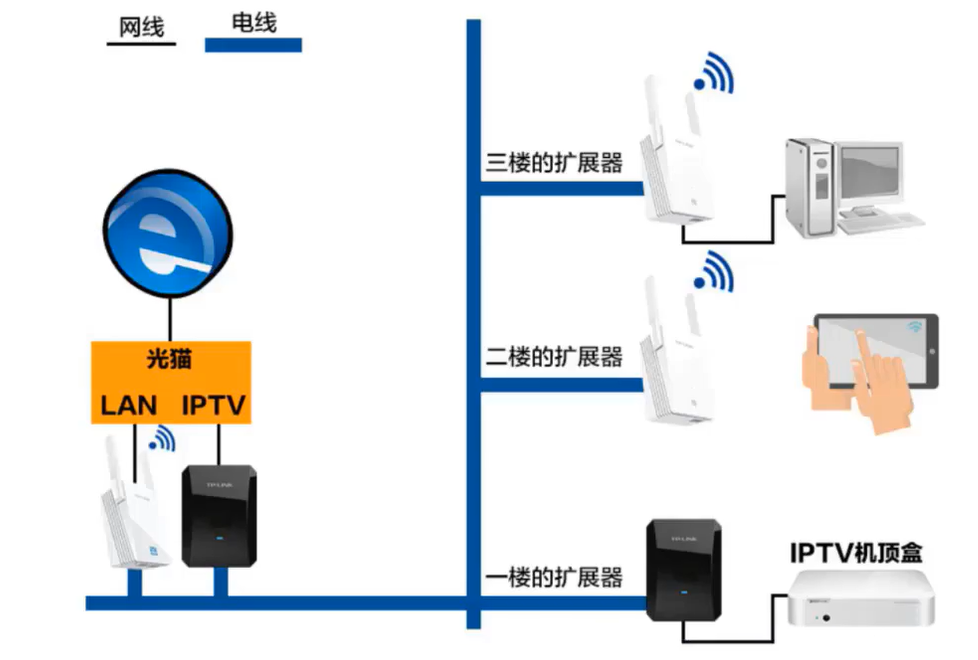

目前，如果要构建家庭高性能局域网，采用电力线作为传输媒体是不能满足要求的。对于装修时没有进行网络布线的家庭可以采用这种方式。对于一些采用独立房间进行办公的企业来说，每间办公室的电脑数量不多，而又不希望跨办公室进行布线，也可以采取这种方式。每个办公室只需根据需求在电源插座上插入一个或多个电力猫即可。

## 非导引型传输媒体

## 电磁波频谱的选取

我们可以利用电磁波在自由空间的传播来传授数据信息，这是电磁波的频谱

#### 电信领域使用的电磁波频谱

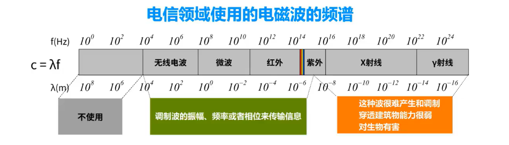

1. 这段频率范围不用于电信领域

   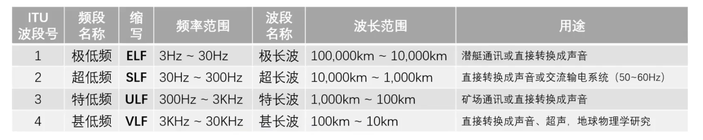

2. 这一段频率范围的电磁波很难产生和调制。由于频率非常高，波长就非常短，因此穿透障碍物的能力就非常弱。更为严重的是，该频段的电磁波对生物是有害的，因此人们很难利用该频率范围的电磁波进行数据传输

3. 这段频率范围的电磁波可以通过调制波的振幅、频率或相位来传输信息

   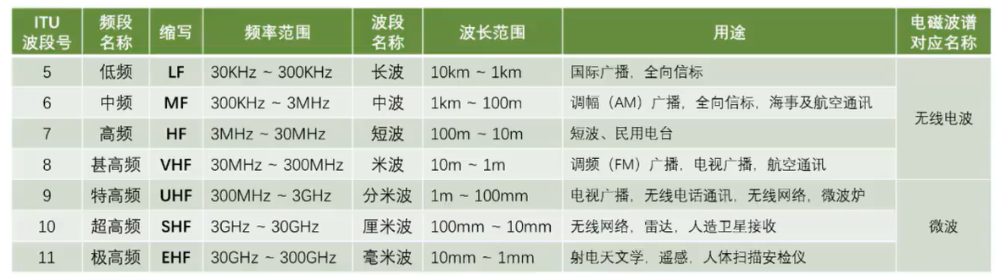

##### 用来传输信息的电磁波——无线电波和微波

上面国际电信联盟 ITU 对电磁波频段的划分。

从低频到甚高频，也就是从长波到米波，这些频段的电磁波又称为**无线电波**，用于国际广播、海事和航空通讯、电台、广播、电视广播等。

从特高频到极高频，也就是从分米波到毫米波。这些频段的电磁波又称为**微波**，用于无线电话、无线网络、雷达、人造卫星接收、射电、天文、人体扫描等。

###### 无线电波

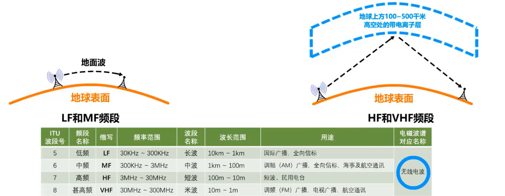

- 无线电波中的**低频和中频**频段主要利用**地面波**进行传输

- **高频和甚高频**频段主要是靠**电离层**的反射。

###### 微波

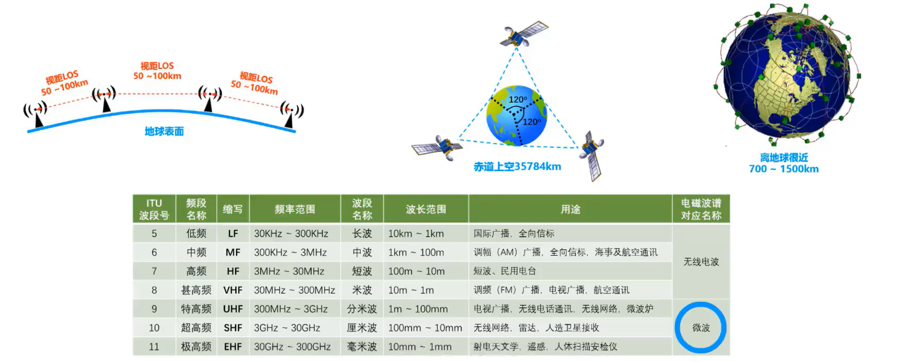

微波通信在数据通信中占有重要地位，频率范围为 300MHz到 300GHz，也就是波长 1 m到 1 mm，但主要使用 2- 40GHz的频率范围。

微波在空间主要是直线传播，由于微波会穿透电离层而进入宇宙空间，因此它**不能经过电离层的反射传播到地面上很远的地方**。

传统的微波通信主要有两种方式，一种是**地面微波接力通信**，另一种是**卫星通信**。由于微波在空间是直线传播的，而地球表面是个曲面，因此其传播距离受到限制，一般只有 50 公里左右。但若采用 100 米高的天线塔，则传播距离可增大到 100 公里。

为实现远距离通信，必须在一条微波通信信道的两个终端之间建立若干个中继站，把前一站送来的信号经过放大后再发送到下一站，故称为接力。常用的卫星通信方法是在地球站之间，利用位于约 36000 公里高空的人造同步地球卫星作为中继器的一种微波接力通信，其最大特点是通信距离远，相应的传播时延也比较大，一般在 250ms- 300 ms之间。除同步卫星外，低轨道卫星通信系统已开始在空间部署，并构成了空间高速链路。

### 红外线

利用红外线来传输数据并不陌生，很多家用电器，例如电视、空调等都配套有红外遥控器，以前的笔记本电脑基本都带有红外接口，可以进行红外通信。

#### 红外通信的特征

- 红外通信属于点对点无线传输

- 中间不能有障碍物，传输距离短

- 传输速率低（4Mb/s~16Mb/s）

现在笔记本电脑已经取消了红外接口，但很多智能手机还带有红外接口，以方便用户对电视、空调等家用电器进行红外遥控。

### 可见光通信

互联网时代，宅男宅女们最大的梦想就是世界上任何一个角落都变不准Wifi，要是再有电源，那这一辈子都值了。人们已经习惯了有 Wifi 的日子，可是现在告诉你，有一种比 Wifi 更高大上的 Wifi 出现了。你知道吗？ Wifi 就是传说中的可见光同性，通俗点来说就是 LED 灯上Wifi。最新的 only com Wifi，记住以每秒开关千万次 LED 灯来调制光信号，上网和数据传输完全不在话下，完全不用担心眼睛被晃瞎，人的肉眼绝对是分辨不出来的。

大家觉得 Wifi 能够取代 Wifi 吗？短时期内应该是无法取代的。想想看，如果两个房间内的网络设备要基于 Wifi 通信，如何做到可见光的同步？目前 Wifi 还处于实验研究阶段，但其应用前景被很多人看好。

#### 无线电频谱通信注意事项

最后还要提醒大家注意，要使用某一段无线电频谱进行通信，通常必须得到本国政府有关**无线电频谱管理机构**的许可证。

- 我国的无线电频谱管理机构：工信部无线电管理局
- 美国的无线电频谱管理机构：联邦通讯委员会FCC

也有一些无线电频段是可以自由使用的，称为 ISM (lndustrial, Scientific, Medical)频段，也就是工业、科学、医疗频段。

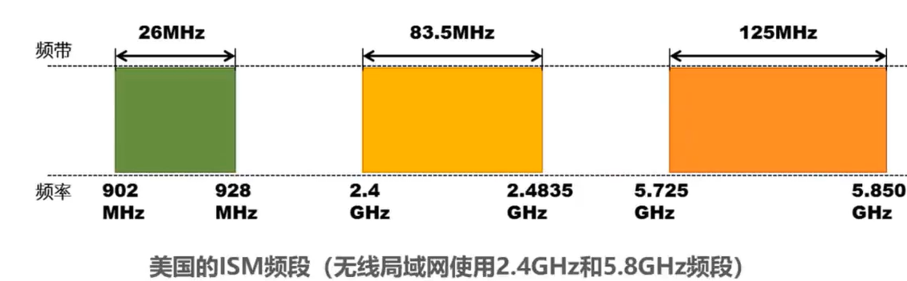

这是美国的 ISM 频段，现在的无线局域网就使用其中的 2. 4GHz和 5. 8GHz频段，各国的 ISM 标准可能略有不同。

## 本节小结（本节非重点难点，了解即可）

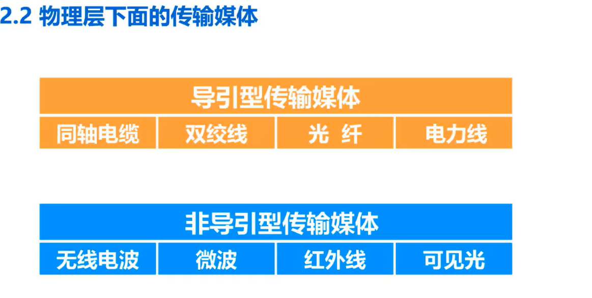

