# 3-10 以太网交换机的生成树协议STP

## 如何提高以太网的可靠性

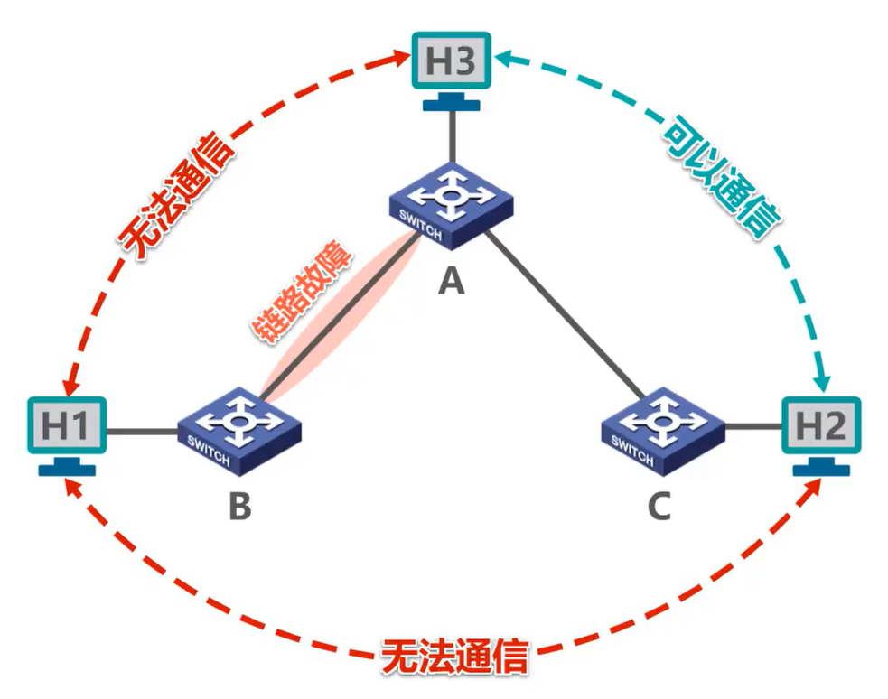

例如图所示的以太网由 3 台交换机互连而成，每个交换机上都连接有一些主机。为了简单起见，我们只画出了每个交换机上连接的一台主机。如果交换机 A 与 B 之间的链路出现了故障，则交换机 B 上连接的所有主机既无法与交换机 A 上连接的所有主机进行通信，也无法与交换机 C 上连接的所有主机进行通信。

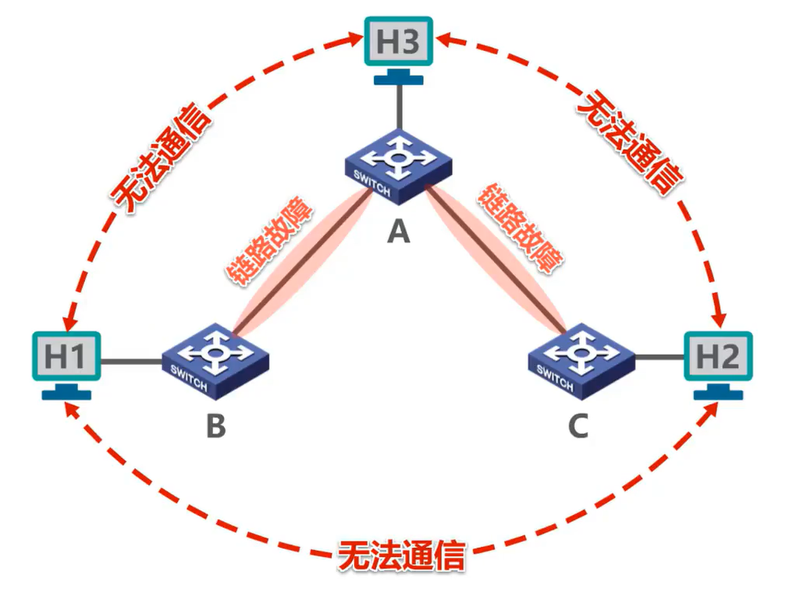

如果交换机 A 与交换机 B 和 C 之间的链路都出现了故障，则原来的以太网变成了 3 个独立的、较小的以太网，他们之间无法通信。

### 通过添加冗余链路的方法来提高以太网的可靠性

例如，在本例中，我们给交换机 B 和 C 之间添加一条冗余链路后，即使交换机 A 和 B 之间的链路出现了故障，整个网络还是连通的。

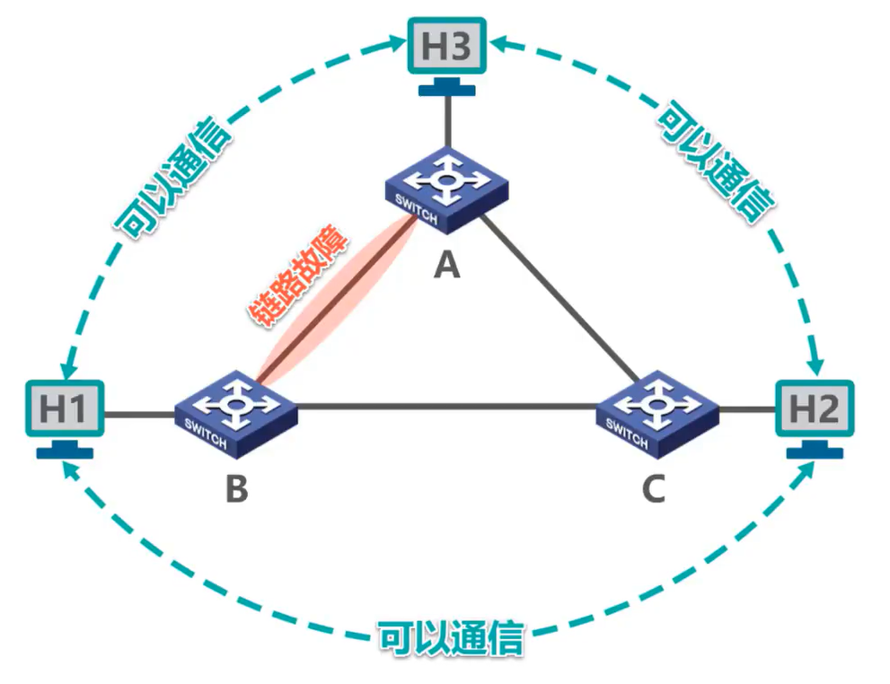

#### 冗余链路也会带来负面效应——网络环路

冗余链路也会带来负面效应，那就是形成网络环路，如图所示。网络环路会带来一些问题，例如广播风暴。

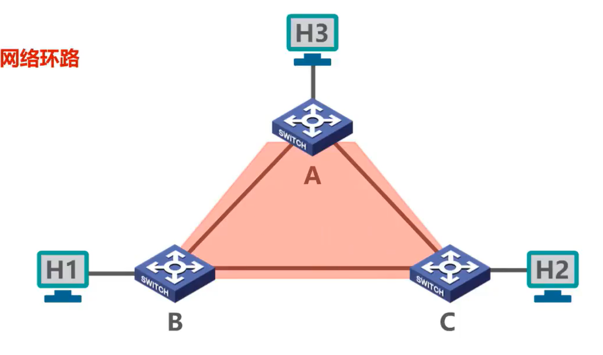

我们来举例说明，假设主机 H1 发送了一个广播帧

- 交换机 B 收到该帧后，将其从自己的其他所有接口转发出去。
- 交换机 A 收到交换机 B 转发来的该帧后，将其从自己的其他所有接口转发出去。
- 同样的，交换机 C 收到交换机 B 转发来的该帧后，将其从自己的其他所有接口转发出去。
- 交换机 C 收到交换机 A 转发来的该帧后，将其从自己的其他所有接口转发出去。
- 同样的，交换机 A 收到交换机 C 转发来的该帧后，将其从自己的其他所有接口转发出去。
- 交换机 B 收到交换机 C 转发来的该帧后，将其从自己的其他所有接口转发出去。
- 同样的，交换机 B 收到交换机 A 转发来的该帧后，将其从自己的其他所有接口转发出去。

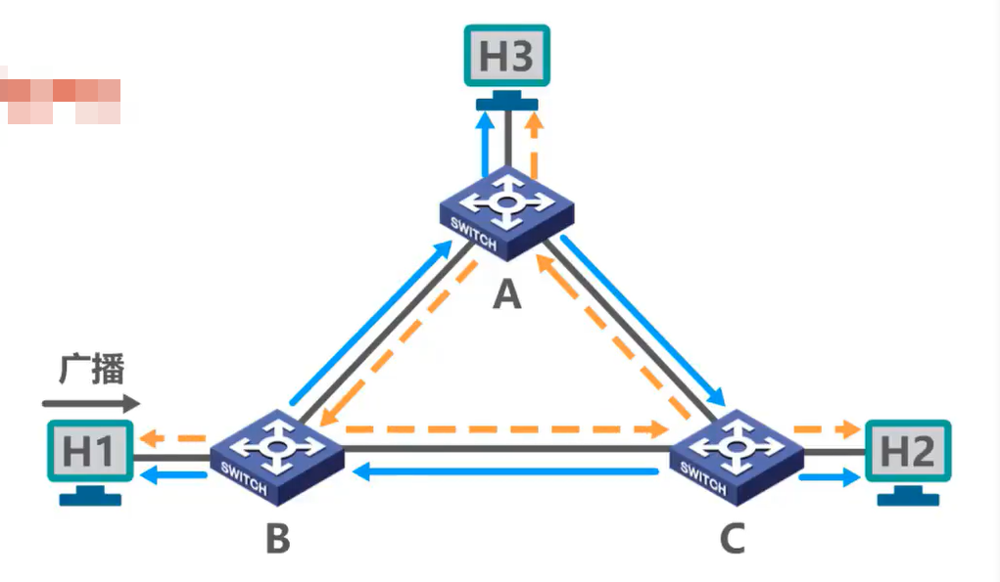

很显然，该广播帧将在各交换机之间反复转发，分别按顺时帧和逆时帧方向同时兜圈，这就是所谓的广播风暴。

#### 网络环路带来以下问题

1. **广播风暴**：广播风暴会大量消耗网络资源，使得网络无法正常转发其他数据帧

2. **使主机反复收到广播帧**：大量消耗主机资源，

3. **使交换机的帧交换表震荡（漂移）**：

如图所示，这是交换机 B 的帧交换表，这是其各接口的接口号。为了简单起见，假设各主机的名称也可作为其MAC地址。

- 当交换机 B 收到主机 H1 发送的广播帧后，进行登记工作，将帧的源 MAC 地址 H1 和帧进入交换机 B 的接口号一登记到帧交换表中，这条记录是正确的。
- 当交换机 B 再次收到交换机 C 转发来的该广播帧后，进行登记工作，将帧的源 MAC 地址 H1 和帧进入交换机 B 的接口号2 这条错误记录登记到帧交换表中，并删除原先正确的记录。
- 当交换机 B 再次收到交换机 A 转发来的该广播帧后，进行登记工作，将帧的源 MAC 地址 H1 和帧进入交换机 B 的接口号3 这条错误记录登记到帧交换表中，并删除原先错误的记录。
- 当交换机 B 再次收到交换机 C 转发来的该广播帧后，进行登记工作，将帧的原 MAC 地址 H1 和帧进入交换机 B 的接口号2 这条错误记录登记到帧交换表中，并删除原先错误的记录。

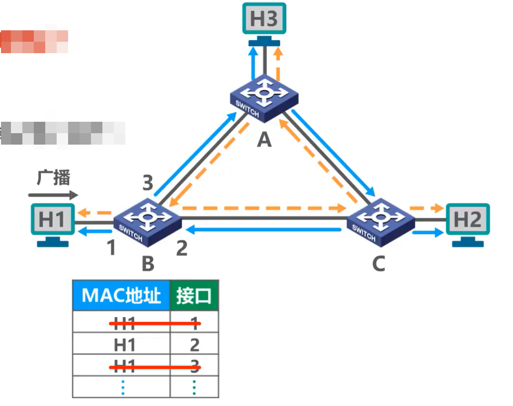

很显然，有关 MAC 地址 H1 的记录将在这两个错误记录之间反复震荡。

## 生成树协议STP

为了可以再增加冗余链路来提高网络可靠性的同时，又避免网络环路带来的各种问题，以太网交换机使用**生成树协议**(STP)。

- 不论交换机之间采用怎样的物理连接，使用生成树协议的交换机都能够**自动计算并构建出一个逻辑上没有环路的网络**，其逻辑拓扑结构必须是树形的，也就是没有逻辑环路。
- 最终生成的树型逻辑拓扑要确**保连通整个网络**;
  当首次连接交换机或网络**物理拓扑发生变化**时(有可能是人为改变或故障)，交换机都将进行**生成树的重新计算**。

### 举例说明生成树协议

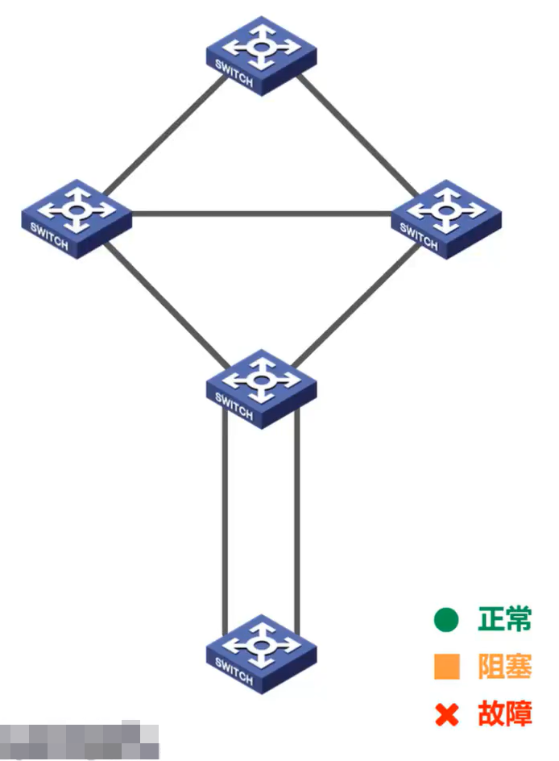

如图所示，为了提高可靠性， 5 台交换机之间进行了冗余连接，冗余链路不止一条，网络环路也不止一个。为了简单起见

- 各交换机上连接的主机没有画出
- 用绿色的小圆圈表示：交换机的接口状态为正常状态
- 用橙色的小方块表示：交换机的接口状态为阻塞状态
- 用红色的叉表示：出现了故障。

如果各交换机的各接口都处于正常状态，则会存在多个网络环路。实际上，各交换机之间按照生成数协议中规定的生成数算法交互一些参数后，就可以判断出自己应该阻塞自己的哪些接口，例如下图所示。

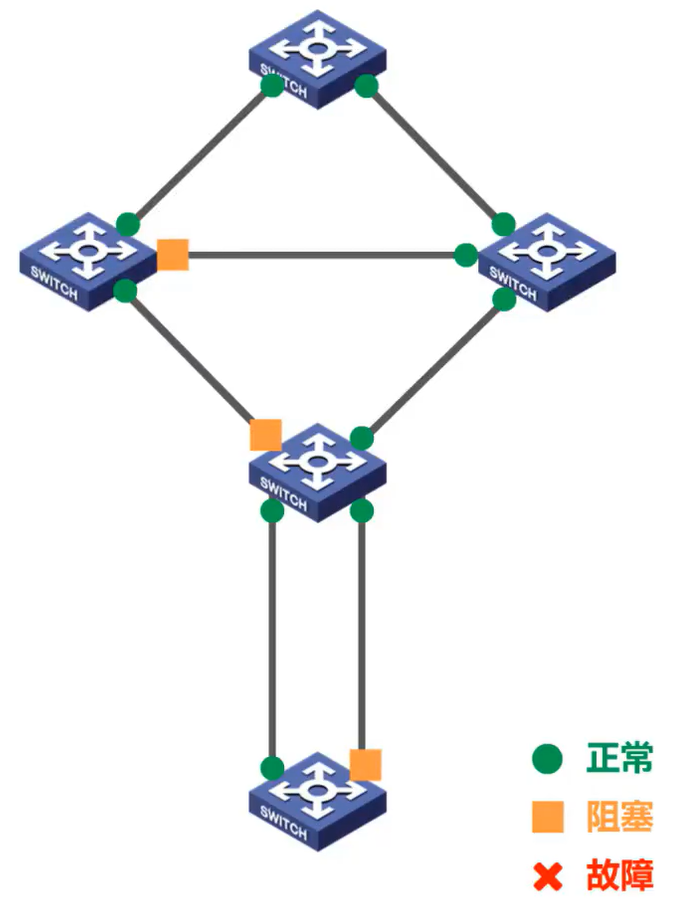

这样就会形成一个逻辑上没有环路的网络，如图所示。

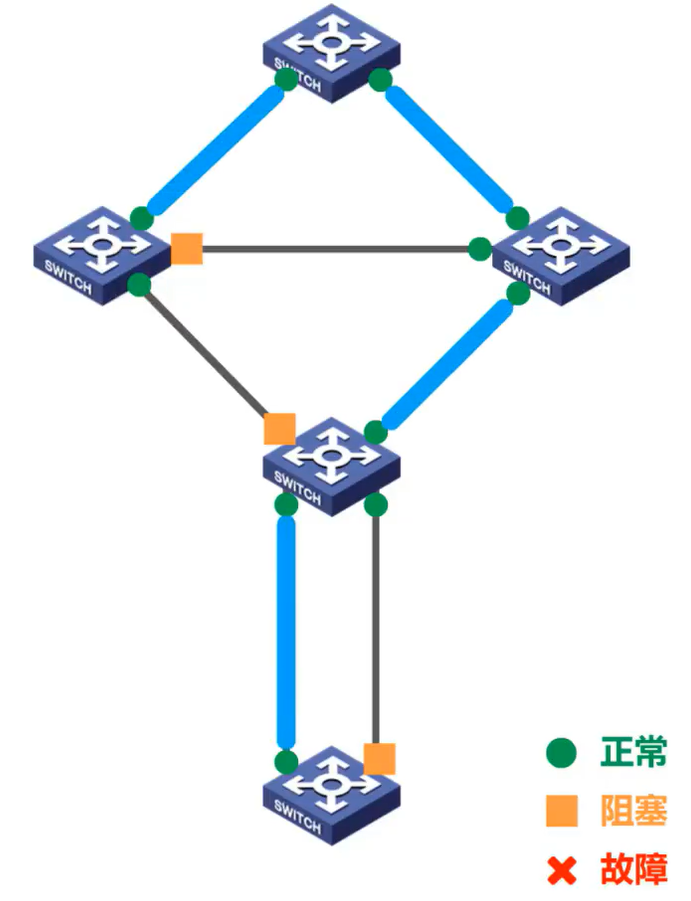

当然，这个逻辑上没有环路的网络一定要确保连通整个网络，否则就没有意义了。

当首次连接交换机或网络物理拓扑发生变化时，这有可能是人为改变造成的，也有可能是出现故障造成的，交换机都将进行生成数的重新计算。

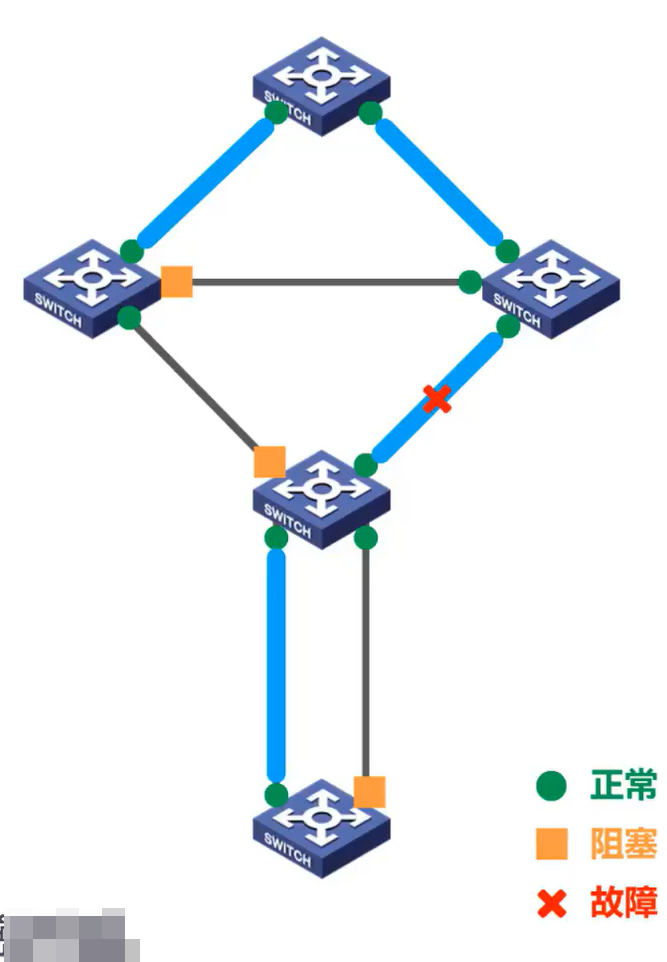

例如，假设这段链路出现了故障，相关交换机检测到该故障后重新计算生成数，决定将自己之前阻塞的接口恢复为正常状态，这样就会形成一个新的逻辑上没有环路的网络。

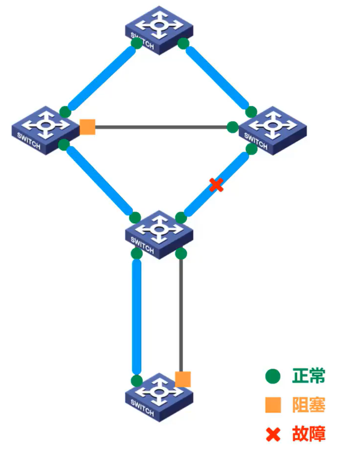

需要说明的是，生成树协议所使用的生成树算法以超出本系列课程的教学大纲。对生成树算法感兴趣的同学可以参看我们的另一个系列课程，计算机网络简明教程和仿真实验。

## 本节小结

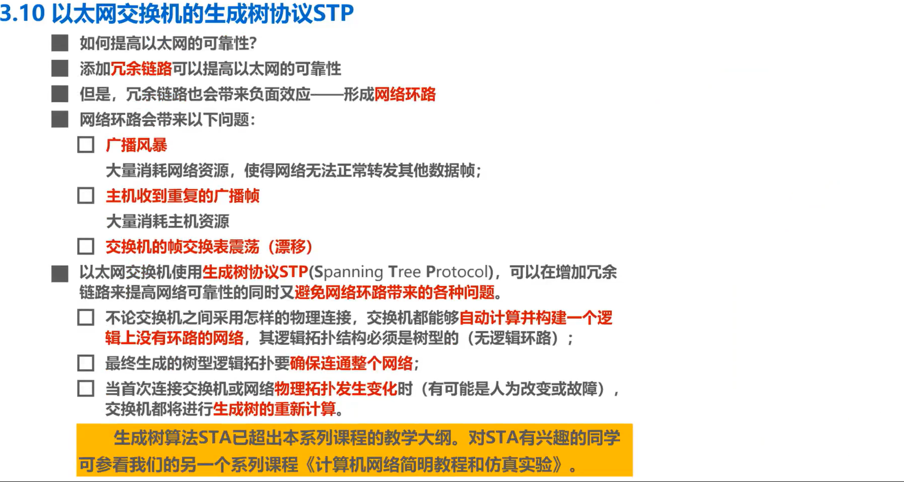

