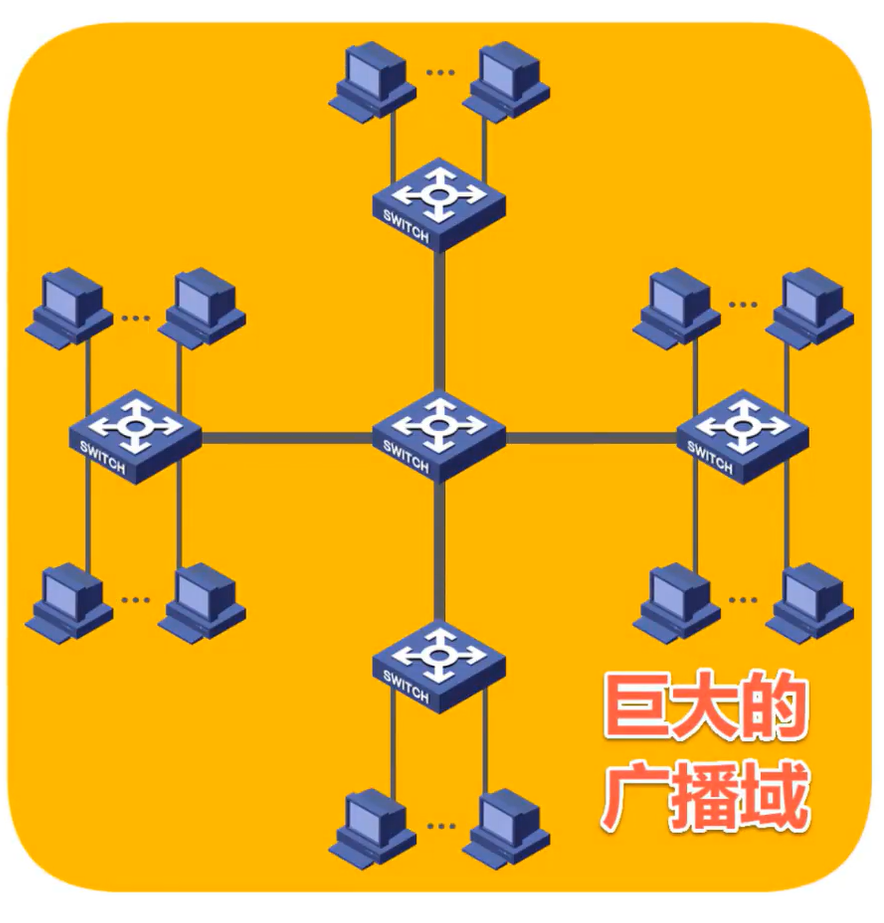
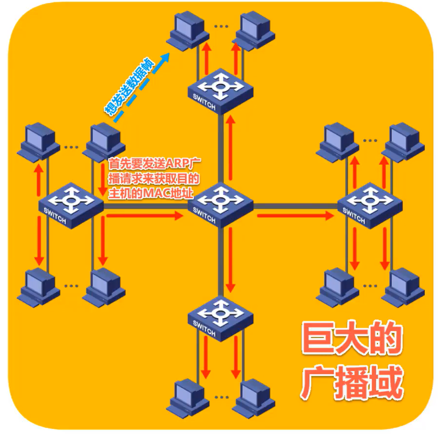
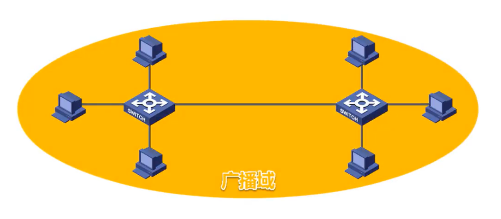
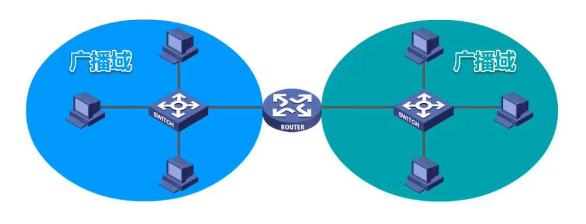
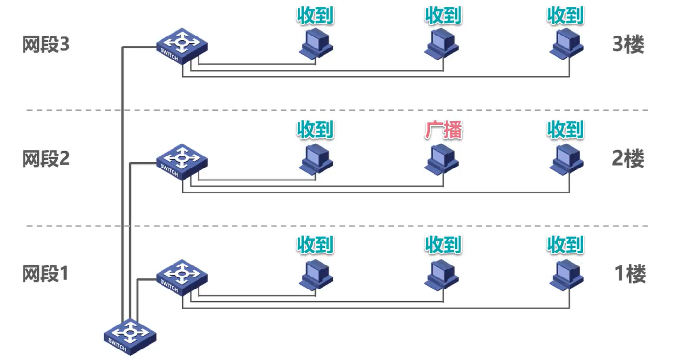
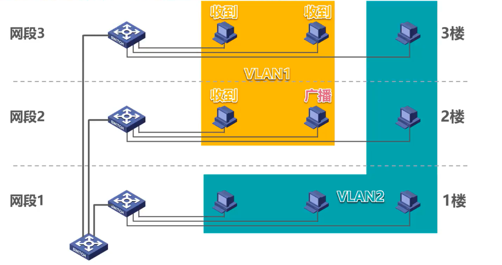
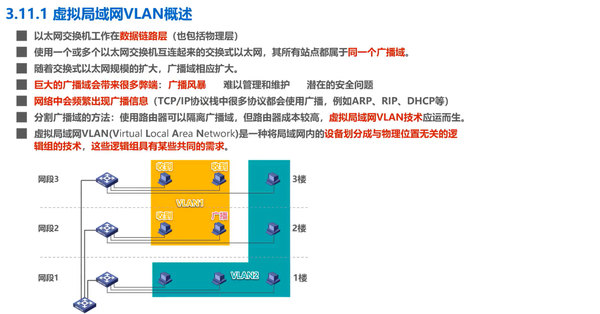

# 3-11-1 虚拟局域网VLAN概述

- 以太网交换机工作在**数据链路层**，也包括物理层。
- 使用一个或多个以太网交换机互连起来的交换式以太网，其所有站点都属于**同一个广播域**。
- 随着交换式以太网规模的扩大，广播域相应扩大。

如图所示，这是一个由多个以太网交换机互连而成的交换式以太网。

每个以太网交换机上都连接了多个主机，形成了一个巨大的广播域。

- 巨大的广播域会带来很多弊端，例如
  - 广播风暴
  - 难以管理和维护
  - 潜在的安全问题等

## 广播风暴

我们来举例说明广播风暴的问题。

假设网络中的某个主机要给另一个主机发送一个数据帧，但是在自己的 ARP 高速缓存表中无法查到目的主机的MAC地址，于是首先要发送 ARP广播请求来获取目的主机的MAC地址。该 ARP广播请求会传遍整个网络中的其他所有主机都可以收到该广播，这种情况就是所谓的广播风暴。

广播风暴会浪费网络资源和网络中各主机的 CPU 资源。因此，除非应用需求必须要使用广播，否则**网络中的主机应尽量不使用广播**。

也许有的同学会有这样的想法，如果网络中只是偶尔出现广播，那还是可以接受的。但事实上，网络中会频繁出现广播信息。

### 网络中会频繁出现广播信息

- 目前使用最广泛的 TCP/IP 协议栈中的很多协议都会使用广播，例如
  - 地址解析协议ARP
  - 路由信息协议RIP
  - 动态主机配置协议 DHCP 等

- 除此之外，其他一些协议站也会频繁使用广播
  - NetBEUI: Widnows下使用的广播型协议
  - IPX/SPX: Novell网络的协议栈
  - Apple Talk: Apple公司的网络协议栈

### 分割广播域的方法

那么，如何才能将较大的广播域分割成更小的广播域？——**使用路由器就可以隔离广播域**。

如图所示，这是由两台以太网交换机互连而成的交换式以太网网络中的各主机同属于一个广播域

使用路由器可以将该广播域分割成两个较小的广播域

 

路由器工作在网络体系结构的第三层，也就是网络层，由于**路由器默认情况下不对广播数据包进行转发**，因此路由器很自然的就可以隔离广播域。

然而路由器的成本较高，局域网内部全部使用路由器来隔离广播域是不现实的。在这种情况下，虚拟局网技术应运而生。

### 虚拟局域网的产生

虚拟局域网的英文缩写词为VLAN(Virtual Local Area Network)，它是一种**将局域网内的设备划分成与物理位置无关的逻辑组的技术，这些逻辑组具有某些共同的需求**。

如图所示，一楼、二楼、三楼分别有一个局域网，可将他们通过另外一个交换机互连成一个更大的局域网，那么原来每一个局域网成为现在这个局域网的一个网段。网络中的各主机属于同一个广播域，某个主机发送的广播数据包，其他所有主机都可以收到。

根据应用需求，我们将该局域网划分成两个VLAN，VLAN1 和VLAN2。

此后，VLAN1 中的广播数据包不会传送到VLAN2，VLAN2 中的广播数据包也不会传送到VLAN1。也就是说，**同一个VLAN内部可以广播通信，不同VLAN之间不能广播通信**。

VLAN的具体实现见下节

## 本节小结

