# 3-11-2 虚拟局域网VLAN的实现机制

虚拟局域网VLAN技术是在交换机上实现的，需要交换机能够实现以下两大功能

- 一是能够处理带有VLAN标记的帧，也就是IEEE 802.1Q帧
- 二是交换机的各端口可以支持不同的端口类型，不同端口类型的端口对帧的处理方式有所不同

## IEEE 802.1Q帧

- IEEE 802.1Q帧 (Dot One Q帧即.1Q帧)，它对以太网的MAC帧格式进行了扩展，插入了 4 字节的VLAN标记。如图所示，分别是以太网版本 2 的MAC帧格式和插入VLAN标记后的 802. 1 Q 帧的格式

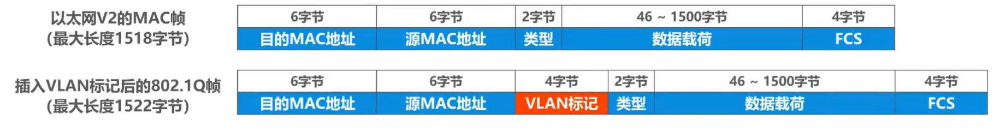

- VLAN标记的最后 12 个比特称为VLAN标识符VID。它唯一的标识了以太网帧属于哪一个VLAN 
  - VID 的取值范围是 0 到4095（0~2^12^-1），
  - 其中 0 和 4095 都不用来表示VLAN，因此用于表示VLAN的 VID 的有效取值范围是 1- 4094。

- 需要注意的是， 802.1Q帧是由交换机来处理的，而不是用户主机来处理的。
  - 当交换机收到普通的以太网帧时，会将其插入 4 字节的VLAN标记，将其转变为 802 .1Q 帧，简称为“打标签”。
  - 当交换机转发 802. 1 Q 帧时，可能会删除其 4 字节VLAN标记，将其转变为普通以太网帧，简称为“去标签”。
- VLAN标记字段的其他内容对我们理解VLAN划分机制来说并没有什么帮助，因此就不再赘述

## 交换机的端口类型

接下来我们介绍交换机的端口类型。交换机的端口类型一般有以下三种，它们分别是

- Access
- Trunk
- Hybrid

需要说明的是，思科交换机没有Hybrid端口。

### 交换机的缺省VLAN ID

在介绍这三种交换机端口类型之前，我们首先需要了解一下**端口的缺省VLAN ID** 这个概念。

- 在思科交换机上将其称为Native VLAN，即本征VLAN。例如，思科交换机在用户未配置VLAN时，所有端口都默认属于VLAN1，即所有端口的本征VLAN都是VLAN1，
- 在华为交换机上将其称为**PortDefault VLAN ID** ，即端口VLAN ID，简记为 PVID。

在我们接下来的介绍中，为了描述方便，我们采用 PVID，而不是本征VLAN。需要注意的是，**交换机的每个端口有且仅有一个PVID**。

### Access端口

接下来我们首先介绍 Access 端口。 

- Access端口一般用于连接用户计算机
- Access端口只能属于一个VLAN，因此 Access 端口的 PVID 值与端口所属VLAN的 ID 相同（默认为1）

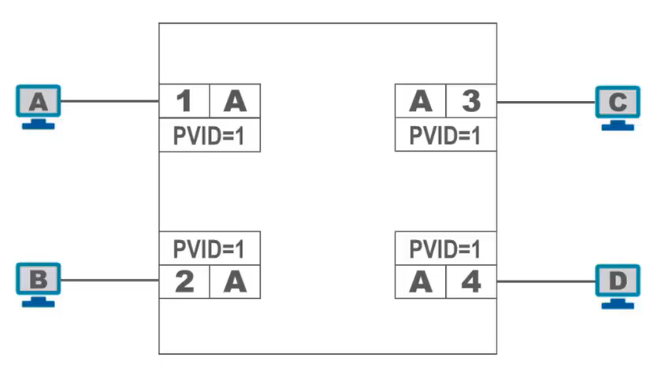

如图所示，主机A、B、C、 D 分别连接在交换机的一个端口上，交换机首次上电时，默认配置各端口属于VLAN1，也就是各端口的 PVID 值等于1，默认配置各端口的类型为Access，我们用大写字母A来表示。

#### Access端口的处理方法

##### Access端口的接收处理方法

Access 端口的接收处理方法：一般只接受未打标签的普通以太网MAC帧，根据接收帧的端口的 PVID 给帧打标签，即插入 4 字节VLAN标记字段中的 VID 取值与端口的 PVID 取值相等。

##### Access端口的发送处理方法

Access 端口的发送处理方法：若帧中的 VID 与端口的 PVID 相等，则去标签后转发该帧，否则不转发。

#### 举例说明1

我们来举例说明，假设主机 A 发送了一个广播帧，该帧从交换机的端口 1 进入交换机，由于端口 1 的类型是Access，它会对接收到的未打标签的普通以太网MAC帧打标签，也就是插入 4 字节的VLAN标记字段。如图所示，由于端口 1 的 PVID 值等于1，因此所插入的 4 字节VLAN标记字段中的 VID 的值也等于1。 

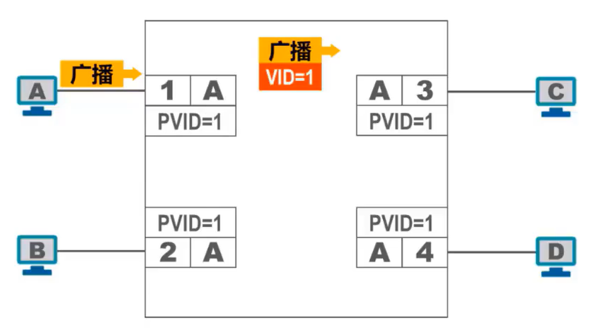

Access 端口的发送处理方法：若帧中的 VID 与端口的 PVID 相等，则去标签后转发该帧，否则不转发。

对于本例，广播帧中的 VID 的取值与端口 2、3、4 的 PVID 取值都等于1，因此交换机会从这三个端口对帧进行去标签转发，如下图所示。

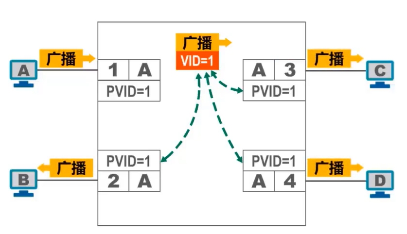

#### 举例说明2

再来看这个例子，我们的应用需求是将主机 A 和 B 划归到VLAN2，将主机 C 和 D 划归到VLAN3，这样VLAN2 中的广播帧不会传送到VLAN3，VLAN3 中的广播帧也不会传送到VLAN2。

为了实现这种应用，可以在交换机上创建VLAN2 和VLAN3，然后将交换机的端口 1 和 2 划归到VLAN2，因此端口 1 和 2 的 PVID 值等于2。将交换机的端口 3 和 4 划归到VLAN3，因此端口 3 和 4 的 PV ID 值等于3。

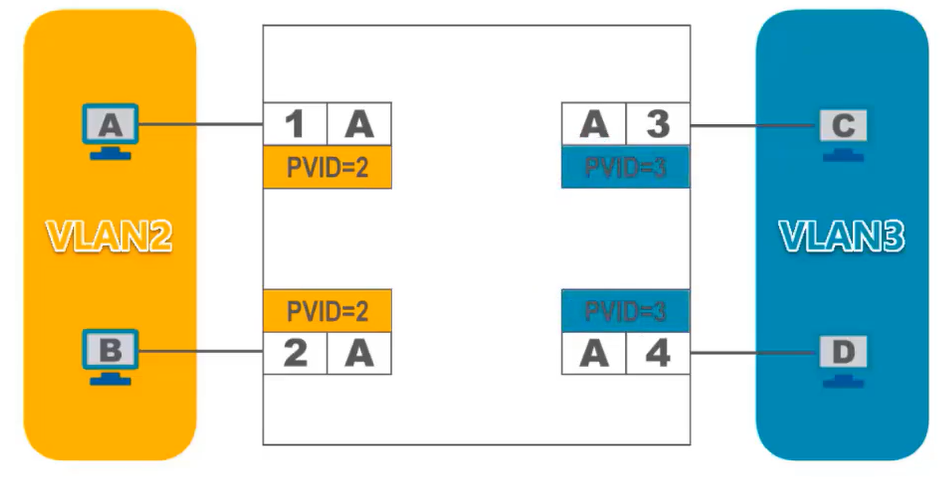

##### 主机A发送广播帧

我们来看主机A发送广播帧的情况，该帧从交换机的端口 1 进入交换机，由于端口 1 的类型是Access，他会对接收到的未打标签的普通以太网MAC帧打标签，也就是插入 4 字节的VLAN标记字段，如图所示，由于端口 1 的 PVID 值等于2，因此所插入的 4 字节VLAN标记字段中的 VID 的值也等于2。

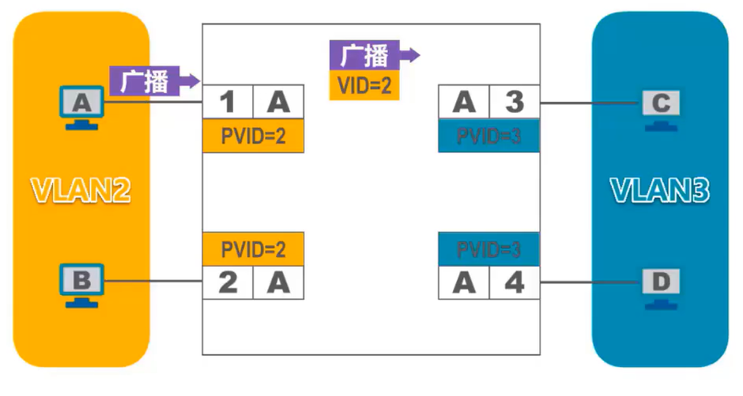

广播帧中的 VID 的取值与端口 2 的 PVID 取值都等于2，因此交换机会从端口2 对帧进行去标签转发。

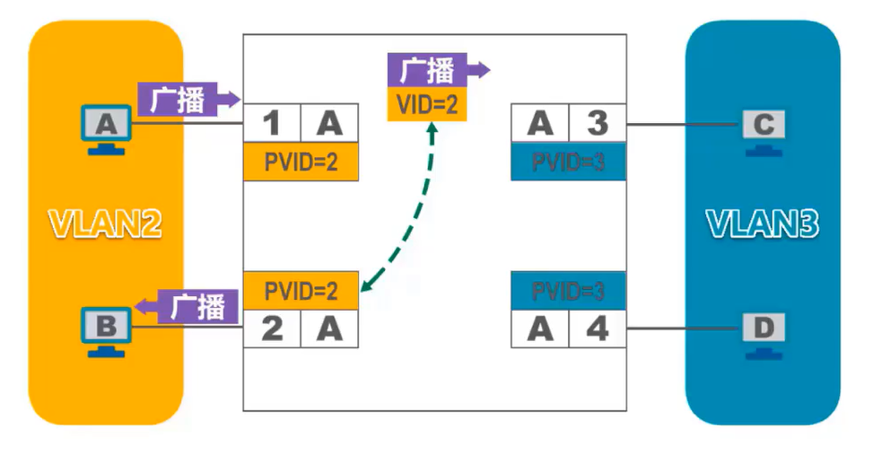

##### 主机C发送广播帧

我们再来看主机 C 发送广播帧的情况，该帧从交换机的端口 3 进入交换机，由于端口 3 的类型是Access，它会对接收到的未打标签的普通以太网MAC帧打标签，也就是插入 4 字节的VLAN标记字段，如图所示。

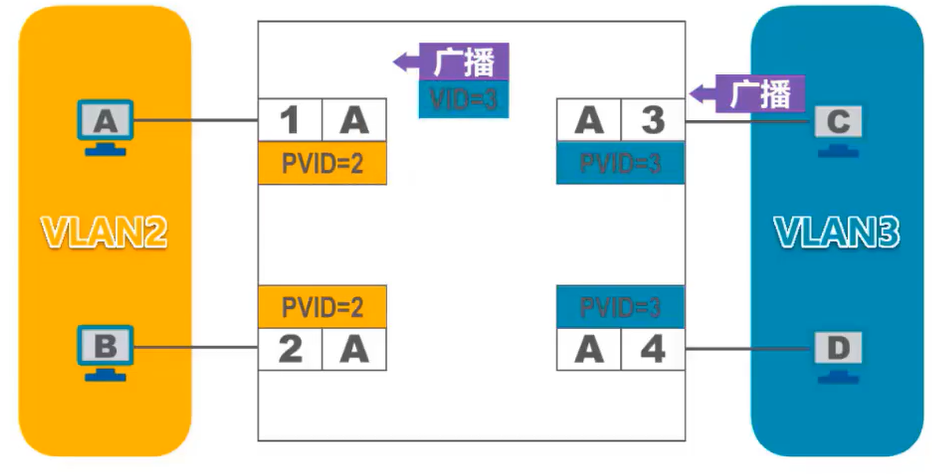

由于端口 3 的PVID值等于3，因此所插入的 4 字节VLAN标记字段中的VID的值也等于3。广播帧中的VID的取值与端口 4 的PVID取值都等于3，因此交换机会从端口 4 对帧进行去标签转发。

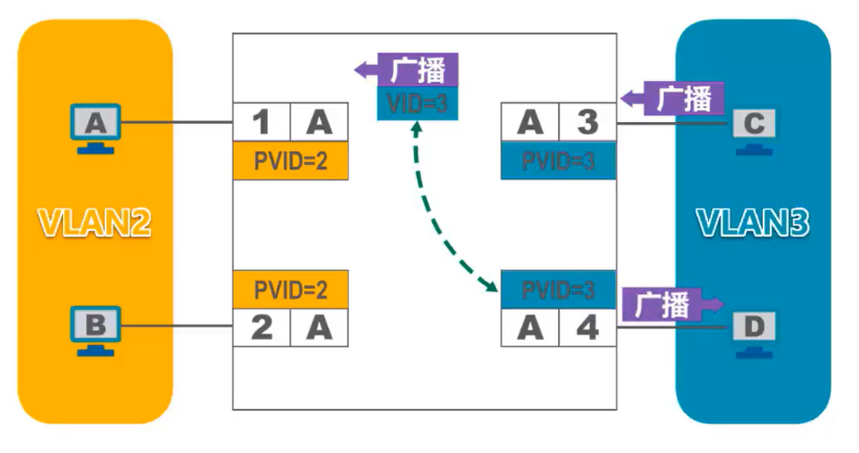

### Trunk端口

接下来我们介绍Trunk端口。

- Trunk端口一般用于交换机之间或交换机与路由器之间的互连。
- Trunk端口可以属于多个VLAN：也就是说Trunk端口可以接收和发送多个VLAN的帧
- 用户可以设置Trunk端口的 PVID 值，默认情况下，Trunk端口的 PVID 值为1。

##### Trunk端口的发送处理方法

Trunk端口的发送处理方法：

- 对 VID 等于 PVID 的帧去标签再转发；
- 对 VID 不等于 PVID 的帧直接转发，即不去掉标签而带着标签直接转发

##### Trunk端口的接收处理方法

Trunk端口的接收处理方法：

- 接收未打标签的帧，根据接收帧的端口的 PVID 给帧打标签。即插入 4 字节VLAN标记字段，其中的 VID 取值与端口的 PVID 取值相等。
- 接收已打标签的帧

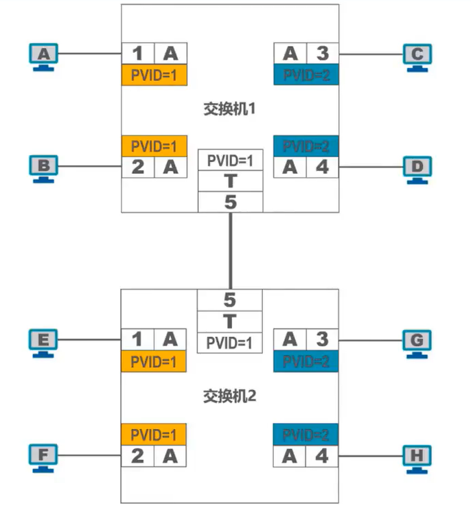

#### 举例说明

我们来举例说明Trunk端口的功能，如图所示，两台交换机互连而成的一个交换式以太网，我们的应用需求是将主机A、B、E、 F 划归到VLAN1，将主机C、D、G、 H 划归到VLAN2。

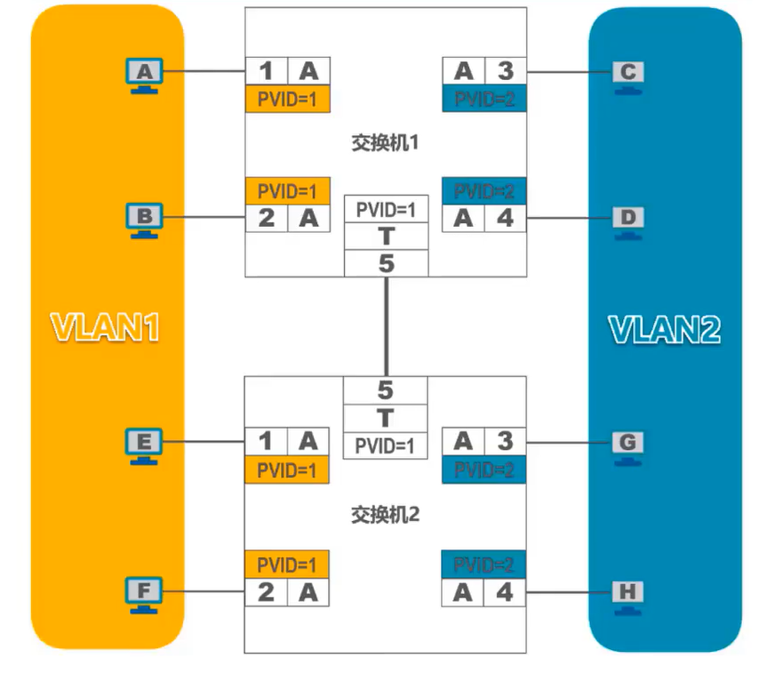

##### 交换机配置VLAN及Trunk端口

由于交换机首次上电时默认配置各端口属于VLAN1，其相应的 PVID 值等于1，并且端口的类型为Access，因此我们需要对交换机进行相应的配置才能满足应用需求。

分别在两个交换机上创建VLAN2，并将他们的端口 3 和 4 都划归到VLAN2，其相应的 PVID 值等于2，而两个交换机的端口 1 和 2 保持默认配置即可，也就是属于VLAN1，其相应的 PVID 值等于1。特别需要注意的是，**两个交换机互联的端口 5 需要将它们的类型更改为Trunk类型**，而它们的 PVID 值保持默认的 1 即可。

##### 主机 A 发送个广播帧

假设主机 A 发送了一个广播帧，该帧从交换机 1 的端口 1 进入交换机。

###### Access类型发送端口打标签

由于端口 1 的类型是Access，它会对接收到的未打标签的普通以太网MAC帧打标签，也就是插入 4 字节的VLAN标记字段，如图所示。由于端口 1 的 PVID 值等于1，因此所插入的 4 字节VLAN，标记字段中的 VID 的值也等于1。

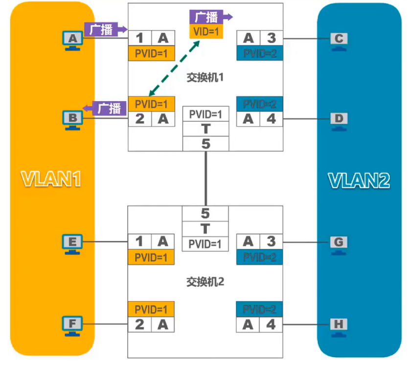

###### 同交换机下的Access端口转发

该广播帧中的VID 的取值与端口 2 的 PVID 值都等于1。端口 2 的类型是Access，因此交换机 1 会从端口 2 对帧进行去标签转发。

###### 同交换机下的Trunk端口转发

该广播帧中的 VID 的取值与端口 5 的 PVID 值都等于1。端口 5 的类型是Trunk，因此交换机 1 会从端口 5 对帧进行**去标签转发**。很显然，该广播帧会从交换机 2 的端口 5 进入交换机 2 。

###### 另一交换机Trunk端口转发

Trunk端口的接收处理方法：接收未打标签的帧，根据接收帧的端口的 PVID 给帧打标签。即插入 4 字节VLAN标记字段中的 VID 取值与端口的 PVID 取值相等。

对于本例，交换机 2 会对接收到的未打标签的普通以太网MAC帧打标签，也就是插入 4 字节的VLAN标记字段。如图所示，由于端口 5 的 PVID 值等于1，因此所插入的 4 字节VLAN标记字段中的 VID 的值也等于1。

###### 另一交换机Access端口转发

该广播帧中的VID的取值与端口 1 和 2 的PVID值都等于1。端口 1 和 2 的类型都是Access，因此交换机 2 会从端口 1 和 2 对帧进行去标签转发。

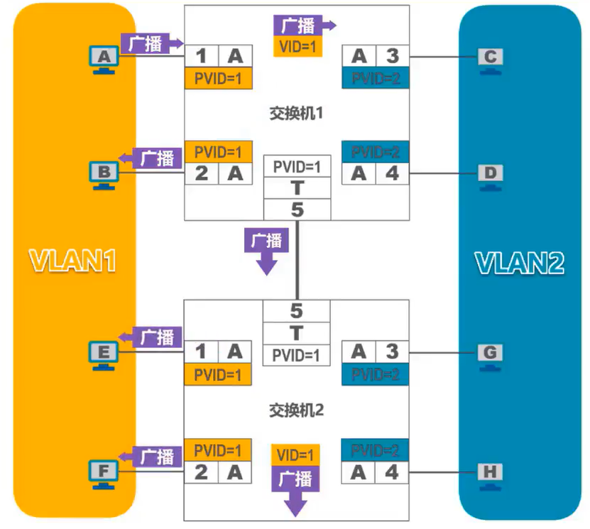

##### 主机 C 发送广播帧

再来看主机 C 发送广播帧的情况

###### Access类型发送端口打标签

该帧从交换机 1 的端口 3 进入交换机，由于端口 3 的类型是Access，它会对接收到的未打标签的普通以太网MAC帧打标签，也就是插入 4 字节的VLAN标记字段。如图所示，由于端口 3 的 PVID 值等于2，因此所插入的 4 字节VLAN标记字段中的 VID 的值也等于2。

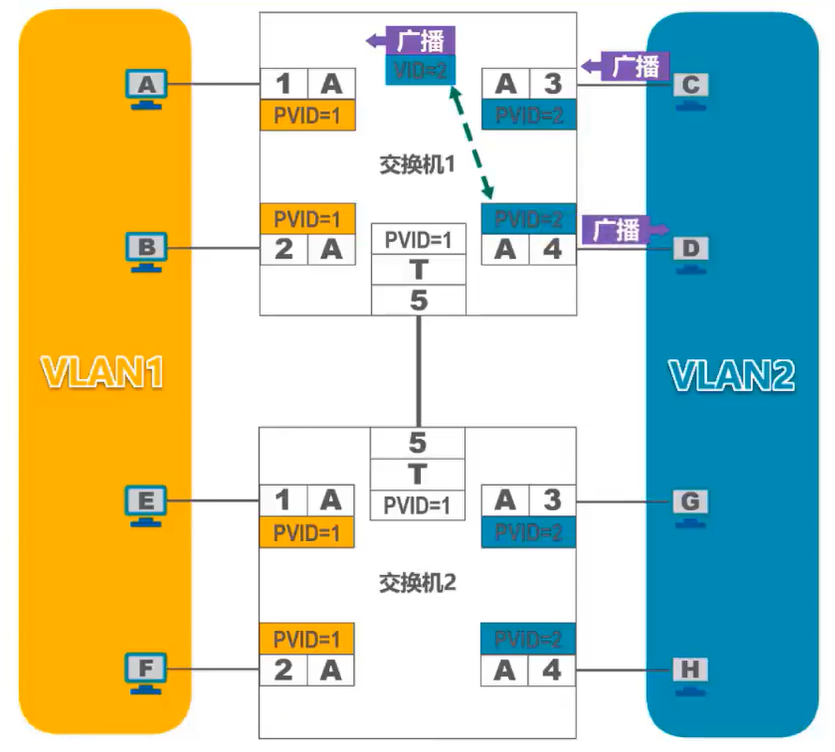

###### 同交换机下Access类型端口转发

该广播帧中的VID的取值与端口 4 的 PVID 值都等于2，端口 4 的类型是Access，因此交换机 1 会从端口 4 对帧进行去标签转发，见上图所示。

###### 同交换机下Trunk类型端口转发

该广播帧中的 VID 的取值与端口 5 的 PVID 值不相等。由于**Trunk端口对 VID 不等于 PVID 的帧是直接转发的**，因此交换机 1 会从端口 5 对帧直接转发，也就是**不去掉标签而带着标签直接转发**。

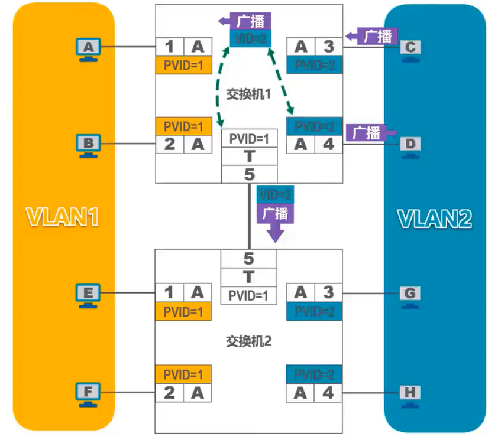

很显然，该 802. 1 Q 广播帧会从交换机 2 的端口 5 进入交换机 2 Trunk端口接收已打标签的 802. 1 Q 帧。

###### 另一交换机Access类型端口转发

该广播帧中的VID 的取值与端口 3 和 4 的PVID值都等于2，端口 3 和 4 的类型都是 Access 类型，因此交换机 2 会从端口 3 和 4 对帧进行去标签转发。

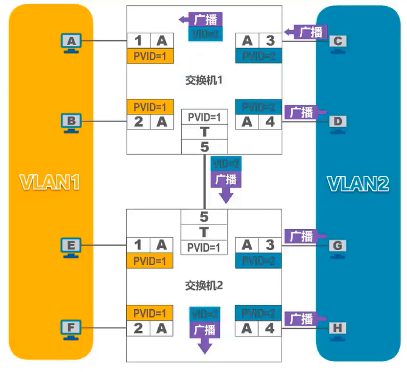

通过本例可以看出，**在由多个交换机互连而成的交换式以太网中划分VLAN时，连接主机的交换机端口应设置为 Access 类型，交换机之间互联的端口应设置为 Trunk 类型**。

==笔者注：若A、B、E、F划分为VLAN10，C、D、G、H划分为VLAN20；各端口5配置Trunk端口类型，PVID值为1，似乎也可实现VLAN划分，各VLAN的数据帧在Trunk口处直接转发即可==

## 习题

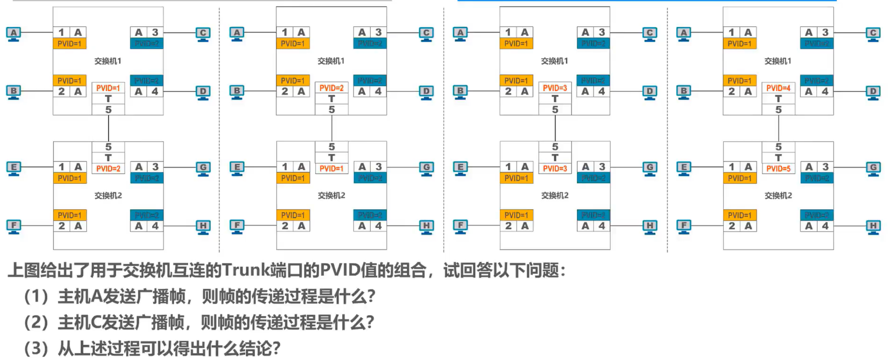

本题的答案如下所示

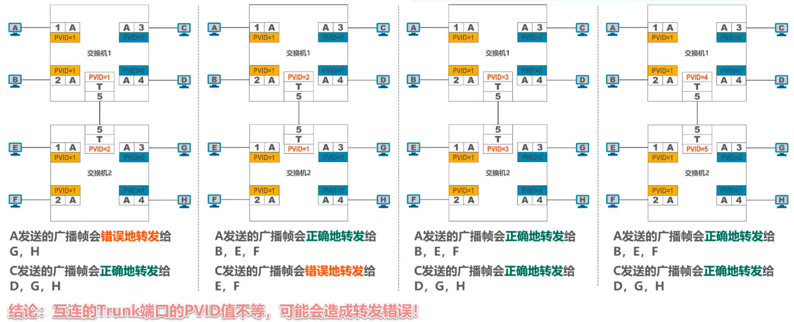

### Hybrid端口

最后我们简单介绍一下华为交换机私有的Hybrid的端口类型。

- Hybrid的端口既可用于交换机之间或交换机与路由器之间的互联（与Trunk端口相同），也可用于交换机与用户计算机之间的互联（与 Access 端口相同）。

- Hybrid端口可以属于多个VLAN(同Trun端口)

- 用户可以设置Hybrid端口的PVID值。默认情况下,Hybrid端口的PVID值为1(同Trun端口)

除此之外， Hybrid 端口的绝大部分功能与Trunk端口相同。不同点在于Hybrid端口的发送处理方法。

#### Hybrid发送处理方法（与Trunk端口不同）

Hybrid端口会查看帧的VID是否在端口的“去标签”列表中

- 若存在，则“去标签”后再转发;
- 若不存在，则直接转发;

#### Hybrid接收处理方法（与Trunk端口相同）

- 接收“未打标签”的帧，根据接收帧的端口的PVID给帧“打标签”，即插入4字节VLAN标记字段，字段中的VID取值与端口的PVID取值相等
- 接收“已打标签的帧”;

#### 举例说明Hybrid的端口的功能

主机A、B、 C 连接在同一个交换机的不同接口上，请利用Hybrid的端口的功能实现以下应用需求： A 和 B 都能与 C 相互通信，但 A 与 B 不能相互通信。

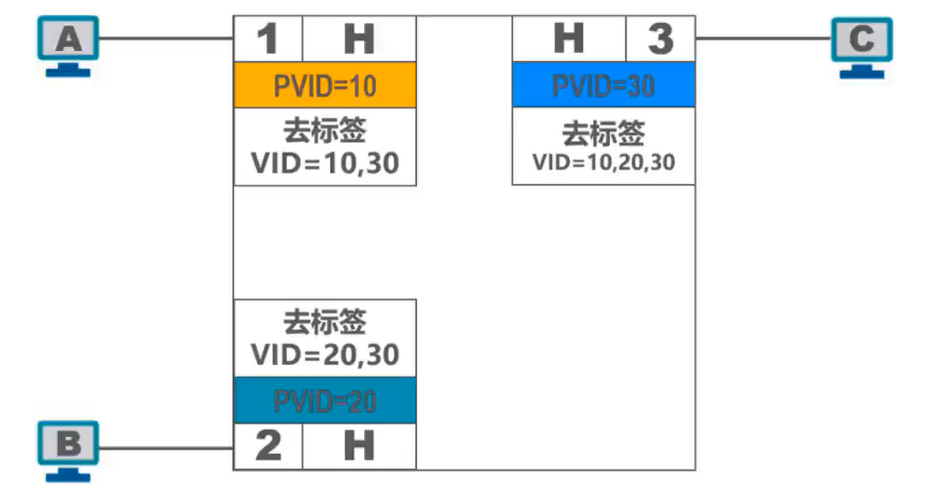

如图所示。我们可以将这三台主机所连接的交换机的三个端口划分到不同的VLAN，并且端口类型设置为Hybrid。假设这三个VLAN分别是VLAN10、VLAN20、VLAN30，相应的 PVID 分别为10、20、30。

- 在端口 1 的去标签列表中配置VLAN10和VLAN30。
- 在端口 2 的去标签列表中配置VLAN 20 和VLAN30。
- 在端口 3 的区标签列表中配置VLAN10、VLAN20、VLAN30。

##### 主机A给C发送数据帧

主机A给C发送数据帧，该帧从交换机的端口 1 进入交换机。由于端口译的类型是Hybrid，它会对接收到的未打标签的普通以太网MAC帧打标签，也就是插入 4 字节的VLAN标记字段，如图所示。

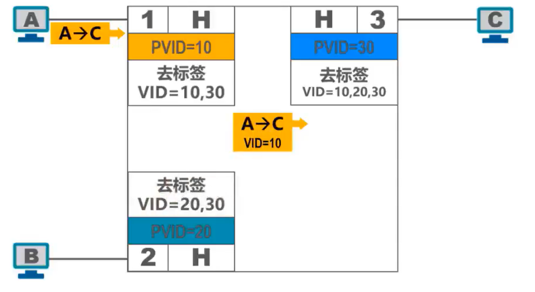

由于端口 1 的 PVID 值等于10，因此所插入的 4 字节VLAN标记字段中的 VID 的值也等于10，该帧将从端口 3 转发（帧VID值与端口PVID值不同时直接转发）。又由于帧中的VID 的取值在端口 3 的去标签列表中，因此该帧会被端口3去标签转发，这样主机C就可以收到主机 A 发送的数据帧。

同理，主机 C 给 A 发送数据帧，主机 A 同样可以收到，我们就不再演示了。

同理，主机 B 给 C 发送数据帧，如下图所示

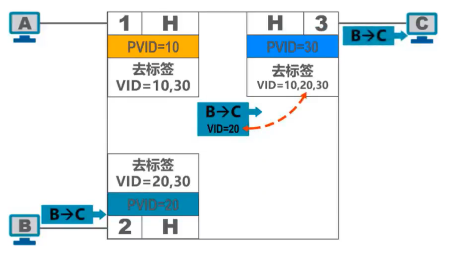

同理，主机 C 给 B 发送数据帧，就不再演示了。

##### 主机 A 给 B 发送数据帧

再来看看主机 A 给 B 发送数据帧的情况。该帧从交换机的端口 1 进入交换机，给该帧打标签，其中 VID 取之为10，该帧将从端口 2 转发（帧VID值与端口PVID值不同时直接转发）。

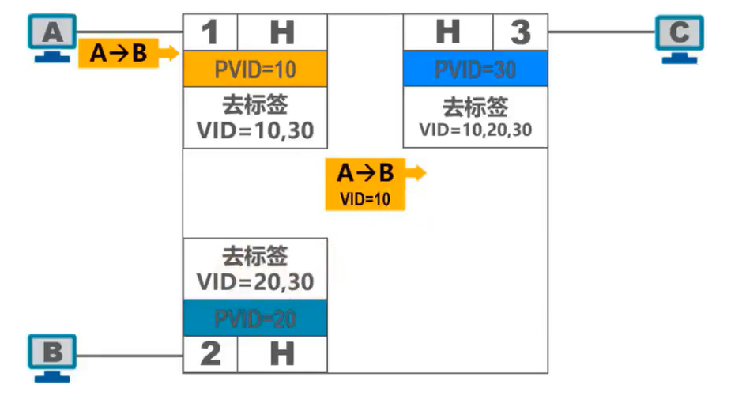

由于帧中的 VID 的取值不在端口 2 的去标签列表中，因此该帧被直接转发，这样**主机B 就会收到一个带有VLAN标记的 802.1Q 帧，但是主机 B 可以识别普通以太网MAC帧，而不能识别 802.1Q 帧，只能丢弃该帧**。

同理，主机 B 给 A 发送的普通以太网MAC帧，主机 A 收到的却是 802.1Q帧，无法识别而丢弃。

## 本节小结

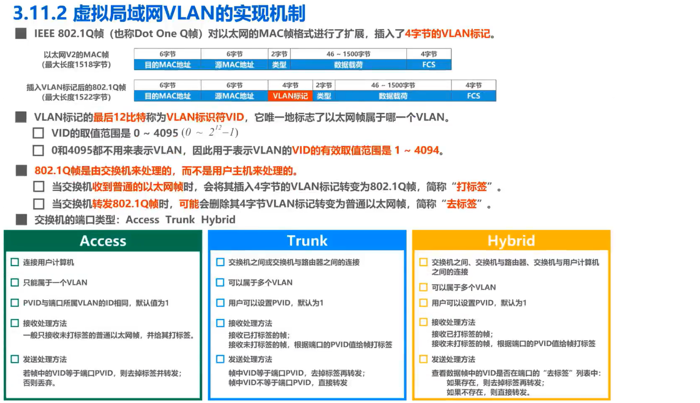

