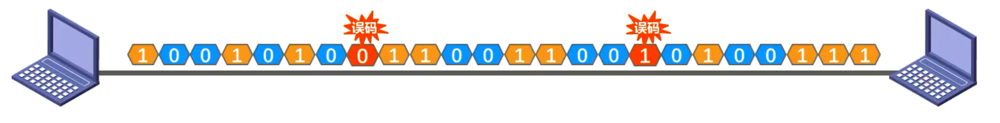
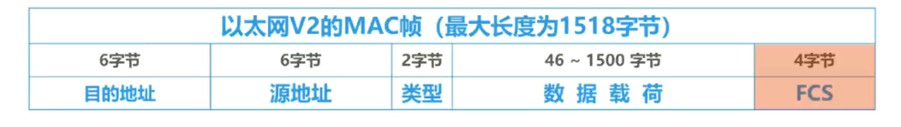
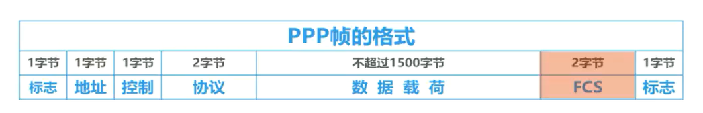
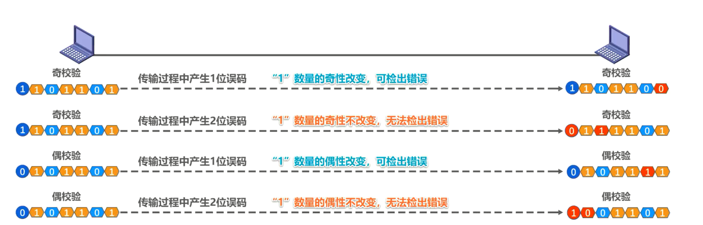
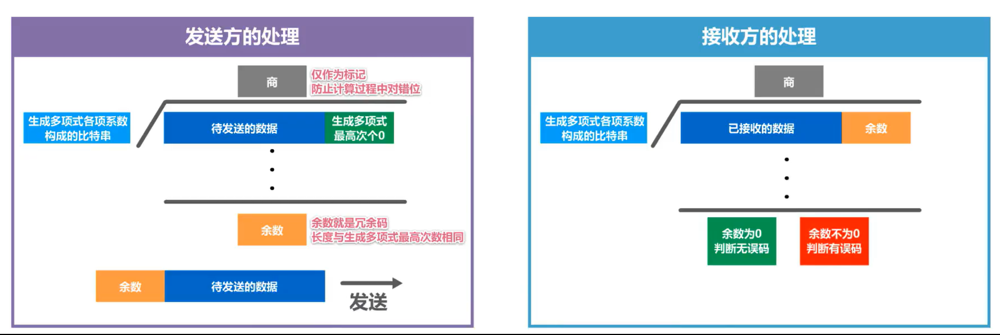
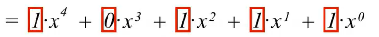
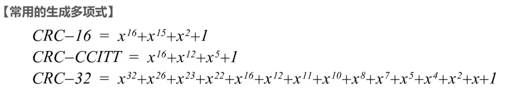
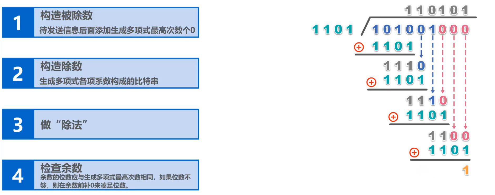
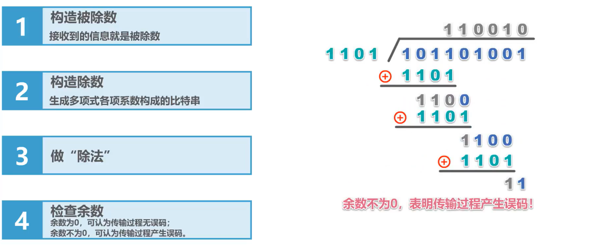

# 3.3 差错检测

## 差错检测简介

比特差错：我们知道实际的通信链路都不是理想的，比特在传输过程中可能会产生差错， 1 可能变成0，而 0 也可能变成1，这称为**比特差错**。如图所示，比特流在传输过程中由于受到各种干扰，就可能会出现比特差错，或称为误码。

误码率：在一段时间内，传输错误的比特占所传输比特总数的比率，称为**误码率BER**(Bit Error Rate)。

使用**差错检测码**来检测数据在传输过程中是否产生了比特差错，是数据链路层所要解决的重要问题之一。

接收方的数据链路层又是通过怎样的方法才能知道呢？

例如，这是以太网版本 2 的MAC帧格式，其帧尾中包含了一个长度为 4 字节的帧检验序列 FCS 字段，其作用就是让接收方的数据链路层检查帧在传输过程中是否产生了误码。

这是点对点协议 PPP 的帧格式，其帧尾中也包含了一个长度为 2 字节的帧检验序列 FCS 字段，其作用也是让接收方的数据链路层检查正在传输过程中是否产生了误码。

## 奇偶校验

**奇偶校验**：在待发送的数据后面**添加1位奇偶校验位**，使**整个数据（包括所添加的校验位在内）**中**“1”**的个数为奇数（称为奇校验）或偶数（称为偶校验）。

如果有**奇数个位发生误码**，则奇偶性会发生变化，也就是奇变偶或者是偶变奇，这样就**可以检查出误码**。

如果有**偶数个位发生误码**，则奇偶性不会发生变化，这是因为每个误码对奇偶性的影响相互抵消了，这样就无法检查出误码，也称为**漏检**。

我们来举例说明，左边待发送的数据。

假设收发双方约定采用**奇校验**，那么在数据后面添加的**校验位应该为比特1**，使得**比特1的总数为奇数**。

假设传输过程中产生了一位误码，我们用红色表示。接收方对收到的比特流进行奇校验，发现比特 1 的总数为偶数而不是奇数，就知道传输过程中发生了误码。换句话说，采用奇校验，若比特 1 的数量的奇性改变，可以检查出错误。但是，如果传输过程中产生了两位误码，接收方对收到的比特流进行奇校验，发现比特 1 的总数为奇数，就误认为传输过程中没有发生误码。换句话说，采用奇校验，若比特 1 的数量的奇性不改变，是无法检查出错误的。

假设收发双方约定采用**偶校验**，那么在数据后面添加的**校验位应该为比特0**，使得**比特 1 的总数为偶数**。

假设传输过程中产生了一位误码，接收方对收到的比特流进行偶校验，发现比特 1 的总数为奇数而不是偶数，就知道传输过程中发生了误码。换句话说，采用偶校验，若比特 1 的数量的偶性改变，可以检查出错误。但是，如果传输过程中产生了两位误码，接收方对收到的比特流进行偶校验，发现比特 1 的总数为偶数，就误认为传输过程中没有发生误码。换句话说，采用偶校验，若比特1的数量的偶性不改变，是无法检查出错误的。

由于奇偶校验的漏检率比较高，因此计算机网络的数据链路层一般不会采用这种检测方法。

接下来我们介绍循环冗余校验CRC，这是一种具有很强检错能力的检测方法，漏检率极低。

## 循环冗余校验CRC(Cyclic Redundancy Check)

1. 收发双方约定好一个**生成多项式G(x)**
2. 发送方基于**待发送的数据**和**生成多项式**计算出差错检测码(称为**冗余码**)，并将其添加到待传输数据的后面一起传输
3. 接收方通过生成多项式来计算收到的数据是否产生了误码

### 发送方的处理

我们来看发送方的操作，使用除法来计算冗余码

- 待发送的数据作为**被除数**的一部分，后面添加生成多项式最高次数个0，以构成**被除数**
- 生成多项式**各项系数构成的比特串**作为**除数**进行除法，得到**商**和**余数**，**余数**就是所计算出的**冗余码**，将其添加到待发送数据的后面一起发送。
- 需要注意的是，**冗余码的长度**与**生成多项式最高次数**相同，而**商仅作为标记**，防止计算过程中对错位。

### 接收方的处理

再来看接收方的处理也是做除法

- **被除数**就是接收到的**数据**
- **除数**仍是生成多项式**各项系数构成的比特串**进行除法，得到**商**和**余数**
- 如果余数为0，可判定传输过程没有产生误码，否则可判定传输过程产生了误码。

### 生成多项式举例说明

这是一个生成多项式

这是该生成多项式的完整形式

生成多项式各项系数构成的比特串就是我们做除法时所用到的除数：**10111**

下面是常用的生成多项式。

使用这些生成多项式进行 CRC 校验，可以达到较好的检测效果，也就是漏检率比较低。需要注意的是， **CRC 算法要求生成多项式必须包含最低次项**。

### 循环冗余校验CRC举例

**此处除法注意**：

- 除法**位数够**即可除，位数不够时落下一位，不考虑差值
- 确定一位的商之后，应当做**异或**运算得到此商之下的**“余数”**

该题给定了待发送的信息和一个生成多项式要求计算余数。我们使用之前介绍的除法来计算。

- 第一步，构造被除数，在待发送信息后面添加生成多项式最高次数个0，就可以构造出被除数：101001000
- 第二步，构造除数，生成多项式各项系数构成的比特串就是除数：1101。
- 第三步，做除法，
  - 在**该位做标记**，将除数移过来，然后进行异或运算（111）；
  - 将该位落下来（1110），在该位坐标记 1 表示**够除（位数够即为够除）**。将除数移过来，然后进行异或运算（11），
  - 将该位落下来（111），在该位坐标记 0 表示**不够除（位数不够即为不够除）**，再将该位落下来（1110），在该位坐标记 1 表示够除。将除数移过来，然后进行异或运算（11）
  - 将该位落下来（110），在该位做标记 0 表示不够除，再将该位落下来（1100），在该位坐标记 1 表示够除。将除数移过来，然后进行异或运算，得到余数为1

- 第四步，检查余数。**余数的位数应与生成多项式最高次数相同，如果位数不够，则在余数前补 0 来凑足位数**。将余数添加到待发送信息的后面，就可以发送了。

给定了接收方收到的信息和一个生成多项式，要求判断传输过程是否产生了误码，过程略。

参照之前的除法过程计算余数，然后**根据余数是否为 0 来判断传输过程是否产生了误码**。

### 检错码只能检测出现差错，无法定位错误

- 检错码只能检测出帧在传输过程中**出现了差错**，但并不能定位错误，因此**无法纠正错误**。
- 要想纠正传输中的差错，可以使用冗余信息更多的**纠错码**进行**前向纠错**，但纠错码的开销比较大，**在计算机网络中较少使用****。
- 循环冗余校验 **CRC** 有很好的检测能力，**漏检率非常低**。虽然计算比较复杂，但非常**易于用硬件来实现**，因此被**广泛应用于计算机网络的数据链路层**。
- 在计算机网络中，通常采用我们后续课程中将要讨论的**检错重传方式来纠正传输中的差错**，**或者仅仅是丢弃检测到差错的帧**。这取决于数据链路层向其上层提供的是可靠传输服务还是不可靠传输服务。

## 本节小结

