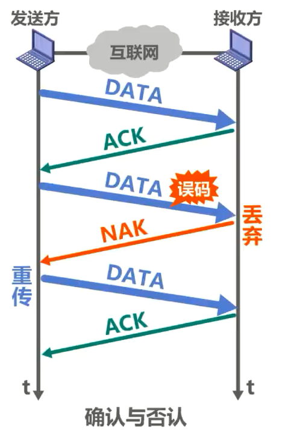
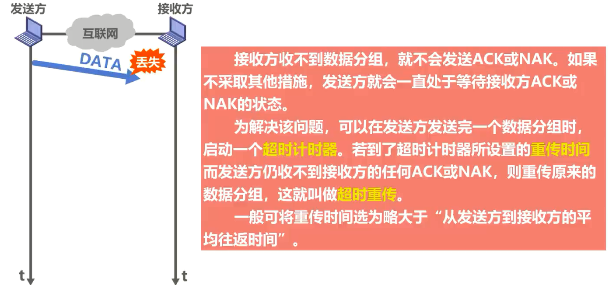
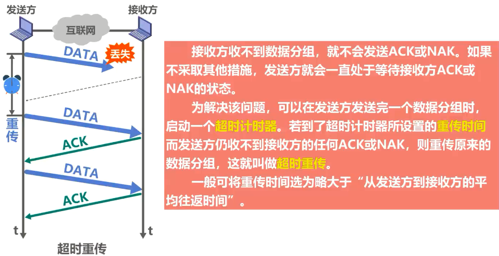
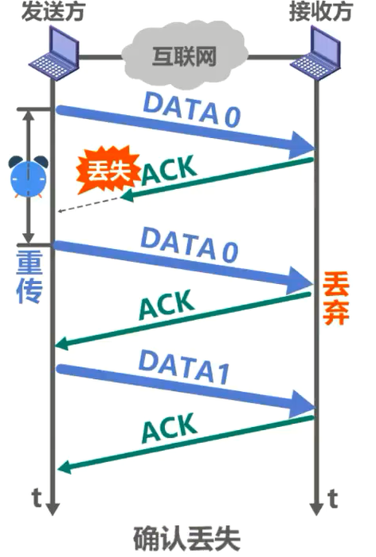
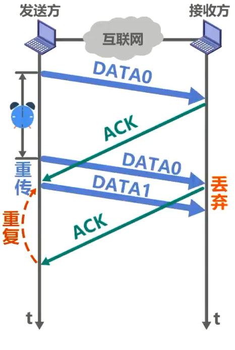
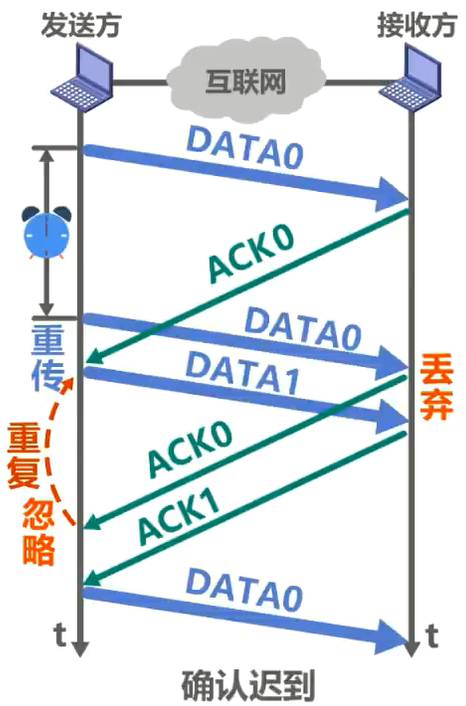
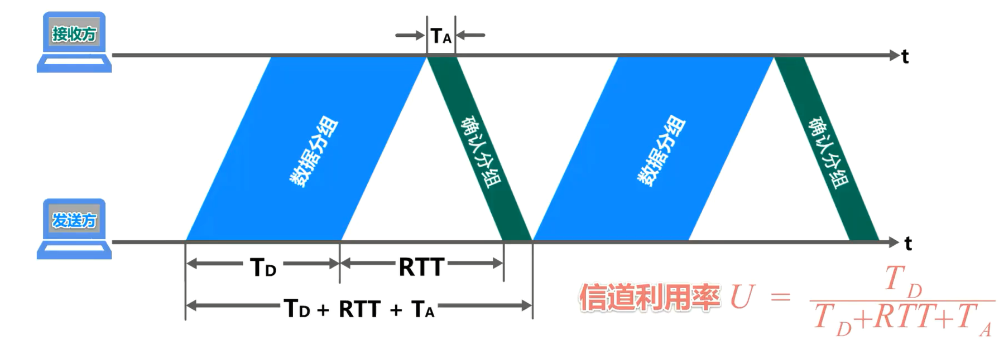
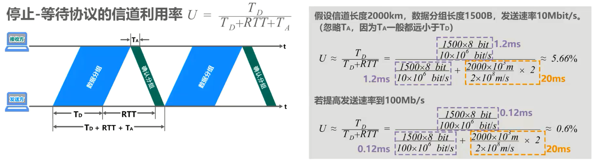
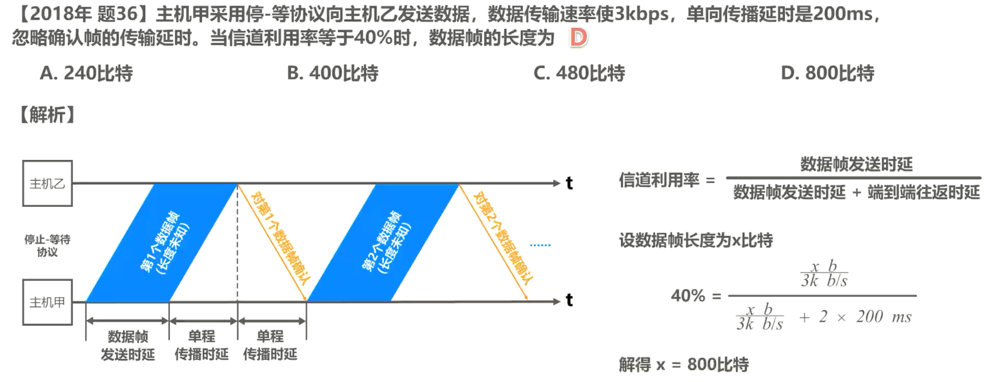
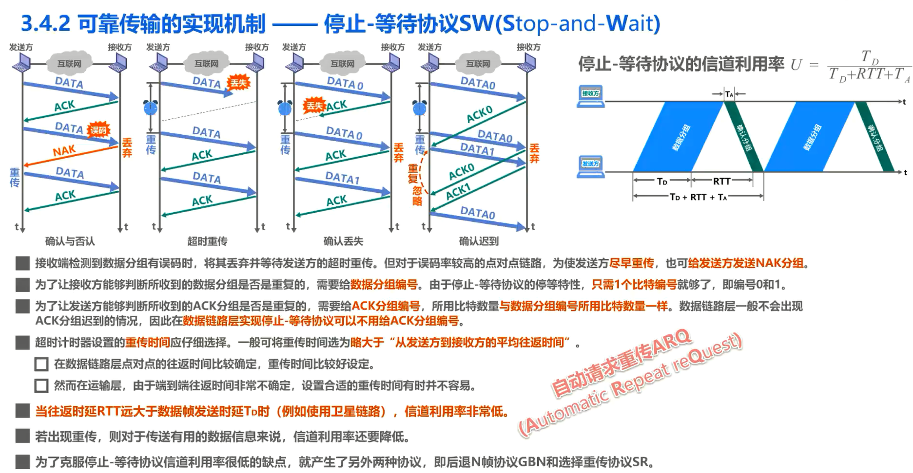

# 3.4.2 可靠传输的实现机制：停止等待协议

## 三种可靠传输的实现机制简介

3 种可靠传输的实现机制，他们是停止等待协议SW、回退 n 帧协议GBN、选择重传协议SR。

**这 3 种可靠传输实现机制的基本原理并不仅限于数据链路层，可以应用到计算机网络体系结构的各层协议中**。不要把思维局限在数据链路层，而应放眼于整个网络体系结构。

## 停止等待协议SW(Stop-and-Wait)

### 引入确认分组和否认分组

如图所示，收发双方基于互联网进行通信，而不是局限在一条点对点的数据链路，纵坐标为时间，发送方给接收方发送数据分组，接收方收到后对其进行差错检测——

- 若没有误码则接受该数据分组并给发送方发送确认分组，简称为ACK。
  - 发送方收到对所发送数据分组的确认分组后，才能发送下一个数据分组。

- 假设这个数据分组在传输过程中出现了误码，接收方收到后对其进行差错检测，发现了误码，则丢弃该数据分组，并给发送方发送否认分组，简称为NAK。
  - 发送方收到对所发送数据分组的否认分组后，就知道了之前自己所发送的数据分组出现了差错而被接收方拒绝，于是立刻重传该数据分组。

因此，发送方每发送完一个数据分组后，并不能立刻将该数据分组从缓存中删除。只有在收到帧对该数据分组的确认分组后，才能将其从缓存中删除。

看来，发送方每发送完一个数据分组后，就停止发送下一个数据分组，等待来自接收方的确认分组或否认分组。若收到确认分组，则可继续发送下一个数据分组。若收到否认分组，则重发之前发送的那个数据分组。这样就实现了发送方发送什么，接收方最终都能收到什么，也就是所谓的可靠传输。

【发送方每发送完一个数据分组后，就停止发送下一个数据分组，等待来自接收方的确认分组或否认分组——即停止等待】

### 引入超时重传机制

但实际情况远比我们想象的要复杂。来看这种情况，发送方给接收方发送数据分组，然而该数据分组在传输过程中丢失了。需要说明的是，对于数据链路层点对点信道而言，不太容易出现这种情况，但对于多个网络通过多个路由器互联的复杂互联网环境而言，这种情况是会经常出现的。

对于这种情况，接收方既然收不到数据分组，那么也就不会无缘无故的发送确认或否认分组。如果不采取其他措施，发送方就会一直处于等待接收方确认或否认分组的状态。为了解决该问题，可以在发送方发送完一个数据分组时，启动一个超时计时器。若到了超时计时器所设置的重传时间，而发送方仍收不到接收方的确认或否认分组，则重传原来的数据分组，这就叫做超时重传。一般可将重传时间选为**略大于从发送方到接收方的平均往返时间**。

如图所示，发送方超时重传之前所发送的数据分组，接收方正确接收重传的数据分组后，给发送方发送确认分组，发送方收到确认分组后发送下一个数据分组，接收方正确接收该数据分组后给发送方发送确认分组。

### 引入发送方数据分组编号

到目前为止，貌似基于停止等待使用确认或否认分组，再加上超时重传的手段就可以实现可靠传输了。但请大家再深入的思考一下，是否还会出现目前这些手段不足以应对实现可靠传输的其他情况？

来看这种情况，既然发送方发送的数据分组可能丢失，那么接收方发送的确认或否认分组就也有可能丢失。例如，发送方发送了一个数据分组，接收方正确接收该数据分组后给发送方发送确认分组，但该确认分组在传输过程中丢失了，这必然会造成发送方对之前所发送数据分组的超时重传。

假设这个重传的数据分组也正确到达了接收方，那么现在问题来了，接收方如何判断该数据分组是否是一个重复的分组？为了避免分组重复这种传输错误，必须**给每个数据分组带上序号**，例如，该数据分组的序号为0。对于停止等待协议，由于每发送一个数据分组就进行停止等待，只要保证每发送一个新的数据分组，**其序号与上次发送的数据分组的序号不同就可以了**。因此，用一个比特来编号就够了，即序号 0 和1。

这样，根据数据分组的序号，接收方就可以判断出该数据分组是否是重复的。接收方丢弃重复的数据分组，并给发送方发送帧对该数据分组的确认分组，以免发送方对该数据分组的再次超时重传。发送方收到帧对 0 号数据分组的确认分组，就可以发送下一个数据分组了，其序号为1。接收方正确收到 1 号数据分组后，给发送方发送确认分组。

### 引入接收方确认分组序号

我们通过确认分组丢失的情况引出了给数据分组编号的问题，请大家思考一下。既然数据分组需要编号，那么确认分组是否也需要编号来看这种情况。发送方发送 0 号数据分组，接收方正确接收后，给发送方发送确认分组。由于某些原因，该**确认分组迟到**了，这必然会导致发送方对 0 号数据分组的超时重传。在重传的 0 号数据分组的传输过程中，发送方收到了迟到的确认分组，于是发送 1 号数据分组。接收方收到重传的 0 号数据分组后，发现这是一个重复的数据分组，将其丢弃，并针对该数据分组给发送方发送确认分组，以免发送方再次超时重传该数据分组。

现在问题来了，我们可以非常清楚地看到这是一个对 0 号数据分组的重复确认，但是发送方又如何知道？如果不采取其他措施的话，发送方会误认为这是对 1 号数据分组的确认。如果对确认分组也进行编号，就可以使发送方避免这种误判。

如图所示，该确认分组的序号为0，发送方通过确认分组的序号知道这是一个**重复的确认分组，忽略即可**。接收方正确接收 1 号数据分组后，给发送方发送帧对该数据分组的确认分组，其序号为1，发送方收到该确认分组后发送下一个数据分组，序号为0。请注意，该数据分组与之前序号为 0 的那个数据分组不是同一个数据分组。

我们用给确认分组编号的方法解决了确认迟到所导致的重复确认的问题。需要说明的是，对于数据链路层的点对点信道往返时间比较固定，不会出现确认迟到的情况。因此，**如果只在数据链路层实现停止等待协议，可以不用给确认分组编号**。接下来我们对停止等待协议的一些注意事项进行一下小结。

### 停止等待协议的注意事项

- 接收端检测到数据分组有误码时，将其丢弃并等待发送方的超时重传。但对于误码率较高的点对点链路，为使发送方**尽早重传**，也可**给发送方发送否认分组**。

- 为了让接收方能够判断所收到的数据分组是否是重复的，需要给**数据分组编号**。由于停止等待协议的停等特性，只需**1个比特编号就够**了，即序号 0 和1。

- 为了让发送方能够判断所收到的确认分组是否是重复的，需要给**确认分组编号**。所用比特数量与数据分组编号所用比特数量一样，数据链路层一般不会出现确认分组迟到的情况，因此，**在数据链路层实现停止等待协议，可以不用给确认分组编号。**

- 超时计时器设置的重装时间应仔细选择，一般可将重装时间选为**略大于从发送方到接收方的平均往返时间**。

  - 在数据链路层，点对点的往返时间比较确定，重传时间比较好设定。

  - 在运输层，由于端到端往返时间非常不确定，设置合适的重装时间有时并不容易。我们将在第五章有关 TCP 协议的课程中详细讨论该问题。

### 停止等待协议的信道利用率

如图所示，横坐标为时间。为了简单起见，假设收发双方之间是一条直通的信道，发送方发送完一个数据分组后就停止发送，并等待接收方对该数据分组的确认。当收到确认分组后，可以发送下一个数据分组，如此反复进行

TD：发送方发送数据分组所耗费的发送时延(这个时间是发送方消耗掉的，双方时间同步消耗)；

 RTT：收发双方之间的往返时间 (即两个单程传播时延)(这个时间是收发双方的消息在传播过程中消耗掉的)；

TA：接收方发送确认分组所耗费的发送时延(这个时间是接收方消耗掉的，双方时间同步消耗)

 图中忽略了接收方对数据分组的处理时延以及发送方对确认分组的处理时延。这是使用停止等待协议的发送方从发送一个数据分组开始到可以发送下一个数据分组为止所经历的总时间。因为仅仅是在时间 TD 内才用来传送有用的数据，也就是数据分组。因此信道的利用率 u 可以用上图中标红的式子来计算， TA 一般都远小于 TDd 可以忽略。当RTT远大于 TD 时，信道利用率会非常低。

我们来举例说明，假设信道长度为 2000 公里，数据分组长度为 1500 字节，发送速率为 10 兆比特每秒，忽略TA，因为 TA 一般都远小于TD，可以计算出信道利用率约为 5. 66%。如果将发送速率提高到 100 兆比特每秒，则可计算出信道利用率仅为 0. 6%

可以看出

- **当往返时延 RTT 远大于数据帧发送时延 TD 时，例如使用卫星链路，信道利用率非常低。**

- **若出现重传，则对于传送有用的数据信息来说，信道利用率还要降低。**

- **为了克服停止等待协议信道利用率很低的缺点，就产生了另外两种协议，即后退N帧协议GBN和选择重传协议SR。**

### 例题

根据题意可以画出停止等待协议的示意图。这一段是数据帧的发送时延，这一段是数据帧的最后一比特，信号从主机甲传播到主机乙所耗费的传播时延，也就是信号在两主机之间的单程传播时延。同理，这一段也是单程传播时延。停止等待协议的信道利用率等于数据帧的发送时延，除以数据帧发送时延加端到端往返时延，也就是 2 倍的单程传播时延。设数据帧长度为 x 个比特，将其与题目所给的相关已知量带入上市，可得，解得 x 等于 800 比特。

## 本节小结

顺便提一下，像停止等待协议这种通过确认和重传机制实现的可靠传输协议，常称为自动请求重传协议ARQ(Automatic Repeat reQuest)，意思是重传的请求是自动进行的，因为不需要接收方显式地请求发送方重传某个出错的分组。