# 回退N帧协议

停止等待协议如图所示，发送方每发送完一个数据分组，就要停止发送，并等待接收方的确认分组。当收到接收方的确认分组后，才能发送下一个数据分组，如此反复进行。从图中可以看出，发送方每发送完一个数据分组，就至少要等待一个收发双方之间的往返时间。当往返时间较大时，例如卫星链路停止等待协议的信道利用率很低，若出现超时重传，则信道利用率更低。

如图所示，如果发送方在收到接收方的确认分组之前，可以连续发送多个数据分组，则可大大提高信道利用率。就本例而言，同等条件下，在相同的时间内使用停止等待协议的发送方只能发送一个数据分组，而采用流水线传输的发送方可以发送 5 个数据分组。

## 回退N帧协议原理

本节课我们介绍回退N帧协议，该协议在流水线传输的基础上，利用发送窗口来限制发送方可连续发送分组的个数。举例说明

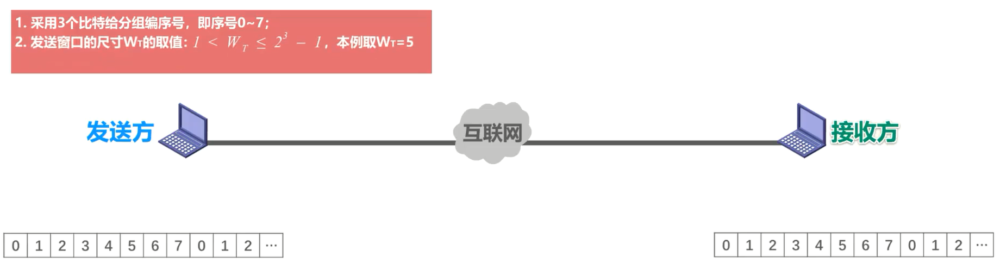

**分组编号**：假设采用 3 个比特给分组编序号，因此序号的取值范围是 0- 7，如图所示，这是收发双方各自的分组序号。当序号增加到7，下一个序号又从 0 开始

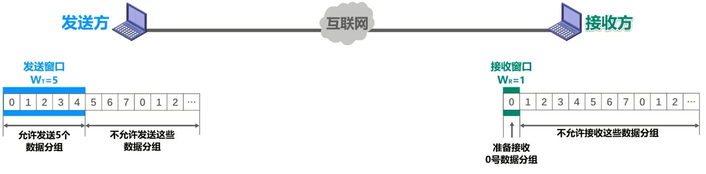

**发送窗口**：发送方要维持一个发送窗口，序号落在发送窗口内的数据分组可被连续发送，而不必等收到接收方的相应确认分组后再发送。发送窗口的尺寸即为WT，对于本例，其取值范围是大于1，小于等于 2^3 -1，其中的 3 是构成分组序号的比特数量。本例取 WT 的值为5。如果 WT 的值取为1，则是停止等待协议。如果 WT 的值超过取值范围的上限，则会造成严重的错误，我们之后会举例详细说明。如图所示，序号落在发送窗口内的这 5 个数据分组可以连续发送，而序号落在发送窗口外的数据分组不允许发送。

**接收窗口**：接收窗口的尺寸即为WR 。对于回推N帧协议，其取值只能为1，这一点与停止等待协议是相同的。如图所示，序号落在接收窗口内的这个数据分组允许接收，而序号落在接收窗口外的数据分组不允许接收。

### 无差错情况

我们首先来看最简单的情况，也就是无差错的情况。

发送方将序号落在发送窗口内的 0- 4 号数据分组依次连续发送出去，他们经过互联网的传输正确到达了接收方，也就是没有出现乱序和误码。

接收方按序接收他们，每接收一个接收窗口就向前滑动一个位置，并给发送方发送针对所接收分组的确认分组 。

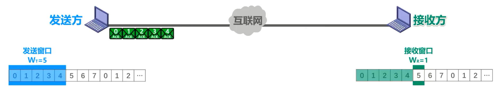

0- 4 号确认分组经过互联网的传输，正确到达了发送方，发送方每接收一个发送窗口，就向前滑动一个位置，这样就有新的序号落入了发送窗口，发送方可以将收到确认的数据分组从缓存中删除了，而接收方可以择机将已接收的数据分组交付上层处理。

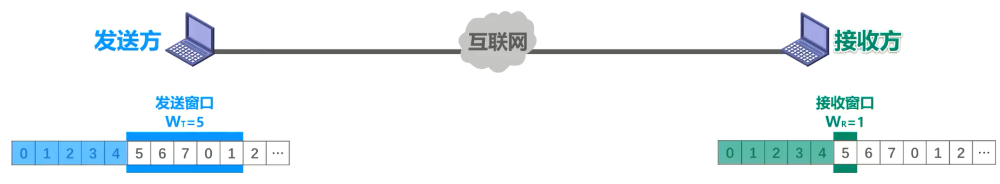

### 引入累积确认

接下来我们来看累积确认的概念。使用回退N帧协议的接收方可以采用累积确认的方式。

**累积确认**：接收方不一定要对收到的数据分组**逐个发送确认**，而是可以在收到几个数据分组后，对**按序到达的最后一个数据分组发送确认**。ACKn 表示序号为 n 及以前的所有数据分组都已正确接收。

我们来举例说明。累计确认发送方将序号落在发送窗口内的 0- 4 号数据分组依次连续发送出去，他们经过互联网的传输正确到达了接收方。接收方按序接收他们，当接收完 0 号和 1 号数据分组后，给发送方发送了一个累积确认 ACK1，当接收完 2- 4 号数据分组后，又给发送方发送了一个累计确认 ACK4。

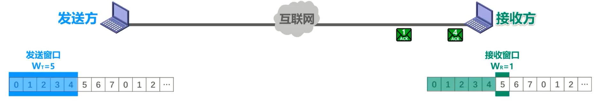

假设 ACK 1 在传输过程中丢失了，而 ACK 4 正确到达了发送方。发送方接收 ACK 4 后就知道了序号为 4 及之前的数据分组已被接收方正确接收了，于是将发送窗口向前滑动 5 个位置，这样就有新的序号落入了发送窗口。发送方可以将收到确认的数据分组从缓存中删除了，而接收方可以择机将已接收的数据分组交付上层处理。

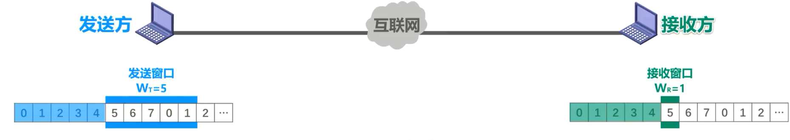

从本例可以看出，使用累积累确认的其中一个优点就是**即使确认分组丢失，发送方也可能不必重传**。例如本例中 ACK1 丢失了，但并没有造成 1 号数据分组的超时重传，使用累积确认还有其他好处，例如可以减小接收方的开销，减少对网络资源的占用等。当然了，使用累计确认也有缺点，那就是**不能**向发送方**及时**反映出接收方已经正确接收的数据分组的信息。

### 有差错情况回退N帧

接下来我们来看出现差错的情况。发送方将序号落在发送窗口内的这 5 个数据分组依次连续发送出去，他们经过互联网的传输到达了接收方。假设他们在传输过程中受到了干扰，其中 5 号数据分组出现了误码，接收方通过数据分组中的检错码发现了错误，于是丢弃该数据分组。

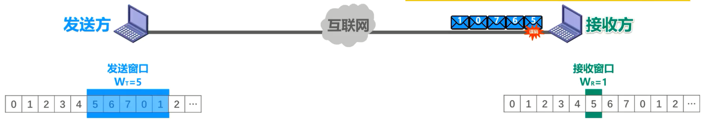

后续到达的这 4 个数据分组的序号与接收窗口中的序号不匹配

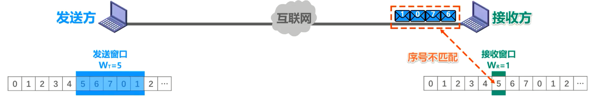

接收方同样也不能接受他们，将他们丢弃，并对**之前按序接收的最后一个数据分组**进行确认，也就是发送 ACK 4。每丢弃一个数据分组就发送一个 ACK 4。这四个 ACK 4 经过互联网的传输到达了接收方。

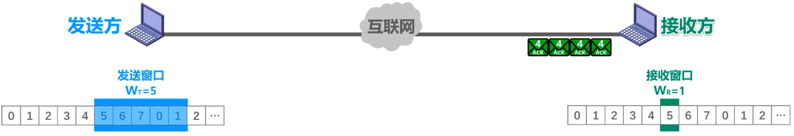

发送方之前就接收过ACK 4，当收到这些重复的ACK4 时(**每收到一个ACKn，发送窗口把序号为n及以前的数据分组移出去，当重复接收到ACKn时，发送窗口自然不移动，则实现了下一个发送窗口自动回退N帧**)，就知道了之前所发送的数据分组出现了差错，于是可以不等超时计时器超时就立刻开始重传。至于收到几个重复确认就立刻重传，由具体实现来决定。在本例中，假设收到这 4 个重复的确认并不会触发发送方立刻重传。

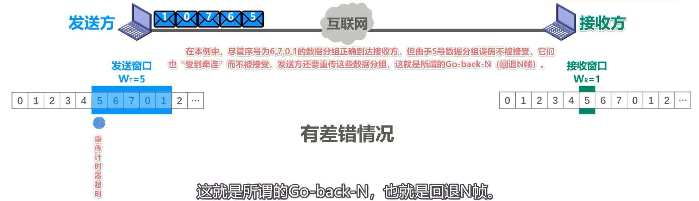

一段时间后，超时计时器出现超时，发送方将发送窗口内已发送过的这些数据分组全部重传。在本例中，尽管序号为 5、6、7、0、1 的数据分组之前已经正确的到达接收方，但由于 5 号数据分组误码不被接受，他们也受到牵连而不被接受，发送方还要重传这些数据分组，这就是所谓的 go-back-n，也就是回退N帧。可见，当通信线路质量不好时，回退N帧协议的信道利用率并不比停止等待协议高。

## 发送窗口的尺寸 WT 超过其取值范围的上限情况

接下来我们来看看如果发送窗口的尺寸 WT 超过其取值范围的上限，会出现什么情况。对于本例，采用三个比特给分组编序号， WT 的最大值为 2 的三次减1，也就是7。我们故意超过该上限，将 WT 取之为8。发送方将序号落在发送窗口内的 0- 7 号，这 8 个数据分组依次连续发送出去，他们经过互联网的传输正确到达了接收方

接收方按序正确接收他们后，给发送方发回累计确认ACK7。假设ACK 7 在传输过程中丢失了，这将导致发送方的超时重传，重传的 0- 7 号数据分组到达接收方。

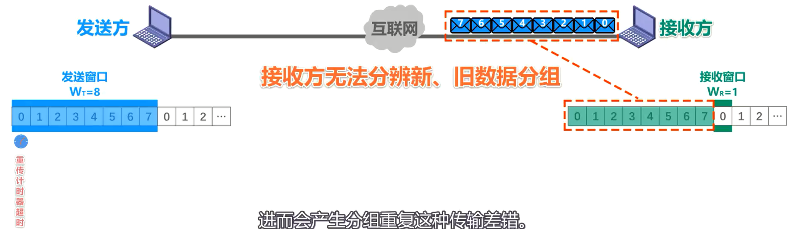

现在问题来了，接收方根据当前接收窗口内的序号，会对这 8 个数据分组按序接收，但是接收方之前已经接收过这 8 个数据分组了，现在是在重复接收。也就是说，接收方无法分辨新旧分组，进而会产生分组重复这种传输差错。因此**发送窗口的尺寸不能超过其上限**。

## 回退N帧协议原理小结

## 例题

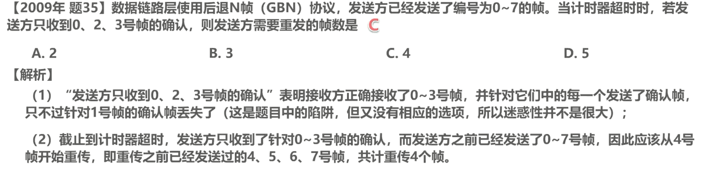

我们再来画个示意图，以便更容易理解该题。假设这是帧可用的序号，这是发送窗口，发送方将序号落在发送窗口内的 0- 7 号数据帧依次发送出去。当收到帧对 0 号数据帧的确认帧 ACK 0 时，发送窗口向前移动一个位置。若收到帧对 1 号数据帧的确认帧ACK1 时，发送窗口也会向前移动一个位置，只不过ACK1 在传输过程中丢失了，当收到帧对 2 号数据帧的确认帧 ACK2 时，发送窗口向前移动两个位置，将序号 1 和 2 全部移出发送窗口。当收到帧对 3 号数据帧的确认帧 ACK3 时，发送窗口向前移动一个位置，之后发送方出现了超时，将发送窗口内已发送但未收到确认的 4567 号数据帧依次重传。

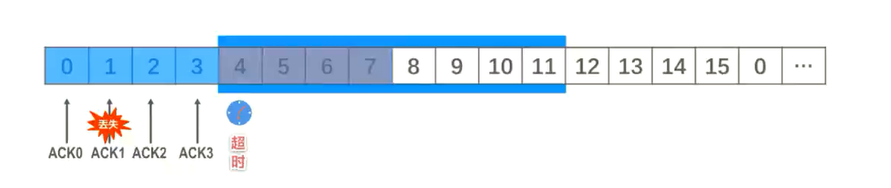

## 本节小结

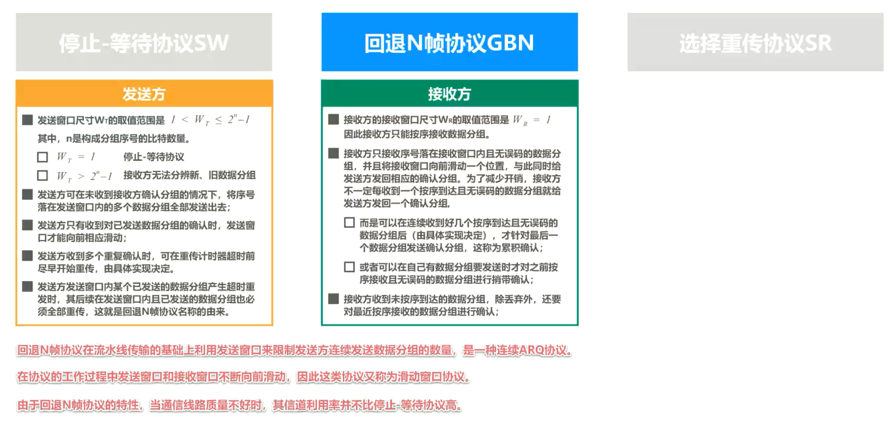

- 回退 n 帧协议在流水线传输的基础上，利用发送窗口来限制发送方连续发送数据分组的数量，是一种连续 ARQ 协议。
- 在协议的工作过程中，发送窗口和接收窗口不断向前滑动，因此这类协议又称为滑动窗口协议。
- 由于回退恩贞协议的特性，当通信线路质量不好时，其信道利用率并不比停止等待协议高。