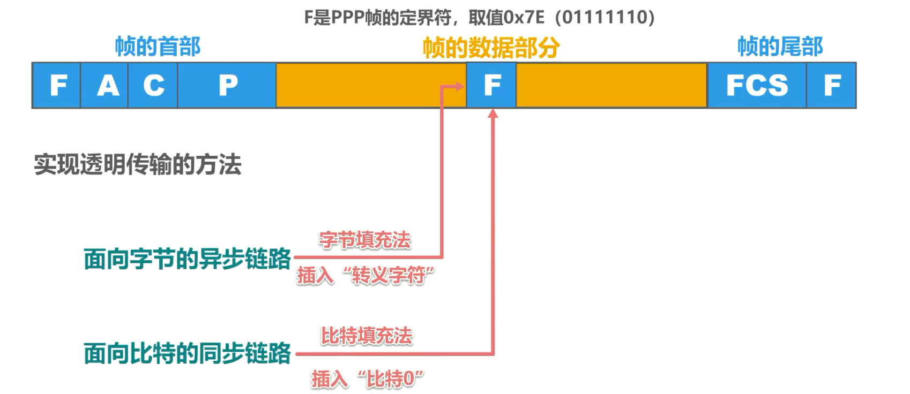
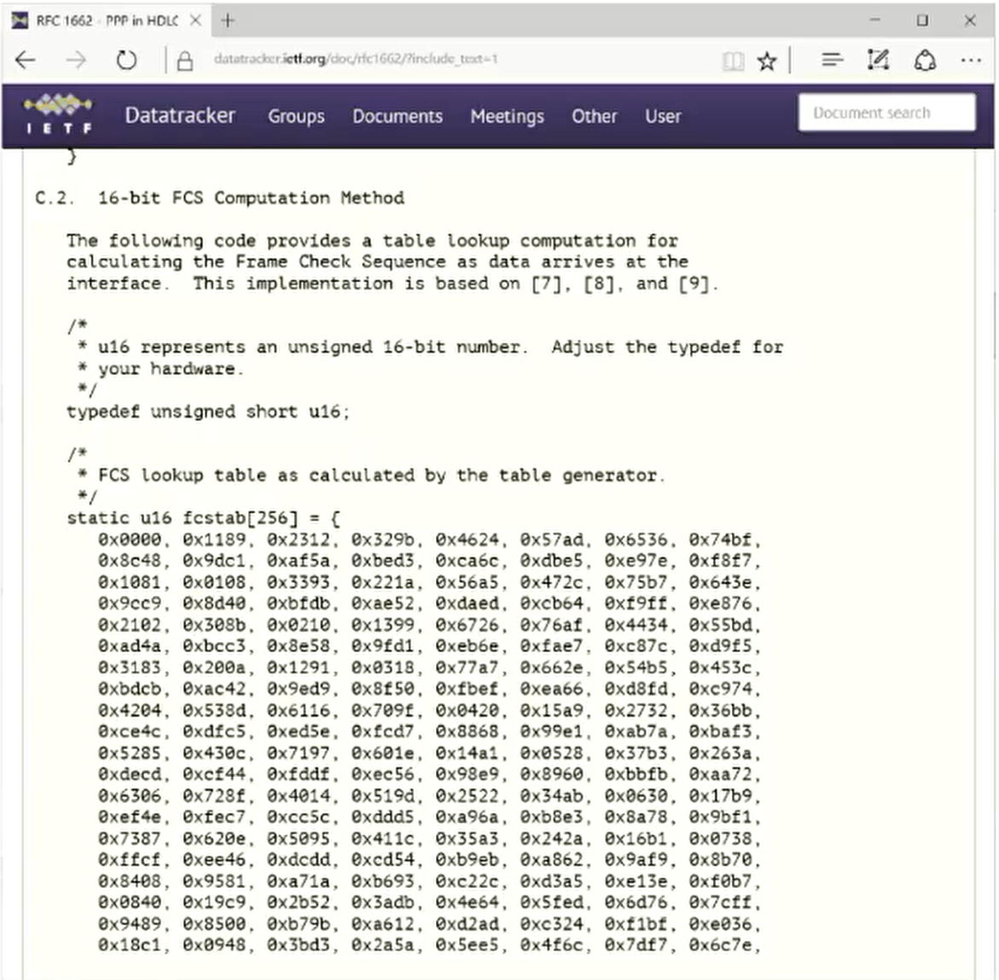
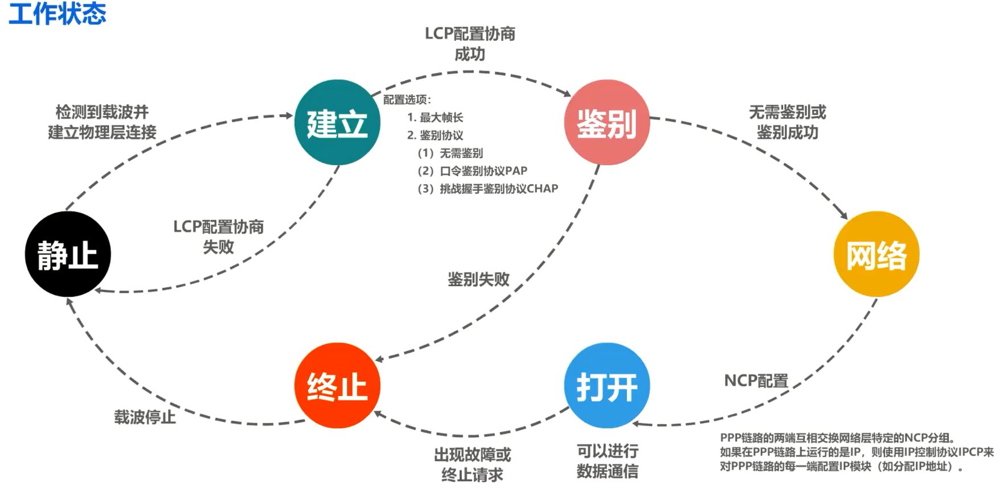
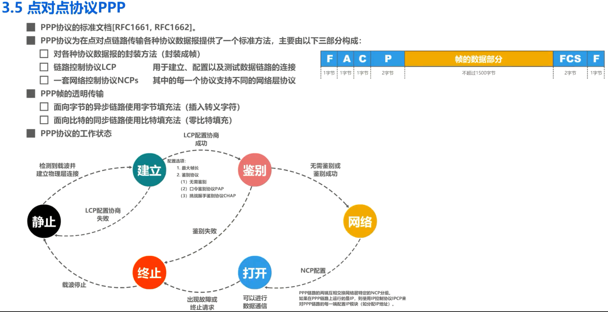

# 点对点协议PPP

## PPP协议简介

### 点对点协议PPP(Point-to-Point Protocol) 是目前使用最广泛的点对点数据链路层协议

一般的因特网用户通常都是要通过连接到某个因特网服务提供者ISP，例如中国电信、中国联通、中国移动这三大运营商才能接入因特网。这些 ISP 已经从因特网管理机构申请到了一批IP地址，用户计算机只有获取到ISP 所分配的合法IP地址后，才能成为因特网上的主机用户。

用户计算机与 ISP 进行通信时所使用的**数据链路层协议通常就是 PPP 协议**。这里需要说明的是在 1999 年公布的在以太网上运行的 PPP 协议——**PPP over Ethernet 简称为 PPPoE**。它使得ISP 可以通过 DSL(电路调制解调器 )、以太网等宽带接入技术，以以太网接口的形式为为用户提供接入服务。

另外，点对点协议 PPP 也广泛应用于广域网路由器之间的专用线路。

### PPP协议历史

PPP协议是因特网工程任务组IETF在 1992 年制定的。经过 1993 年和 1994 年的修订，现在的 PPP 协议已成为因特网的正式标准。我们可以在 ITF 官方网站的相关页面搜索并查看 PPP 协议的相关 RFC 文档。

### PPP协议为在点对点链路传输各种协议数据报提供了一个标准方法

主要由以下三部分构成

1. 对各种协议数据报的封装方法：封装成帧（前面课程介绍过）

2. 链路控制协议LCP：用于建立、配置以及测试数据链路的连接

3. 一套网络控制协议NCPs：其中的每一个协议支持不同的网络层协议。

从网络体系结构的角度看，PPP 是数据链路层的协议，它将上层交付下来的协议数据单元封装成PPP帧。为了支持不同的网络层协议， PPP 协议包含了一套网络控制协议NCPs，其中的每一个协议支持不同的网络层协议，例如网络层中的 TCP/IP 中的 IP协议，网络操作系统中的IPX协议、苹果公司的Apple Talk 等链路控制协议。 

LCP 用于建立配置以及测试数据链路的连接。

 PPP协议能够在多种类型的点对点链路上运行，例如面向字节的异步链路，面向比特的同步链路。

## PPP 协议的帧格式

接下来我们来看看 PPP 协议的帧格式。帧首部由 4 个字段构成，帧尾部由两个字段构成，各字段的长度以及帧的数据部分的最大长度如图所示。

**标志(Flag)字段F**：帧首和帧尾部中的标志字段是 PPP 帧的定界符，取值为 16 进制的0x7e。

**地址(Address)字段A**：帧首部中的地址字段取值为 16 进制的0xFF，预留(目前没有什么作用)

**控制(Control)字段C**：控制字段取值为 16 进制的0x03，预留(目前没有什么作用)。最初曾考虑以后再对这两个字段的值进行其他定义，但至今也没有给出，可见这两个字段实际上并没有携带 PPP 帧的信息。

**协议(Protocol)字段P**：帧首部中的协议字段指明了帧的数据部分应送交哪个协议处理。当协议字段取值为 16 进制的 0x0021 时， PPP 帧的数据部分就是 **IP 数据报**，如图所示

当协议字段取值为 16 进制的0xC021 时， PPP帧的数据部分就是**链路控制协议LCP的分组**，如图所示

当协议字段取值为 16 进制的 8021 时， PPP 帧的数据部分就是**网络控制协议 NCP 的分组**，如图所示

**帧尾部中的帧检验序列 FCS 字段**：其值是使用**循环冗余校验 CRC** 计算出的校验位，用于检查 PPP 帧是否存在误码。

## PPP协议解决透明传输(即解决帧定界问题)

接下来我们来看看 PPP 协议是如何解决透明传输问题的？

当PPP帧的数据部分出现帧首和帧尾中的标志字段时，如果不采取措施，则会造成接收方对 PPP帧是否结束的误判。因为标志字段是 PPP 帧的定界符，取值为 10 六进制的0x7E，也就是二进制的01111110。

PPP 协议实现透明传输的方法取决于所使用的链路类型。

### 字节填充法

如果是面向字节的异步链路，则采用字节填充法，也就是插入转义字符。

举例说明字节填充法，也就是以**字节0x7E作为 PPP 帧的定界符**，以字节为单位来讨论问题。

#### 发送方对 PPP 帧数据部分的处理

- 将出现的每一个**7E**字节转变成 2 字节序列**7D5E**，如图所示，这相当于在7E字节前插入了转义字节7D，并将7E字节减去 16 进制的**0x20**。
- 将出现的每一个 **7D** 字节转变成 2 字节序列**7D5D**，如图所示
- 在出现的每一个ASCII控制字符(数值小于0x20的字符)，则在该字符前前插入一个 **7D** 字节，同时将该字符的编码加上 16 进制的**0x20**。

对于 PPP 帧的接收方，只要进行反变换，即可恢复出原来的 PPP帧的数据部分，

### 比特填充法

如果是面向比特的同步链路，则采用比特填充法，也就是插入比特0。

举例说明比特填充法，也就是以 **01111110 作为 PPP 帧的定界符**，以比特为单位来讨论问题。

#### 发送方对 PPP 帧数据部分的处理

假设 PPP 帧的数据部分如图所示，其中包含了两个帧定界符，来看发送方对 PPP 帧数据部分的处理，对帧的数据部分进行扫描，一般由硬件实现，只要发现 **5 个连续的比特**1，则**立即填充一个比特0**，如图所示。

#### 接收方对 PPP 帧数据部分的处理

再来看接收方对 PPP 帧数据部分的处理，对帧的数据部分进行扫描，一般由硬件实现。只要**发现 5 个连续的比特1**，就**把其后的一个比特 0 删除**，如图所示。

## PPP协议的差错检测

PPP 帧的尾部包含有一个 2 字节的帧检验序列 FCS 字段，使用循环冗余校验 CRC 来计算该字段的取值，采用的生成多项式，如下所示。 

RFC 1662 文档的附录部分给出了 FCS 的计算方法的C语言实现，为了减少对 CPU 的占用，采用查表法来实现 FCS 的计算范围，如图所示

接收方每收到一个 PPP 帧就进行 CRC 检验，若 CRC 检验正确，就收下这个帧，反之就丢弃这个帧。使用 PPP 的数据链路层向上不提供可靠传输服务。

## PPP协议的工作状态

最后我们以拨号接入为例，简单介绍一下 PPP 协议的工作状态。 PPP链路的开始和结束状态都是静止状态，这时并不存在物理层的连接。

- 当检测到调制解调器的载波信号并建立物理层连接后， PPP 就进入链路的建立状态。
- 这时链路控制协议 LCP 开始协商一些配置选项，所协商的配置选项包括最大帧长、鉴别协议等。可以不使用鉴别，也可以使用口令鉴别协议 PAP 或挑战握手鉴别协议CHAP。
  - 若协商成功则进入鉴别状态
    - 若通信双方无需鉴别或鉴别身份成功，则进入网络状态。
      - 进入网络状态后进行 NCP 配置，配置完成后就进入打开状态。PPP链路的两端通过相互交换网络层特定的 NCP 分组来进行NCP配置。如果在 PPP 链路上运行的是 IP 协议，则使用 IP 控制协议 IPCP 来对 PPP 链路的每一端配置 IP 模块，例如分配 ip 地址，只要链路处于打开状态，就可以进行数据通信。当出现故障或链路的一端发出终止请求时，就进入终止状态，当载波停止后，则回到静止状态。
    - 若鉴别失败，则进入终止状态。
  - 若协商失败，则退回到静止状态

## 本节小结

