# 3-7 MAC地址 IP地址以及ARP协议——MAC地址

MAC地址是以太网的MAC子层所使用的地址——数据链路层

IP地址是 TCPIP 体系结构网际层所使用的地址——网际层

ARP 协议属于 TCP/IP 体系结构的网际层，其作用是已知设备所分配到的IP地址。使用 ARP 协议就可以通过该IP地址获取到设备的 MAC地址——网际层

从网络体系结构的角度来看， MAC地址属于数据链路层的范畴，IP地址和 ARP 协议属于网基层的范畴。

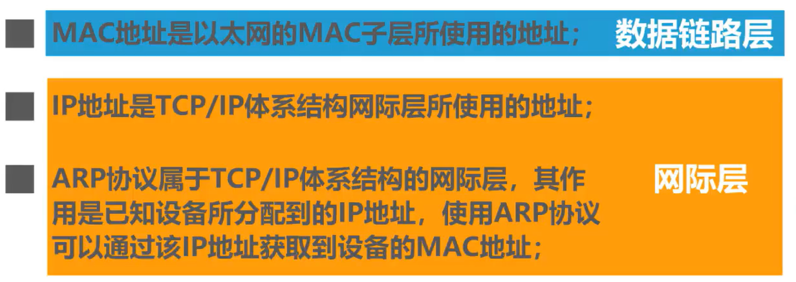

尽管IP地址和 ARP 协议属于 TCP/IP 体系结构的网际层，而不属于数据链路层，但是他们与 MAC地址存在一定的关系，并且我们日常的网络应用都离不开 MAC地址、IP地址以及 ARP 协议，因此我们将这三者放在一起讨论。

## MAC地址

如图所示，两台主机通过一条链路通信，很显然，他们不需要使用地址就可以通信，因为连接在信道上的主机只有他们两个。换句话说，**使用点对点信道的数据链路层不需要使用地址**。

再来看使用共享信道的总线型局域网，总线上的某台主机要给另一台主机发送帧，表示帧的信号通过总线会传送到总线上的其他所有主机。那么这些主机如何判断该帧是否是发送给自己的？很显然，**使用广播信道的数据链路层必须使用地址来区分各主机**。也就是说，当多个主机连接在同一个广播信道上，要想实现两个主机之间的通信，则每个主机都必须有一个唯一的标识，即一个数据链路层地址。

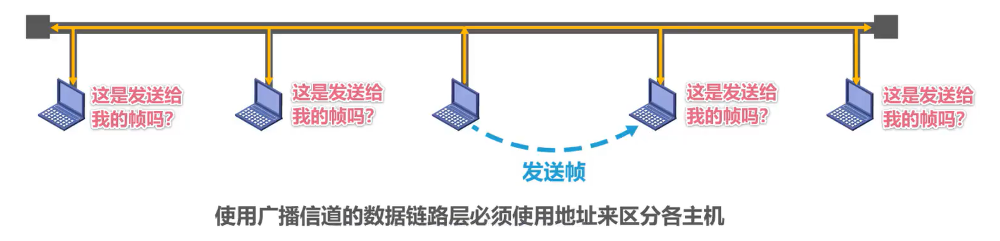

如图所示，假设总线上各主机的地址分别用一个不同的大写字母来表示，在每个主机发送的帧中，必须携带标识**发送主机**和**接收主机**的地址。由于这类地址是用于媒体接入控制的，其英文缩写词为MAC(Media Access Control)，因此这类地址被称为 MAC地址。

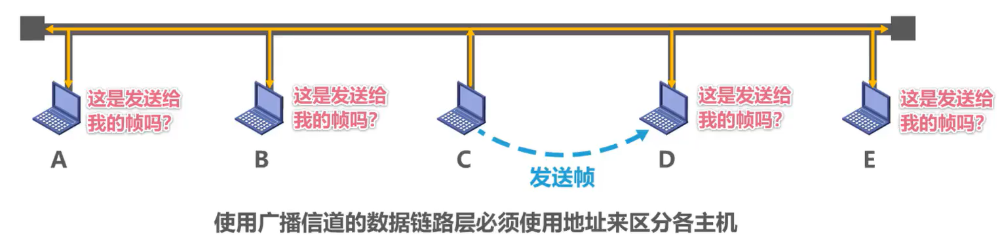

如图所示，这是主机C要发送给主机D的帧，则在帧首部中的目的地址字段应填入主机D的 MAC地址，而在源地址字段应填入主机C自己的 MAC地址。这样总线上其他各主机收到该帧后，就可以根据帧手部中的目的地址字段的值是否与自己的 MAC地址匹配，进而丢弃或接受该帧。

MAC地址一般被固化在网卡的电可擦可编程只读存储器EEPROM 中，因此 MAC地址也被称为**硬件地址**。

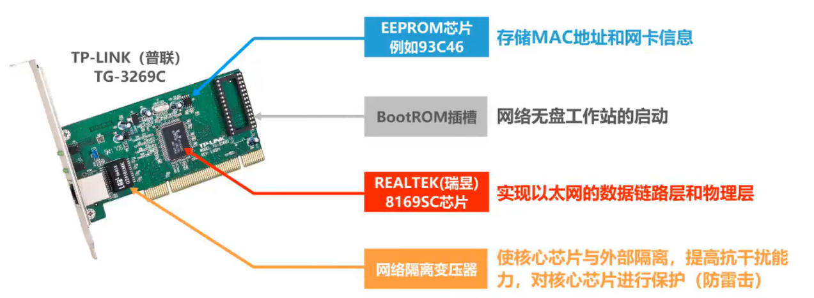

如图所示，这是一块 PCI 接口的千兆以太网卡核心芯片

- 采用REALTEK(瑞昱)的 8169SC：该芯片实现了以太网的数据链路层和物理层
- EEPROM芯片：例如 93C46，用来存储MAC地址以及网卡的相关信息
- BootROM插槽：用于网络无盘工作站的启动，一般并不标配启动芯片，
- 网络隔离变压器：将核心芯片与外部隔离，提高抗干扰能力，对核心芯片进行保护，例如防雷击。

那个地址有时也被称为**物理地址**，例如在 windows 系统中。但请大家注意，这并不意味着MAC地址属于网络体系结构中的物理层。

一般情况下，用户主机会包含两个网络适配器，一个是**有线局域网适配器**，也就是有线网卡。另一个是**无线局域网适配器**，也就是无线网卡。每个网络适配器都有一个全球唯一的 MAC地址，而交换机和路由器往往拥有更多的网络接口，所以就会拥有更多的 MAC 地址。

综上所述，严格来说， **MAC地址是对网络上各接口的唯一标识，而不是对网络上各设备的唯一标识**。

### 习题

本题的答案是选项C。如果大家知道物理地址又称为硬件地址或MAC地址，它并不属于物理层的范畴，而是属于数据链路层的范畴，那么本题可以直接选出答案。即便大家不知道物理层接口规范定义的内容，也可以选出答案。但是如果大家不知道这个知识点，并且对物理层接口规范定义的机械特性、电气特性、工能特性以及过程特性不熟悉，而仅从字面上理解，那么很可能选项C会被首先排除掉。

## IEEE 802局域网的MAC地址格式

IEEE 八零二局域网的 MAC地址格式由 48 个比特构成，每 8 个比特为一个字节，从左至右依次为第1字节到第6字节，前 3 个字节是组织唯一标识符OUI。生产网络设备的厂商需要向IEEE的注册管理机构申请一个或多个OUI，后三个字节是获得OUI的厂商可自行随意分配的。这种地址标识符称为扩展的唯一标识符EUI。

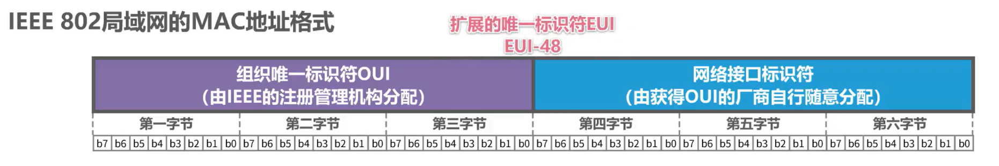

对于 48 比特的 MAC地址可称为 EUI-48 MAC地址的**标准表示方法**是，将每 4 个比特写成一个 16 进制的字符，共 12 个字符，将每两个字符分为一组，共 6 组，组织间用短线连接。

- 组织间用短线连接：例如Windows 系统中的表示方法
- 也可以将短线更改为冒号：例如，Linux 系统、苹果系统、安卓系统中的表示方法。
- 将 4 个字符分为一组，共 3 组，组织间用点连接：例如，Packet Tracer仿真软件中的表示方法。

我们可以在 h ve 的官方网站查看已分配的组织唯一标识符OUI，这是具体的网址。

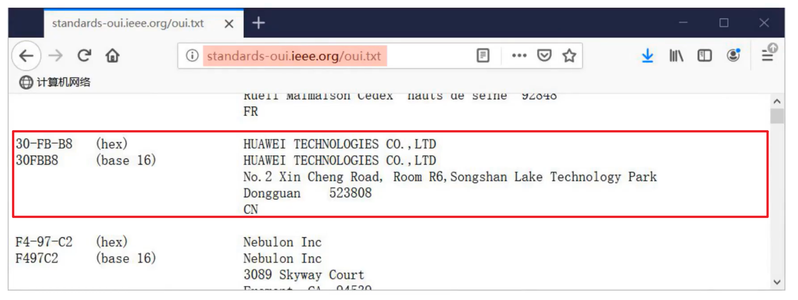

可以看到 30-FB-B8这个OUI 已被分配给华为科技有限公司，而 A4-45-19 这个OUI 已被分配给小米通信有限公司。如果我们知道设备的MAC地址，而不知道该设备的厂商信息，可以通过设备的MAC地址来查询，有很多网站都提供这样的免费查询服务。例如在该网站输入设备的 MAC地址后，就可以查出设备的厂商信息。 

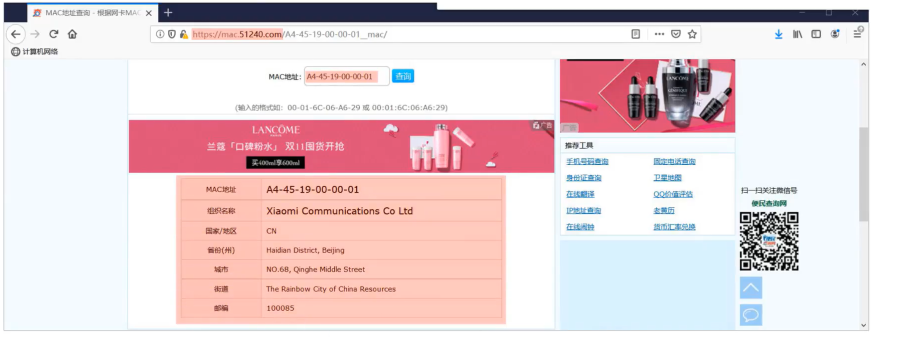

## MAC地址类型：多播/单播、全球/本地管理的MAC地址

MAC地址第1字节的**b0 位**

- 取 0 时表示该地址是单播地址
- 取 1 时表示该地址是多播地址，又称为主播地址。 

MAC地址第一字节的**b1位**

- 取0时，表示该地址是全球管理的，也就是全球唯一的。
- 取1时，表示该地址是本地管理的。

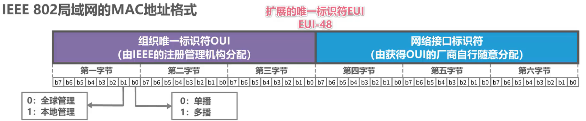

根据上面的规定，我们来填写下表。

第1字节的b1位，取 0 表明 MAC地址是全球管理的，取 1 表明 MAC地址是本地管理的。

第1字节的b0位，取 0 表示MAC地址是单播地址，取 1 表明 MAC地址是多播地址。

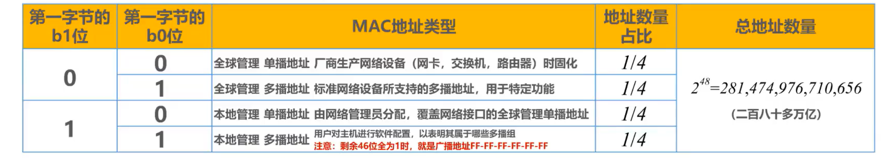

很显然，一共有 4 种类型的 MAC地址，分别是全球管理的单播地址、全球管理的多播地址、本地管理的单播地址以及本地管理的多拨地址。

- 全球管理的单播地址是厂商生产网络设备时，给设备的各网络接口固化的 MAC地址。
- 全球管理的多拨地址是标准网络设备所应支持的多拨地址，用于特定功能，例如交换机生成树协议所需要的多播地址。
- 本地管理的单拨地址由网络管理员分配。这种类型的地址会覆盖网络接口的全球管理单拨地址，也就是它的优先级高。
- 本地管理的多拨地址用于用户对主机的软件配置，以表明该主机属于哪些多播组。

需要注意的是，当剩余 46 比特为全 1 时，也就是 MAC地址的 48 比特全部为1，十六进制形式为全F，就是**广播地址**。

由于MAC地址由 48 个比特构成，因此总地址数量为 2 的 48 次方个，也就是 280 多万亿个。这四类 MAC地址各占总地址空间的 1/ 4，也就是每种 MAC地址有 70 多万亿个。

请大家思考一下，我们每个人一般会拥有几个全球管理的单播 MAC地址？

台式机、笔记本电脑、平板电脑、智能手机等设备上的以太网接口、 Wifi 接口、蓝牙接口都分配有全球单播的MAC地址。而每台交换机和路由器都拥有多个网络接口，也就拥有多个全球单播的MAC地址，那么在我们有生之年，是否会看到EUI-48地址空间耗尽？对于使用EUI-48地址空间的应用程序， IEEE 的目标寿命为 100 年，也就是直到 2080 年，但现在鼓励采用 EUI-64作为替代。

## MAC地址的发送顺序

MAC地址的发送顺序：

- 字节发送顺序为第1字节到第6

- 字节内的比特，发送顺序为 B0 到B7

如图所示

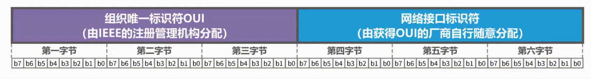

## 单播MAC地址的作用

下面我们来举例说明单播MAC地址的作用。假设这是一个拥有 3 台主机的总线型以太网各主机网卡上固化的全球单播MAC地址，如图所示。假设主机B要给主机C发送单播帧，主机B首先要构建该单播帧在帧首部中的目的地址字段填入主机C的 MAC地址，源地址字段填入自己的MAC地址，再加上帧首部中的其他字段、数据载荷以及帧尾部就构成了该单播帧。

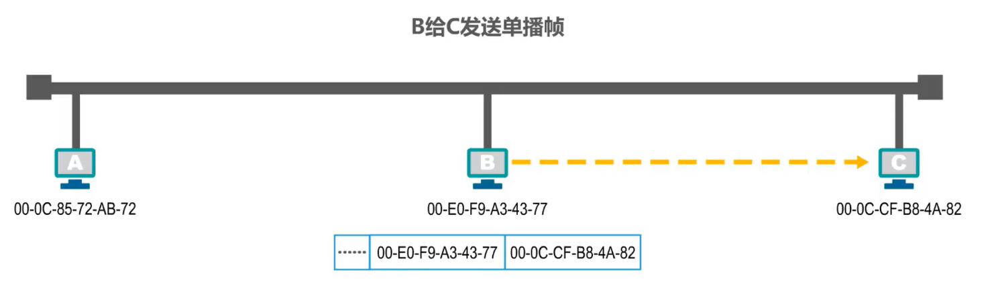

主机B将该单播帧发送出去，主机A和C都会收到该单播帧。主机A的网卡发现该单播帧的目的MAC地址与自己的 MAC地址不匹配，于是丢弃该帧。主机C的网卡发现该单播帧的目的MAC地址与自己的MAC地址匹配，于是接受该帧，并将该帧交给其上层处理，如图所示。

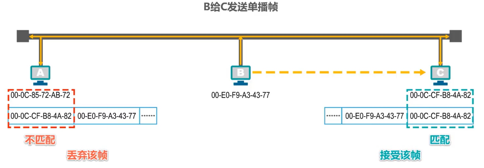

## 广播MAC地址的作用

广播 MAC地址的作用，假设主机B要发送一个广播帧，主机B首先要构建该广播帧在帧首部中的目的地址字段填，若广播地址也就是 16 进制的全F，原地址字段填入自己的 MAC地址，再加上帧首部中的其他字段数据载荷以及帧尾部，就构成了该广播帧。

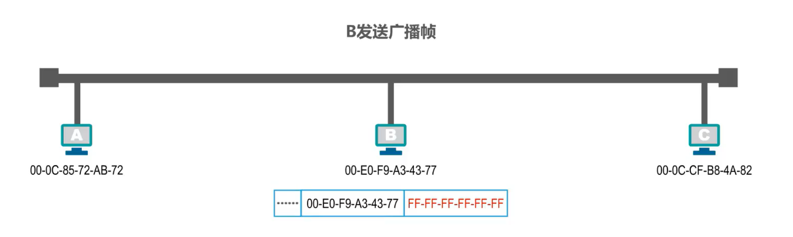

主机B将该广播帧发送出去，主机A和C都会收到该广播帧。发现该帧首部中的目的地址字段的内容是广播地址，就知道该帧是广播帧，接受该帧，并将该帧交给上层处理。

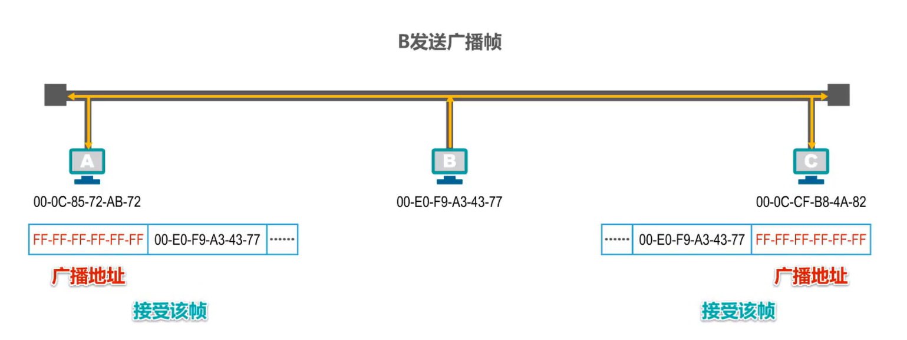

## 多播 MAC地址的作用

再来看多播 MAC地址的作用，假设主机A要发送多播帧给该多播地址`07-E0-12-F6-2A-D8`，将该多播地址的左起第一个字节写成 8 个比特，可以看到最低比特位是1，这就表明该地址是多播地址。

这里给大家介绍一个快速判断 MAC地址是否是多播地址的方法，也就是如果该位 16 进制数不能整除2即1、3、5、7、9、B、D、F，则该地址是多播地址。

假设主机B、C、D支持MAC多播，各用户给自己的主机配置的多播阻列表如下所示。

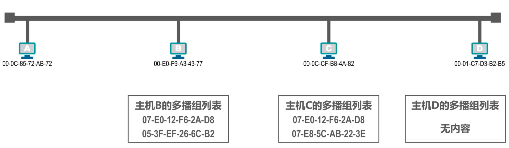

可以看到主机B属于两个多播组，主机C也属于两个多播组，而主机D不属于任何多播组。

主机A首先要构建该多拨帧在帧首部中的目的地址字段，填入该多播地址，源地址字段填入自己的 MAC地址，再加上帧首部中的其他字段数据载荷以及帧尾部，就构成了该多播帧。

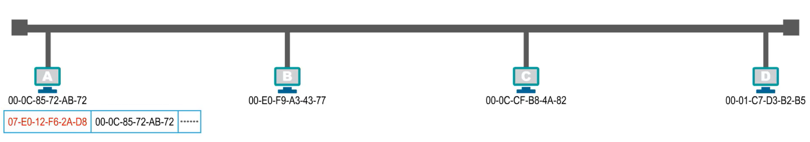

主机A将该多播帧发送出去，主机B、C、D 都会收到该多播身，主机B发现该多伯真的目的MAC地址在自己的多播组列表中。主机C发现该多伯真的目的MAC地址在自己的多播组列表中。因此主机B和C都会接受该帧并送交上层处理。而主机D发现该多播帧的目的MAC地址不在自己的多播组列表中，主基地丢弃该多播帧。

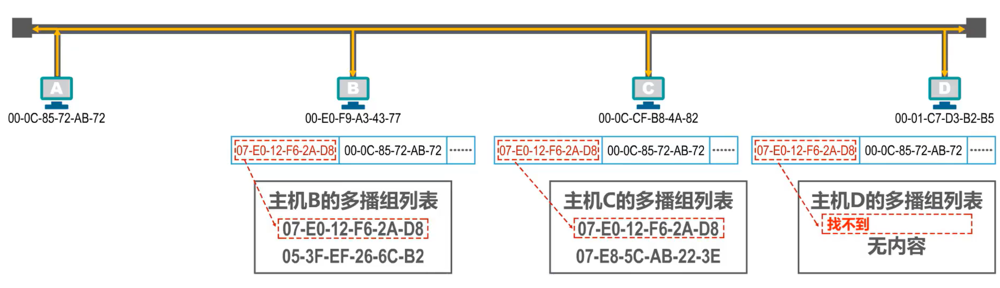

需要提醒大家注意的是，当**给主机配置多播组列表进行私有应用时，不得使用公有的标准多播地址**，具体可在以下网址查询：

http://standards.ieee.org/develop/regauth/grpmac/public.htm

## 随机MAC地址

据斯诺登爆料，美国国家安全局有一套系统，通过监视电子设备的MAC地址来跟踪城市中每个人的行动。因此，苹果率先在 iOS 系列设备扫描网络时采用随机MAC地址技术。随后 windows 10、安卓 6. 0 以及内核版本为 3. 18 的 Linux 系统也开始提供随机MAC地址的功能。目前大多数移动设备已经采用了随机MAC地址技术。

## 本节小结

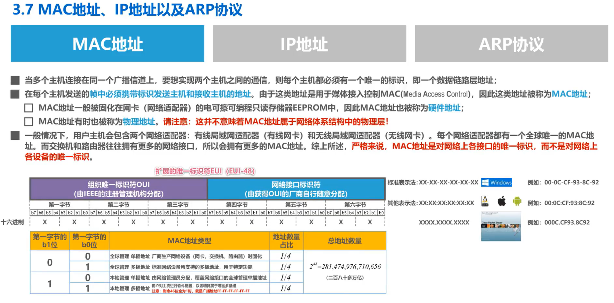