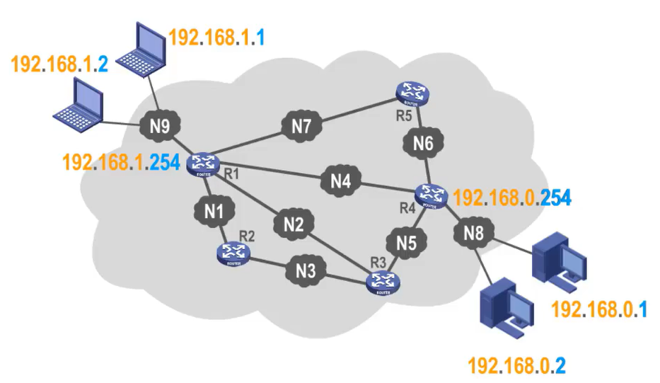
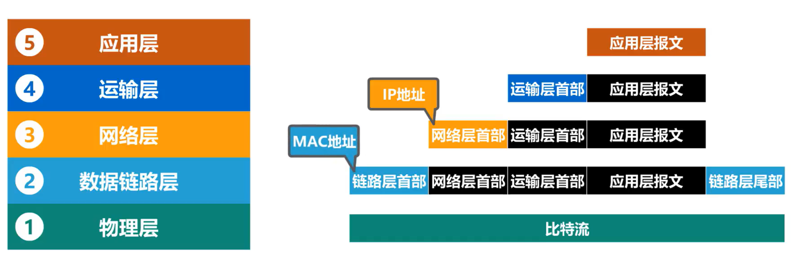
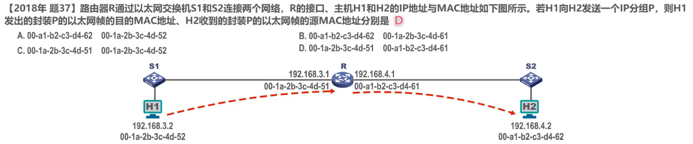
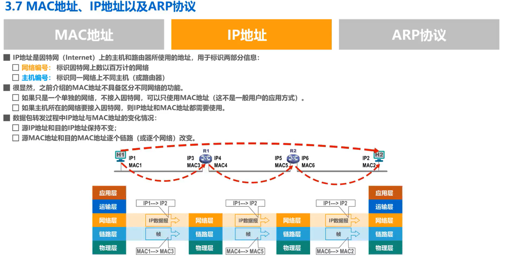

# 3-7 MAC地址 IP地址以及ARP协议——IP地址

IP地址属于网络层的范畴，而非数据链路层的范畴。之所以在数据链路层这一章的讲解中引入 IP地址，是因为在我们日常的大多数网络应用中，属于数据链路层的MAC地址和属于网络层的 IP地址都在使用，它们之间存在一定的关系。 IP地址的相关内容比较多，例如分类的 IP地址、划分子网的 IP地址、构造超网的 IP地址等。这些内容我们将在网络层这一章详细介绍。

## IP地址

IP地址是因特网上的主机和路由器所使用的地址，用于标识两部分信息，

- 网络编号：用来标识因特网上数以百万计的网络。
- 主机编号：用来标识同一网络上不同主机或路由器各接口。

如图所示。假设这是因特网的一部分，我们给网络 N8 上的两台主机各分配了一个 IP地址，给路由器R4连接该网络的接口也分配了一个 IP地址。这三个 IP地址的前3个十进制数是相同的，也就是网络 N8 的编号。而最后一个十进制数各不相同，是网络 N8 上个主机和路由器接口的编号。换句话说，**同一个网络上的各主机和路由器的各接口的 IP地址的网络号部分应该相同，而主机号部分应该互不相同**。

又例如，我们给网络 N9 上的各主机和路由器的接口各分配了一个 IP地址，这三个 IP地址的前3个十进制数是相同的，也就是网络 N9 的编号，而最后一个十进制数各不相同，是网络 N9 上各主机和路由器接口的编号。

**因特网中，不同网络的网络编号必须各不相同**。例如，在本例中，网络 N8 的编号为192.168.0，而网络 N9 的编号为192.168.1。需要提醒大家注意的是，在一个 IP地址中，哪部分是网络编号，哪部分是主机编号，并不都和本地相同。我们将在后续网络层这一章进行详细介绍。

很显然，之前介绍的**MAC地址不具备区分不同网络的功能**，而 IP地址具备这样的功能。

- 如果只是一个单独的网络不接入因特网，可以只使用MAC地址，但这并不是一般用户的常见应用方式。

- 如果主机所在的网络要接入因特网，则 IP地址和MAC地址都需要使用。

## IP地址与MAC地址的封装位置

从网络体系结构的角度看看 IP地址与MAC地址的封装位置。我们以 5 层源理体系结构为例

这是应用层封装好的应用层报文，将其向下交付给运输层

- 运输层看不懂，也无需看懂应用层报文的结构与内容，我们用黑色表示，仅仅给其添加一个运输层首部。运输层将封装好的协议数据单元向下交付给网络层
- 网络层看不懂也无需看懂运输层协议数据单元的结构与内容，仅仅给其添加一个网络层首部。网络层将封装好的协议数据单元向下交付给数据链路层
- 数据链路层看不懂也无需看懂网络层协议数据单元的结构与内容，仅仅给其添加一个数据链路层首部和一个数据链路层尾部，数据链路层将封装好的协议数据单元向下交付给物理层
- 物理层看不懂也无需看懂数据链路层协议数据单元的结构与内容，仅仅将它们看作是比特流，以便将它们转换为相应的电信号发送到传输媒体

由于 IP地址属于网络体系结构中网络层的范畴，因此在网络层首部中应该封装有源 IP地址和目的 IP地址。相应的，由于MAC地址属于网络体系结构中数据链路层的范畴，因此在数据链路层首部中应该封装有源MAC地址和目的MAC地址。

## 数据包在转发过程中 IP地址与MAC地址的变化情况

接下来我们来看看数据包在转发过程中 IP地址与MAC地址的变化情况，如图所示。为了简单起见，图中各主机和路由器各接口的 IP地址和MAC地址用比较简单的标识符来表示，而并未使用实际的 IP地址和MAC地址。假设主机 H1 要给主机 H2 发送一个数据包，我们从网络体系结构的角度来看，数据包在传输过程中 IP地址与MAC地址的变化情况需要注意的是，主机中有完整的网络体系结构，而路由器的最高层为网络层，它没有网络体系结构中的运输层和应用层。

我们所关注的重点是**网络层封装 IP 数据报时，源 IP地址和目的 IP地址应该填写什么？数据链路层封装帧实源MAC地址和目的MAC地址应填写什么？**因此，我们忽略网络体系结构中除网络层和数据链路层外的其他各层。可以想象成各网络层进行水平方向的逻辑通信。各数据链路层进行水平方向的逻辑通信。

1. 主机 H1 将数据包发送给路由器R1

   - 在网络层封装的 IP 数据报首部中，源IP地址应填写主机 H1 的 IP地址IP1，目的 IP地址应填写主机H2的IP地址IP2，也就是从 IP1 发送给IP2。

   - 数据链路层封装的帧首部中，源MAC地址应填写主机 H1 的MAC地址MAC1，目的MAC地址应填写路由器 R1 的MAC地址MAC3，也就是从MAC1 发送给MAC3

2. 路由器 R1 将收到的数据包转发给路由器R2

   - 在网络层封装的 IP 数据报，首部中源 IP地址仍然填写主机 H1 的 IP地址IP1，目的 IP地址仍然填写主机 H2 的 IP地址IP2，也就是从IP1发送给IP2。

   - 在数据链路层封装的帧守步中，源MAC地址应填写路由器 R1 的MAC地址MAC4，目的MAC地址应填写路由器 R2 的MAC地址MAC5，也就是从MAC4 发送给MAC5。

3. 路由器 R2 将收到的数据包转发给主机H2

   - 在网络层封装的 IP 数据报首部中，源 IP地址仍然填写主机 H1 的 IP地址IP1，目的 IP地址仍然填写主机 H2 的 IP地址IP2，也就是从 IP1 发送给IP2

   - 在数据链路层封装帧首部时，源MAC地址应填写路由器 R2 的MAC地址MAC6，目的MAC地址应填写主机 H2 的MAC地址MAC2，也就是从MAC6 发送给MAC2。

通过本例可以看出，**在数据包转发过程中，源IP地址和目的 IP地址始终保持不变，而源MAC地址和目的MAC地址逐个链路（逐个网络）改变**。

## 如何通过 IP地址找出其对应的MAC地址——见下节地址解析协议ARP

-  主机 H1 知道应该把数据包传给R1，由 R1 当其把数据包转发出去， H1 知道 R1 相应接口的IP地址为IP3，但不知道其对应的MAC地址是什么。

- 路由器 R1 知道应该把数据包转发给R2，R1 知道 R2 相应接口的 IP地址为IP5，但不知道其对应的MAC地址是什么。

- 路由器 R2 直到应该把数据包传给主机H2， R2 知道 H2 的 IP地址为IP2，但不知道其对应的MAC地址是什么。

有的同学可能会对这部分内容产生疑问，请大家目前先权且这么认可，我们将在后续的网络层这一章详细介绍。

对于本力主机H1，路由器 R1 和 R2 都存在一个共同的问题，那就是知道 IP地址但不知道其相应的MAC地址，如何通过 IP地址找出其对应的MAC地址，这是我们下节课将要介绍的地址解析协议 ARP 所要实现的功能。

## 习题

在数据包的转发过程中，源 IP地址和目的 IP地址始终保持不变，而源MAC地址和目的MAC地址逐段链路或逐个网络改变。针对本题，可以填写下表

## 本节小结

