# 3-7 MAC地址 IP地址以及ARP协议——ARP协议

在之前的课程中，我们分别介绍了属于数据链路层范畴的MAC地址和属于网络层范畴的IP地址，以及数据包在传输过程中IP地址和MAC地址的变化情况。之后我们提出了这样一个问题，那就是如何通过IP地址找到其相应的MAC地址。这就是本节课我们将要介绍的地址解析协议 ARP 所要实现的主要功能。

## 举例说明 ARP 协议的工作原理

这是一个共享总线型的以太网，为了简单起见，我们只画出了该网络中的三台主机，各主机所配置的IP地址和其网卡上固化的MAC地址，如图所示。

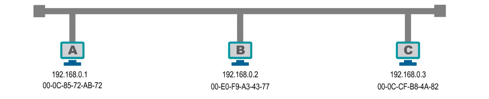

假设主机B要给主机C发送数据包，主机B知道主机C的IP地址，但不知道他的MAC地址，因此，主机B的数据链路层在封装MAC帧时，就无法填写目的MAC地址字段，进而也就无法构建出要发送的MAC帧。

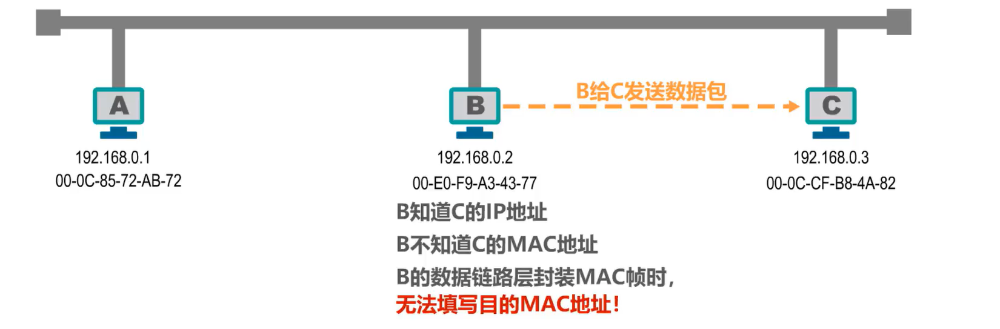

实际上，每台主机都会有一个 **ARP 高速缓存表**，例如，这是主机B的 ARP 高速缓存表。

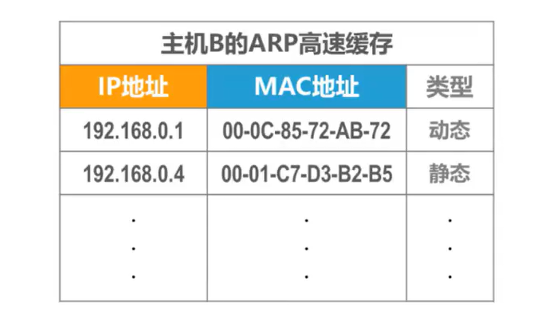

ARP高速缓存表中记录有**IP地址和MAC地址的对应关系**，例如，这是主机B之前获取到的主机A的IP地址与MAC地址的对应关系。

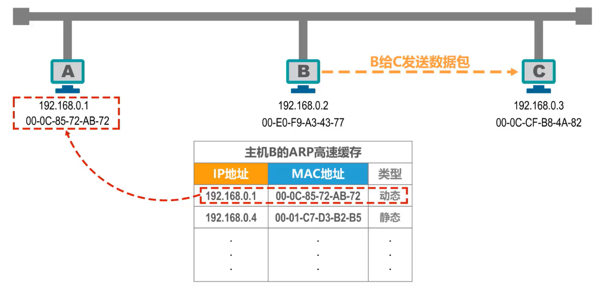

在本例中，当主机B要给主机C发送数据包时，会首先在自己的 ARP 高速缓存表中查找主机C的IP地址所对应的MAC地址，但未找到。

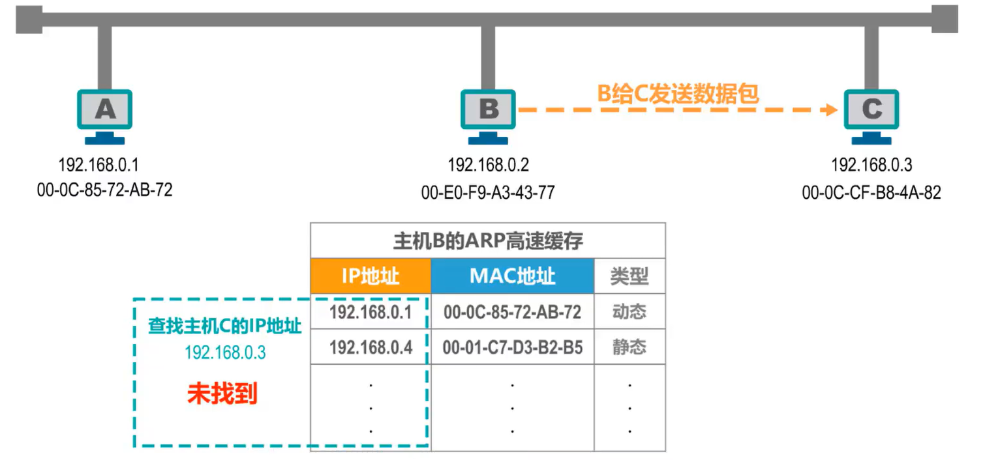

因此，主机B需要发送 ARP 请求报文来获取主机C的MAC地址。

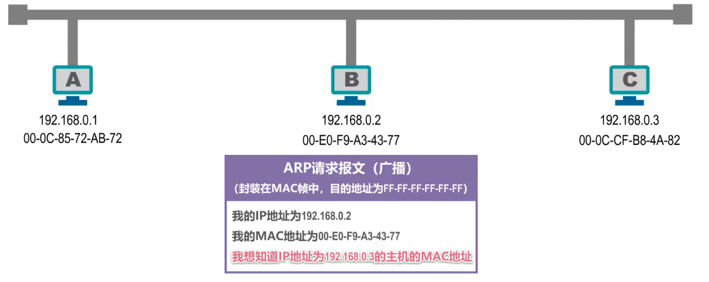

ARP请求报文的内容是：我的IP地址为192.168.0.2，我的MAC地址为 00-E0-F9-A3-43-77。我想知道IP地址为192.168.0.3的主机的MAC地址。

需要说明的是，为了简单起见，这里我们以比较通俗的语言来描述 ARP 请求报文的内容，但实际上ARP请求报文有其具体的格式。

另外需要大家注意的是，ARP请求报文被封装在MAC帧中发送，目的地址为广播地址，主机B发送封装有ARP请求报文的广播帧，总线上的其他主机都能收到该广播帧。

- 主机A的网卡收到该广播帧后，将其送交上层处理。上层的ARP进程解析ARP请求报文，发现所询问的IP地址不是自己的IP地址，因此不予理会。

  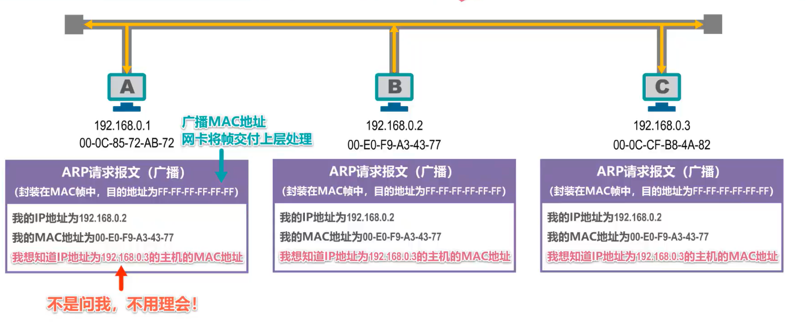

- 主机C的网卡收到该广播帧后，将其送交上层处理。上层的ARP进程解析ARP请求报文，发现所询问的IP地址正是自己的IP地址，需要进行响应。主机C首先将ARP请求报文中所携带的主机B的IP地址与MAC地址记录到自己的ARP高速缓存表中，然后给主机B发送ARP响应报文，已告知自己的MAC地址。ARP响应报文的内容是：我的IP地址是192.168.0.3，我的MAC地址为00-0C-CF-B8-4A-82。

  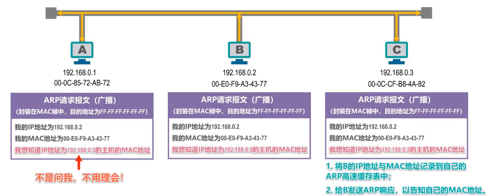

需要注意的是，ARP响应报文被封装在MAC帧中，发送目的地址为主机B的MAC地址。主机C给主机B发送封装有**ARP响应报文的单播帧**，总线上的其他主机都能收到该单播帧。

- 主机A的网卡，收到该单播帧后，发现其目的MAC地址与自己的MAC地址不匹配，直接丢弃该帧。

- 主机B的网卡收到该单波帧后，发现其目的MAC地址就是自己的MAC地址，将其交付上层处理。上层的ARP进程解析ARP响应报文，将其所包含的主机C的IP地址与MAC地址记录到自己的ARP高速缓存表中。

  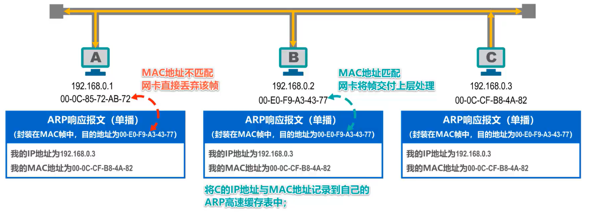

如图所示添加新的ARP缓存记录，主机B现在可以给主机C发送之前想发送的数据包了。

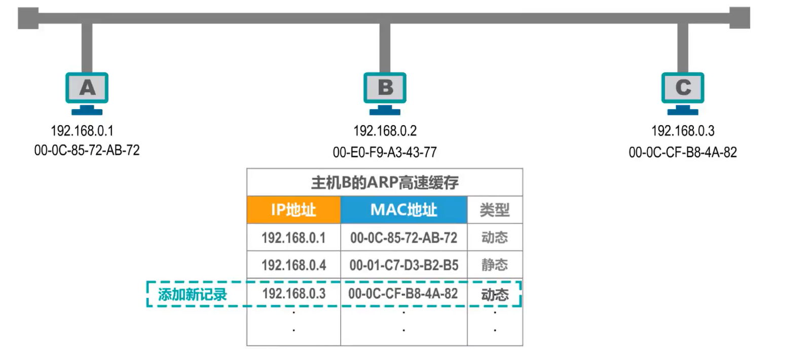

### 注意

- **除ARP请求和响应报文外，ARP还有其他类型的报文**，例如用于检查IP地址冲突的无故ARP或称免费ARP

- 另外， ARP 协议没有安全验证机制，存在 ARP 欺骗或攻击等问题

## ARP高速缓存表中的记录类型

 ARP 高速缓存表中的每一条记录都有其类型，分为动态和静态两种。

### 动态类型

动态类型是指记录是主机自动获取到的，其生命周期默认为 2 分钟，当生命周期结束时，该记录将自动删除。这样做的原因是**IP地址与MAC地址的对应关系并不是永久性的**。

例如，当主机的网卡坏了，更换新的网卡后，主机的IP地址并没有改变，但主机的MAC地址改变了。

### 静态类型

静态类型是指记录是用户或网络维护人员手工配置的。不同操作系统下的生命周期不同

例如系统重启后不存在，或在系统重启后依然有效。

接下来请大家思考一下，在下图所示的网络拓扑中，主机 H1 是否可以使用 ARP 协议获取到主机 H2 的MAC地址？

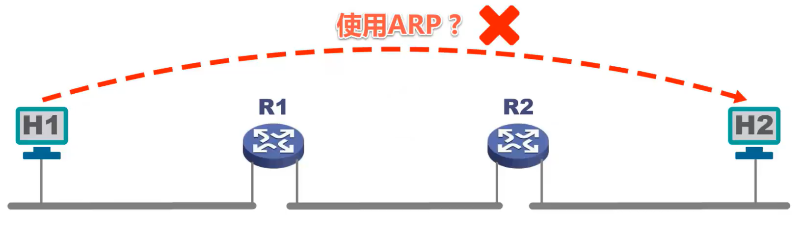

回答是否定的。 **ARP 协议只能在一段链路或一个网络上使用，而不能跨网络使用**。对于本例， ARP 协议的使用是逐段链路进行的。

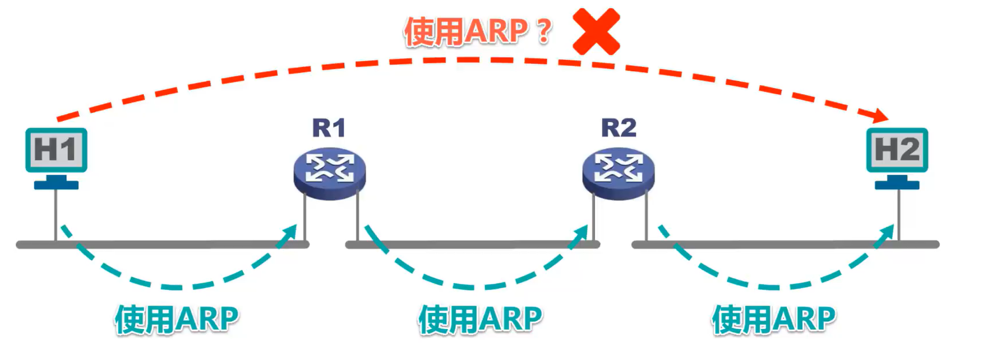

## 本节小结（含前2节）

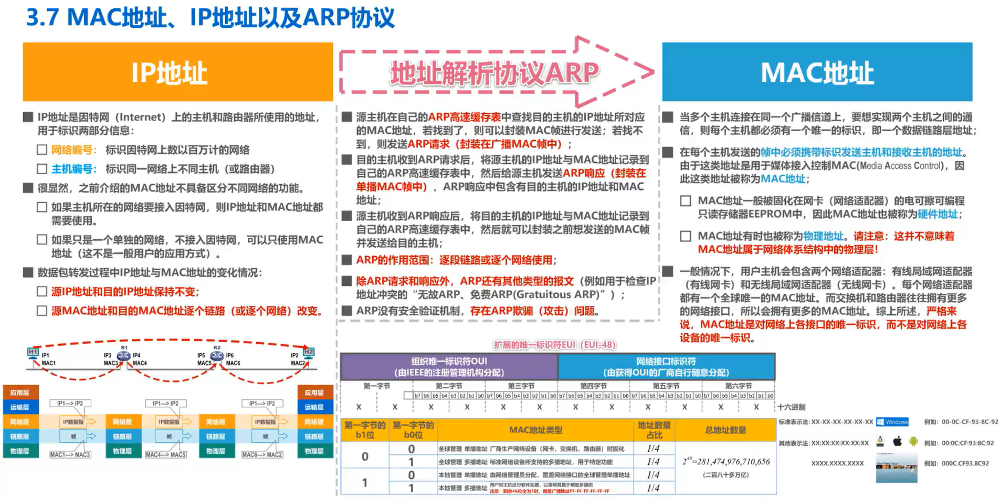