# 3-8 集线器与交换机的区别

本节课我们介绍集线器与交换机的区别

## 早期的总线型以太网

我们首先来看早期的总线型以太网，这是我们之前课程中经常用来举例的总线型以太网。它最初使用粗同轴电缆作为传输媒体，后来演进到使用价格相对便宜的细同轴电缆。

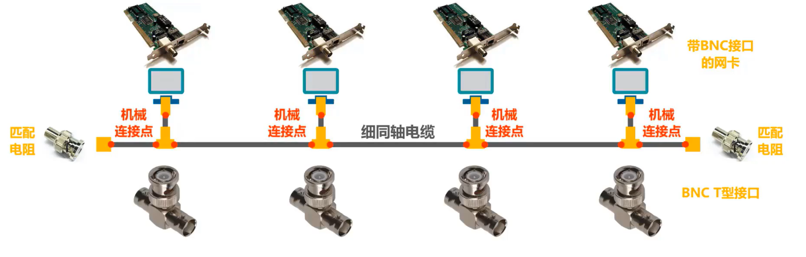

当初认为这种连接方法既简单又可靠，因为在那个时代普遍认为有源器件不可靠，而无源的电缆线才是最可靠的。然而，这种使用无源电缆和大量机械接头的总线型以太网并不像人们想象的那么可靠。

## 使用双绞线和集线器HUB的星型以太网

后来，以太网发展出来了一种使用大规模集成电路，可靠性非常高的设备，叫做**集线器**，并且使用更便宜、更灵活的双绞线作为传输媒体

如图所示，这是一个使用集线器和双绞线电缆互联了 4 台主机的星型拓扑的以太网。

主机中的以太网卡以及集线器各接口使用 RJ45 插座，他们之间通过双脚线电缆进行连接。

在双绞线电缆的两端是 **RJ45插头**，也就是我们俗称的**水晶头**。

实践证明，使用双绞线和集线器比使用具有大量机械接头的无源电缆电缆要可靠的多，并且价格便宜，使用方便。因此，粗缆和细缆的以太网早已成为了历史，从市场上消失了。

- 使用集线器的以太网虽然物理拓扑是星型的，但在**逻辑上仍然是一个总线网**，各站共享逻辑上的总线资源**使用的还是CSMA/CD协议**。

- **集线器只工作在物理层**，它的每个接口仅简单地转发比特，不进行碰撞检测，碰撞检测的任务由各站的网卡负责。在分析问题时，我们可将集线器简单看作是一条总线。

- **集线器一般都有少量的容错能力和网络管理功能**。例如，若网络中某个网卡出现了故障，不停的发送帧，此时集线器也可以检测到这个问题，在内部断开与出故障网卡的连线，使整个以太网仍然能正常工作。

## 使用集线器在物理层扩展以太网——总线特性

使用集线器可以对以太网进行扩展。由于集线器只工作在物理层，所以更具体的说法是使用集线器在物理层扩展以太网。

我们来举例说明，假设某学院下设 3 个系部，每个系部都有一个使用集线器作为互联设备的以太网，这三个以太网相互独立，**各自共享自己的总线资源，是三个独立的碰撞域，或称冲突域**。

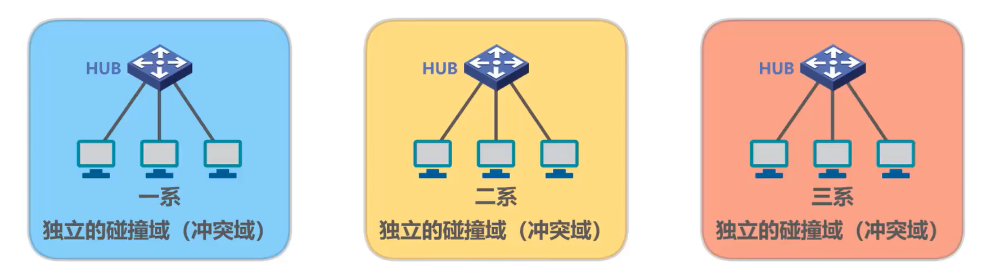

例如

-  1 系中的某台主机给另一台主机发送数据帧，由于总线特性，表示该数据帧的信号会传输到 1 系中的其他各主机。

- 2 系中的多台主机同时发送数据帧，由于总线特性，这必然会产生信号碰撞，碰撞后的信号会传输到二期中的各主机。

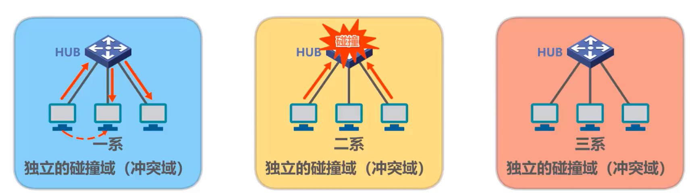

为了使各系部的以太网能够相互通信，可再使用一个集线器将它们互联起来。这样，原来三个独立的以太网就互联成为了一个更大的以太网，而原来三个独立的碰撞域就合并成了一个更大的碰撞域。换句话说，形成了一个更大的总线型以太网

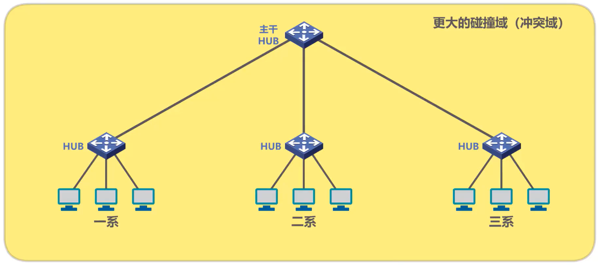

例如 1 系中的某台主机给 2 系中的某台主机发送数据帧，由于总线特性，表示该数据帧的信号会传输到整个网络中的其他各主机。

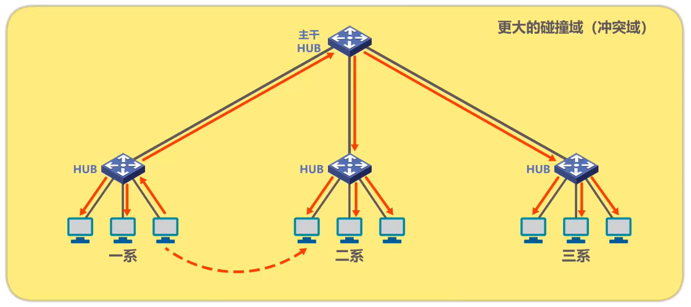

## 以太网交换机——交换特性

在集线器之后发展出了更先进的网络互联设备，也就是以太网交换机。

### 以太网交换机和集线器的区别

我们先从一个典型的例子来看看以太网交换机与集线器的区别。

- 使用**集线器互联而成的共享总线式以太网**上的某个主机要给另一个主机发送单播帧，该单播帧会通过共享总线传输到总线上的其他各个主机。

- 使用**交换机互联而成的交换式以太网上**的某个主机要给另一个主机发送单播帧，该单播帧进入交换机后，交换机会将该**单播帧转发给目的主机**，而不是网络中的其他各个主机。

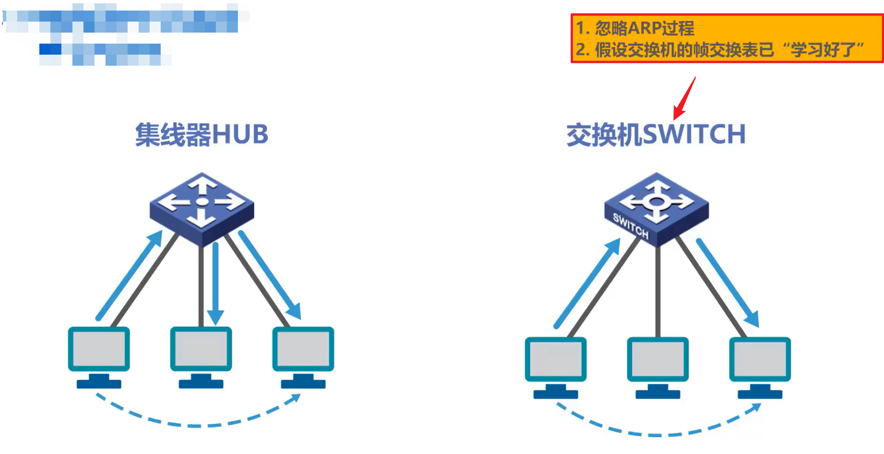

很显然，交换机具有明显的优势。需要说明的是，为了简单起见，本节课所有举例的**前提条件是忽略 ARP 过程，并假设交换机的帧交换表已经学习或配置好了**。

### 以太网交换机的特性

- 以太网交换机通常都有**多个接口**，每个接口都可以通过双绞线电缆与一台主机或另一个以太网交换机相连，一般都工作在**全双工方式**，也就是发送帧和接收帧可以同时进行。（注意，使用集线器的以太网在逻辑上是**共享总线**的，需要使用CSMA/CD协议来协调各主机征用总线，只能工作在**半双工模式**，也就是收发帧不能同时进行。）

- 以太网交换机具有并行性，**能同时连通多对接口**，使多对主机能同时通信而**无碰撞**（**不使用CSMA/CD协议**）。

- 以太网交换机的接口一般都支持多种速率，例如 10 Mb/s、 100 Mb/s、 1Gb/s、10Gb/s等。

- 以太网交换机**工作在数据链路层**，当然**也包括物理层**。他收到帧后，在帧交换表中查找**帧的目的MAC地址所对应的接口号**，然后通过该接口转发帧

  - 假设这是该交换机的帧交换表，主机A给主机B发送数据帧交换机收到该帧后，在帧交换表中查找该帧的目的MAC地址，也就是主机B的MAC地址，发现应该从接口 2 转发，于是就从接口 2 将该帧转发出去。

    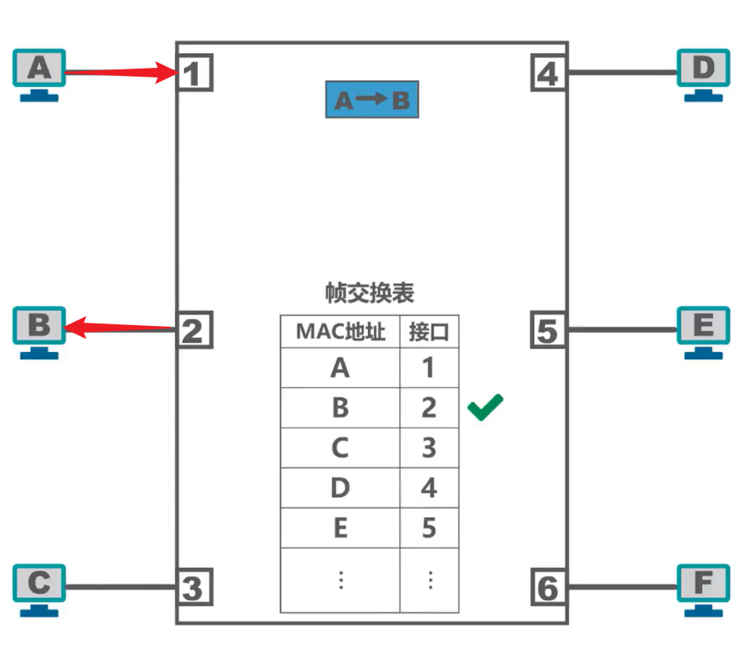

- 以太网交换机是一种即插即用的设备，上电即可工作。其内部的**帧交换表**是通过**自学习算法**自动的逐渐建立起来的。
- 帧的2种转发方式
  - 存储转发方式：将接收的帧先缓存后再进行处理
  - 直通交换方式：直通交换不必把整个帧先缓存后再进行处理，而是在接收帧的同时就立即按帧的目的MAC地址决定该帧的转发接口，因而提高了帧的转发速率。一般采用基于硬件的交叉矩阵（这样交换时延就非常小。但直通交换的一个缺点就是它不检查帧是否有差错，就直接将帧转发出去）

## 进一步对比集线器和交换机

接下来我们再通过几个例子进一步对比集线器和交换机，这是前提条件

- 忽略ARP过程
- 假设交换机的帧交换表已“学习好了"

### 一台主机发送单播帧

我们首先来对比主机发送单播帧的情况

对于使用集线器的共享总线型以太网，单播帧会传播到总线上的其他各主机，各主机中的网卡根据帧的目的MAC地址决定是否接受该帧。

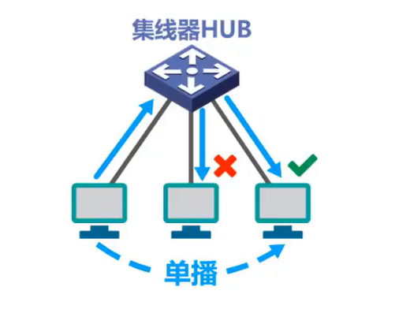

对于使用交换机的交换式以太网交换机收到单播帧后，根据帧的目的MAC地址和自身的帧交换表，将帧转发给目的主机，而不是网络中的其他各主机。

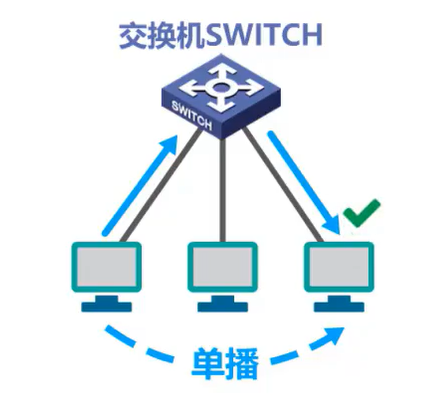

### 一台主机发送广播帧

我们再来对比发送广播帧的情况

对于使用集线器的共享总线型以太网，广播帧会传播到总线上的其他各主机。各主机中的网卡，检测到帧的目的MAC地址是广播地址，就接受该帧。

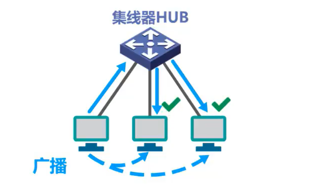

对于使用交换机的交换式以太网交换机收到广播帧后，检测到帧的目的，MAC地址是广播地址，于是从除该帧进入交换机接口外的其他各接口转发该帧。网络中除原主机外的其他各主机收到广播帧后接受该广播帧。

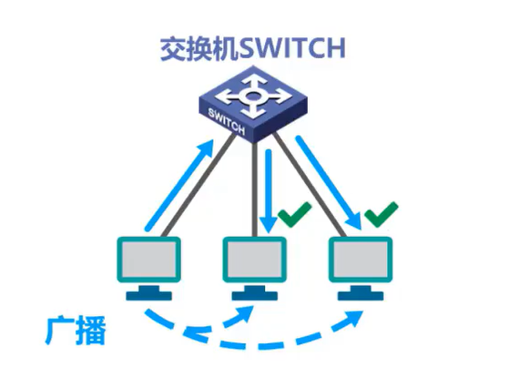

从本例可以看出，**使用集线器的共享总线型以太网中的各主机属于同一个广播域，而使用交换机的交换式以太网中的各主机也属于同一个广播域**。因此对于广播帧的情况，从效果上看没有什么区别。

### 多台主机同时发送单播帧

我们再来对比网络中的多台主机同时给另一台主机发送单播帧的情况。

对于使用集线器的共享总线型以太网，这必然会产生碰撞，遭遇碰撞的帧会传播到总线上的各主机。

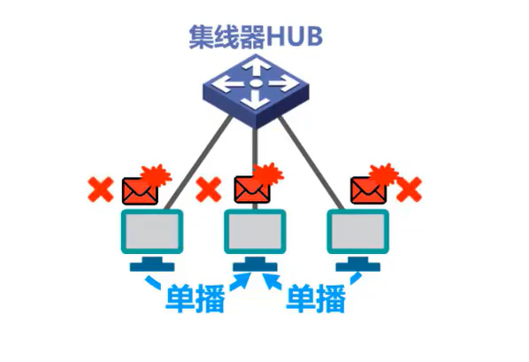

对于使用交换机的交换式以太网交换机收到多个帧时，会将它们**缓存起来**，然后逐个转发给目的主机，不会产生碰撞。

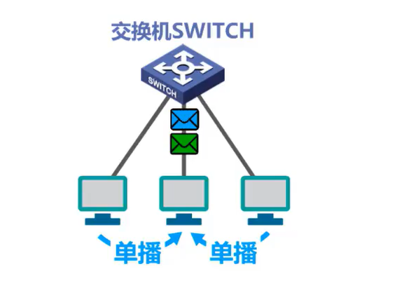

## 集线器扩展以太网和使用交换机扩展以太网的区别

接下来我们来对比使用集线器扩展以太网和使用交换机扩展以太网有什么区别。

### 发送单播帧

首先对比发送单波帧的情况

这是仅使用集线器扩展以太网后发送单播帧的情况

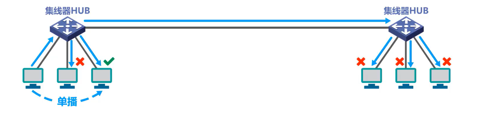

这是仅使用交换机扩展以太网后发送单播帧的情况

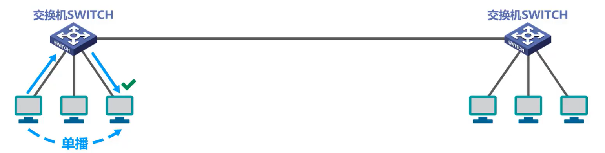

很显然，交换机具有非常明显的优势。

### 发送广播帧

再来对比发送广播帧的情况

这是仅使用集线器扩展以太网后发送广播帧的情况

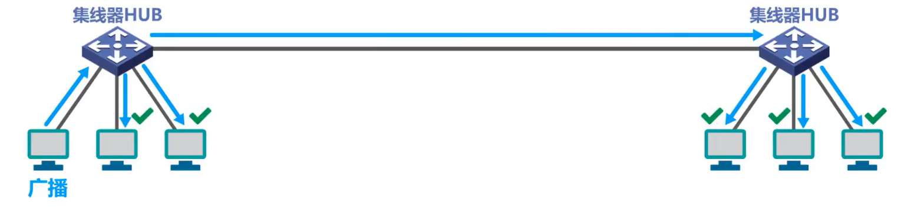

这是仅使用交换机扩展以太网后发送广播帧的情况

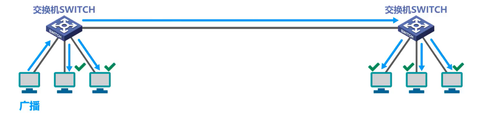

从效果上看是一样的。可见，**不管使用集线器还是交换机来扩展以太网，扩展后的以太网中的各主机都属于同一个广播域，仅使用集线器扩展的以太网在逻辑上仍然是共享总线的，并且形成为一个更大的碰撞域。**换句话说，参与竞争总线的主机比扩展前的更多了

### 竞争总线并产生碰撞

这是竞争总线并产生碰撞的一个例子。同样的传输任务，在仅使用交换机扩展的以太网上就不会产生碰撞。

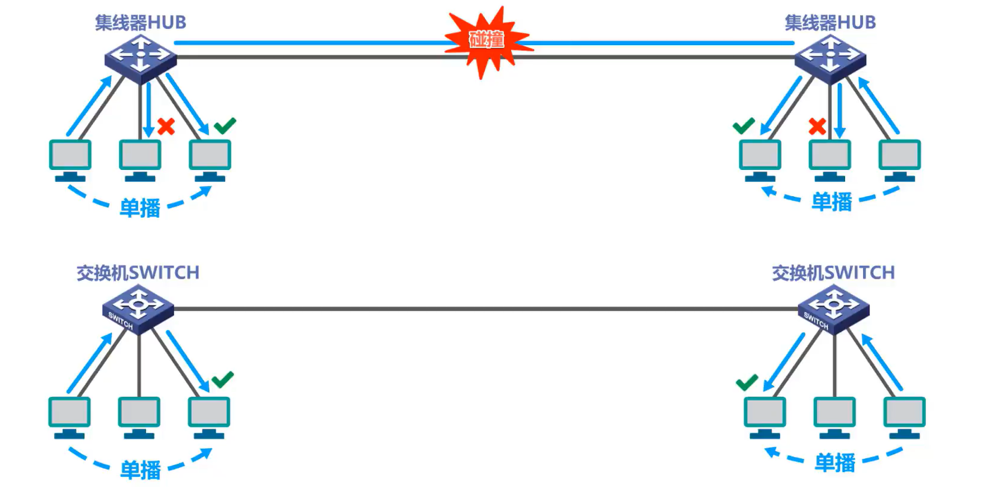

因此，如果**仅仅使用集线器来扩展以太网，不仅会扩大广播域，还同时扩大了碰撞域。但是，如果使用交换机将原来各自独立的碰撞域连接起来，只会扩大广播域而不会扩大碰撞域，也就是说，交换机可以隔离碰撞域。**

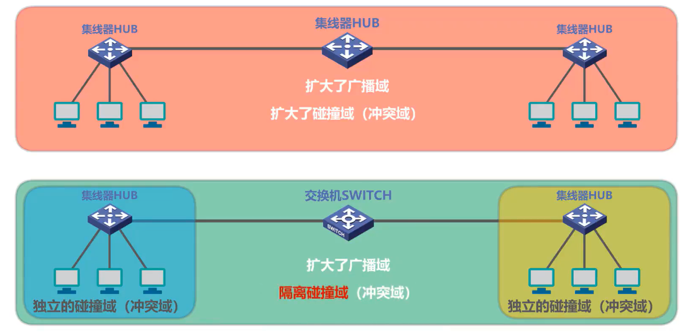

## 本节小结

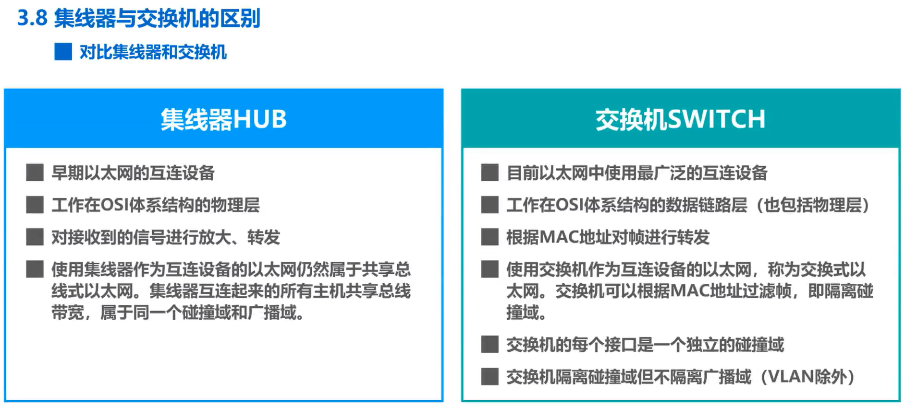

需要说明的是，**工作在数据链路层的以太网交换机，其性能远远超过工作在物理层的集线器**，而且价格并不贵，这就使得集线器逐渐被市场淘汰，目前很难在市场上再见到集线器了