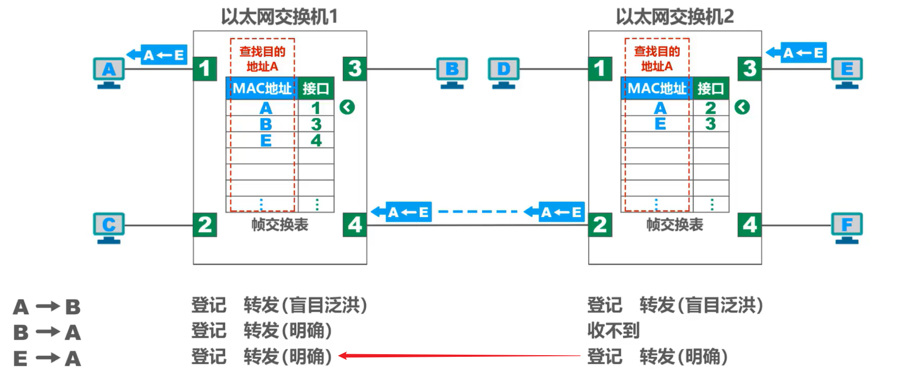
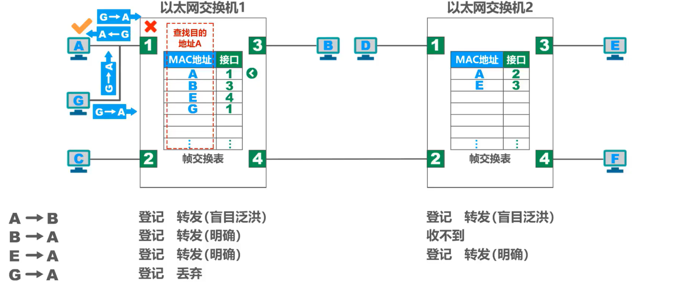
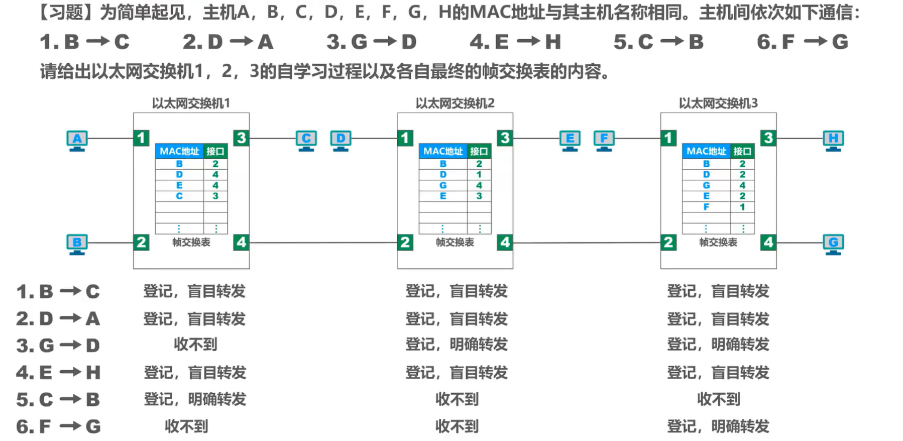
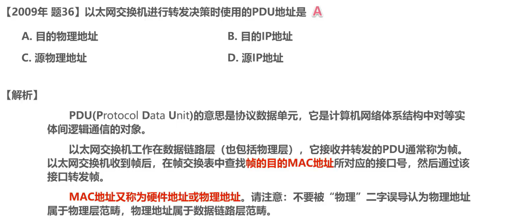
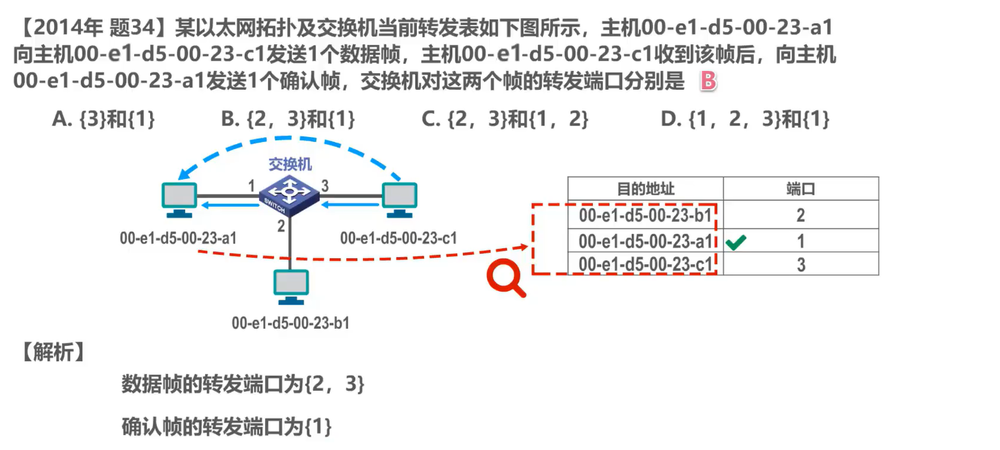
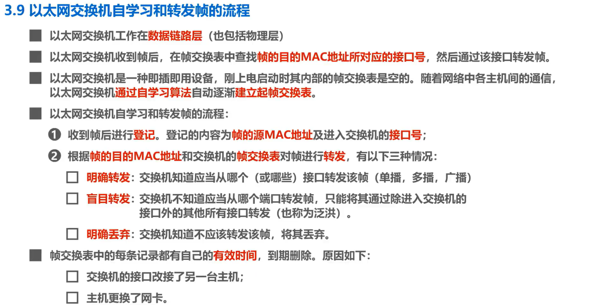

# 3-9 以太网交换机自学习和转发帧的流程

在上节课中，我们对比了在物理层扩展以太网的极限器和在数据链路层扩展以太网的交换机。本节课我们介绍以太网交换机自学习和转发帧的流程。

## 以太网交换机自学习和转发帧的流程简介

- 以太网交换机工作在**数据链路层**，当然也包括物理层。需要说明的是，目前市场上也有包含网络层部分功能的交换机，称为三层交换机。

- 以太网交换机收到帧后，在帧交换表中查找**帧的目的MAC地址所对应的接口号**，然后通过该接口转发帧。

- 以太网交换机是一种机插机用的设备，刚上电启动时，其内部的帧交换表是空的。随着网络中各主机间的通信，以太网交换机通过**自学习算法**自动逐渐建立起**帧交换表**。

## 举例说明以太网交换机自学习和转发帧的流程

如图所示，相互连接的两台以太网交换机各自连接了 3 台主机，构成了一个交换式以太网。为了简单起见，各主机中网卡上固化的 MAC地址仅用一个大写字母表示各主机互不相同。为了将重点放在以太网交换机自学习和转发帧的流程上，我们假设各主机已经知道了网络中其他各主机的MAC地址。换句话说，不需要首先通过 ARP 来获取目的主机的 MAC地址。

### A→B

#### 登记

假设主机A给主机B发送帧，该帧从交换机 1 的接口 1 进入交换机1，交换机 1 首先进行登记的工作，将该帧的源 MAC地址A记录到自己的帧交换表中，将该帧进入自己的接口号1，相应的也记录到帧交换表中。上述登记工作就称为交换机的自学习。

#### 转发（盲目泛洪）

之后，交换机 1 对该帧进行转发，该帧的目的 MAC地址是B，在帧交换表中查找 MAC地址B。 找不到，于是对该帧进行盲目的转发，也称为泛洪，也就是从除该帧进入交换机接口外的其他所有接口转发该帧。可以看出交换机一开始还是比较笨的，他还没有足够的知识来明确转发帧，只能进行盲目的转发。

- 主机 B 的网卡收到该帧后，根据帧的目的 MAC地址 B 就知道这是发送给自己的帧，于是就接受该帧。
- 主机 C  的网卡收到该帧后，根据帧的目的 MAC地址 B 就知道这不是发送给自己的帧，于是就丢弃该帧。
- 该帧从交换机 2 的接口 2 进入交换机 2。 首先进行登记的工作，将该帧的源 MAC地址A记录到自己的帧交换表中，将该帧进入自己的接口号2相应的也记录到帧交换表中。之后交换机 2 对该帧进行转发，该帧的目的 MAC地址是B，在帧交换表中查找 MAC地址 B ，找不到，于是对该帧进行盲目的转发，主机D、E、F都会收到该帧。根据帧的目的 MAC地址 B 就知道这不是发送给自己的帧，于是丢弃该帧。

### B→A

#### 登记

接下来主机 B 给主机 A  发送帧，该帧从交换机 1 的接口 3 进入交换机1。交换机 1 首先进行登记的工作，将该帧的源 MAC地址 B 记录到自己的帧交换表中，将该帧进入自己的接口号 3 相应也记录到帧交换表中。

#### 转发（明确）

之后交换机 1 对该帧进行转发，该帧的目的 MAC地址是A ，在帧交换表中查找 MAC地址 A  ，可以找到，于是按照 MAC地址 A  所对应的接口号 1 从接口 1 转发该帧，这是明确的转发。主机 A  的网卡。收到该帧后，根据帧的目的MAC地址 A  就知道这是发送给自己的帧，于是接受该帧。很显然，交换机 2 不会收到该帧。

### E→A

#### 登记

接下来主机 E 给主机 A  发送帧，该帧从交换机 2 的接口 3 进入交换机2，交换机 2 首先进行登记的工作

#### 转发（明确）

之后交换机 2 对该帧进行转发，该帧的目的 MAC地址是A ，在帧交换表中查找 MAC地址 A  ，可以找到，于是按照 MAC地址 A  所对应的接口号 2 从接口 2 转发该帧，这是明确的转发。

- 该帧从交换机 1 的接口 4 进入交换机 1 首先进行登记的工作，之后交换机 1 对该帧进行转发，该帧的目的 MAC地址是A 。

- 在帧交换表中查找 MAC地址 A  可以找到，于是按照 MAC地址 A  所对应的接口号 1 从接口 1 转发该帧，这是明确的转发，主机 A  的网卡收到该帧后，根据帧的目的 MAC地址， A  就知道这是发送给自己的帧，于是接受该帧。

我们再来看看以太网交换机丢弃帧的情况，为了演示该情况，我们给交换机 1 的接口1再连接一台主机器G，为了简单起见，没有画出集线器，这样主机A 、主机G、交换机 1 的接口 1 就共享同一条总线。

假设主机 G 给主机 A  发送帧，该帧通过总线进行传输，主机 A  和交换机 1 的接口 1 都可以收到。主机 A  的网卡收到该帧后，根据帧的目的 MAC地址A  ，就知道这是发送给自己的帧，于是接受该帧。

交换机 1 收到该帧后，首先进行登记工作，之后交换机 1 对该帧进行转发。该帧的目的 MAC地址是A ，在帧交换表中查找 MAC地址A ，可以找到 MAC地址 A  所对应的接口号是1，但是**该帧正是从接口 1 进入交换机 1 的，交换机 1 不会再从该接口将该帧转发出去**，因为这是没有必要的，于是丢弃该帧。很显然，交换机 2 不会收到该帧。

随着网络中各主机都发送了帧后，网络中的各交换机就可以学习到各主机的 MAC地址，以及他们与自己各接口的对应关系。

### 注意

需要注意的是，帧交换表中的每条记录都有自己的**有效时间**，到期自动删除。

为什么要到期自动删除呢？

这是因为 **MAC地址与交换机接口的对应关系并不是永久性的**。例如交换机某接口所连接的主机更换成了另一台主机，又或者主机中的网卡坏了，更换了新的网卡，这些情况都会导致 MAC地址与交换机接口的对应关系的改变。相信大家还记得我们曾经介绍过的 ARP 高速缓存表中的 IP 地址与 MAC地址的对应关系记录，也是会定期自动删除的，这是因为 IP 地址与 MAC地址的对应关系也并不是永久性的。

## 习题

### 习题1

### 习题2

我们来一起分析一下。 PDU 的意思是协议数据单元，它是计算机网络体系结构中对等实体间逻辑通信的对象。以太网交换机工作在数据链路层，也包括物理层。他接收并转发的 PDU 通常称为帧。以太网交换机收到帧后，在帧交换表中查找帧的目的 MAC地址所对应的接口号，然后通过该接口转发帧 MAC地址又称为硬件地址或物理地址，请注意不要被物理二字误导，认为物理地址属于物理层范畴，实际上物理地址属于数据链路层范畴。

### 习题3

解析：根据题意，左侧主机给右侧主机发送数据帧，该帧从交换机的接口 1 进入交换机，交换机首先进行登记的工作，将该帧的源 MAC地址记录到自己的帧交换表中，将该帧进入自己的接口号，相应的也记录到帧交换表中。之后交换机对该帧进行转发，在帧交换表中查找该帧的目的， MA C  地址找不到，于是对该帧进行盲目的转发，因此交换机转发数据帧的端口为 2 和3。

根据题意，右侧主机收到左侧主机发送的数据帧后，给左侧主机发送确认帧，该帧从交换机的接口 3 进入交换机，交换机首先进行登记的工作，将该帧的源 MAC地址记录到自己的帧交换表中，将该帧进入自己的接口号，相应的也记录到帧交换表中。之后交换机对该帧进行转发，在帧交换表中查找该帧的目的， MAC地址可以找到，于是按照 MAC地址所对应的接口号1，从接口 1 明确转发该帧，因此交换机转发确认帧的端口为1。

## 本节小结

