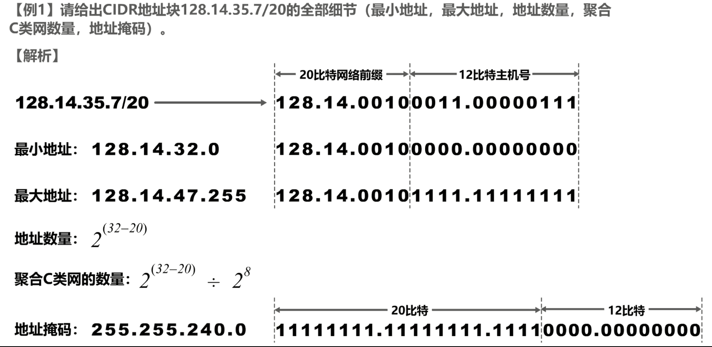
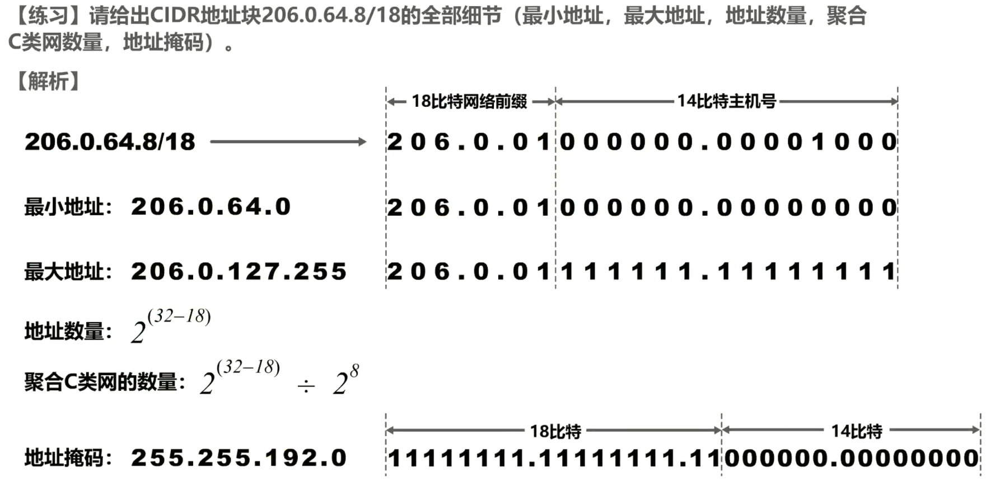
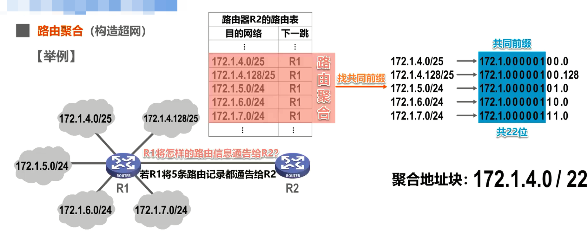
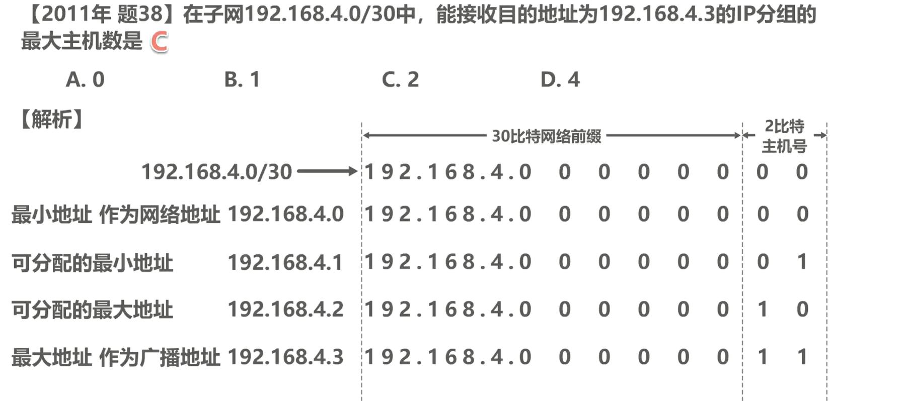
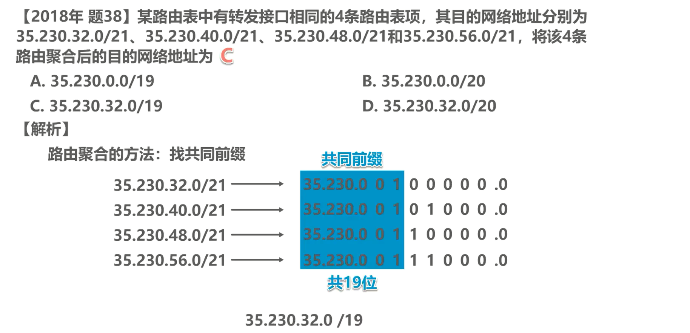
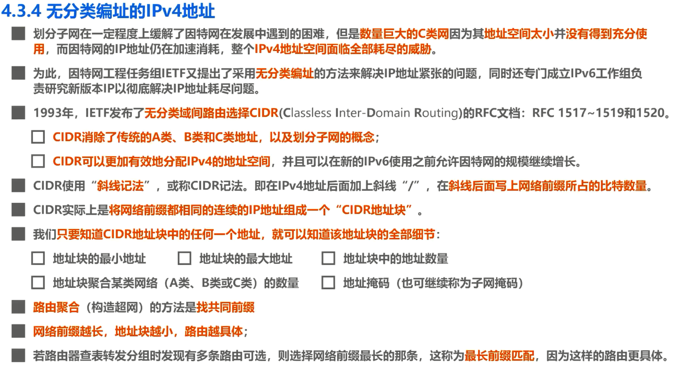

# 4-3-4 无分类编址的IPv4地址CIDR

## 无分类编址的IPv4——CIDR

- 划分子网在一定程度上缓解了因特网在发展中遇到的困难，但是**数量巨大的C类网**因为其**地址空间太小**并**没有得到充分使用**，而因特网的IP地址仍在加速消耗，整个**IPv4地址空间面临全部耗尽的威胁**。
- 为此，因特网工程任务组IETF又提出了采用**无分类编址**的方法来解决IP地址紧张的问题，同时还专门成立IPv6工作组负责研究新版本IP以彻底解决IP地址耗尽问题。
- 1993年，IETF发布了**无分类域间路由选择CIDR**(Classless Inter-Domain Routing)的RFC文档:RFC 1517~1519和1520。
- **CIDR消除了传统的A类、B类和C类地址，以及划分子网的概念**;
- **CIDR可以更加有效地分配IPv4的地址空间**，并且可以在新的IPv6使用之前允许因特网的规模继续增长。
- CIDR使用“**斜线记法**”，或称CIDR记法。即在IPv4地址后面加上斜线“/”，在**斜线后面写上网络前缀所占的比特数量**。

举例：

- CIDR实际上是**将网络前缀都相同的连续的IP地址组成一个“CIDR地址块”**。

- 我们**只要知道CIDR地址块中的任何一个地址，就可以知道该地址块的全部细节**，包括:

  - 地址块的最小地址

  - 地址块的最大地址

  - 地址块中的地址数量

  - 地址块聚合某类网络(A类、B类或C类)的数量
  
  - 地址掩码(也可继续称为子网掩码)

举例：

请给出CIDR地址块`128.14.35.7/20`的全部细节（最小地址，最大地址，地址数量，聚合C类网数量，地址掩码)。

解析：

所给地址左起第1个字节、第2个字节以及第3个字节的前4个比特，构成 20 比特的网络前缀，剩余 12 个比特为主机号。因此我们需要将该地址的第3个字节和第4个字节转换成二进制的形式。这样我们就可以很容易看出 20 比特的网络前缀和 12 比特的主机号，网络前缀为128.14.32——

**最小地址**：将 20 比特的网络前缀保持不变， 12 比特的主机号全部取0，就可以得到该地址块的最小地址，点分十进制为128.14.32.0，这也是网络地址。

**最大地址**：将 20 比特的网络前缀保持不变， 12 比特的主机号全部取1，就可以得到该地址块的最大地址点分十进制为128.14.47.255，这也是广播地址。

**地址数量**：该地址块中的地址数量为 2^(32-20)^个，因为 32 比特的 IPv4 地址中，前 20 个比特为网络前缀，剩余 12 比特为主机号，因此主机号可有2^12^个组合

**聚合C类网络数量**：聚合 C 类网的数量，用该地址块中地址数量**除以** 1 个 C 类网的地址数量 2^8^ 次方个即可得出。

**地址掩码**：地址掩码为 **20 个连续的比特 1 和 12 个连续的比特 0**，20 个连续的比特 1 用来对应网络前缀， 12 个连续的比特 0 用来对应主机号，将其写成点分十进制为255.255.240.0

## 练习

## CIDR路由聚合(构造超网)

路由聚合也称为构造超网，我们来举例说明

如图所示，路由器 R1 与 5 个网络以及路由器 R2 直接相连，路由器 R1 和 R2 互为相邻路由器，他们**周期性地通告自己所知道的路由信息给对方**。

 R1 应该将怎样的路由信息通告给R2？——如果 R1 将自己直连的这 5 个网络的路由记录都通告给R2，则 R2 的路由表会增加 5 条路由记录，如图中表格所示。

为了减少路由记录对路由表的占用，能否将这 5 条路由记录聚合成一条？——答案是肯定的，其方法是找共同前缀，也就是找出这 5 个目的网络地址的共同前缀。这 5 个目的网络地址的左起前两个字节都是相同的，从第3个字节开始不同，因此只需将第3个字节转换成二进制形式，这样就可以很容易找出这 5 个目的网络地址的共同前缀，共 22 个比特，我们将其记为斜线22，**将共同前缀保持不变，而剩余的 10 个比特全部取0，然后写成点分十进制形式放在斜线 22 的前面，这就是聚合后的地址块，也可以称为超网**，如图中所示。

通过本例我们还可以看出

- **网络前缀越长，地址块越小，路由就越具体。**

- 需要说明的是若路由器查表转发分组时发现有多条路由可选，则**选择网络前缀最长的那条**，这称为**最长前缀匹配**，因为这样的路由更具体。

## 练习

### 练习1

题目所给地址划分CIDR地址如解析所示，192.168.4.3则正号是该网络的广播地址，该网络上的所有主机都能够收到，因此能够接收此地址为目的地址的IP分组的主机有192.168.4.1~192.168.4.2，共计2台主机。

### 练习2

路由聚合找共同前缀即可

## 本节小结

