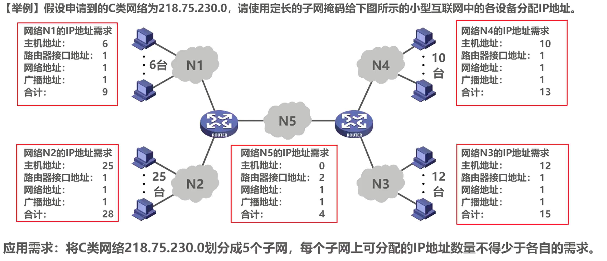
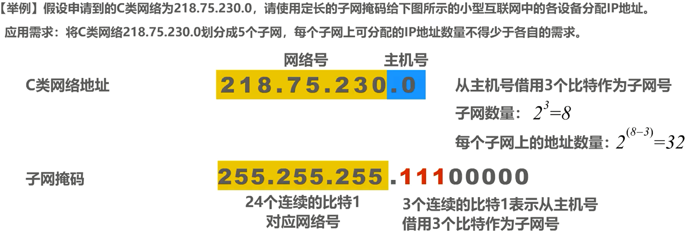
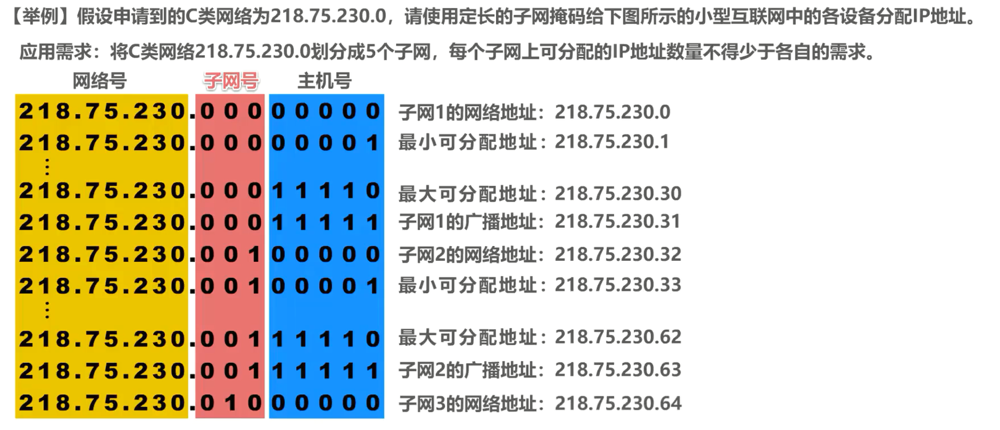
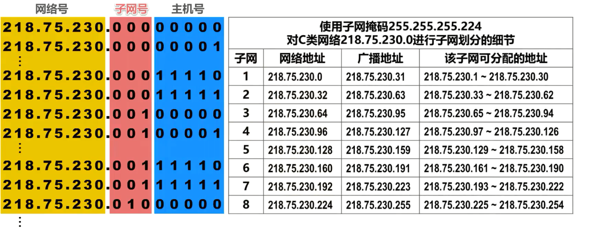
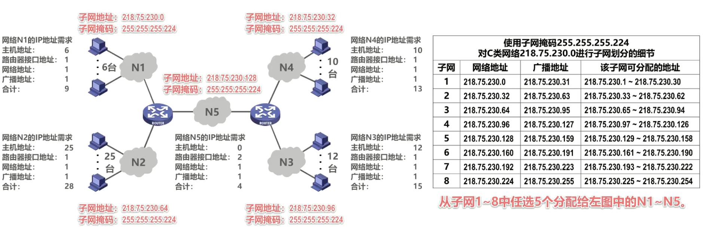
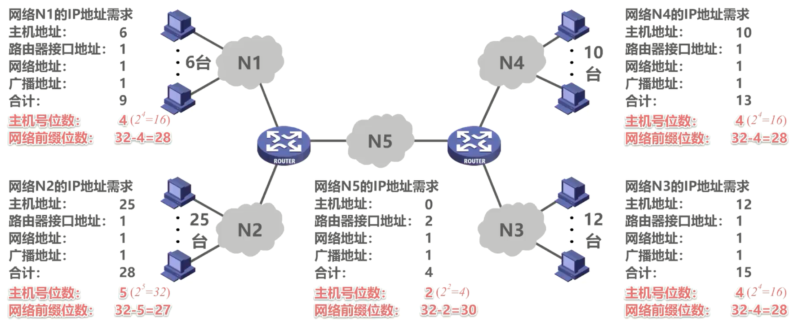
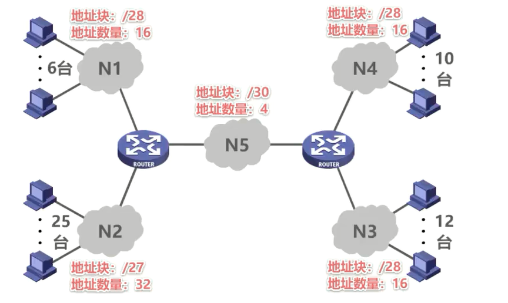
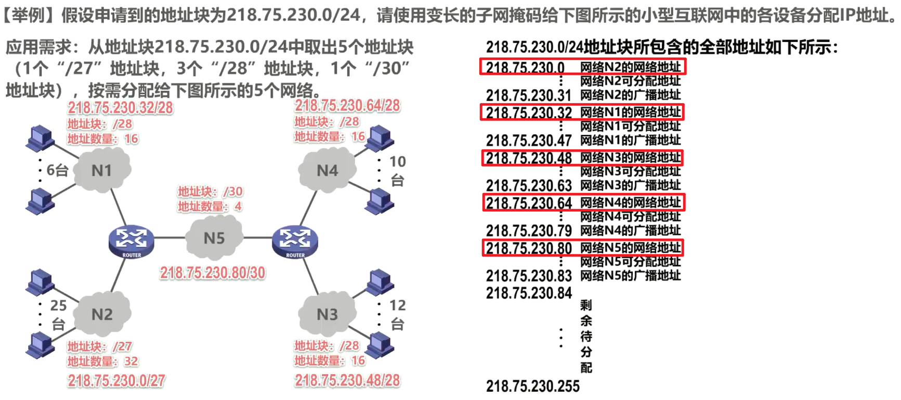
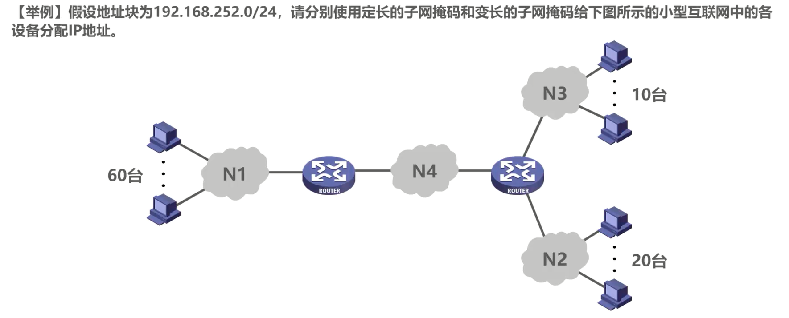

# IPv4地址的应用规划

## 定长的子网掩码和变长的子网掩码简介

本节课我们介绍 IPv 4 地址的应用规划，也就是给定一个 IPv 4 地址块，如何将其划分成几个更小的地址块，并将这些地址块分配给互联网中的不同网络，进而可以给各网络中的主机和路由器接口分配 IPv4 地址。一般有以下两种方法

**定长的子网掩码**：使用同一个子网掩码来划分子网。采用定长的子网掩码来划分子网，每个子网所分配的 IP 地址数量相同，容易造成 IP 地址浪费

**变长的子网掩码**：使用不同的子网掩码来划分子网。采用变长的子网掩码来划分子网，每个子网所分配的 IP 地址数量可以不相同，尽可能减少了对 IP 地址的浪费。

## 定长子网掩码划分子网举例

### 定长子网掩码划分子网

举例说明采用定长的子网掩码划分子网的方法

假设我们申请到了一个 C 类网络为218.75.230.0，要使用**定长的子网掩码**给图中所示的小型互联网中的各设备分配 IP 地址。

我们首先来统计一下图中各网络所需的 IP 地址数量：

- 网络 N1 的 IP 地址需求， N1 中有 6 台主机，因此主机需要的地址数量为 6 个。有一个路由器接口，因此路由器接口需要的地址数量为 1 个。再加上 N1 自身的网络地址一个和广播地址一个，总共需要 9 个 IP 地址
- 网络 N2 的 IP 地址需求， N2 中有 25 台主机，因此主机需要的地址数量为 25 个，有一个路由器接口，因此路由器接口需要的地址数量为一个，再加上 N2 自身的网络地址一个和广播地址 1 个，总共需要 28 个 IP 地址。
- 同理可以统计出网络 N3 和 N4 各自所需的 IP 地址数量，我们就不再赘述了。
- **注意**，我们可将图中两个路由器之间的这段链路看成是**网络N5**，其中没有主机，因此主机需要的地址数量为0。有两个路由器接口，因此路由器接口需要的地址数量为 2 个，再加上 N5 自身的网络地址一个和广播地址一个，总共需要 4 个 IP 地址

这样我们就可得到本地的应用需求。也就是将 C 类网络218.75.230.0划分成 5 个子网，每个子网上可分配的 IP 地址数量不得少于各自的需求。因此，需要从主机号部分借用 3 个比特作为子网号(2^3 = 8 > 5)，可以满足我们对子网数量的要求。而每个子网上的地址数量为 2 ^( 8- 3) 次个，也就是 32 个，可以满足我们对子网上 IP 地址数量的要求。

这样我们就可以得出划分子网所需的子网掩码，即用三个十进制数 255 来对应网络号部分，也就是用 24 个连续的比特 1 来对应网络号，而**最后 8 个比特为111000000**，其中 3 个连续的比特 1 表示从主机号部分借用 3 个比特作为子网号，将这巴比特写成十进制数为224。

### 划分子网的细节

划分子网的细节，这是 24 比特网络号部分，这是从主机号部分借用的 3 比特作为子网号部分，这是剩余的 5 比特主机号部分

- 子网1

  - 子网 1 的网络地址：主机号全0

  - 子网1的广播地址：将网络号和子网号保持不变，主机号从 5 个比特 0 增长到 5 个比特1

  - 子网 1 上可分配给主机或路由器接口的最小地址：比子网 1 的网络地址大一的地址

  - 子网1上可分配给主机或路由器接口的最大地址：比子网1的广播地址小1的地址

- 子网2
  - 子网 2 的网络地址：比子网 1 的广播地址大一的地址
  - 子网2的广播地址：将网络号和子网号保持不变，主机号从 5 个比特 0 增长到 5 个比特1
  - 子网2上可分配给主机或路由器接口的最小地址：比子网 2 的网络地址大1的地址
  - 网 2 上可分配给主机或路由器接口的最大地址：比子网2的广播地址小一的地址子
- 子网3
  - 子网 3 的网络地址：比子网 2 的广播地址大一的地址
  - ……

以此类推，我们可以得到划分子网的全部细节。

现在我们就可以从子网 1- 8 中任选 5 个分配给图中的网络 N1 到N5。

通过本例可以看出，采用定长的子网掩码进行子网划分，只能划分出 2 的 n 次方个子网，其中 n 是从主机号部分借用的用来作为子网号的比特数量。

每个子网所分配的 IP 地址数量相同，容易造成 IP 地址的浪费。例如图中的网络 5 只需要 4 个 IP 地址，但是我们只能给他分配 32 个 IP 地址，这样就造成了 IP 地址的严重浪费。

## 变长子网掩码划分子网举例

### 变长子网掩码划分子网

接下来我们举例说明采用变长的子网掩码划分子网的方法。

本例与之前的例子基本一样，只是划分子网的方法改为采用变长的子网掩码。

网络 N1 需要 9 个地址，那么分配给网络 N1 的地址的主机号应为 4 个比特，因为 2 的 4 次方等于16，这样网络 N1 就可有 16 个地址。由于使用 4 个比特作为主机号，因此剩余 28 个比特可作为网络前缀。

网络 N2 需要 28 个地址，那么分配给网络 N2 的地址的主机号应该为 5 个比特，因为 2 的 5 次方等于32，这样网络 N2 就可有 32 个地址。由于使用 5 个比特作为主机号，因此剩余 27 个比特可作为网络前缀。

…………

同理可得出分配给网络N3、N4、 N5 的地址中的主机号所占比特数量和网络前缀所占比特数量，如下图所示

我们将所得出的各网络所需地址块的大小标注在他们各自的旁边，这样我们就可得到本立的应用需求，也就是**从地址块218.75.230.0/24中取出 5 个地址块(1个/27地址块，3个/28地址块，1个/30地址块)，按需分配给图中所示的 5 个网络**。

218.75.230.0/24地址块所包含的全部地址如下所示，我们需要在该地址块中给图中所示的网络 N1 到 N5 分配子块。

**分配的原则：每个子块的起点位置不能随意选取，只能选取块大小整数倍的地址作为起点，建议大家先给大的子块进行分配。**

将0~31这 32 个地址作为一个地址块分配给网络 N2 。地址块中最小的地址就是 N2 的网络地址，最大的地址就是 N2 的广播地址。网络地址和广播地址之间的这些地址可分配给 N2 中的主机或路由器接口。我们将网络 N2 所分配到的地址块标注在它的旁边

将32~47这 16 个地址作为一个地址块分配给网络N1，地址块中最小的地址就是 N1 的网络地址，最大的地址就是 N1 的广播地址。网络地址和广播地址之间的这些地址可分配给 N1 中的主机或路由器接口。我们将网络 N1 所分配到的地址块标注在它的旁边。

将47~63这 16 个地址作为一个地址块分配给网络N3，地址块中最小的地址就是 N3 的网络地址，最大的地址就是 N3 的广播地址。网络地址和广播地址之间的这些地址可分配给 N3 中的主机或路由器接口。我们将网络 N3 所分配到的地址块标注在它的旁边。

将64~79这 16 个地址作为一个地址块分配给网络N4，地址块中最小的地址就是 N4 的网络地址，最大的地址就是 N4 的广播地址。网络地址和广播地址之间的这些地址可分配给 N4 中的主机或路由器接口。我们将网络 N4 所分配到的地址块标注在他的旁边。

将80~83这 4 个地址作为一个地址块分配给网络N5。地址块中最小的地址就是 N5 的网络地址，最大的地址就是 N5 的广播地址。网络地址和广播地址之间的这些地址可分配给 N5 中的主机或路由器接口。我们将网络 N5 所分配到的地址块标注在它的旁边。

原地址块中还剩余这些地址，可以留作今后分配，分配结果如下图所示。

通过本例可以看出，采用变长的子网掩码进行子网划分，可以按需划分出相应数量的子网，每个子网所分配到的 IP 地址数量可以不相同，尽可能减少了对 IP 地址的浪费。例如图中的网络 5 只需要 4 个 IP 地址，我们也非常精确地给它分配了 4 个 IP 地址，没有造成 IP 地址的浪费。

最后，请同学们参照本节课所介绍的两个例子，完成下面这道习题。本题的答案并不唯一。

## 本节小结

