# 4-4 IP数据报的发送和转发过程

本节课我们介绍 IP 数据报的发送和转发过程。 

IP 数据报的发送和转发过程包含以下两部分

- 主机发送 IP 数据报

- 路由器转发 IP 数据报

需要说明的是，为了将重点放在 TCP/IP 协议栈的网际层发送和转发 IP 数据报的过程上，在本节课的举例中，我们将**忽略使用 ARP 协议来获取目的主机或路由器接口的MAC地址的过程，以及以太网交换机自学习和转发帧的过程**。下面我们就来举例说明 IP 数据报的发送和转发过程。

## 举例说明 IP 数据报的发送和转发过程

在下图所示的小型互联网中，路由器 R 的接口 0 直连了一个**交换式以太网**；接口 1 也直连了一个交换式以太网。

我们给该网络分配了图中所示的网络地址和子网掩码，给网络中的各主机和路由器的接口配置了相应的 IP 地址和子网掩码。

我们给另一个网络分配了图中所示的网络地址和子网掩码，给网络中的各主机和路由器的接口配置了相应的 IP地址和子网掩码。

**(这是对于一个192.168.0.0的C类地址块，借用主机号中的1位用来划分子网，所产生的的2个子网)**

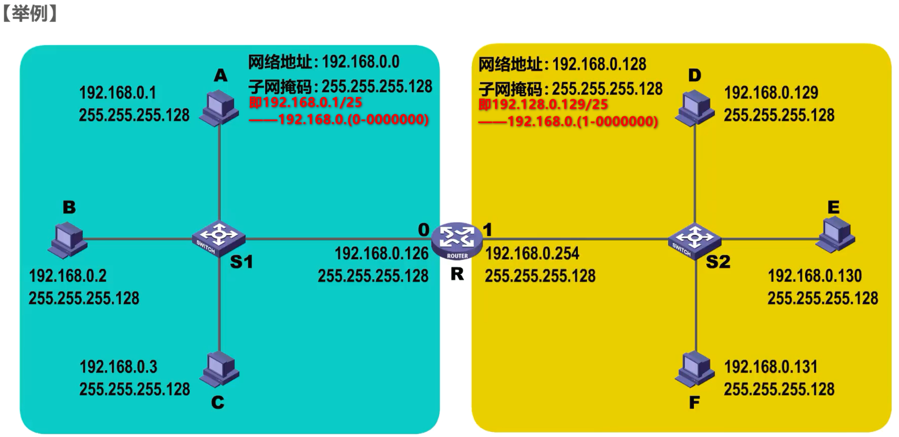

### 直接交付和间接交付

**直接交付**：同一个网络中的主机之间可以直接通信，这属于直接交付。

**间接交付**：不同网络中的主机之间的通信需要通过路由器来中转，这属于间接交付。

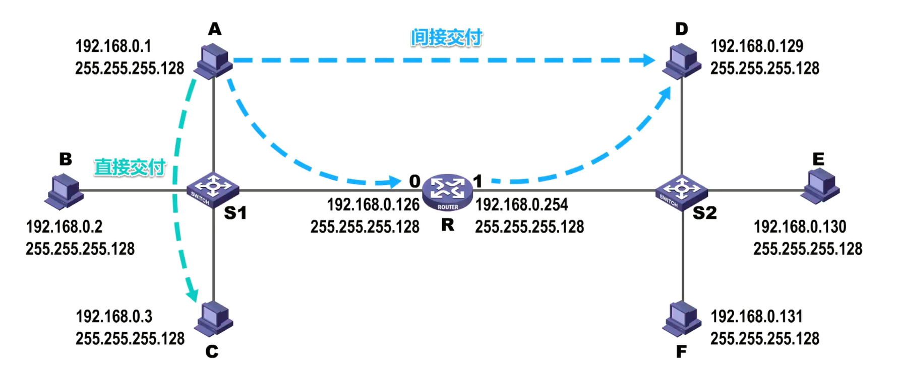

### 源主机如何判断出目的主机是否与自己在同一个网络中？

源主机如何判断出目的主机是否与自己在同一个网络中？——举例说明，假设主机 C 要给主机 F 发送 IP 数据报，主机 C 将自己的 IP 地址和子网掩码相与，就可以得到主机C所在网络的网络地址。既然主机 C 要给主机 F 发送 IP 数据报，那主机 C 肯定知道主机 F 的 IP 地址，否则就没法发送了。主机 C 将主机 F 的 IP 地址与自己的子网掩码相与，就可得到目的网络地址，该地址与主机 C 的网络地址不相等。因此，主机 C 就知道了主机 F 与自己不在同一个网络，它们之间的通信属于间接交付。主机 C 需要将 IP 数据报传输给路由器，由路由器将 IP 数据报转发给主机F。

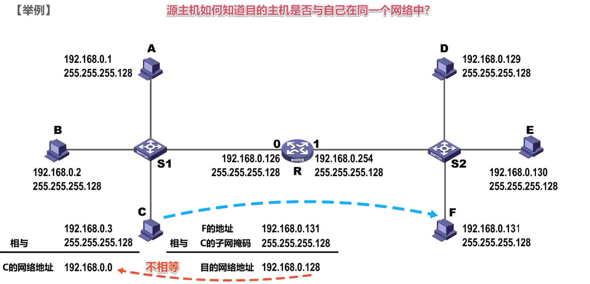

### 主机 C 如何知道应该把 IP 数据报交给哪个路由器进行转发？

主机 C 又是如何知道应该把 IP 数据报交给哪个路由器进行转发呢？——实际上，用户为了让本网络中的主机能和其他网络中的主机进行通信，就必须给其指定本网络中的一个路由器，由该路由器帮忙进行转发，所指定的路由器也被称为**默认网关**。

对于本例，我们可以将路由器接口 0 的 IP 地址指定给该接口所直连网络中的各个主机作为默认网关。同理，可将路由器接口 1 的 IP 地址指定给该接口所直连网络中的各个主机作为默认网关。

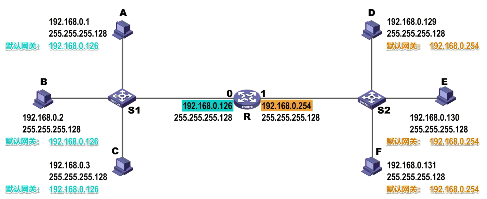

这样，当本网络中的主机要和其他网络中的主机进行通信时，会将 IP 数据报传输给默认网关，由默认网关帮主机将 IP 数据报转发出去。假设本例中的主机 A 要给主机 D 发送 IP 数据报，这属于间接交付，主机 A 会将该 IP 数据报传输给自己的默认网关，也就是图中所示的路由器R。

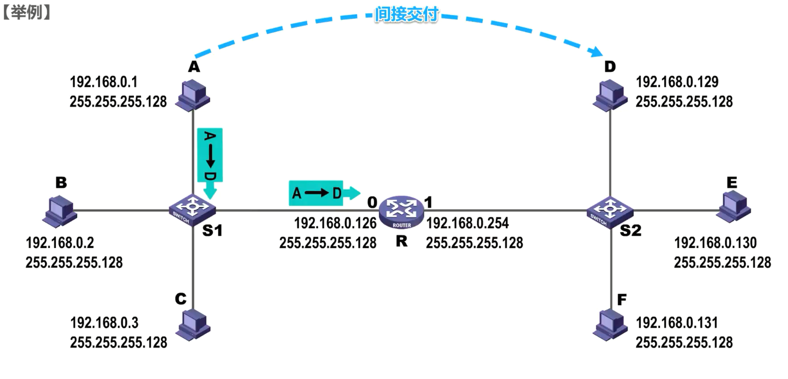

### 当路由器收到 IP 数据报后如何转发？

当路由器收到 IP 数据报后又是如何转发的？

1. 路由器首先会检查 IP 数据报的首部是否出错——若出错则丢弃该 IP 数据报并通告原主机；若没有出错，则进行转发。

2. 路由器根据 IP 数据报首部中的目的地址，在自己的路由表中查找匹配的路由条目，若找到匹配的路由条目，则转发给路由条目中指示的下一跳，若找不到，则丢弃该 IP 数据报并通告源主机。

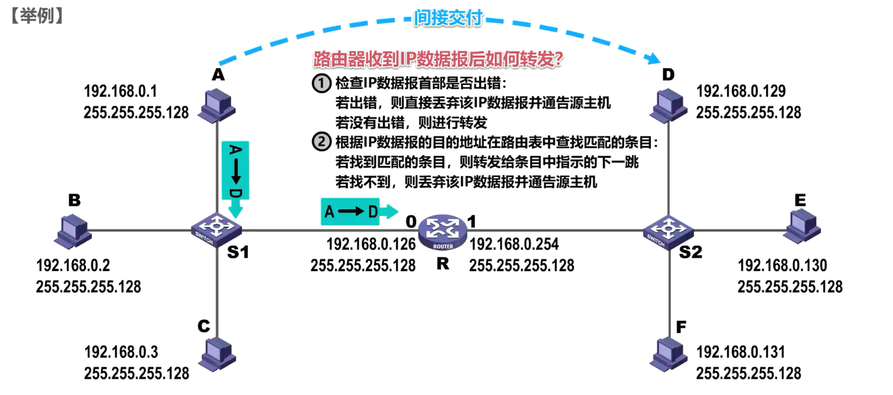

为了简单起见，我们假设本例中的 IP 数据报首部没有出现差错，路由器取出 IP 数据报首部各地址字段的值，源地址字段的值为主机 A 的 IP 地址，目的地址字段的值为主机D的 IP 地址。

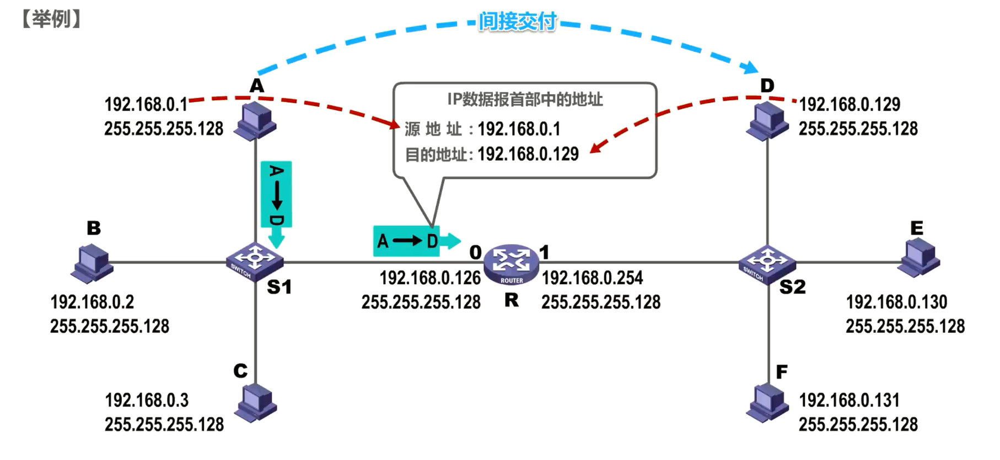

接下来，路由器就要对该 IP 数据报进行查表转发了，这是路由器的路由表。**当我们给路由器的接口配置 IP 地址和子网掩码时，路由器就知道了自己的该接口与哪个网络是直连的**。

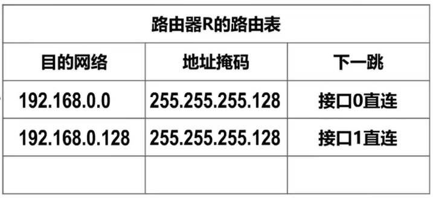

例如在本例中，接口 0 所直连的网络是192.168.0.0，相应的地址掩码为255.255.255.128，不需要下一跳路由器，因为接口 0 与该网络是直连的。

接口1所直连的网络是192.168.0.128，相应的地址掩码为255.255.255.128，不需要下一跳路由器，因为接口 1 与该网络是直连的。

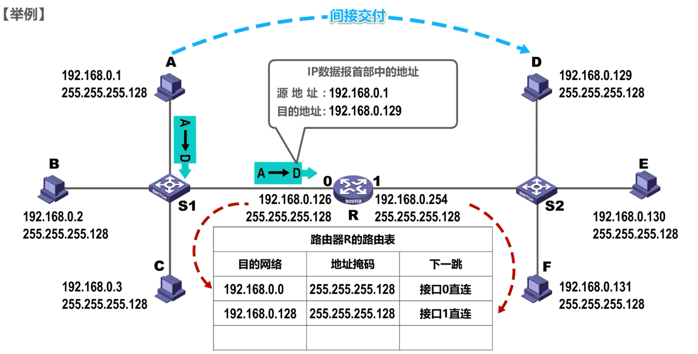

需要说明的是，路由表中可能还会有其他路由条目

- **静态路由**：用户或网络管理员手工配置的静态路由
- **动态路由**：路由器使用路由协议自动获取到的动态路由

我们将在后续课程中详细介绍这部分内容。

接下来，路由器根据 IP 数据报的目的地址，在自己的路由表中查找匹配的路由条目，逐条检查路由条目，**将目的地址与路由条目中的地址掩码相与得到目的网络地址，该目的网络地址与路由条目中的目的网络地址不相同，则这条路由条目不匹配。再检查下一条路由条目，将目的地址与下一条路由条目中的地址掩码相与得到目的网络地址，该目的网络地址与路由条目中的目的网络地址相同，则这条路由条目就是匹配的路由条目。**

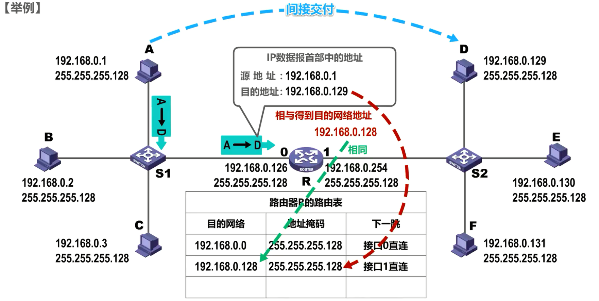

按照它的下一跳指示，也就是从接口 1 转发该 IP 数据报，这样主机D就可以收到路由器转发来的该 IP 数据报。

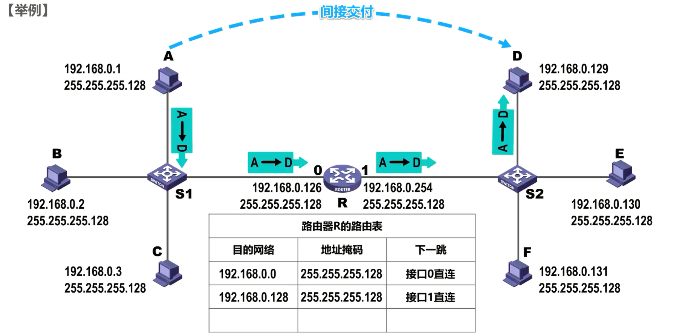

需要说明的是，我们这里所介绍的路由器查表转发 IP 数据报的过程，只是为了让同学们理解其最基本的工作原理，在*路由器的实际研发过程中，需要设计很好的数据结构，以便提高查找速度*。

## 路由器隔离广播域：不转发目的地址为本网络/其他网络广播地址的IP数据报

### 路由器不转发目的地址为本网络的广播地址的IP数据报

再来看这种情况，假设主机 A 给本网络上的各设备发送了一个广播 IP 数据报，在数据报首部中的目的地址字段可以填写的目的地址为192.168.0.127，这是本网络的广播地址，也可以填写255.255.255.255，这是受限的广播地址。

该网络中的各设备都会收到该广播 IP 数据报，但是**路由器收到后并不会转发该数据报，也就是说路由器是隔离广播域的**，这是很有必要的。试想一下，如果英特网中数量巨大的路由器收到广播 IP 数据报后都进行转发，则会造成巨大的广播风暴，严重浪费英特网资源。

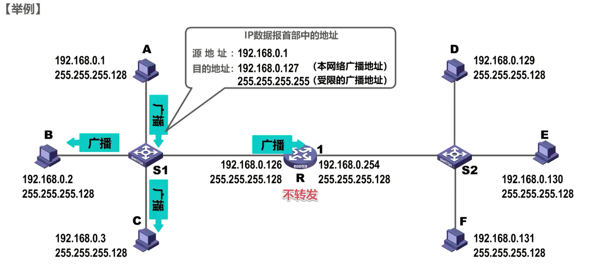

### 路由器不转发目的地址为其他网络的广播地址的IP数据报

同理，主机 A 给另一个网络发送广播 IP 数据报，在数据报首部中的目的地址字段填写的目的地址为192.168.0.255，这是网络192.168.0.128的广播地址。主机 A 将该广播 IP 数据报传输给路由器，希望由路由器帮其转发，但路由器判断出这是广播 IP 数据报，不会转发。

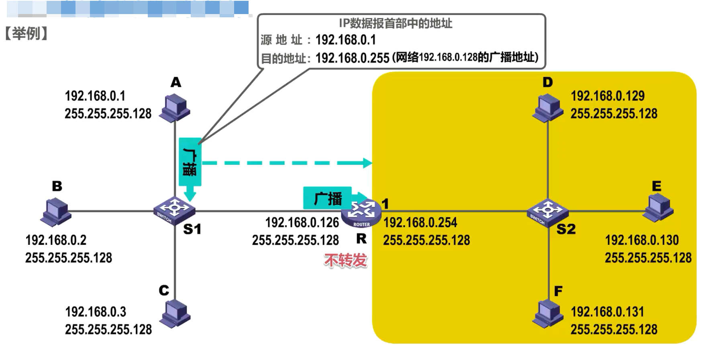

## 练习

### 练习1：冲突域和广播域

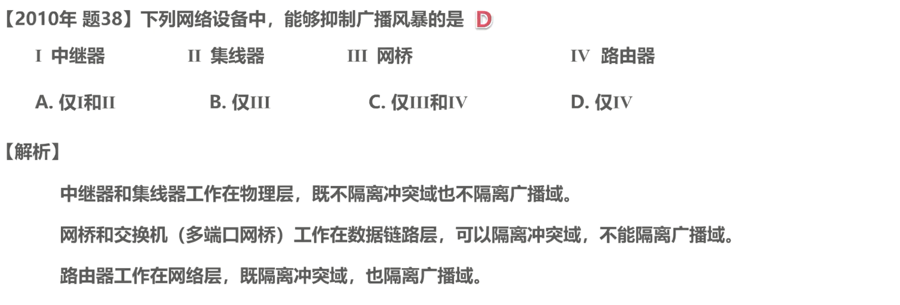

解析：**——冲突域和广播域**

- **中继器和集线器工作在物理层，既不隔离冲突域，也不隔离广播域。**

- **网桥和交换机工作在数据链路层，可以隔离冲突域，不能隔离广播域**

- **路由器工作在网络层，既隔离冲突域也隔离广播域。**

因此本题的答案是选项D。

### 练习2

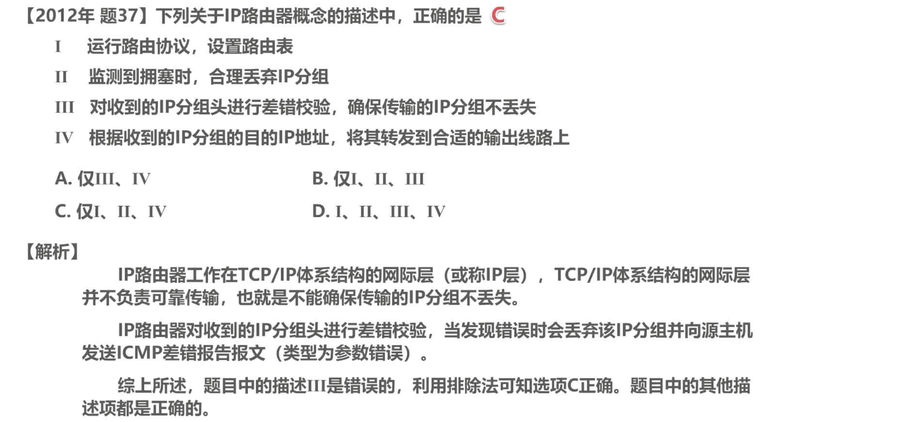

解析：

IP 路由器工作在 TCP/IP 体系结构的网际层，并**不负责可靠传输**，也就是不能确保传输的 IP 分组不丢失。 IP 路由器对收到的 IP 分组头进行差错校验，当发现错误时，会丢弃该 IP 分组，并向源主机发送ICMP 差错报告报文。综上所述，题目中的描述三是错误的，利用排除法可知选项 C 正确，题目中的其他描述项都是正确的。

### 练习3

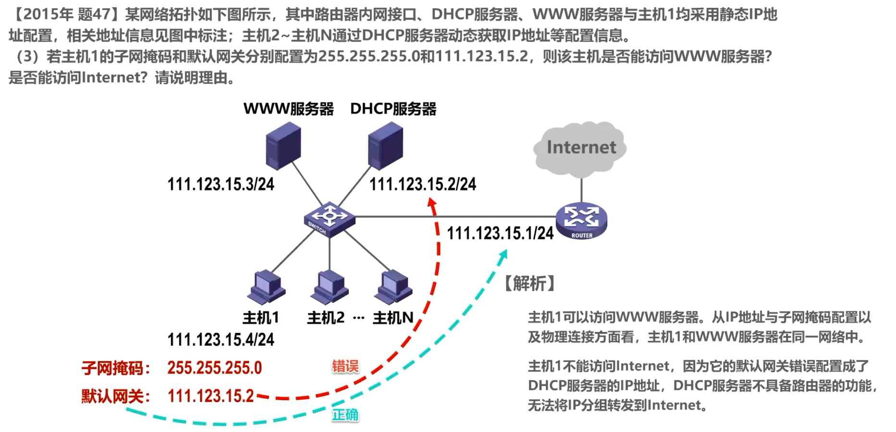

解析：我们将题目所给的主机 1 的配置信息标注在他的旁边。从子网掩码和主机 1 的 IP 地址的CIDR表示方法都可以看出，网络前缀为 24 个比特，而 WWW 服务器的 IP 地址的网络前缀也是 24 个比特，并且与主机 1 的网络前缀相同，因此主机 1 可以访问 WWW 服务器，因为从 IP 地址配置以及物理连接方面看，主机 1 和 WWW 服务器在同一网络中。

但是主机 1 不能访问Internet，因为它的**默认网关错误的配置成了 DHCP 服务器的 IP 地址， DHCP 服务器不具备路由器的功能**，无法将 IP 分组转发到Internet。如图所示，主机 1 的默认网关错误的指定为了 DHCP 服务器的 IP 地址，正确的配置应该指定为路由器该接口的 IP 地址。

## 本节小结

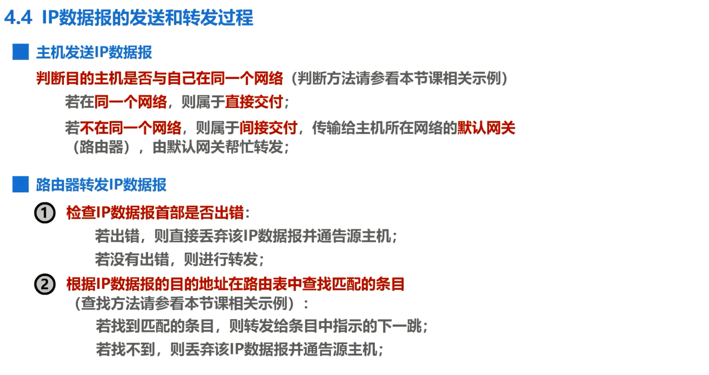

