# 4-5 静态路由配置及其可能产生的路由环路问题

本节课我们介绍静态路由配置及其可能产生的路由环路问题。

## 静态路由配置

**静态路由配置**：静态路由配置是指用户或网络管理员使用路由器的相关命令，给路由器**人工配置路由表**。

- 这种人工配置方式简单，开销小，但不能及时适应网络状态(拓扑、流量等)的变化
- 一般只在小规模网络中采用
- 使用静态路由配置可能出现以下**导致产生路由环路**的错误，
  - 配置错误
  - 聚合不存在的网络
  - 网络故障

### 举例说明静态路由配置

接下来我们首先举例说明静态路由配置，我们采用如图所示的网络拓扑和相应的 IP 地址配置

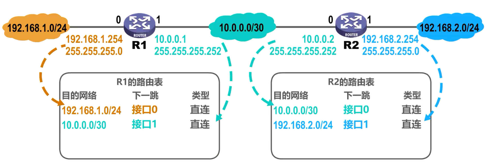

对于路由器 R1 的路由表，路由器 R1 通过自己的接口 0 所配置的 **IP 地址**和**地址掩码**可以自动得出接口 0 所在的网络。由于接口 0 与该网络直连，则下一跳不是一个路由器地址，而是通过接口 0 转发 IP 数据报给该网络中的某个主机，这属于**直接交付**这条自动得出的路由条目的类型，属于**直连路由**。同理， R1 还可自行得出接口 1 的直连网络路由条目。对于R2 的路由表，同理可知其接口 0 的直连网络路由条目，以及其接口 1 的直连网络路由条目。

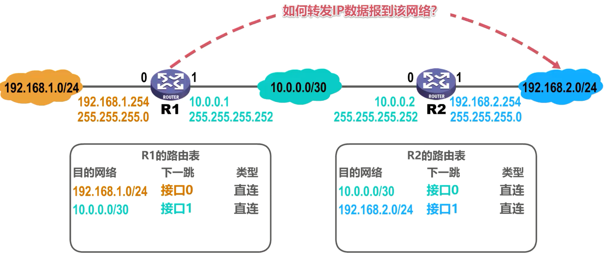

假设 R1 要转发一个 IP 数据报给该网络中的某个主机，从图中可以看出， R1 应该将该 IP 数据报转发给路由器 R2 的接口0，但 R1 的路由表中并没有关于该目的网络的路由条目。换句话说， R1 并不知道目的网络的存在。因此我们可以**使用路由器的相关配置命令给 R1 添加一条到达该目的网络的路由条目**，这是该目的网络的地址，下一跳为路由器 R2 的接口 0 的地址。该路由条目是我们人工配置的静态路由。

**笔者注：路由表中，非直连网络下一跳的路由器IP地址一定在本路由器某接口的直连网络下，比如下面配置的静态路由条目，10.0.0.2是在接口1的直连网络10.0.0.0/0下**

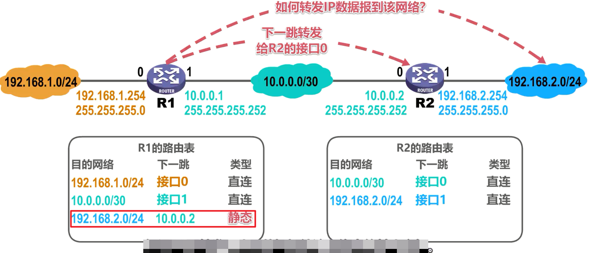

假设 R2 要转发一个 IP 数据报给该网络中的某个主机，从图中可以看出， R2 应该将该 IP 数据报转发给路由器 R1 的接口1，但 R2的路由表中并没有关于该目的网络的路由条目，因此我们可以给 R2 添加一条到达该目的网络的路由条目，第一列为目的网络的地址，下一跳为路由器 R1 的接口 1 的地址，类型为静态。

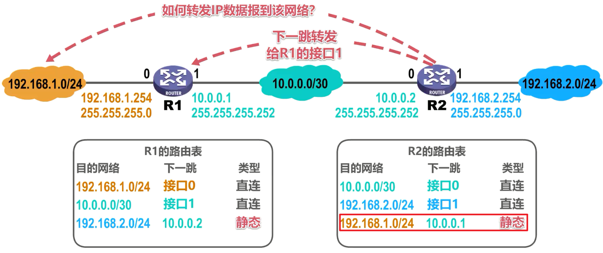

## 特殊的静态路由条目

### 默认路由

举例说明默认路由概念，假设路由器 R2 的接口 2 连接到了因特网，这是路由器 R1 的路由表，这是其接口 0 的直连网络路由条目，这是其接口 1 的直连网络路由条目，这是我们人工配置的到达该目的网络的静态路由。

假设 R1 要转发一个 IP 数据报给因特网中某个网络中的某个主机，从图中可以看出， R1 应该将该 IP 数据报转发给路由器 R2 的接口0。由于**因特网中包含了众多的网络**，如果我们给 R1 添加针对这些网络的每一条路由条目，则会给人工配置带来巨大的工作量，并且使 R1 的路由表变得非常大，降低了查表转发的速度。

实际上，对于具有**相同下一跳的不同目的网络**的路由条目，我们可以用**一条默认路由**条目来替代。

默认路由条目中

- 目的网络地址为0.0.0.0
- 地址掩码也为0

其CIDR形式为0.0.0.0/0

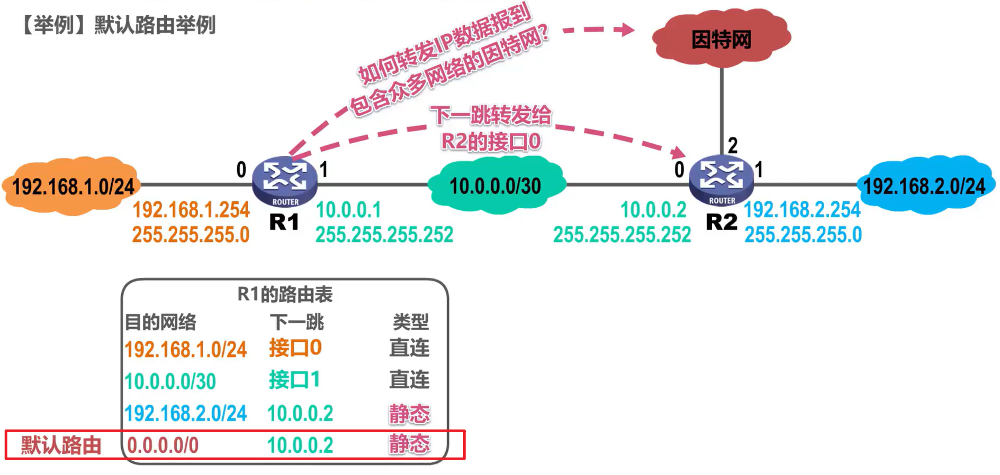

对于本例，默认路由条目中的下一跳是路由器 R2 的接口 0 的地址，由于默认路由也是由我们人工配置的，因此其类型也是静态。

在配置了默认路由条目后，我们甚至可以删除这条路由条目。

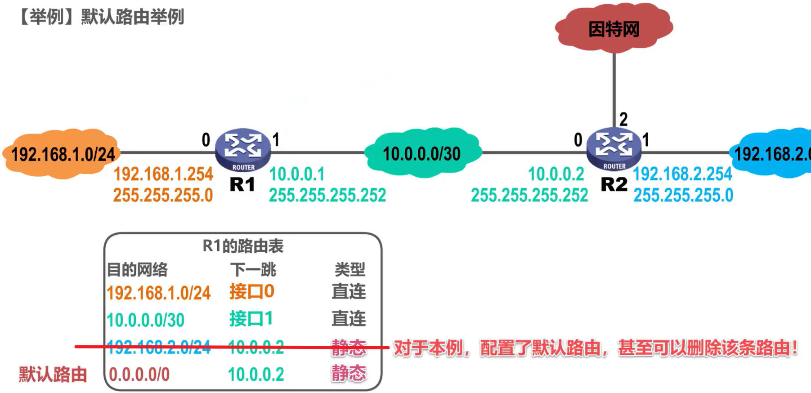

### 特定主机路由

举例说明特定主机路由的概念，有时候我们可以给路由器添加**针对某个主机**的特定主机路由条目，一般用于网络管理人员对网络的管理和测试。另外，在需要考虑某种安全问题时，也可以采用特定主题路由。

假设这是该网络中的某台特定主机，我们可以在 R1 的路由表中添加一条到达该主机的特定主机路由条目。

- 网络地址：特定主机路由条目中的目的网络地址为**该特定主机的 IP 地址**

- 地址掩码：地址掩码为255.255.255.255

其CIDR形式为特定主机 IP 地址/32。

对于本例，特定主机路由条目中的下一跳是路由器 R2 的接口 0 的地址，由于特定主机路由也是由我们人工配置的，因此其类型也是静态。

可以看出

- **特定主机路由的目的网络前缀最长**，路由最**具体**。

- **默认路由的目的网络前缀最短**，路由最**模糊**。

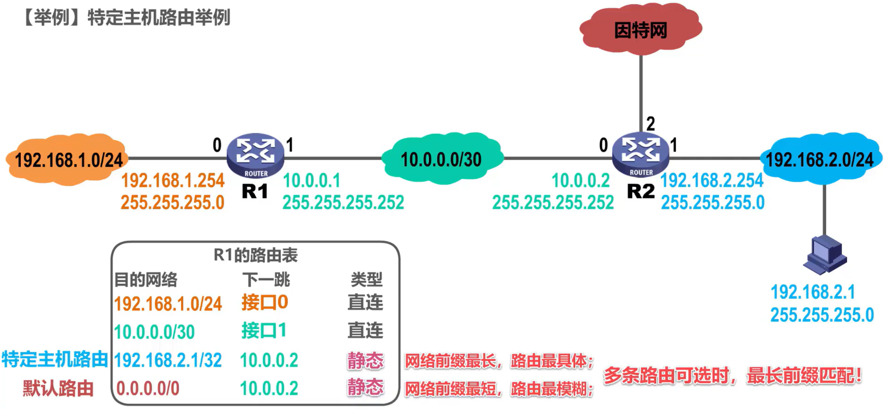

当路由器查表转发 IP 数据报时，若有多条路由条目可选，则采用**最长前缀匹配的原则**，选用目的网络前缀最长的那个路由条目进行转发。

### 黑洞路由

见于下文距离说明

## 静态路由配置可能导致的环路问题

接下来我们举例说明静态路由配置错误可能导致的路由环路问题。

如图所示，这是各路由器自动得出的直连网络，这是我们给各路由器人工配置的静态路由。

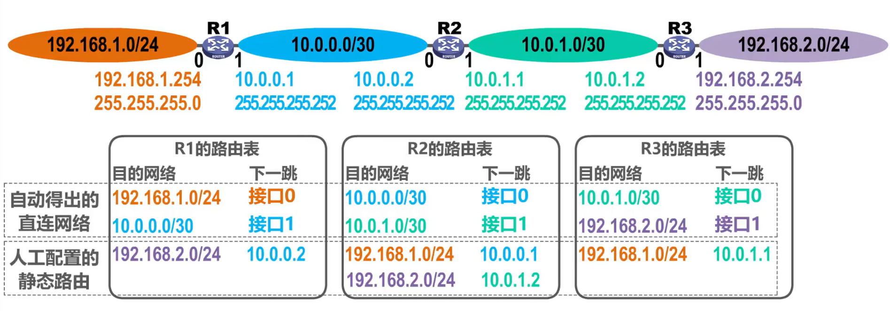

我们来看看路由器 R2中的这条人工配置的静态路由条目，它表明 R2 要转发 IP 数据报到该网络，下一跳应转发给 R1 的接口一

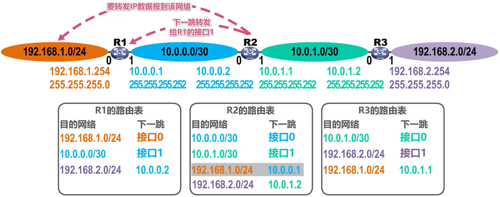

假设我们将下一条错误的配置成了该地址，也就是错误地指向了 R3 的接口0

则当 R2 要转发 IP 数据报到该网络时，下一跳会错误的转发给路由器 R3 的接口0。

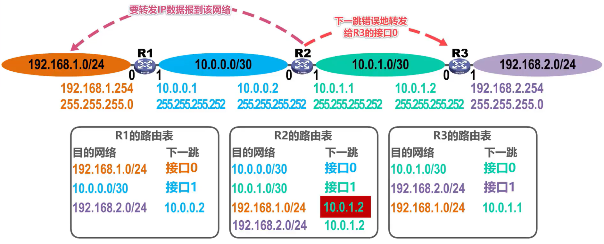

R3 收到该 IP 数据报后进行查表转发，找到了匹配的路由条目，下一跳应该转发给该地址，也就是转发给R2的接口一。 R2 收到该 IP 数据报后，进行查表转发，找到了匹配的路由条目，下一跳应该转发给该地址，也就是转发给 R3 的接口0。

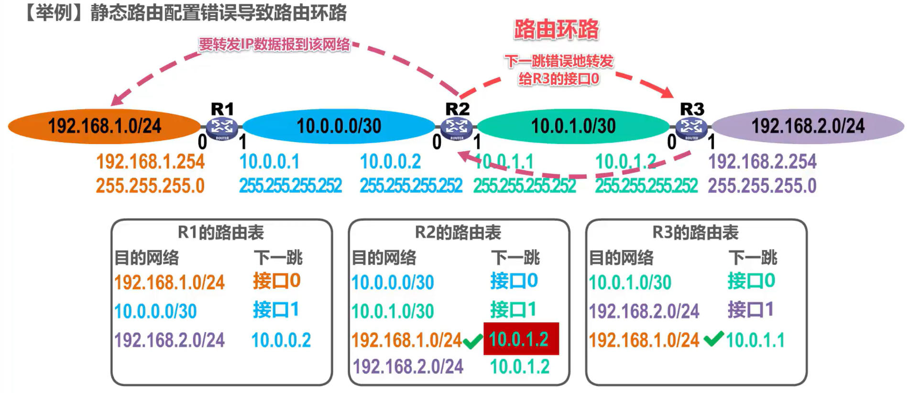

很显然，由于我们静态路由配置错误，导致 R2 和 R3 之间产生了路由环落。为了防止IP数据报在路由环路中永久兜圈，在IP数据报首部设有**生存时间TTL字段**， IP 数据报进入路由器后， TTL 字段的值被路由器减1，若 TTL 字段的值减 1 后不等于0，则被路由器转发，否则被丢弃。

## 静态路由聚合不存在的网络导致路由环路
我们再来举例说明聚合了不存在的网络可能导致的路由环路问题。

这是路由器 R1 的路由表

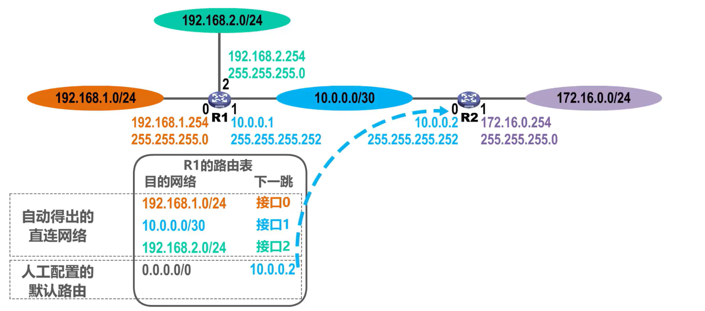

这是其自动得出的直连网络，这是我们给其人工配置的默认路由，下一跳指向路由器 R2 的接口0。

下面是路由器 R2 的路由表

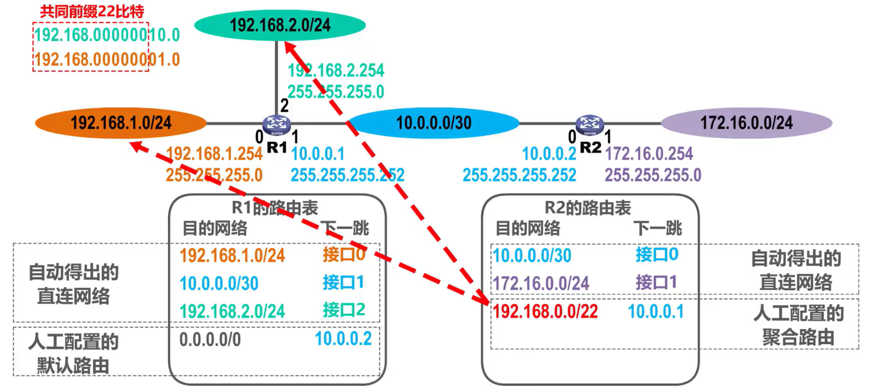

这是其自动得出的直连网络，这是我们给其人工配置的一条聚合路由，它是由这两个网络地址聚合而来的。具体方法就是找这两个网络地址的共同前缀，然后将共同前缀保持不变，将剩余比特全部取0，写成点分十进制形式，在其后面写上斜线，斜线后面写上共同前缀的数量。

假设 R2 要转发 IP 数据报到该网络192.168.2.0/24，进行查表转发，找到了匹配的路由条目，下一跳应该转发给该地址，也就是转发给 R1 的接口1。R 1 收到该 IP 数据报后，进行查表转发，找到了匹配的路由条目，下一跳是通过接口 2 直接交付。

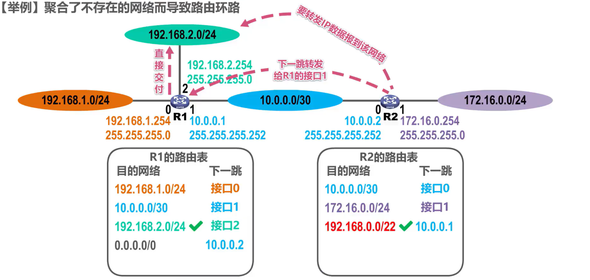

我们再来看看这条聚合路由的细节，它实际上包含了以下 4 个网络，该网络存在于我们的网络拓扑中，该网络也存在于我们的网络拓扑中，而该网络不存在，该网络也不存在。

当R2要转发 IP 数据报到这个不存在的网络192.168.3.0/24时，进行查表转发，找到了匹配的路由条目，下一跳应该转发给该地址，也就是转发给 R1 的接口1。但**对于这个不存在的网络路由器 R2 应该不予转发**，却错把它转发给了路由器R1，而一收到该 IP 数据报后进行查表，转发只能走默认路由，下一跳应该转发给该地址，也就是转发给 R2 的接口0。

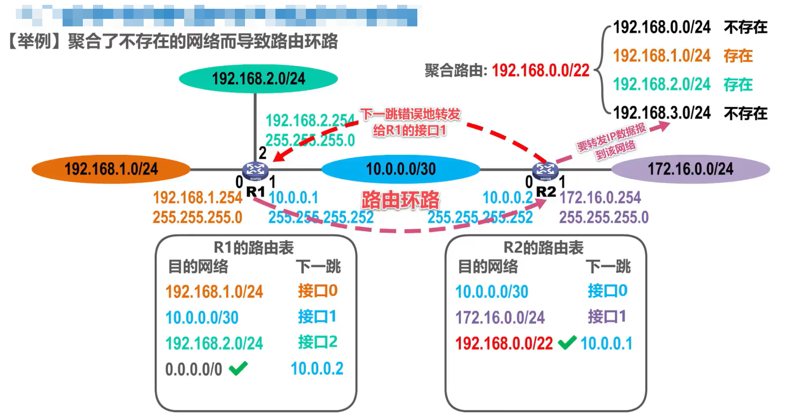

很显然， R1 和 R2 之间产生了路由环路

针对这种情况，我们可以在 R2 的路由表中添加**针对所聚合的不存在的网络的黑洞路由**。黑洞路由的吓一跳为null0，这是路由器内部的虚拟接口，可以把它形象的看成是一个黑洞 ，IP 数据报进入它后就有去无回了，也就是路由器丢弃了该 IP 数据报，而不是转发该 IP 数据报。

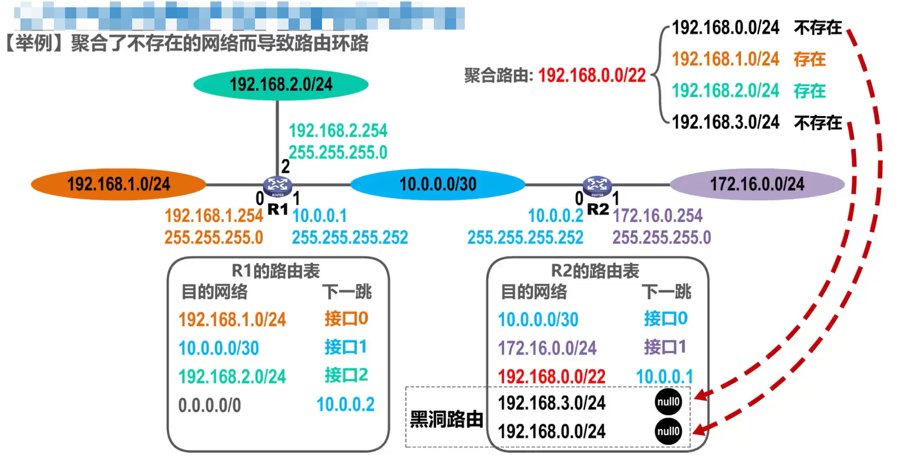

现在假设R2要转发 IP 数据报到这个不存在的网络，进行查表转发，找到了两条可选的路由条目，根据最长前缀匹配的原则，将会选择这条到达该不存在网络的黑洞路由，下一跳为虚拟接口null0，因此该 IP 数据报会进入这个黑洞。

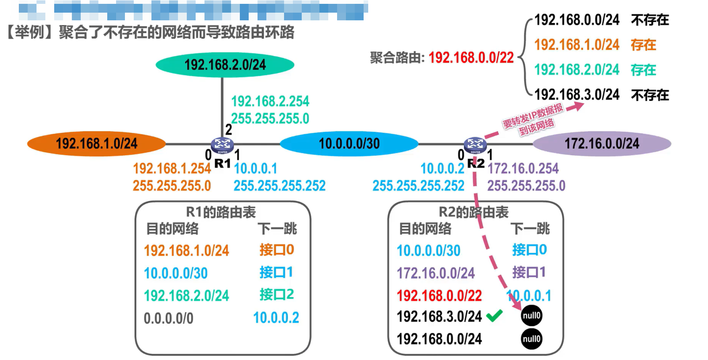

## 网络故障可能导致的路由环路

举例说明网络故障可能导致的路由环路问题。假设路由器 R1 检测到其接口0所直连的网络出现了故障而不可达，就会自动在其路由表中删除该直连网络的路由条目。

之后R2要转发 IP 数据报到该网络，进行查表转发，找到匹配的路由条目，下一跳应该转发给该地址，也就是转发给 R1 的接口1，R1收到该 IP 数据报后，进行查表转发，找不到该 IP 数据报的目的网络的相关路由条目，只能走默认路由，下一跳应该转发给该地址，也就是转发给 R2 的接口0，这样就将该 IP 数据报错误的转发给了R2。

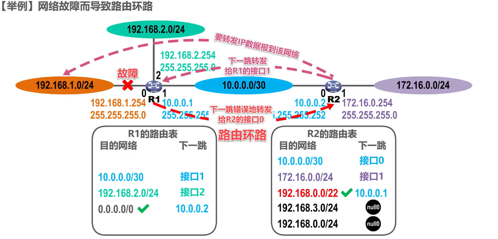

很显然， R1 和 R2 之间产生了路由环路，针对这种情况，我们可以在 R1 的路由表中**添加针对该直连网络**的**黑洞路由**。这样，当 R2 要转发 IP 数据报到该网络时，进行查表转发，找到匹配的路由条目，下一跳转发给 R1 的接口1， R1 收到该 IP 数据报后，进行查表转发，找到匹配的路由条目，这是一条黑洞路由，想一跳为虚拟接口null0，因此该 IP 数据报会进入这个黑洞。

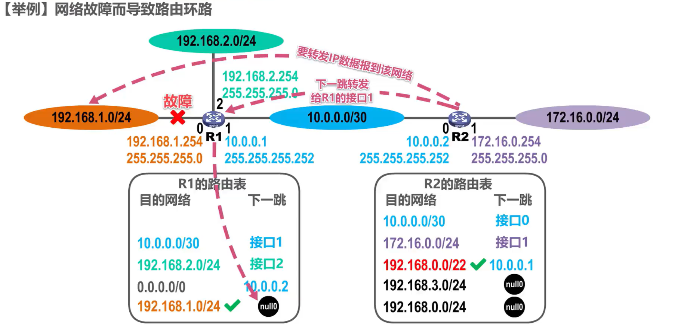

假设一段时间后，之前的故障消失了，则 R1 又自动的得出了其接口 0 的直连网络的路由条目，并将我们之前人工配置的针对该直连网络的黑洞路由条目设置为失效状态。

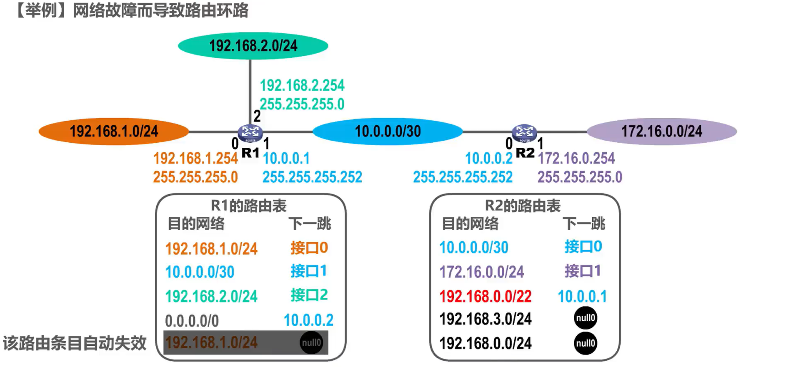

假设 R1 再次检测到其接口 0 所直连的网络出现了故障而不可达，则会自动在其路由表中**删除**该直连网络的路由条目，并将我们之前人工配置的针对该直连网络的黑洞路由条目**设置为生效状态**。

## 本节小结

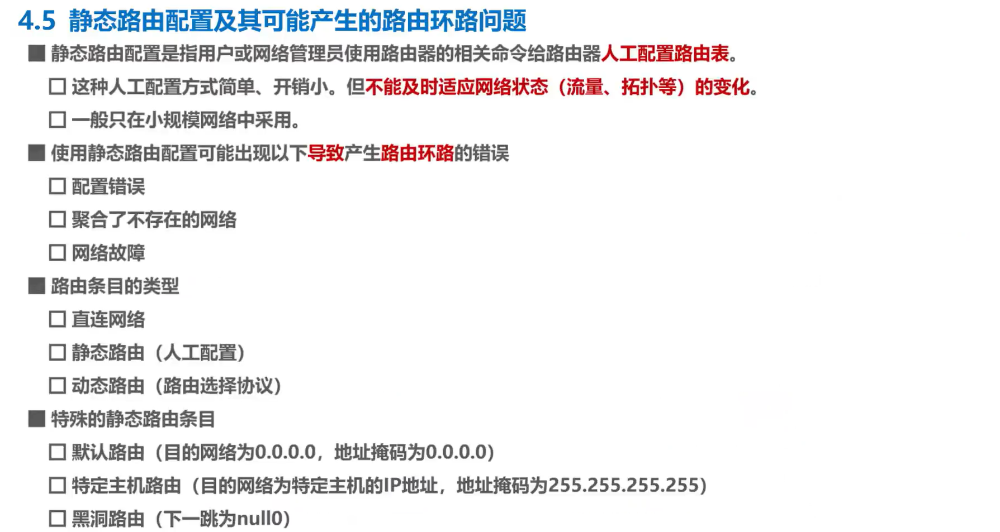