# 路由选择协议概述

本节课我们介绍路由选择协议的相关基本概念。

路由选择可分为静态路由选择和动态路由选择两类。

## 静态路由选择和动态路由选择简介

### 静态路由选择简介

- **静态路由选择**：采用人工配置的方式给路由器添加网络路由、默认路由、特定主机路由、黑洞路由等路由信息。
- 对于路由器自身而言，静态路由选择简单，开销小，但不能及时适应网络状态(流量、拓扑等)的变化。
- 静态路由选择一般只在小规模网络中采用

### 动态路由选择简介

- **动态路由选择**：路由器通过路由选择协议自动获取路由信息。
- 动态路由选择比较复杂，开销比较大，但能较好的适应网络状态的变化。
- 动态路由选择适用于大规模网络

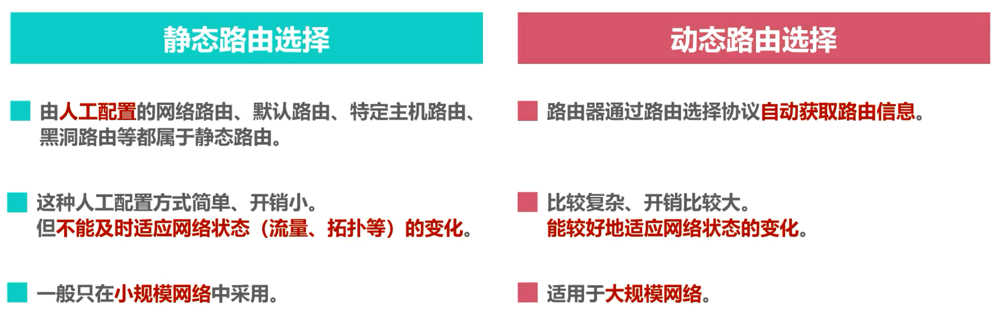

## 因特网使用的路由选择

因特网是全球最大的互联网络，它所采用的路由选择协议具有以下三个主要特点，分别是自适应、分布式、分层次。

自适应：因特网采用的是动态路由选择，能较好的适应网络状态的变化。

分布式：因特网中的各路由器通过相互间的信息交互，共同完成路由信息的获取和更新。

分层次：将整个因特网划分为许多较小的自治系统AS。例如一个较大的因特网服务提供商就可划分为一个自治系统，在自治系统内部和自治系统外部采用不同类别的路由选择协议分别进行路由选择。

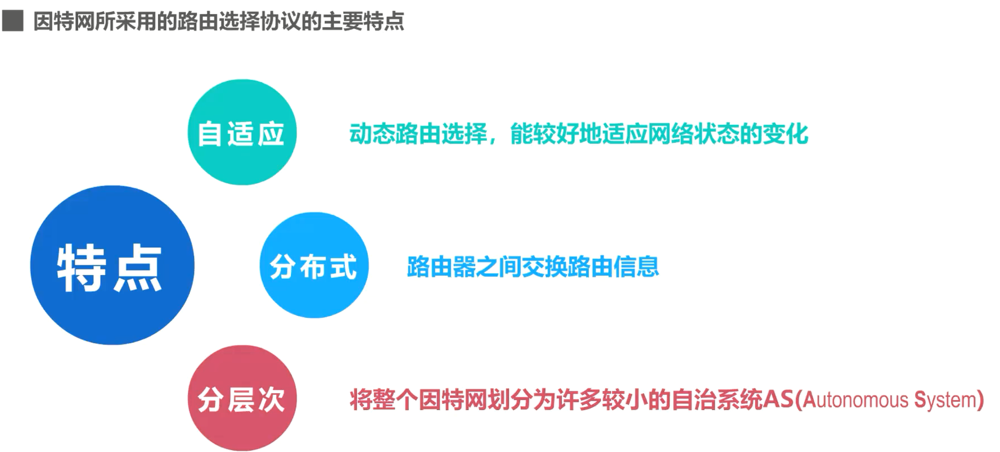

下面我们来举例说明因特网采用的分层次路由选择协议

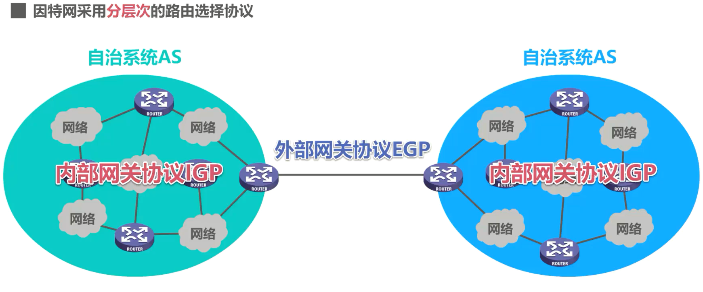

假设这是因特网中的很小的一部分，我们可以将这些网络和路由器划归到一个自治系统，而将这些网络和路由器划归到另一个自治系统。自治系统之间的路由选择简称为域间路由选择。自治系统内部的路由选择简称为域内路由选择。域间路由选择使用外部网关协议 EGP 这个类别的路由选择协议。域内路由选择使用内部网关协议 IGP 这个类别的路由选择协议。需要说明的是外部网关协议 EGP 和内部网关协议 IGP 只是路由选择协议的分类名称，而不是具体的路由选择协议。

另外，名称中使用的是网关这个名词，是因为在因特网早期的 RFC 文档中没有使用路由器，而使用的是网关这一名词，现在新的 RFC 文档中又改用路由器这一名词。因此，外部网关协议 EGP 可改称为外部路由协议ERP，内部网关协议 IGP 可改称为内部路由协议ARP。本课程仍然采用 RFC 原先使用的名词，以方便大家查阅 RFC 文档。

在一个自治系统内部使用的具体的内部网关协议与因特网中其他自治系统中选用何种内部网关协议无关。例如，在该自治系统内部使用的内部网关协议为路由信息协议RIP，而在这个自治系统内部使用的内部网关协议为开放式最短路径优先OSPF协议，自治系统之间使用的外部网关协议为边界网关协议BGP。

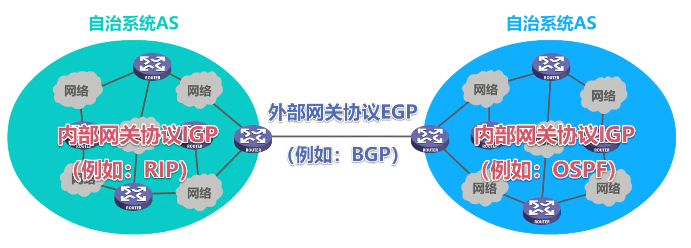

## 常见的路由选择协议 

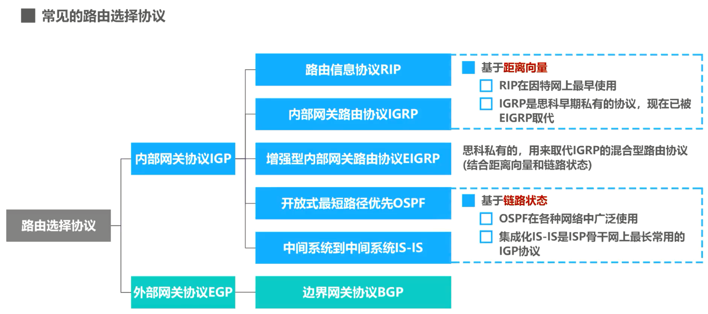

接下来我们给出常见的路由选择协议，分为内部网关协议和外部网关协议两大类。内部网关协议包括路由信息协议RIP、内部网关路由协议IGRP、增强型内部网关路由协议EGRP、开放式最短路径优先OSPF、中间系统到中间系统 IS-IS；而外部网关协议中最常见的仅有边界网关协议BGP。

RIP和 IGRP 是基于距离向量的，RIP是最早应用在因特网上的路由选择协议。 

IGRP是思科早期私有的协议，现在已被EIGRP取代。

OSPF和IS-IS是基于链路状态的，OSPF在各种网络中得到了广泛的使用，而集成化的IS-IS是ISP 骨干网上最常用的内部网关协议。

EIGRP是思科私有的用来取代IGRP的混合型路由选择协议，它结合了距离、向量和链路状态。

## 路由器的基本结构

路由选择协议是在路由器上运行的，下面我们就来看看路由器的基本结构。

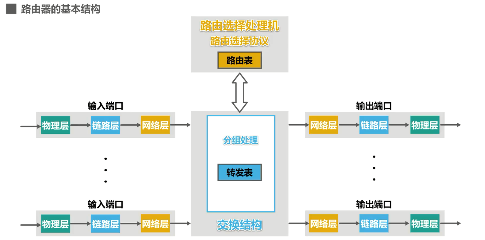

如图所示，路由器是一种具有多个输入端口和输出端口的专用计算机，其任务是转发分组。整个路由器结构可划分为两大部分

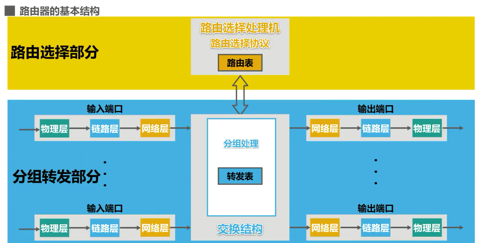

- 路由选择部分：路由选择部分的核心构件是**路由选择处理机**，它的任务是根据所使用的路由选择协议**周期性地与其他路由器进行路由信息的交互，来更新路由表**

- 分组转发部分：分组转发部分由三部分构成，分别是

  - 交换结构

  - 一组输入端口

  - 一组输出端口

    - 路由器的各端口还应具有输入缓冲区和输出缓冲区。输入缓冲区用来暂存新进入路由器但还来不及处理的分组。输出缓冲区用来暂存已经处理完毕但还来不及发送的分组。

      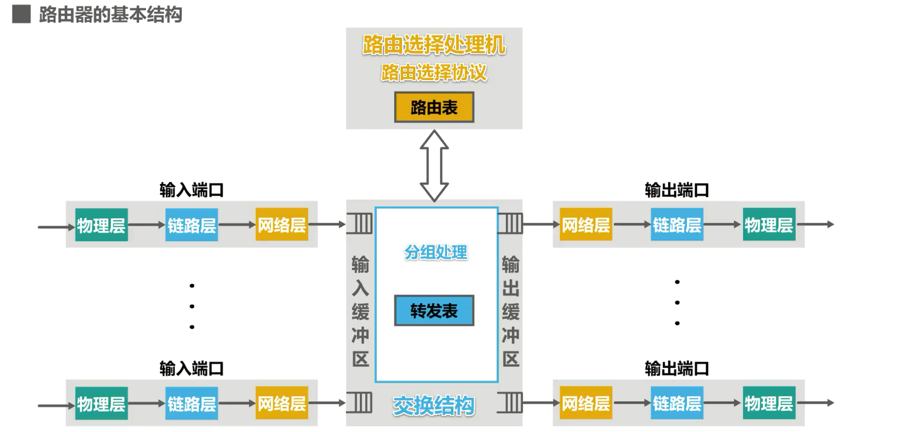

      需要说明的是，路由器的端口一般都具有输入和输出的功能。我们图中分别给出输入端口和输出端口，目的在于更好地演示路由器的基本工作过程

## 路由器处理流程

信号从某个输入端口进入路由器物理层，将信号转换成比特流，送交数据链路层处理。

数据链路层从比特流中识别出帧，去掉帧头和帧尾后，送交网络层处理。

### 送交网络层的分组是普通待转发的数据分组

如果送交网络层的分组是普通待转发的数据分组，则根据分组首部中的目的地址进行查表转发。若找不到匹配的转发条目，则丢弃该分组，否则按照匹配条目中所指示的端口进行转发。

网络层更新数据分组首部中某些字段的值，例如，将数据分组的生存时间减1，然后送交数据链路层进行封装。

数据链路层将数据分组封装成帧送交物理层处理

物理层将帧看作是比特流，将其变换成相应的电信号进行发送。

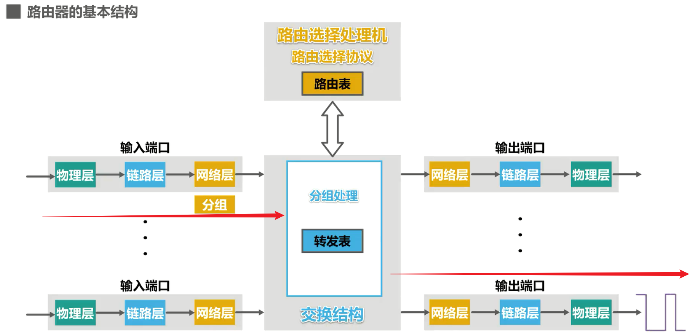

### 送交网络层的分组是路由器之间交换路由信息的路由报文

如果送交网络层的分组是路由器之间交换路由信息的路由报文，则把这种分组送交**路由选择处理机**，路由选择处理机根据分组的内容来更新自己的路由表。

- 路由表一般仅包含从目的网络到下一跳的映射

- 路由表需要对网络拓扑变化的计算最优化
- 转发表是从路由表得出的
- 转发表的结构应当使查找过程最优化

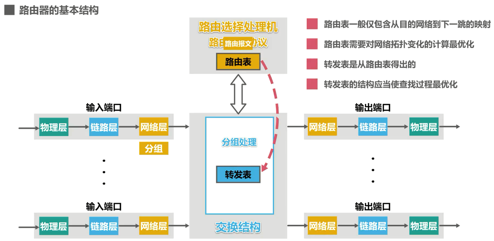

需要说明的是，我们在之前的静态路由配置的相关课程中**并没有严格区分路由器中的路由表和转发表**，这样有助于简化问题的分析。因此，在后续有关路由选择协议的课程中，我们仍然不严格区分路由表和转发表，还是以路由表来表述问题。路由选择处理机除了处理收到的路由报文外，还会周期性的给其他路由器发送自己所知道的路由信息

## 本节小结

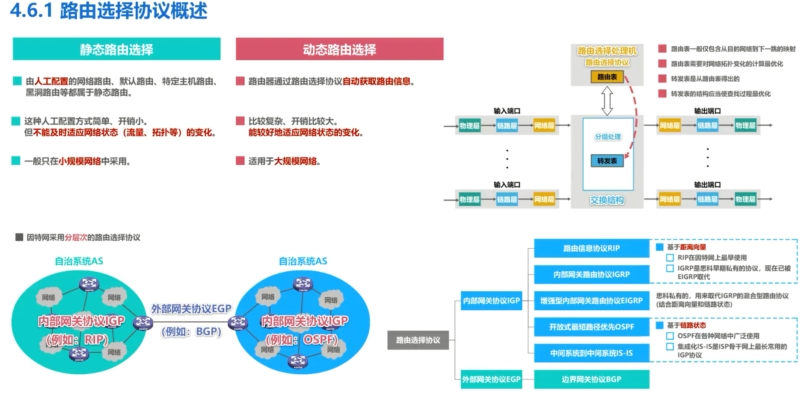