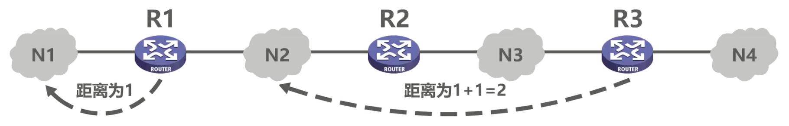
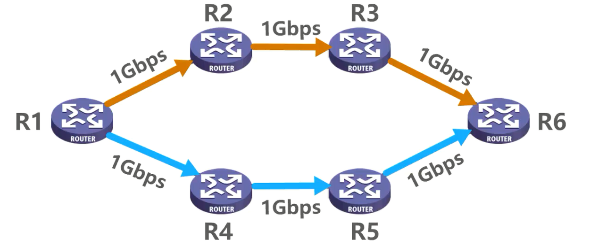
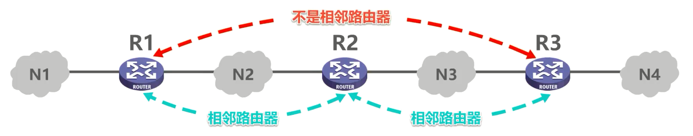

# 路由信息协议RIP的基本工作原理

## 路由信息协议RIP简介

**路由信息协议 RIP**(Routing Information Protocol) 是内部网关协议中最先得到广泛使用的协议之一，其相关标准文档为 RFC 1058。

RIP要求自治系统内的每一个路由器都要维护从他自己到自治系统内其他每一个网络的距离记录。这是一组距离，称为**距离向量D-V(DIstance-Vector)**。

RIP使用**跳数**(Hop Count)作为度量(Metric)**来衡量到达目的网络的距离**。

- RIP将路由器到直连网络的距离定义为1，例如图中的路由器 R1 到其直连网络 N1 的距离为1。
- RIP将路由器到非直连网络的距离定义为所经过的路由器数加1，例如图中的路由器 R3 到其非直连网络 N2 的距离为2。
- RIP允许一条路径最多只能包含 15 个路由器，**距离等于 16 时，相当于不可达**。因此**RIP只适用于小型互联网**。

需要说明的是，有些厂商的路由器并没有严格按照RIP标准文档的规定来实现RIP。例如，思科路由器中的RIP将路由器到直连网络的距离定义为0，但这并不影响RIP的正常运行。

### RIP:好的路由就是距离短的路由

RIP认为**好的路由就是距离短的路由**，也就是**所通过路由器数量最少的路由**。如图所示，从 R1 到 R5 可以走这条路由，也可以走这条路由。RIP认为 R1 到 R5 的好路由是图中只经过一个路由器 R4 的这条路由，尽管这条路由上各段链路的带宽都非常小。

再来看这个例子，从 R1 到R6，可以走这条路由，也可以走这条路由，而这两条路由是等价的，RIP该如何选择？

当到达同一目的网络，有多条距离相等的路由时，RIP可以进行**等价负载均衡**，也就是将通信量均衡的分布到多条等价的路由上。

### RIP的三个要点

- **和谁交换信息**：答案是仅和**相邻路由器**交换信息。我们来举例说明相邻路由器的概念。下图中 R1 与 R2 互为相邻路由器，因为它们是直连的，中间没有其他路由器。同理， R2 与 R3 也互为相邻路由器，但是 R1 与 R3 不是相邻路由器，因为它们之间还存在其它路由器。

  

- **交换什么信息**：答案是路由器自己的路由表。

- **何时交换信息**：答案是周期性交换。例如每 30 秒发送一次 RIP 更新报文。

## RIP的基本工作过程

接下来我们举例说明RIP的基本工作过程。路由器刚开始工作时只知道自己到直连网络的距离是1，如图所示，这是各路由器刚开始工作时各自的路由表，其中包含的路由条目都是到达各自直连网络的信息，其距离都是一。之后每个路由器锦和相邻路由器周期性的交换并更新路由信息。如图所示， R1 和 R2 互为相邻路由器， R1 和 R3 互为相邻路由器， R2 和 R3 互为相邻路由器， R2 和 R4 互为相邻路由器， R3 和 R4 也互为相邻路由器，相邻路由器之间周期性的交换并更新路由信息。若干次交换和更新后，每个路由器都知道到达本自治系统内各网络的最短距离和下一跳地址，这称为收敛，如图所示。

05:09 
接下来我们举例说明RIP的路由条目更新规则。路由器 c 和 d 互为相邻路由器，它们之间周期性的交换并更新路由信息。这是路由器 c 的路由表。其中到达各目的网络的吓一跳都记为问号。可以理解为路由器 d 并不需要关心路由器 c 的这些内容，这是路由器 d 的路由表。

05:41 
假设路由器 c 的RIP更新报文发送周期到了，则路由器 c 将自己路由表中的相关路由信息封装到RIP更新报文中，发送给路由器地。我们可以简单的理解为，路由器 c 将自己的路由表发送给了路由器d，路由基地收到后对其进行改造，将到达各目的网络的吓一跳都改为c，距离都增加一。这样的操作很容易理解，因为路由器 c 告诉 d 它可以到达这些目的网络，那么路由器 d 作为 c 的邻居路由器，当然也就可以通过 c 来到达这些目的网络，只是比 c 到达这些目的网络的距离大一。路由器 d 现在可以根据改造好的路由表来更新自己先前的路由表了。

06:45 
路由器 d 原来到达网络 N2 的距离是2，下一跳经过路由器 c 的转发，现在路由器 d 知道了到达网络 N2 仍然经过 c 的转发，距离变为了5，也就是说 c 与 N2 之间的网络拓扑发生了变化，于是将自己这条路由条目中的距离更新为5。更新路由表的理由可总结为，到达目的网络相同的。

07:16 
吓一跳，最新的消息应该更新。路由器 d 原来不知道网络 N3 的存在，现在路由器 d 知道了可以通过路由器 c 到达网络N3，于是将该路由条目添加到自己的路由表中。更新路由表的理由可总结为，发现了新的网络添加。路由器 d 原来到达网络 N6 的距离是8，吓一跳，经过路由器 f 的转发，现在路由器 d 知道了到达网络N6。如果通过 c 来转发，则距离可缩短为5，于是将自己这条路由条目中的距离修改为5，下一跳修改为c。更新路由表的理由可总结为，到达目的网络不同的吓一跳。新路由有优势，应该更新路由器d。原来到达网络 N8 的距离是四。

08:19 
下一跳，经过路由器 e 的转发，现在路由器 d 知道了到达网络N8，还可以通过 c 来转发，距离也为4，于是将该路由条目添加到自己的路由表中。更新路由表的理由可总结为，到达目的网络不同的吓一跳，但距离相等。进行等价负载均衡，路由器 d 原来到达网络 N9 的距离是四下一跳，经过路由器 f 的转发，现在路由器 d 知道了到达网络N9，如果通过 c 来转发，则距离扩大为6，于是不使用这条路由条目来更新自己的路由表。不更新路由表的理由可总结为，到达目的网络不同的吓一跳，新路由劣势不应该更新。

09:20 
接下来请同学们参看我们之前的这个举例，来完成这道习题。本题的解答过程如下所示，相信大家都能正确完成。再来看这道相关的考研题，这是计算机专业考研全国统考计算机网络部分 2010 年的题35，请大家暂停播放视频思考一下，给出你的答案。答案是选项d，大家都选对了吗？我们来一起分析一下。在RIP协议中，距离 16 被定义为目的网络不可达，因此 r 无法到达。 net 1，而 1 也无法通过 R2 到达。 net 1。下面我们介绍锐步协议存在的坏消息传得慢的问题。如图所示，假设 R1 到达，其直连网络 N1 的链路出现了故障，当 R1 检测出该故障后，会将到达 N1 的路由条目中的距离修改为16，表示恩义不可达，并等待RIP更新周期到时候发送该路由信息给R2。而此时 R2 的路由表中关于 N1 的路由条目仍然是先前通过RIP协议获取到的，也就是到达 N1 的距离为2。

10:59 
下一跳，通过 R1 转发，假设 r 的锐步更新周期先到10，也就是 r 的这条路由信息先到达R1，而 R1 的这条路由信息后到达R2。当 R1 收到 R2 的这条路由信息后，就会被该谣言误导，认为可以通过 R2 到达N1，距离为3，并在自己的 RIP 更新周期到时候将这条路由信息发送给R2。

11:34 
当 R2 收到 R1 的这条路由信息后，被该谣言误导，认为可以通过 R1 到达N1，距离为4，并在自己的 rap 更新周期到时候将这条路由信息发送给R1。当 R1 收到 R2 的这条路由信息后，被该谣言误导，认为可以通过 R2 到达N1，距离为5，并在自己的RIP更新周期，到时候将这条路由信息发送给R2。很显然，只有当 R1 和 R2 的路由表中到达 N1 的路由条目中的距离都增加到 16 号， R1 和 R2 才都知道 N1 不可达，也就是才收敛。在该过程中， R1 和 R2 之间会出现路由环落时间长达数分钟。

12:33 
有关路由环路的问题，我们在之前的静态路由配置的相关课程中已经介绍过了，此处就不再赘述了。坏消息传得慢，又称为路由环路或距离无穷技术问题。这是距离向量算法的一个固有问题，可以采取多种措施减少出现该问题的概率或减少该问题带来的危害。例如，限制最大路径距离为15。当路由表发生变化时，就立即发送更新报文及触发更新，而不仅是周期性发送，让路由器记录收到某特定路由信息的接口，而不让同一路由信息再通过此接口向反方向传送，借水平分割。请注意，使用上述措施后也不能彻底避免路由环路问题，这是距离向量算法的本质所决定的。

13:41 
最后，我们再来练习一道相关的考研题，这是 2016 年的题三日期，请大家暂停播放视频思考一下，给出你的答案。答案是选项b，大家都选对了吗？我们来一起分析一下。根据题目所给R3，检测到网络 20 一点二点零，斜线 25 不可达，可知 R3 与该网络是直连的。如图所示，要根据题目所给 R1 R2， R3 采用 RIP 协议交换路由信息，且均已收敛，可知先前他们各自的路由表中关于该目的网络的路由条目如下所示，再根据题目所给 R3 检测到网络20，一点二点零斜线 25 不可达，并向 R2 通告一次新的距离向量，可知 R3 与该网络之间的链路出现了故障。

14:53 
当 R3 检测到该故障时，将自己到达该网络的路由条目中的距离修改为16，表示该网络不可达，并向 R2 发送关于这条路由条目的通告。 R2 收到后更新自己相应的路由条目，将距离修改为16。最后，根据题目所给则 R2 更新后这句话可知， R1 给 R2 发送了关于该路由条目的 RIP 更新报文，而 R2 听信了该谣言，误认为到达该目的网络可以通过 R1 的转发，距离为3。本节课到这里就结束了，我们将本节课的内容小结如下，需要说明的是，本节课我们介绍了RIP最基本的工作原理，并不涉及RIP的全部细节，例如RIP相关报文的封包格式、RIP中涉及到的一些定时时长等。目前基于 ipv 4 的 RIP 有版本 1 和版本 2 两个版本，还有基于 ipv 6 的 RIP NG，有兴趣的同学可以自行查阅相关文档。同学们，我们下节课再见。