## 4-7 IPv4数据报首部格式

为了简单起见，之后我们将IPv4数据报简称为 IP 数据报，而不指出版本号。 IP 数据报的首部格式及其内容是实现 IP 协议主要功能的基础，因此我们有必要搞清楚这部分内容。

## IP 数据报的首部格式

如图所示，这是IP数据报的首部格式，它由 **20 字节的固定部分**和**最大 40 字节的可变部分**组成。

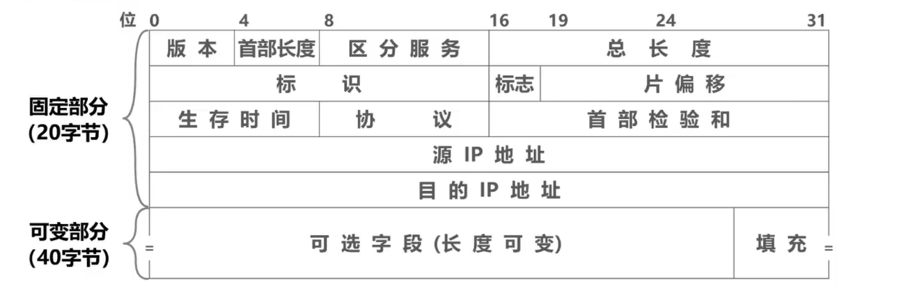

所谓固定部分，是指每个 IP 数据报首部都必须包含的部分。而某些 IP 数据报的首部除了包含 20 字节的固定部分外，还包含一些可选的字段来增加 IP 数据报的功能。

IP数据报的首部常以 32 个比特为单位进行描述。图中的每一行都由 32 个比特，也就是 4 个字节构成，每个小格子称为字段或者域。每个字段或某些字段的组合，用来表达 IP 协议的相关功能，

### 版本

版本字段占 4 个比特，用来表示 IP 协议的版本。通信双方使用的 IP 协议的版本必须一致。

目前广泛使用的 IP 协议的版本号为 4 即IPV4，

### 首部长度

首部长度字段，该字段占 4 个比特，用来表示 IP 数据报首部的长度。

该字段的取值以 4 字节为单位，最小十进制取值为5，表示IP数据报首部只有 20 字节的固定部分，最大十进制取值为15，表示IP数据报首部包含 20 字节的固定部分和最大 40 字节的可变部分，共计60字节

### 可选字段

可选字段，该字段的长度从 1 个字节到 40 个字节不等，用来支持排错、测量以及安全措施。可选字段增加了 IP 数据报的功能，但这同时也使得IP数据报的首部长度成为可变的，这就增加了每一个路由器处理IP数据报的开销。实际上，可选字段很少被使用

### 填充字段

填充字段，该字段用来确保手部长度为 4 字节的整数倍，使用全 0 进行填充。我们之前刚刚介绍过，首部长度字段是以 4 字节为单位的，换句话说， IP 数据报的首部长度一定是 4 字节的整数倍。由于首部中的可选字段的长度从 1 个字节到 40 个字节不等，那么当 20 字节的固定部分加上 1- 40 个字节长度不等的可变部分，会造成手部长度不是 4 字节的整数倍时，就用取值为全 0 的填充字段填充相应的字节，以确保 IP 数据报的首部长度是 4 字节的整数倍

### 区分服务字段

区分服务字段，该字段占 8 个比特，用来获得更好的服务。

该字段在旧标准中叫做服务类型，但实际上一直没有被使用过。 1998 年，英特网工程任务组把这个字段改名为区分服务，利用该字段的不同数值可提供不同等级的服务质量。只有在使用区分服务时，该字段才起作用，一般情况下都不使用该字段。

### 总长度字段

总长度字段，该字段占 16 个比特，用来表示 IP 数据报的总长度，也就是**首部和数据载和的长度总和**，最大取值为十进制的65535，以字节为单位。需要注意的是，在实际应用中很少传输这么长的 IP 数据报。

#### 首部长度字段和总长度字段的区别与联系

接下来我们来举例说明首部长度字段和总长度字段的区别与联系。

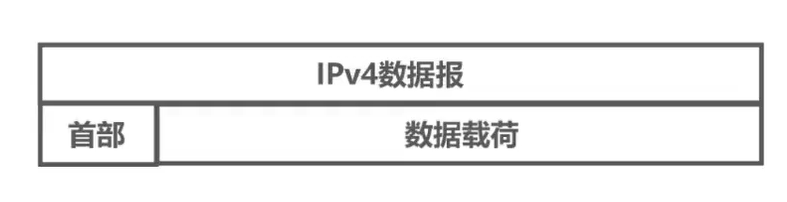

这是一个 IP 数据报，它由首部和数据载和两部分构成。

假设首部中的首部长度字段的二进制取值为0101，则可以计算出 IP 数据报的首部长度，也就是用手部长度字段的取值乘以 4 字节，单位共 20 字节。

假设首部中的总长度字段的二进制取值为00000011111100，则可以计算出 IP 数据报的总长度，也就是在总长度字段的取值后添加字节单位共 1020 个字节，进而可以计算出数据载荷的长度，也就是用 IP 数据报的总长度减去 IP 数据报的首部长度，结果为 1000 个字节。

### 标识、标志、片偏移

接下来我们介绍标识、标志、片偏移这三个字段，它们共同用于进行 IP 数据报分片。

这是网际层封装出的 IP 数据报，它将在数据链路层封装成帧。

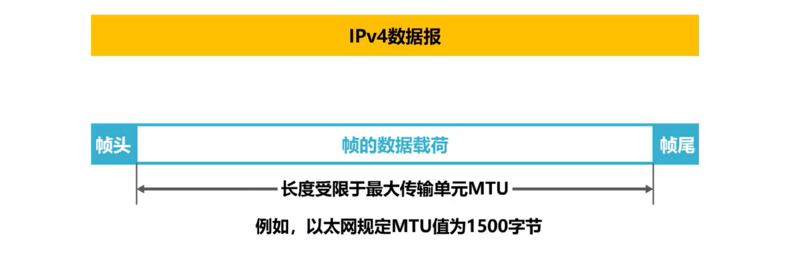

每一种数据链路层协议都规定了帧的数据载荷的最大程度，称为最大传输单元MTU。例如，以太网的数据链路层规定 MTO 的值为 1500 个字节。如果某个 IP 数据报的总长度超过 MTU 时，将无法封装成帧，需要将原 IP 数据报分片为更小的 IP 数据报，再将各分片 IP 数据报封装成帧。

#### 标识

标识字段，占 16 个比特，属于同一个数据报的各分片数据报应该具有相同的标识。

IP软件维持一个计数器，每产生一个 IP 数据报，计数器的值就加1，并将此值赋给标识字段。

#### 标志

标志字段占 3 个比特，各比特含义如下

- DF位：表示是否允许分片制， 1 表示不允许分片，清零表示允许分片。
- MF位：表示本分片后面是否还有分片，至 1 表示本分片后面还有分片，清零表示本分片就是最后一个酚片
- 保留位：还有一个保留位，必须设置为0。

#### 片偏移

偏移字段，占 13 个比特，指出分片数据报的数据载荷部分偏移其在原数据报的位置有多远。片偏移以 8 个字节为单位。

#### 举例说明IPv4数据报的分片

假设有这样一个 IP 数据报，它由 20 字节的固定首部和 3800 字节的数据载荷两部分构成。也就是说，该 IP 数据报的总长为 3820 个字节。

##### 分片

假设是用以太网传送该 IP 数据报，以太网的最大传送单元 MTU 为 1500 个字节，也就是以太网的数据载和部分最大为 1500 个字节，无法封装 3820 字节长的 IP 数据报，因此需要把该 IP 数据报分片成几个更小的 IP 数据报，每个长度不能大于 1500 个字节。然后再将每个分片 IP 数据报封装成一个以太网的帧进行传输。

为了更好地描述后续的分片工作，我们将原 IP 数据报数据载和部分的每一个字节都编上号，第一个字节编号为0，最后一个字节编号为3799。

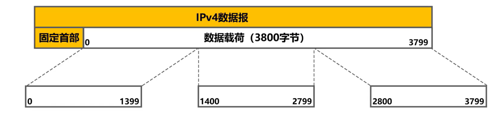

我们可将原 IP 数据报的数据载荷分成三个更小的分片

- 第一个分片从 0 号字节到 1399 号字节，共 1400 个字节。
- 第二个分片从 1400 号字节到 2799 号字节，共 1400 个字节
- 第三个分片从 2800 号字节到 3799 号字节，共 1000 个字节。

##### 添加IPv4首部及确定首部中字段的值

分片结束后，给每个分片重新添加一个首部，使之成为 IP 数据报。

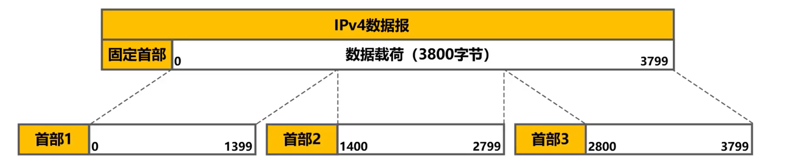

给各分片添加的首部是否完全相同？我们来一起填一下下面这张表格。

原 IP 数据报首部中的总长度字段的十进制取值为 3800 + 20，标识字段的十进制取值为12345， MF比特的取值为0，表示后面没有分片数据报，这就是最后一个分片数据报。 DF比特的取值为0，表示该 IP 数据报允许被分片。由于这是未分片的原 IP 数据报，因此片偏移为0

###### 填写分片1IP 数据报首部中相关字段的值。

- 总长度字段的十进制取值为 1400 + 20，其中 1400 字节是分片的长度， 20 字节是固定首部的长度。

- 标识字段的十进制取值与原 IP 数据报的相同，为12345
- MF位：由于该分片不是最后一个分片，因此 MF 比特的取值为1，表示该分片后还有分片。
- DF位：该分片 IP 数据报允许被再次分片，因此DF比特的取值为0
- 片偏移：该分片 IP 数据报数据载荷部分的第一个字节就是原 IP 数据报数据载荷部分的第一个字节，因此片偏移字段的取值为 0/8，除以 8 的原因是偏移字段以 8 字节为单位。

###### 填写分片2的 IP 数据报首部中相关字段的值

**只有片偏移字段的值与分片 1 IP 数据报的不同**

###### 填写分片三 IP 数据报首部中相关字段的值

- 总长度字段的十进制取值为 1000 + 20，其中 1 千字节是分片的长度， 20 字节是固定首部的长度。
- 标识字段：标识字段的十进制取值与原IP数据报的相同，为12345
- MF位：由于该分片就是最后一个分片，因此MF比特的取值为0，表示该分片后没有其他分片。
- DF位：该分片IP数据报允许被再次分片，因此DF比特的取值为0。
- 片偏移：该分片IP数据报数据载荷的第一个字节是原 IP 数据报数据载荷中编号为2800 的字节，因此片偏移字段的取值为 2800/8。

上述分片字段结果如下表所示：

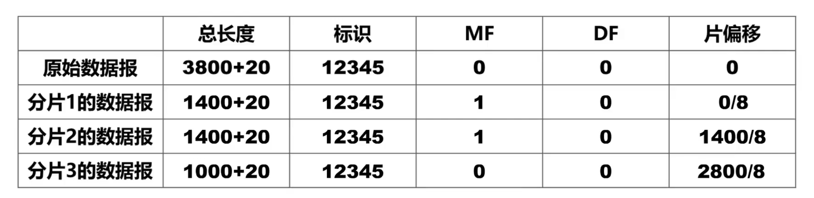

##### 再次分片

现在假定分片 2 的 IP 数据报经过某个网络时，还需要再进行分片，其中一个分片长度为 800 字节，另一个分片长度为 600 字节。

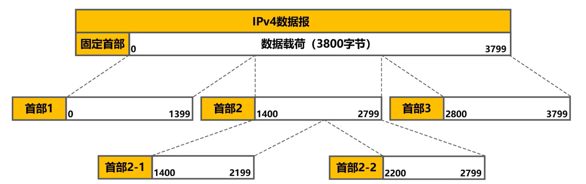

分片结束后，给每个分片重新添加一个首部，使之成为 IP 数据报，则重新分片后的IP首部字段值如下表所示

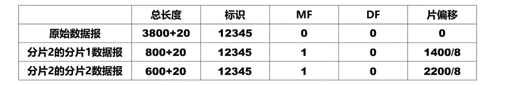

### 生存时间

生存时间字段，该字段占 8 个比特

该字段最初以秒为单位，最大生存周期为 255 秒。路由器转发 IP 数据报时，将IP数据报首部中的该字段的值减去IP数据报在本路由器上所耗费的时间，若不为 0 就转发，否则就丢弃（笔者注：即表示超时丢弃）。

现在以跳数为单位，路由器转发 IP 数据报时，将 IP 数据报首部中的该字段的值减1，若不为 0 就转发，否则就丢弃。

#### 举例说明生存时间字段的作用

假设采用如下图所示的网络拓扑，路由器R1、R2、 R3 各自的路由表，如图所示。

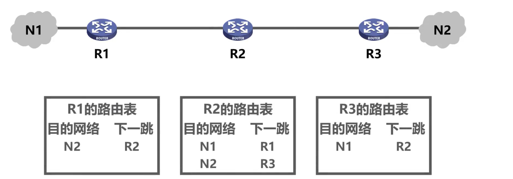

为了简单起见，我们只给出了各路由器路由表中的由人工配置的静态路由条目，例如路由器R2中的这条静态路由条目，他指出了 IP 数据报要到达网络N2，下一跳需要转发给路由器R3。假设我们在人工配置这条静态路由条目时，错将下一跳配置成了R1，这会导致将去往网络 N2 的 IP 数据报错误的转发给路由器R1，我们来看看会出现什么问题。

假设某个 IP 数据报从网络 N1 发往网络N2，该 IP 数据报到达 R1 后， R1 进行查表转发，发现了匹配的路由条目，其下一跳只是转发给R2，于是 R1 将该 IP 数据报转发给了R2。 

R2 收到该 IP 数据报后进行查表转发，发现了匹配的路由条目，其下一跳只是转发给R1，于是 R2 将该 IP 数据报又转发回了R1，很显然形成了**路由环路**，如果没有其他措施， IP 数据报将在路由环路中永久兜圈。

现在相信大家能够更好的理解 IP 数据报首部中生存时间字段的作用了，那就是**确保 IP 数据报不会在网络中永久兜圈**。 **IP 数据报每经过一个路由器，其生存时间的值被减1，当减少到 0 时， IP 数据报将被路由器丢弃**。

### 协议字段

协议字段，该字段占 8 个比特，用来指明 IP 数据报的**数据部分是何种协议数据单元**。常用的一些协议和相应的协议字段值如下表所示。

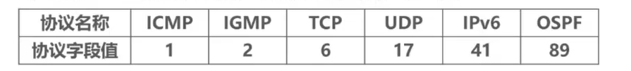

#### 举例说明协议字段

这是一个 IP 数据报，当首部中协议字段的取值为 1 时，表明数据部分是 SMP 报文，也就是用 SMP 协议封装的协议数据单元。

当首部中协议字段的取值为 6 时，表明数据部分是 TCP 报文段，也就是用 TCP 协议封装的协议数据单元。

### 首部检验和

首部检验和字段，该字段占 16 个比特，用来检测 IP 数据报首部在传输过程中是否出现差错，所采用的检错码比CRC循环冗余检错码简单，称为因特网检验和，这里不赘述，有兴趣可自行查阅相关资料

 IP 数据报每经过一个路由器，都要重新计算首部检验和，因为某些字段例如生存时间、标志偏移等的取值可能会发生变化。由于 IP 层本身并不提供可靠传输的服务，并且计算首部检验和是一项耗时的操作，因此在IPv6 中，路由器不再计算首部检验和，从而更快转发 IP 数据报。

### 源目IP

源IP地址和目的 IP地址字段，他们各占 32 个比特，用来填写发送该 IP 数据报的原主机的 IP地址和接收该IP 数据报的目的主机的 IP地址。

## 练习

### 习题1

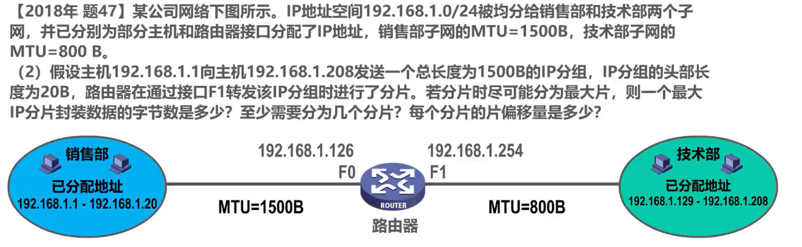

这是题目所给的销售部中某个主机发送的 IP 分组，总长度为 1500 个字节，题目给出 IP 分组的头部长度为 20 字节，因此数据载荷部分应为 1480 个字节。为了方便描述，我们将数据载和中的每一个字节都编上号，第一个字节的编号为0，最后一个字节的编号为1479。题目给出由于该 IP 数据报通过路由器的 F1 接口转发时，受到所在网络的最大传送单元 MTU 为 800 字节的限制，需要进行分片。换句话说，分片后的每一个 IP 数据报的最大长度可以是 800 字节。假设这是分片 1 的 IP 数据报，这是他的 20 字节固定首部。

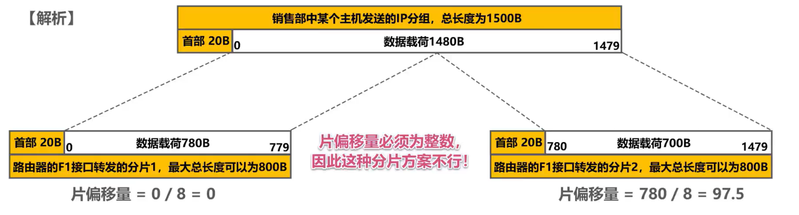

为了符合题目的要求，尽可能分为最大片，我们将分片长度取为 780 个字节，其第一个字节的编号为0，最后一个字节的编号为779，片偏移量等于 0/ 8，结果是0。将剩余的 700 字节作为分片二，其第一个字节的编号为780，最后一个字节的编号为1479。给其添加相应的 20 字节首部，使之成为分片 2 的 IP 数据报片 1 量等于 780/ 8，结果为 97. 5。由于片易量必须为整数，因此这种分片方案不行。

 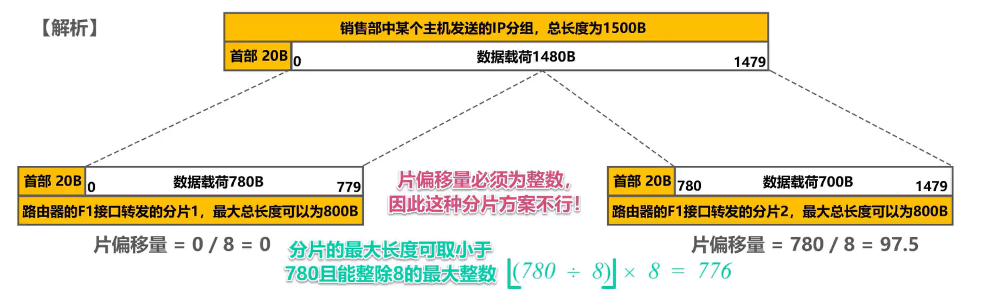

我们可将分片的**最大长度取为小于780，且能整除 8 的最大整数**。具体方法是将 780/ 8 的结果向下取整，然后再乘以8，结果为776，这样分片一的长度为 776 个字节，剩余 704 个字节作为分片二。分片 1 的最后一个字节编号为775，分片 2 的第一个字节编号为776，这样分片 2 的片 1 量等于 776/ 8，结果为97。

### 习题2（笔者注：此题综合性极强）

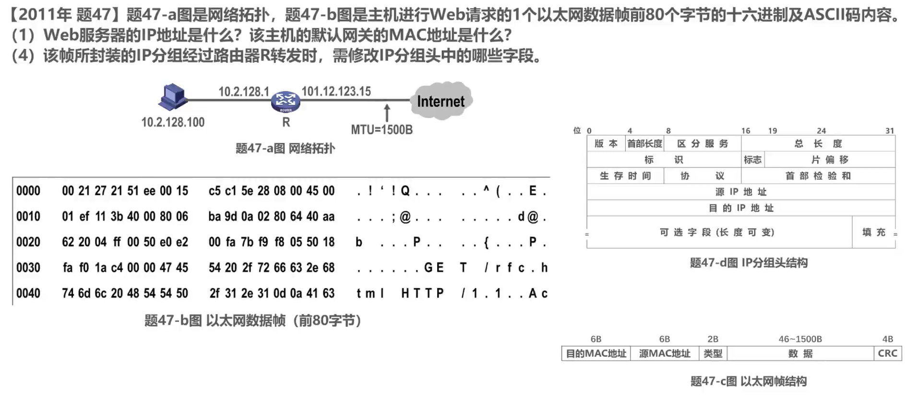

尽管到目前为止，我们还未学习 web 请求是用什么应用层协议封装的，也不知道在运输层还会用什么协议进行封装。但是我们知道在网际层一定会用 IP 协议对其进行封装，使之成为 IP 分组。 web 服务器的 IP地址就填写在 IP 分组头中的目的 IP地址字段， IP 分组还要封装成以太网帧才能发送。

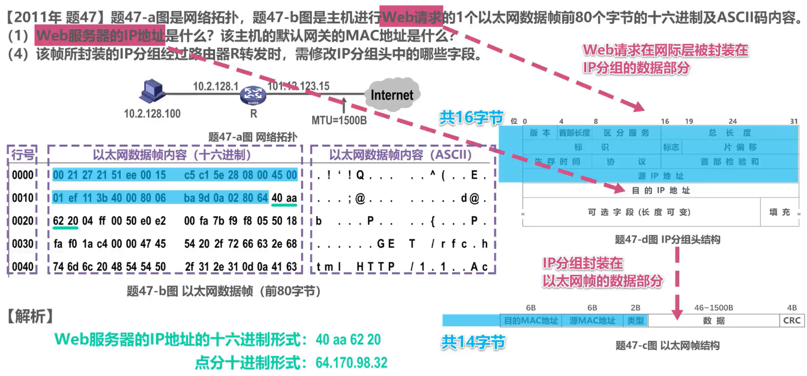

在 IP 分组头中，目的 IP地址字段**前**还有 16 个字节的内容，在以太网帧中，数据载荷**前**还有 14 字节的内容。因此可知，在以太网帧中，从**第 31 个字节开始的 4 个字节实际上就是目的 IP地址的内容**。

题目所给的以太网数据帧

- 第一列数据，实际上并不是以太网帧的内容，仅仅作为行号，其增量为16，表示每行有 16 个字节的内容
- 中间虚框是以太网帧内容的十六进制形式
- 右侧虚框是以太网帧内容的ASCII码，这些是以太网帧的前 30 个字节。

**接下来的 4 个字节就是外部服务器的 IP地址**，其点分十进制形式为34.170.98.32。

从图中可知，主机的默认网关就是路由器R，主机会将外部请求发送给默认网关，由默认网关将 web 请求转发到因特网。因此，以太网帧头中的目的MAC地址字段封装的就是默认网关的MAC地址，如图所示。

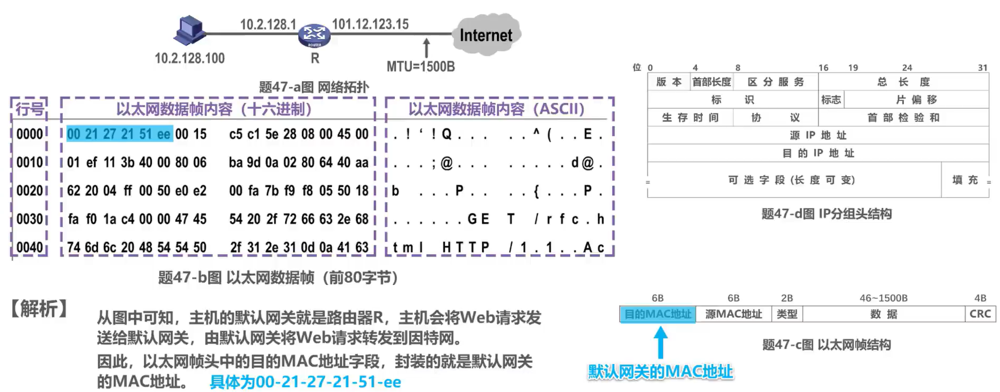

目的MAC地址字段就是以太网帧的前 6 个字节，其内容就是默认网关的MAC地址。写成MAC地址的形式为 00-21-27-21-51-ee。

再来解答第4问， IP 分组经过路由器R时

- 生存时间字段的值被减1
- 首部检验和会被重新计算
- 若 IP 分组总长度大于最大传送单元 MTU 的值，则需要进行分片，此时总长度字段、标志字段片、偏移字段都需要修改。

## 本节小结

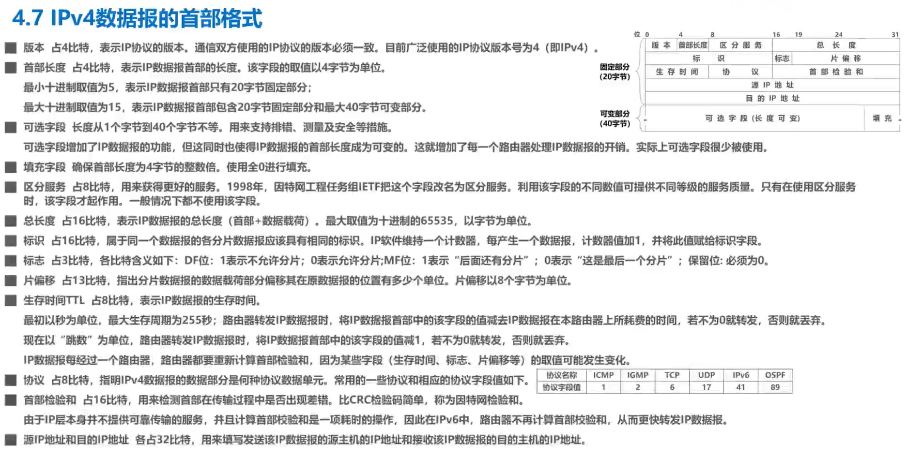