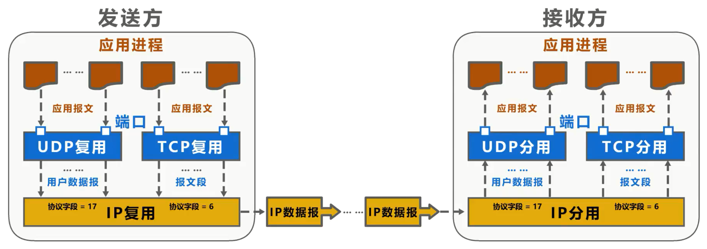
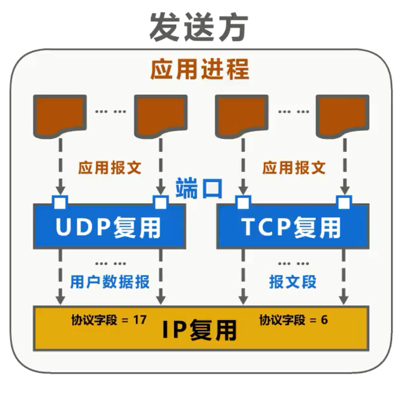
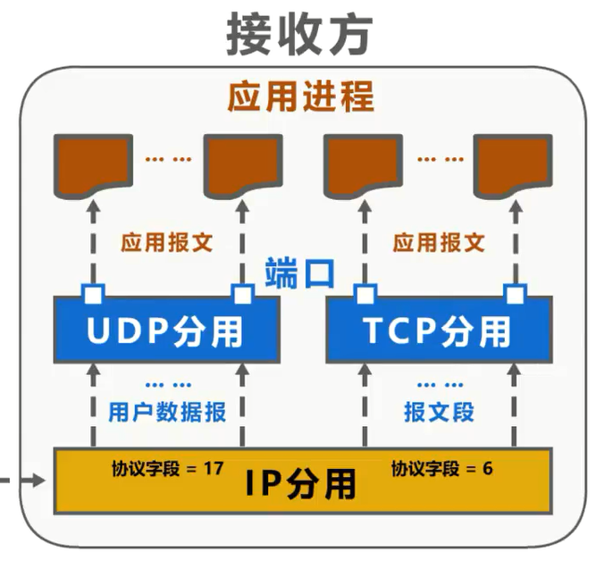
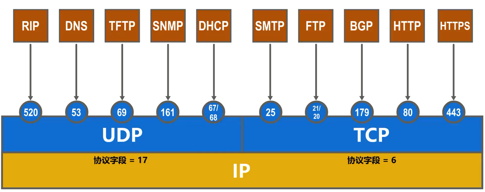
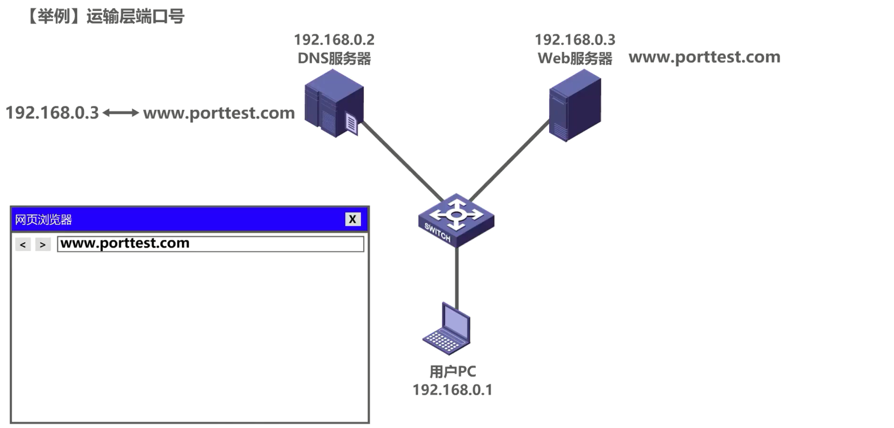
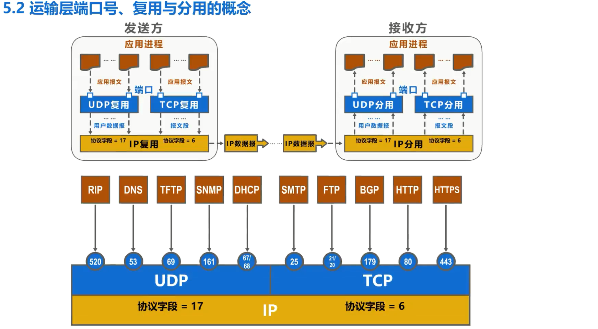

# 运输层端口号 复用与分用的概念

## 端口号

运输层的任务是直接为应用进程间的逻辑通信提供服务，运输层使用端口号来区分不同的应用进程。

运行在计算机上的进程是使用**进程标识符 PID** 来标志的。

因特网上的计算机并不是使用统一的操作系统，不同操作系统例如Windows、Linux、Mac OS 等又使用**不同格式的进程标识符**。

为了使运行不同操作系统的计算机的应用进程之间能够进行网络通信，**就必须使用统一的方法对 TCP/IP 体系的应用进程进行标识**。

TCP/IP 体系的运输层使用**端口号**来区分应用层的不同应用进程。

- 端口号是用 **16 比特**来标识，取值范围是 **0- 65535**，分为以下三种
  - **熟知端口号**：取值范围是 0 到1023。因特网数字分配机构IANA把这些端口号指派给了TCP/IP体系中最重要的一些应用协议，例如FTP协议使用 21 和 22 号端口， HTTP协议使用 80 号端口， DNS 使用 53 号端口。
  - **登记端口号**：取值范围是 1024 到49151，为没有熟知端口号的应用程序所使用。使用这类端口号必须在IANA 按照规定的手续登记，以防止重复。例如，微软远程桌面应用程序使用的端口号是3389。
  - **短暂端口号**：取值范围是 49152 到65535，留给客户进程选择暂时使用。当服务器进程收到客户进程的报文时，就知道了客户进程所使用的动态端口号，通信结束后，这个端口号可供其他客户进程以后使用。

需要注意的是，**端口号只具有本地意义**，即端口号只是为了**标识本计算机应用层中的各进程**。在因特网中，**不同计算机中的相同端口号是没有联系的**。

## 发送方的复用和接收方的分用

### 发送方的复用

如图所示，这是收发双方的应用进程。发送方的某些应用进程所发送的不同应用报文。在运输层使用 UDP 协议进行封装，这称为 **UDP 复用**。而另一些应用进程所发送的不同应用报文在运输层使用 TCP 协议进行封装，这称为 **TCP 复用**。

运输层使用端口号来区分不同的应用进程，不管是使用运输层的 UDP 协议封装成的 UDP 用户数据报，还是使用 TCP 协议封装成的 TCP 报文段，在网络层都需要使用 IP 协议封装成 IP 数据报，这称为**IP复用**。

IP 数据报首部中**协议字段的值**用来表明 IP 数据报的数据载荷部分封装的是何种协议的数据单元

- 取值为6，表示封装的是 TCP 报文段
- 取值为17，表示封装的是 UDP 用户数据报

### 接收方的分用

接收方的网络层收到 IP 数据报后，进行 IP 分用。

若 IP数据报首部中协议字段的值为17，则把 IP 数据报的数据载荷部分所封装的UDP 用户数据报上交运输层的UDP。

若协议字段的值为6，则把 IP 数据报的数据载荷部分所封装的 TCP 报文段上交运输层的 TCP。

运输层对 UDP 用户数据报进行 **UDP 分用**，对 TCP 报文段进行 **TCP 分用**，也就是**根据端口号将它们交付给上层相应的应用进程**。

## TCP/IP 体系的应用层常用协议所使用的运输层熟知端口号

下面我们给出 TCP/IP 体系的应用层常用协议所使用的运输层熟知端口号

不管在运输层使用 UDP 还是 TCP 协议，在网络层都需要使用 IP 协议。 IP 数据报首部中协议字段的值表明了 IP 数据报数据载荷部分封装的是何种协议数据单元。

## 实例说明运输层端口号作用

接下来我们通过一个实例来进一步说明运输层端口号的作用。如图所示，用户 PC、DNS 服务器外部服务器通过交换机进行互联，它们处于同一个以太网中。假设这是 web 服务器的域名， DNS 服务器中记录有该域名所对应的 ip 地址。

### DNS请求与响应

我们在用户 PC 中使用网页浏览器来访问外部服务器的内容，在网页浏览器的地址栏中输入 web 服务器的域名。

用户 PC 中的 **DNS 客户端进程**会发送一个 DNS 查询请求报文，其内容为“域名 www.porttest.com所对应的 ip 地址是什么？” DNS 的查询请求报文需要使用运输层的 UDP 协议封装成 UDP 用户数据报，其首部中的原端口字段值在**短暂端口号** 49151 到 65535 中，挑选一个未被占用的，用来表示 DNS 客户端进程，例如 49152 

目的端口字段的值设置为53，这是 **DNS 服务器端进程**所使用的**熟知端口号**。之后将 UDP 用户数据报封装在 IP数据报中，通过以太网发送给DNS服务器。 

DNS 服务器端收到该数据报后，从中解封出 UDP 用户数据报。UDP首部中的目的端口号为53，这表明应将该 UDP 用户数据报的数据载荷部分，也就是 DNS 查询请求报文交付给本服务器中的 DNS 服务器端进程。 

DNS 服务器端进程解析 DNS 查询请求报文的内容，然后按其要求查找对应的 IP 地址，之后会给用户 PC 发送 DNS 的响应报文，其内容为“域名 www.porttest.com所对应的 ip 地址是192.168.0.3”。 

DNS 响应报文需要使用运输层的 UDP 协议封装成 UDP 用户数据报，其首部中的源端口字段的值设置为熟知端口号53，表明这是 DNS 服务器端进程所发送的 UDP 用户数据报；目的端口字段的值设置为49152，这是之前用户 PC 中发送 DNS 查询请求报文的 DNS 客户端进程所使用的短暂端口号。

之后将 UDP 用户数据报封装在 IP 数据报中，通过以太网发送给用户PC

用户 PC 收到该数据报后，从中解封出 UDP 用户数据报 UDP 手部中的目的端口号为49152，这表明应将该 UDP 用户数据报的数据载荷部分，也就是 DNS 响应报文交付给用户 PC中的 DNS客户端进程 。DNS 客户端进程解析 DNS 响应报文的内容，就可知道自己之前所请求的外部服务器的域名所对应的IP地址为192.168.0.3

### HTTP请求与响应

现在用户PC中的HTTP客户端进程可以向外部服务器发送 HTTP 请求报文了，其内容为“首页内容是什么？ ”

HTTP 请求报文需要使用运输层的 TCP 协议封装成 TCP 报文段，其首部中的源端口字段的值在短暂端口号 49151 到 65535 中，挑选一个未被占用的，用来表示 HTTP 客户端进程。例如，仍然使用之前用过的49152

目的端口字段的值设置为80，这是 HTTP 服务器端进程所使用的熟知端口号，之后将 TCP 报文段封装在 IP 数据报中，通过以太网发送给 web 服务器。web服务器收到该数据报后，从中解封出 TCP 报文段。 TCP首部中的目的端口号为80，这表明应该将该 TCP 报文段的数据载和部分，也就是 HTTP 请求报文交付给本服务器中的 HTTP 服务器端进程。

HTTP 服务器端进程解析 HTTP 请求报文的内容，然后按其要求查找首页内容，之后会给用户 PC 发送 HTTP 响应报文，其内容是 “HTTP 客户端所请求的首页内容是……”。HTTP响应报文需要使用运输层的 TCP 协议封装成 TCP 报文段，即首部中的源端口号字段的值设置为熟知端口号80，表明这是 HTTP 服务器端进程所发送的 TCP 报文段。目的端口字段的值设置为49152，这是之前用户 PC 中发送 HTTP 请求报文的 HTTP 客户端进程所使用的短暂端口号。之后将 TCP 报文段封装在 IP 数据报中，通过以太网发送给用户PC。

用户 PC 收到该数据报后，从中解封出 TCP 报文段。 TCP 手部中的目的端口号为49152，这表明应该将该 TCP 报文段的数据载和部分，也就是 HTTP 响应报文交付给用户 PC 中的 HTTP 客户端进程。

HTTP 客户端进程解析 HTTP 响应报文的内容，并在网页浏览器中进行显示，这样我们就可以在网页浏览器中看到 web 服务器所提供的首页内容了。

## 本节小结

