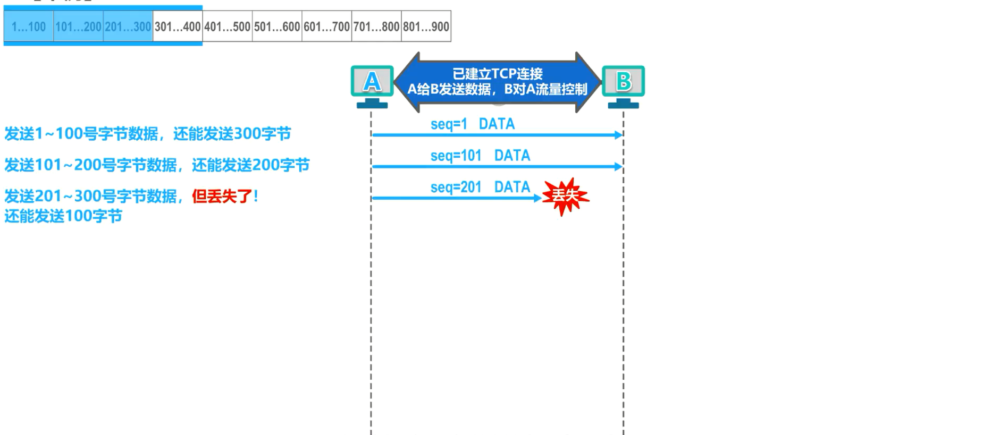
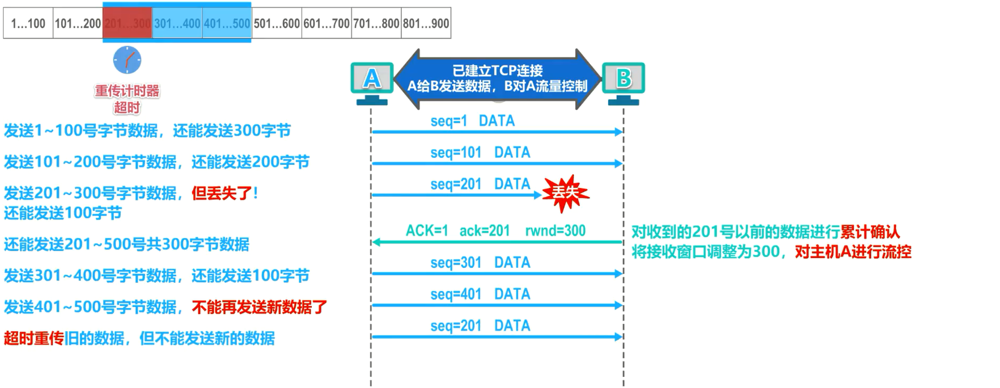
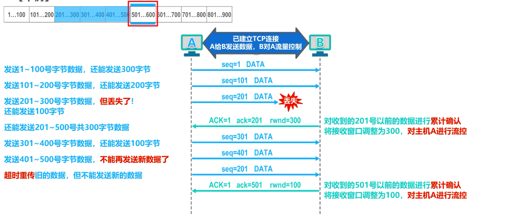
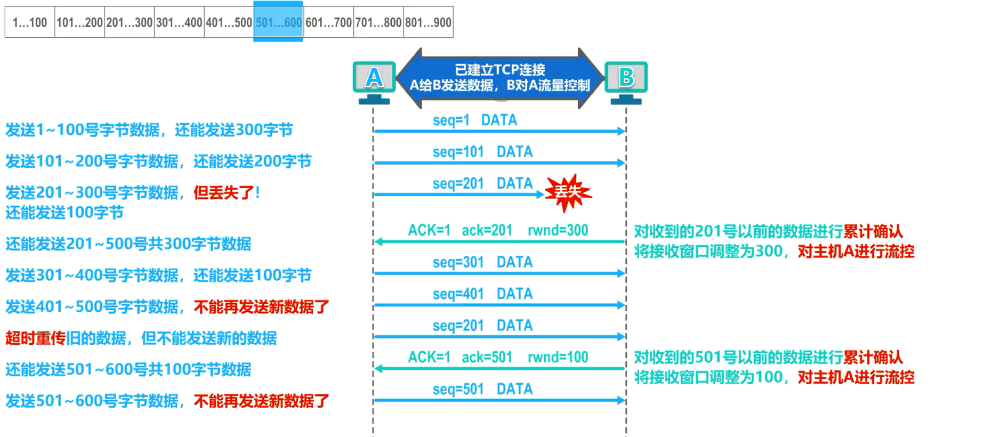
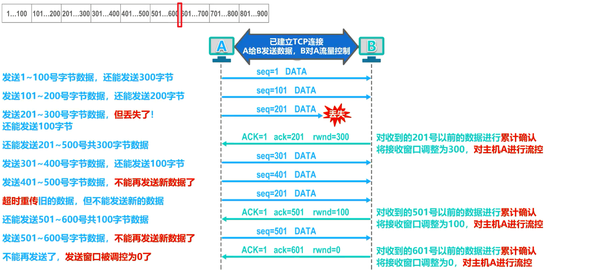
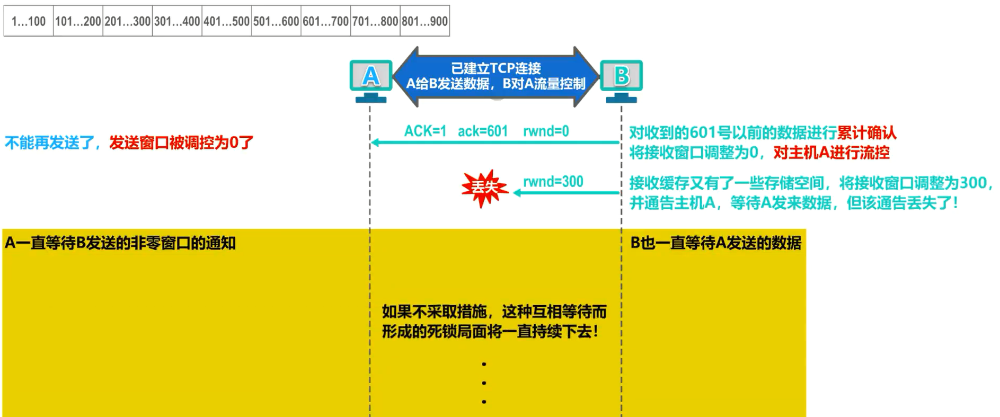
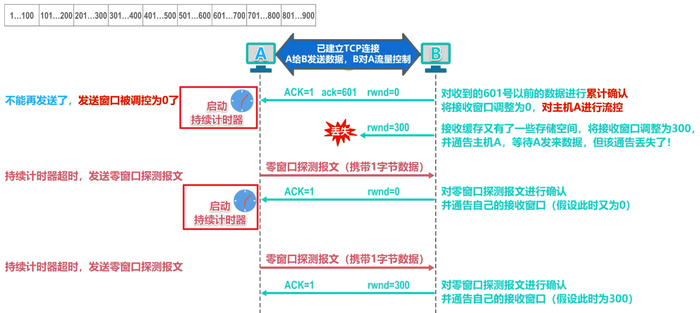
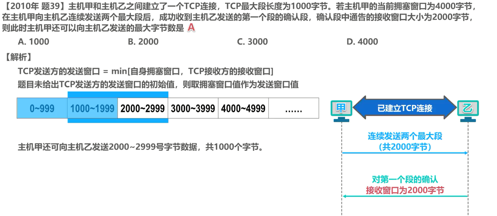
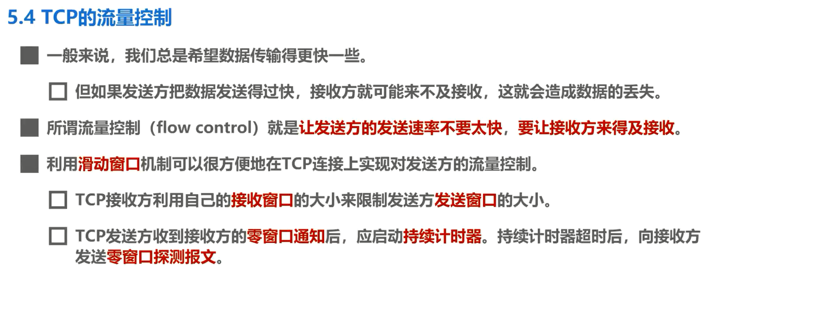

# 5-4 TCP的流量控制

一般来说，我们总是希望数据传输的更快一些，但如果发送方把数据发送的过快，接收方就可能来不及接收，这就会造成数据的丢失。

**流量控制**：就是**让发送方的发送速率不要太快，要让接收方来得及接收**。利用**滑动窗口机制**，可以很方便的在 **TCP 连接**上实现对发送方的流量控制。

## 举例说明TCP的滑动窗口机制实现流量控制

我们来举例说明，假设主机A和B是英特网上的两台主机，它们之间已经建立了 TCP 连接，A给B发送数据，B对A进行流量控制，这是主机A中待发送数据的字节序号。假设主机A发送的**每个 TCP 报文段可携带 100 字节数据**，因此图中每个小格子表示 100 个字节数据的序号。

在主机A和B建立 TCP 连接时，B告诉A：我的接收窗口为400。因此主机A将自己的发送窗口也设置为400。这意味着主机A在未收到主机B发来的确认时，可将序号落入发送窗口中的全部数据发送出去。

接下来我们举例说明主机B对A的流量控制。

主机A将发送窗口内序号 1- 100 的数据封装成一个 TCP 报文段发送出去，发送窗口内还有 300 字节可以发送。这里的 seq 是 TCP 报文段首部中的序号。字段取值 1 表示 TCP 报文段数据载和的第一个字节的序号是1，这里的 DATA 表示这是 TCP 数据报文段。主机A将发送窗口内序号 101- 200 的数据封装成一个 TCP 报文段发送出去，发送窗口内还有 200 字节可以发送。主机A将发送窗口内序号 201- 300 的数据封装成一个 TCP 报文段发送出去，但该报文段在传输过程中丢失了。主机A发送窗口内还有 100 字节可以发送。

**这时候**，主机B对主机A所发送的 201 号以前的数据进行累积确认，并在该累积确认中**将窗口字段的值调整为300**，也就是对主机A进行流量控制。

这里的大写ACK 是 TCP报文段手部中的标志位取值1，表示这是一个 TCP 确认报文段，小写ack 是TCP报文段首部中的确认号字段，取值 201 表示序号 201 之前的数据已全部正确接收，现在希望收到序号 201 及其后续数据。rwnd 是 TCP 报文段首部中的窗口字段，取值 300 表示自己的接收窗口大小为300。

主机A收到该累计确认后，将发送窗口向前滑动时，已发送并收到确认的这些数据的序号移出发送窗口。由于主机B在该累积确认中将自己的接收窗口调整为了300，因此主机A相应的将自己的发送窗口调整为300。

目前主机A发送窗口内的序号为 201- 500，也就是主机A还可以发送这 300 字节。其中 201- 300 号字节是已发送的数据，若重传计时器超时，他们会被重传。 301 号到 400 号字节以及 401 号到 500 号字节还未被发送，可以被分别封装在一个 TCP 报文段中发送。主机A现在可将发送缓存装序号 1- 200 的字节数据全部删除了，因为已经收到了主机B对他们的累积确认。

主机A将发送窗口内序号 301- 400 的数据封装成一个 TCP 报文段发送出去，发送窗口内还有 100 字节可以发送。主机A将发送窗口内序号 401- 500 的数据封装成一个 TCP 报文段发送出去。至此，序号落在发送窗口内的数据已经全部发送出去了，不能再发送新数据了。

而后，发送窗口内序号 201- 300 这 100 个字节数据的重传计时器超时了(即没等到对应的确认报文)，主机A将他们重新封装成一个 TCP 报文段发送出去，暂时不能发送其他数据。

主机B收到该重传的 TCP 报文段后，对主机A所发送的 501 号以前的数据进行累积确认，并在该累计确认中将窗口字段的值调整为100。这是主机B对主机A进行的**第二次流量控制**。

主机A收到该累计确认后，将发送窗口向前滑动时，已发送并收到确认的这些数据的序号移出发送窗口。由于主机B在该累计确认中将自己的接收窗口调整为了100，因此主机A相应的将自己的发送窗口调整为100。

目前，主机A发动窗口内的序号为 501- 600，也就是主机A还可以发送这 100 字节。主机A现在可将发送缓存中序号 201- 500 的字节数据全部删除了，因为已经收到了主机B对他们的累积确认。

主机A将发送窗口内序号 501- 600 的数据封装成一个 TCP 报文段发送出去，至此，序号落在发送窗口内的数据已经全部发送出去了，不能再发送新数据了。

主机B对主机A所发送的 601 号以前的数据进行累积确认，并在该累积确认中将窗口字段的值调整为0。这是主机B对主机A进行的**第三次流量控制**，主机A收到该累计确认后，将发送窗口向前滑动时，已发送并收到确认的这些数据的序号移出发送窗口。由于主机B在该累积确认中将自己的接收窗口调整为了0，因此主机A相应的将自己的发送窗口调整为0。

目前主机A不能再发送**一般的 TCP 报文段**了，主机A现在可将发送缓存中序号 501- 600 的字节数据全部删除了，因为已经收到了主机B对他们的累积确认。

……以此来控制发送方的流量，待接收方缓存有空间，再向发送方发送调整接收窗口的报文

### 接收方发送的调整窗口大小的报文丢失导致死锁——引入持续计时器

假设主机B向主机A发送了临窗口的报文段后不久，主机B的接收缓存又有了一些存储空间，于是主机B向主机A发送了接收窗口等于 300 的报文段，然而这个报文段在传输过程中丢失了。主机A一直等待主机B发送的非 0 窗口的通知，而主机B也一直等待主机A发送的数据。如果不采取措施，这种互相等待而形成的死锁局面将一直持续下去。

为了解决这个问题， TCP 为每一个连接设有一个持续计时器，只要 TCP 连接的一方收到对方的**零窗口通知**，就要启动持续计时器。若持续计时器超时，就发送一个**零窗口探测报文**，该报文仅携带一字节的数据，而对方在**确认这个探测报文段时，给出自己现在的接收窗口值**。

如果接收窗口仍然是0，那么收到这个报文段的一方就重新启动持续计时器。如果接收窗口不是0，那么死锁的局面就可以被打破了。

在本例中，主机A收到 0 窗口通知时，就启动一个持续计时器，当持续计时器超时，主机A立刻发送一个仅携带 1 字节数据的 0 窗口探测报文段。假设主机B此时的接收窗口又为 0 了，主机B就在确认这个 0 窗口探测报文段时，给出自己现在的接收窗口值为0，主机A再次收到 0 窗口通知，就重新启动一个持续计时器。当持续计时器超时，主机A立刻发送一个 0 窗口探测报文段。假设主机B此时的接收缓存又有了一些存储空间，于是将自己的接收窗口调整为了300，主机B就在确认这个 0 窗口探测报文段时，给出自己现在的接收窗口值为300，这样就打破了死锁的局面。

同学们可能会有这样的疑问，主机A所发送的 0 窗口探测报文段到达主机B时，如果主机B此时的接收窗口仍然为0，那么主机B根本就无法接受该报文段，又怎么会针对该报文段给主机A发回确认呢？实际上， **TCP 规定即使接收窗口为0，也必须接受零窗口探测报文段、确认报文段以及携带有紧急数据的报文段**。

请大家再来思考一下这个问题，如果零窗口探测报文段丢失了，会出现怎样的问题？还能否打破死锁的局面？回答是肯定的，因为零窗口探测报文段也有重传计时器，当重传计时器超时后，零窗口探测报文段会被重传。

## 练习

解析：这是主机假装待发送数据的序号，根据提议可知，主机甲的发动窗口为 4 千字节，主机甲向主机乙连续发送两个最大段，共 2 千字节，也就是将发送窗口内序号 0- 1999 的字节数据发送出去。主机乙给主机甲发送针对第一个段的确认，并在该确认中给出自己当前的接收窗口大小为 2 千字节。主机甲收到该确认后，将发送窗口向前滑动时已发送并收到确认的第一个段的序号，移出发送窗口。由于主机已在确认中给出的自己的接收窗口大小为 2 千字节，因此主机甲相应的将自己的发送窗口调整为 2 千字节。很显然，主机甲还可以向主机乙发送 2000- 2999 号字节数据，共 1000 个字节。

## 本节小结

