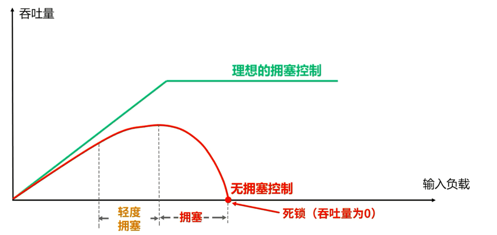
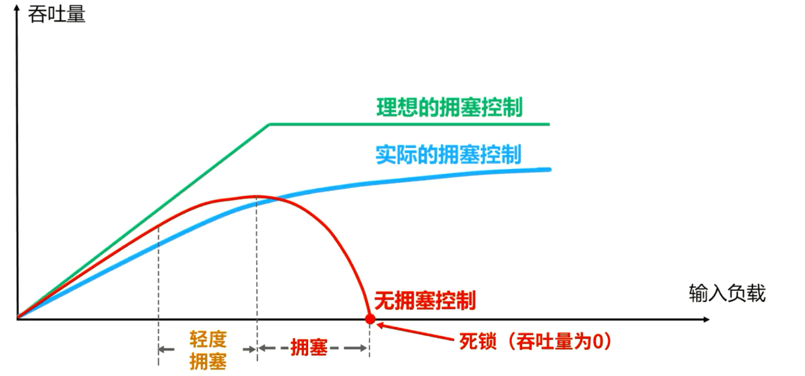
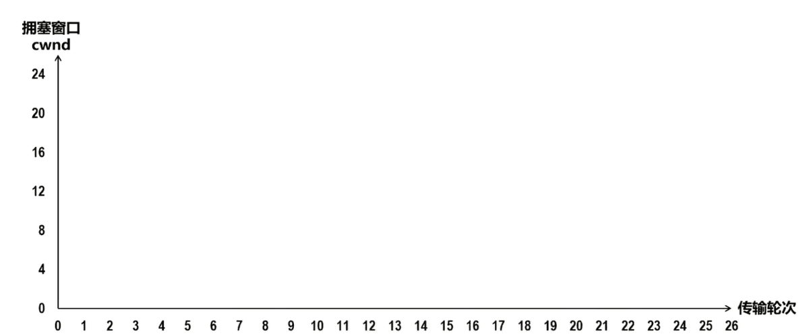
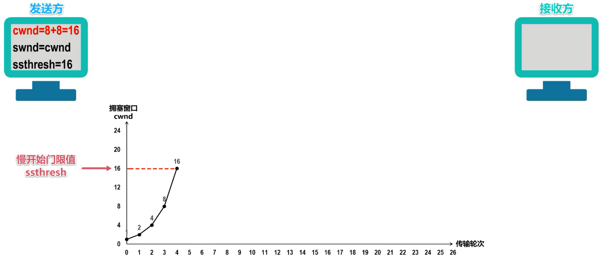
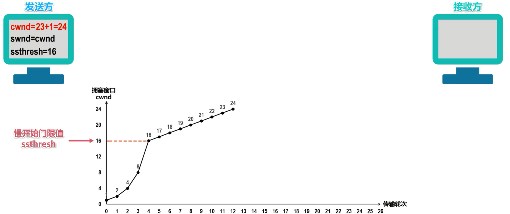
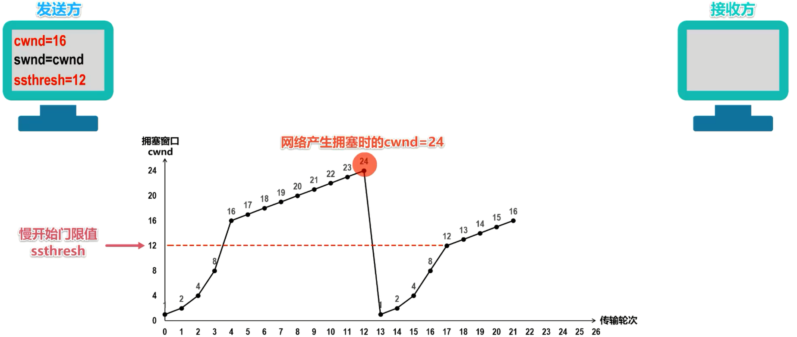
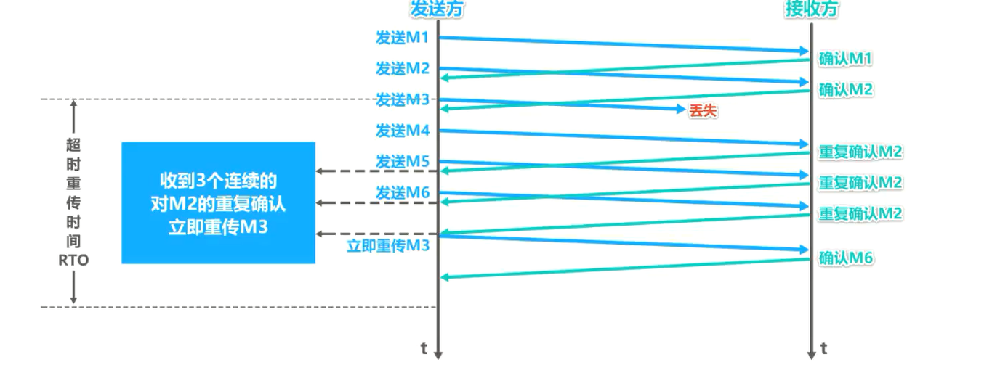
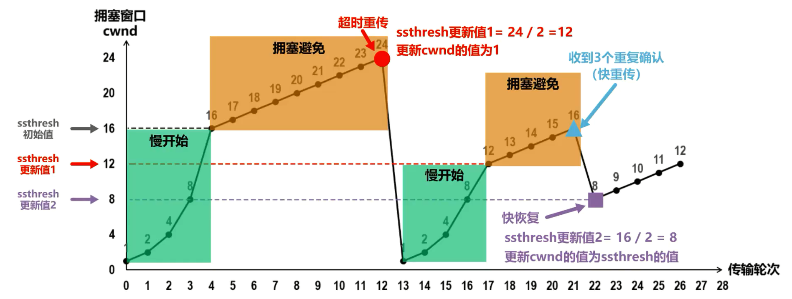
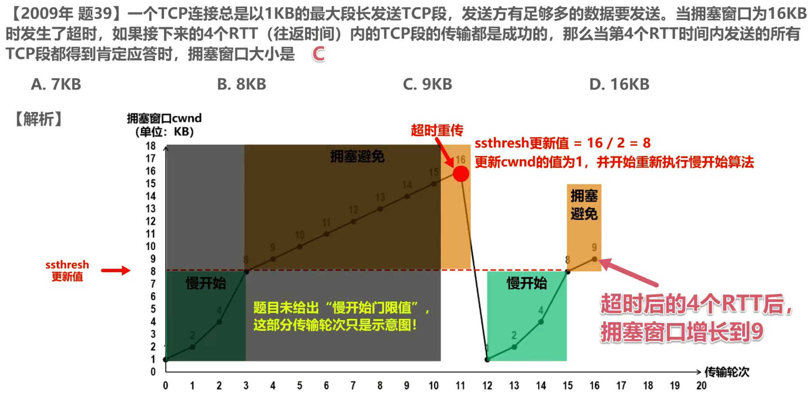
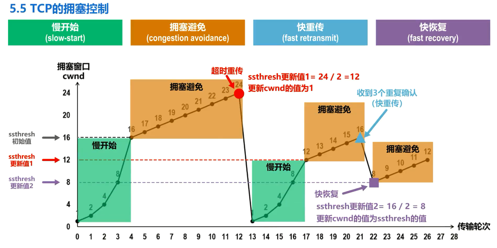

# TCP的拥塞控制

拥塞控制：在某段时间，若**对网络中某一资源的需求超过了该资源所能提供的可用部分，网络性能就要变坏**，这种情况就叫做拥塞。

- 在计算机网络中的链路容量、交换节点中的缓存和处理机等都是网络的资源

若**出现拥塞而不进行控制**，整个网络的**吞吐量将随输入负载的增大而下降**。

我们使用下图来说明拥塞控制的作用。

横坐标是输入负载，代表单位时间内**输入**给网络的分组数量。

纵坐标是吞吐量，代表单位时间内从网络**输出**的分组数量。

具有理想拥塞控制的网络，在吞吐量达到饱和之前，网络吞吐量应**等于**所输入的负载，故吞吐量曲线是 45 度的斜线。但当输入负载超过某一限度时，由于网络资源受限，吞吐量就不再增长而保持水平线，也就是吞吐量达到饱和。这就表明输入的负载中有一部分损失掉了，例如输入到网络中的某些分组被某个节点丢弃了。虽然如此，在这种理想的拥塞控制作用下，网络的吞吐量仍然维持在其所能达到的最大值。

然而实际的网络情况就很不同了，我们再来看这条吞吐量曲线。随着输入负载的增大，网络吞吐量的增长率逐渐减小，也就是在网络吞吐量还未达到饱和时，就已经有一部分的输入分组被丢弃了。当网络的吞吐量明显的小于理想的吞吐量时，网络就进入了轻度拥塞的状态。更值得注意的是，当输入负载到达某一数值时，网络的吞吐量反而随输入负载的增大而减小，这时网络就进入了拥塞状态。当输入负载继续增大到某一数值时，网络的吞吐量就减小为0，此时网络就无法工作了，这就是所谓的死锁。

因此，进行拥塞控制是非常有必要的。实际的拥塞控制曲线应该尽量接近理想的拥塞控制曲线，如下图蓝色线所示

接下来我们介绍 TCP 的 4 种拥塞控制算法，它们分别是，慢开始、拥塞避免、快重传、快恢复。

我们来举例说明 TCP 这 4 种拥塞控制算法的基本原理。为了集中精力讨论拥塞控制，我们假定如下条件：

1. 数据是单方向传送的，而另一个方向只传送确认。
2. 接收方总是有足够大的缓存空间，因而发送方发送窗口的大小仅由网络的拥塞程度来决定。
3. 以 TCP 最大报文段的个数为讨论问题的单位，而不是以字节为单位

## 慢开始(slow-start)和拥塞避免(congestion avoidance)

假设这是 TCP 的发送方和接收方，发送方给接收方发送 TCP 数据报文段，接收方收到后给发送方发送 TCP 确认报文段。

发送方要维护一个叫做**拥塞窗口cwnd**的状态变量，其值**取决于网络的拥塞程度，并且动态变化**。

- **拥塞窗口cwnd的维护原则**是：只要网络**没有出现拥塞**，拥塞窗口就再**增大**一些，但只要网络**出现拥塞**，窗口就**减小**一些
- **判断出现网络拥塞的依据**：是没有按时收到应当到达的确认报文段，也就是发生了**超时重传**。

发送方将拥塞窗口作为**发送窗口swnd**，也就是发送窗口等于拥塞窗口，即**swnd=cwnd**。

发送方还需要维护一个叫做**慢开始门限ssthresh**的状态变量：

- 当拥塞窗口小于慢开始门限时，即cwnd < ssthresh时，使用慢开始算法
- 当拥塞窗口大于慢开始门限时，即cwnd > ssthresh时，停止使用慢开始算法而改用拥塞避免算法
- 当拥塞窗口等于慢开始门限时，即cwnd = ssthresh时，既可以使用慢开始算法，也可以使用拥塞避免算法

### 慢开始算法(slow-start)

为了更清楚地显示出拥塞控制过程，我们还可以绘制这样一幅拥塞窗口随传输轮次变化的图

横坐标为传输轮次。传输轮次是指发送方给接收方发送数据报文段后，接收方给发送方发回相应的确认报文段。一个传输轮次所经历的时间其实就是往返时间。请注意，往返时间并非是恒定的数值，**使用传输轮次是为了强调把把拥塞窗口所允许发送的报文段都连续发送出去，并已收到了对已发送的最后一个报文段的确认**。

纵坐标是拥塞窗口，它会随网络拥塞程度以及所使用的拥塞控制算法动态变化。在 TCP 双方建立逻辑连接关系时，拥塞窗口的值被**设置为1**。我们在图上标出传输轮次 0 时的拥塞窗口值为1。另外还需设置**慢开始门限的初始值**，本例采用16，我们也将它在图中标出。

在执行慢开始算法时，**发送方每收到一个对新报文段的确认时，就把拥塞窗口值加1**，然后开始下一轮的传输。当拥塞窗口值增长到慢开始门限值时，就改为执行拥塞避免算法。

 

由于发送方当前的拥塞窗口值是1，而发送窗口值等于拥塞窗口值，因此发送方当前只能发送一个 TCP 数据报文段。换句话说，拥塞窗口值是几，就能发送几个数据报文段。如图所示，发送方发送 0 号数据报文段，接收方收到后给发送方发回对 0 号报文段的确认报文段

发送方收到该确认报文段后，将拥塞窗口值加 1 ，增大到2，我们在图中标出该值，这意味着发送方现在可以发送 1- 2 号，共两个数据报文段，接收方收到后给发送方发回对 1- 2 号报文段的确认报文段。

发送方收到后将拥塞窗口值加 2 ，增大到4，我们在图中标出该值。发送方现在可以发送 3- 6 号共 4 个数据报文段，接收方收到后给发送方发回对 3- 6 号报文段的确认报文段

发送方收到后将拥塞窗口值加 4 ，增大到8，我们在图中标出该值。发送方现在可以发送 7- 14 号共 8 个数据报文段，接收方收到后给发送方发回对 7- 14 号报文段的确认报文段

发送方收到后将拥塞窗口值加 8 ，增大到16，我们在图中标出该值——拥塞避免算法

### 拥塞避免算法(congestion avoidance)

发送方当前的拥塞窗口值**已经增大到了慢开始门限值**之后，我们要改用拥塞避免算法，也就是**每个传输轮次结束后，拥塞窗口值只能线性加1**，而不像慢开始算法那样，每个传输轮次结束后，拥塞窗口值按指数规律增长。

发送方现在可以发送15到30号共 16 个数据报文段，接收方收到后给发送方发回对 15- 30 号报文段的确认报文段，发送方收到后将拥塞窗口值**加 1， 增大到17**，我们在图中标出该值。

发送方现在可以发送 31- 47 号共 17 个数据报文段，接收方收到后给发送方发回对 31- 47 号报文段的确认报文段，发送方收到后将拥塞窗口值**加 1 ，增大到18**，我们在图中标出该值。

随着传输轮次的增加，拥塞窗口值每轮次都线性加1。例如，当前拥塞窗口值增加到了24，发送方现在可以发送 171- 194 号共 24 个数据报文段。假设这 24 个数据报文段在传输过程中**丢失了几个**，这必然会造成发送方对这些丢失报文段的**超时重传**。发送方以此判断网络很可能出现了拥塞，需要进行以下工作：

1. 将慢开始门限值更新为发生拥塞时拥塞窗口值的一半，网络发生拥塞时的拥塞窗口值是24，因此更新慢开始门限值为该值的一半，即12
2. 将拥塞窗口值减小为1，并重新开始执行慢开始算法。当慢开始执行到拥塞窗口值增大到新的慢开始门限值时，就停止使用慢开始算法，转而执行拥塞避免算法

通过本例可以看出， TCP 发送方 1 开始使用慢开始算法让拥塞窗口值从 1 开始按指数规律增大。当拥塞窗口值增大到慢开始门限值时，停止使用慢开始算法，转而执行拥塞避免算法，让拥塞窗口值按线性加 1 的规律增大。当发生超时重传时，就判断网络很可能出现了拥塞。采取相应的措施，一方面将慢开始门限值更新为发生拥塞时拥塞窗口值的一半；另一方面将拥塞窗口值减小为1，并重新开始执行慢开始算法，拥塞窗口值又从 1 开始按指数规律增大。当增大到了新的慢开始门限值时，停止使用慢开始算法，转而执行拥塞避免算法，让拥塞窗口值按线性加 1 的规律增大。

需要注意的是，“慢开始”是指**一开始向网络注入的报文段少**，而并不是指拥塞窗口值增长速度慢。拥塞避免也**并非指完全能够避免拥塞**，而是只在拥塞避免阶段将拥塞窗口值控制为按限进规律增长，使网络比较不容易出现拥塞

## 快重传(fast retransmit)和快恢复(fast recovery)

慢开始和拥塞避免是 1988 年就提出的 TCP 拥塞控制算法，也就是 TCP Tahoe版本。 1990 年又增加了两个新的拥塞控制算法，以便**改进 TCP 的性能**，这就是快重传和快恢复，被称为 TCP Reno 版本。

### 快重传算法(fast retransmit)

有时**个别报文段会在网络中丢失**，但实际上网络**并未发生拥塞**，这将导致发送方超时重传，并误认为网络发生了拥塞。例如，在之前的例子中，当拥塞窗口值增大到 24 时，发生了超时重传，而网络此时并没有发生拥塞，但是发送方却误认为网络发生了拥塞，于是发送方把**拥塞窗口值减小为1，并错误地起到慢开始算法，因而降低了传输效率**。

采用快重传算法可以**让发送方尽早知道发生了个别报文段的丢失**。所谓快重传，就是**使发送方尽快进行重传，而不是等超时重传计时器超时再重传**。

- 要求接收方不要等待自己发送数据时才进行捎带确认，而是要**立即发送确认**
- 即使收到了失序的报文段(即中途有些序号的报文段丢失导致失序)，也要立即发送对已收到的报文段的**重复确认**

- 发送方一旦**收到 3 个连续的重复确认**，就将相应的报文段**立即重传**，而不是等该报文段的重传计时器超时再重传。
- 对于个别丢失的报文段，发送方不会出现超时重传，也就不会误认为出现了拥塞，而错误的降低拥塞窗口值为最小值1，使用快重传可以使整个网络的吞吐量提高约20%。

举例说明快重传算法。

发送方发送 1 号数据报文段，接收方收到后给发送方发回对 1 号报文段的确认。在该确认报文段到达发送方之前，发送方还可以将发送窗口内的 2 号数据报文段发送出去，接收方收到后给发送方发回对 2 号报文段的确认。在该确认报文段到达发送方之前，发送方还可以将发送窗口内的 3 号数据报文段发送出去，但该报文段丢失了，接收方自然不会给发送方发回。

针对该报文段的确认，发送方还可以将发送窗口内的 4 号数据报文段发送出去，接收方收到后发现这不是按序到达的报文段，因此给发送方发回针对 2 号报文段的重复确认，表明，我现在希望收到的是 3 号报文段，但是我没有收到 3 号报文段，而是收到了未按序到达的报文段。

发送方还可以将发送窗口内的 5 号数据报文段发送出去，接收方收到后发现这不是按序到达的报文段，因此给发送方发回针对 2 号报文段的重复确认，发送方还可以将发送窗口内的 6 号数据报文段发送出去。接收方收到后发现这不是按序到达的报文段，因此给发送方发回针对 2 号报文段的重复确认，至此，发送方会**收到 3 个连续的对 2 号报文段的重复确认，就立即重传 3 号报文段**，接收方收到后给发送方发回针对 6 号报文段的确认，表明序号到 6 为止的报文段都正确接收了，这样就不会造成对 3 号爆文段的超时重传，而是提早进行了重传。

对于个别丢失的报文段，发送方不会出现超时重传，也就不会误认为出现了拥塞，而错误的降低拥塞窗口值为最小值1。使用快重传可以使整个网络的吞吐量提高约20%。

### 快恢复算法(fast recovery)

再来看快恢复算法，发送方一旦收到 3 个重复确认，就知道现在只是丢失了个别的报文段，于是不启动慢开始算法，而是执行**快恢复算法**：

- 发送方将慢开始门限值和拥塞窗口值调整为当前窗口值的一半，开始执行拥塞避免算法(即拥塞窗口从慢开始门限值开始+1)
- 也有的快恢复实现，是把快恢复开始时的拥塞窗口值再增大一些，也就是等于新的慢开始门限值ssthresh+3。
  - 这样做的理由是，既然发送方收到 3 个重复的确认，就表明有 3 个数据报文段已经离开了网络
  - 这 3 个报文段不再消耗网络资源，而是停留在接收方的接收缓存中
  - 可见现在网络中不是堆积了报文段，而是减少了 3 个报文段。因此可以适当把拥塞窗口值扩大一些。

接下来，我们给出 TCP 拥塞窗口值在拥塞控制时的变化情况举例，里面包含了 TCP 拥塞控制的 4 种算法

TCP 发送方 1 开始使用慢开始算法，让拥塞窗口值从 1 开始按指数规律增大。

当增大到慢开始门限初始值时，停止使用慢开始算法，转而执行拥塞避免算法让拥塞窗口直按线性加 1 的规律增大。

当发生超时重传时，就判断网络可能出现了拥塞。采取相应的措施，一方面将慢开始门限值更新为发生拥塞时拥塞窗口值的一半，另一方面将拥塞窗口值减小为1，并重新开始执行慢开始算法。拥塞窗口值又从 1 开始按指数规律增大，当增大到了新的慢开始门限值时，停止使用慢开始算法，转而执行拥塞避免算法，让拥塞窗口值按线性加 1 的规律增大。

当发送方收到 3 个重复的确认时，就进行快重传和快恢复，也就是更新慢开始门限值为当前拥塞窗口值的一半，并**将拥塞窗口值也取为新的慢开始门限值**，转而执行拥塞避免算法，让拥塞窗口值按线性加 1 的规律增大。

## 习题

最后我们来做一个相关的练习题，这是计算机专业考研全国统考计算机网络部分 2009 年的题。39。请同学们暂停播放视频思考一下，给出你的答案。答案是选项C，根据题意，我们可以画出发送方拥塞窗口值随传输轮次的变化图。这是慢开始部分。当拥塞窗口值增大到慢开始门限的初始值时，停止使用慢开始算法，转而执行拥塞避免算法。根据提议，当拥塞窗口值增大到 16K 字节时，发生了超时重传，于是将慢开始门限值更新为当前拥塞窗口值的一半，并将拥塞窗口值减小为 1K 字节，并重新开始执行慢开始算法。当拥塞窗口值增大到新的慢开始门限值时，停止使用慢开始算法，转而执行拥塞避免算法。可以看到，该处就是题目所问的在超时后的 4 个往返时间后，也就是在超时后的 4 个传输轮次结束后，拥塞窗口值增长到 9K 字节。需要说明的是，题目并未给出慢开始门限值的初始值，因此这部分传输轮次只是释义，目的是为了让大家能够更好的理解。

## 本节小结

