# 5-6 TCP超时重传时间的选择

TCP 超时重传时间的选择是 TCP 最复杂的问题之一。

## 超时重传时间RTO的确定

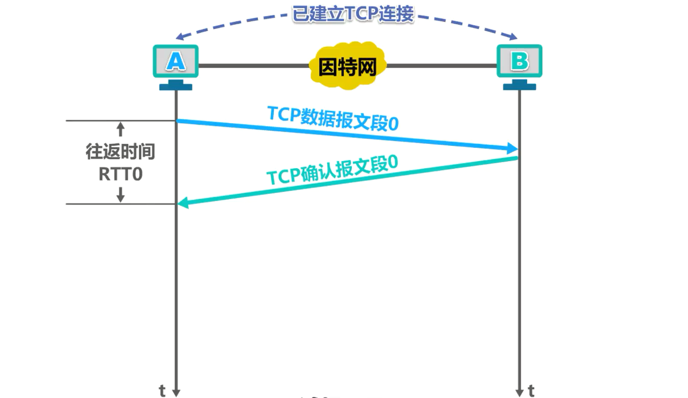

我们来举例说明。假设主机 A 和 B 是英特网上的两台主机，它们之间已经建立了 TCP 连接，纵坐标为时间。现在主机 A 给主机 B 发送 TCP 数据报文段0，并记录下当前的时间。主机 B 收到后，给主机 A 发送相应的确认报文段，主机 A 收到确认报文段后，记录下当前的时间。那那么主机 A 记录下的这两个时间，它们的差值就是报文段的往返时间 RTT。由于这是第 0 个报文段的 RTT，我们就用 RTT 0 来表示。

如果我们将超时同传时间 RTO 的值设置的比 RTT 0 的值小，会引起报文段不必要的重传，使网络负荷增大。

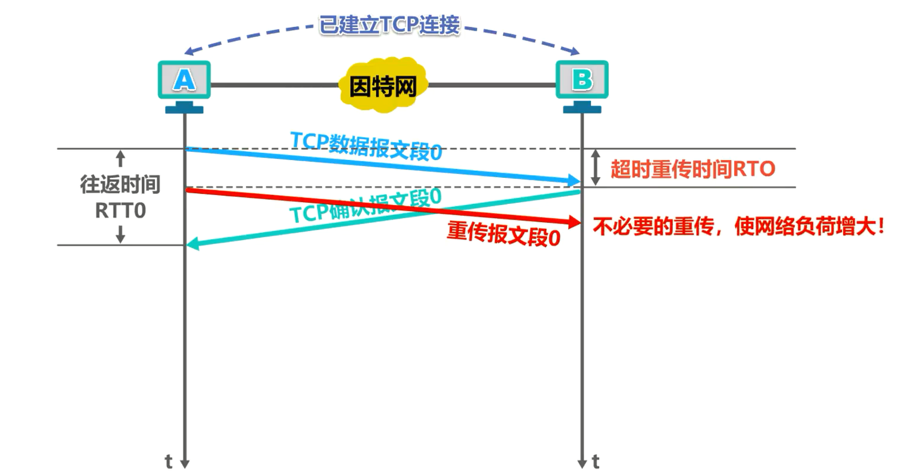

如果将超时重传时间 RTO 的值设置的远大于 RTT0 的值，会使重传推迟的时间太长，使网络的空闲时间增大，降低了传输效率。

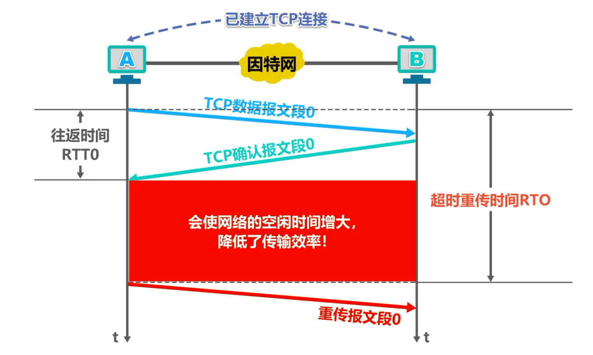

综合上述两种情况，我们可以得出这样的结论，**超时重传时间 RTO 的值应该设置为略大于报文段往返时间 RTT 的值**。至此，同学们可能会觉得超时重穿时间的选择也并不是很复杂。然而， TCP 下层是复杂的互联网环境，主机 A 所发送的报文段可能只经过一个高速率的局域网，也有可能经过多个低速率的网络，并且每个 IP 数据报的转发路由还可能不同。

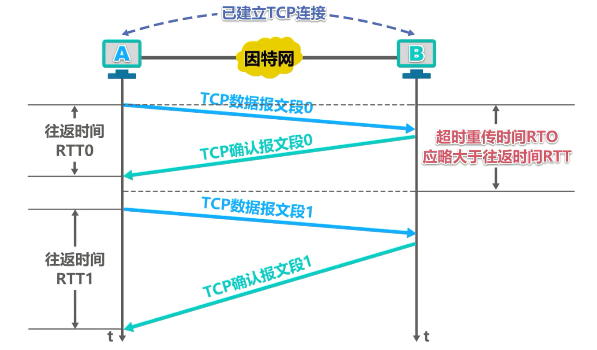

例如现在主机 A 给主机 B 发送 TCP 数据报文段1，主机 B 收到后给主机 A 发送相应的确认报文段。主机 A 这次测得的报文段往返时间 RTT1 如图所示，显然 RTT1 远大于RTT0。如果超时重装时间 RTO 还是我们之前所确定的略大于 RTT0 的话，这对于数据报文段 1 是不合适的，会造成该报文段不必要的重传。这样看来，超时重传时间的选择确实不那么简单了

## 用测量到的往返时间RTT样本计算加权平均往返时间RTTs

- 不能直接使用某次测量得到的 RTT 样本来计算超时重装时间 RTO。

- 可以利用**每次测量得到的 RTT 样本计算加权平均往返时间 RTT s**，又称为**平滑的往返时间**。

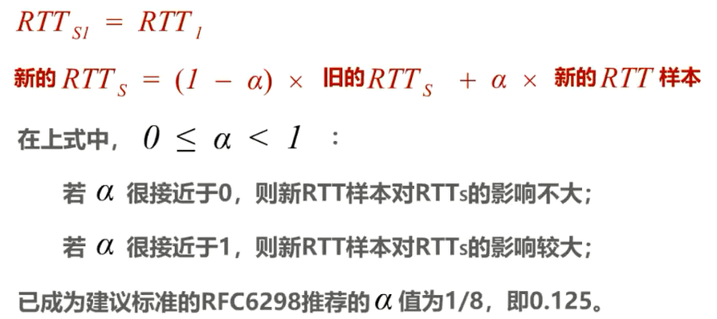

当测量到第一个 RTT 样本时， RTTs 的值直接取为第一个 RTT 样本的值。以后每测量到一个 RTT 样本时，都按该公式来计算新的 RTTs 值。在上式中，α的取值大于等于 0 且小于1。若α很接近于0，则新 RTT 样本对 RTTs的影响不大。若α很接近于1，则新 RTT 样本对 RTTs 的影响较大。已成为建议标准的 RFC 6298 推荐的α为 1/ 8 即0. 125，用这种方法得出的加权平均往返时间 RTTs 的值就比测量出的 RTT 的值更加平滑。

显然，**超时重传时间 RTO 的值应略大于加权平均往返时间 RTTs 的值**。下面我们给出 RFC 6298 建议使用的超时重穿时间 RTO 的计算公式。

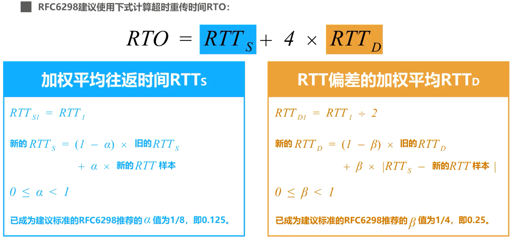

该公式中的 RTTs 是加权平均往返时间，我们刚刚介绍过它的计算方法。 RTT D 是 RTT 偏差的加权平均计算方法如下，当测量到第一个 RTT 样本时， RTT d 的值取为该样本值的一半。以后每测量到一个 RTT 样本时，都按该公式来计算新的 RTT d 的值。在上市中，贝塔的取值大于等于 0 且小于1，已成为建议标准的 RFC 6298 推荐的 BetA 值为 1/ 4 即 0.25。

我们可以发现，不管是 RTTs 还是RTTD，都是基于所测量到的 RTT 样本进行计算的。如果所测量到的 RTT 样本不正确，那么所计算出的 RTT s 和 RTT d 自然就不正确，进而所计算出的超时重穿时间 RTO 也就不正确。然而，往返时间RTT的测量确实是比较复杂的，我们来举例说明。

## 往返时间RTT的准确测量

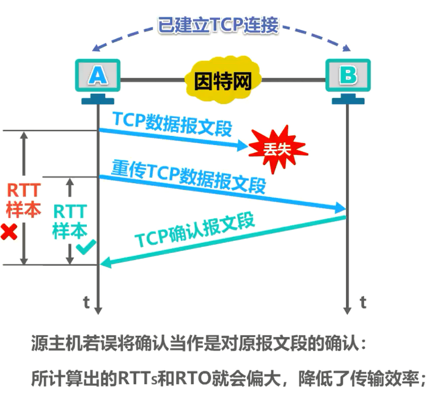

主机 A 给主机 B 发送 TCP 数据报文段，但该报文段在传输过程中丢失了。当超时重传计时器超时后，主机 A 就重传该报文段，主机 B 收到后给主机 A 发送确认报文段。现在问题来了，主机 A 收到该确认报文段后，无法判断该报文段是对原报文段的确认还是对重传报文段的确认。该报文段实际上是对重传报文段的确认，也就是说，正确的 RTT应该是这一段时间。但是，如果主机 A 误将该确认当作是对原报文段的确认，也就是误认为这段时间是RTT，则所计算出的 RTTs 和 RTO 就会偏大，降低了传输效率。

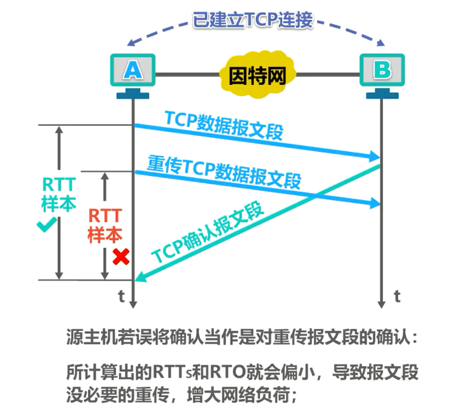

再来看另一种情况，主机 A 给主机 B 发送 TCP 数据报文段，主机 B 收到后给主机 A 发送确认报文段，由于某种原因，该确认报文段没有在正常时间内到达主机A，这必然会导致主机 A 对之前所发送的数据报文段的超时重传。现在问题又来了，主机 A 收到迟到的确认报文段后，无法判断该报文段是对原报文段的确认还是对重传报文段的确认。该报文段实际上是对原报文段的确认，也就是说，正确的 RTT 应该是这一段时间。但是，如果主机 A 误将该确认当作是对重传报文段的确认，也就是误认为这段时间是RTT，则所计算出的 RTTs 和 RTO 就会偏小，这会导致报文段没有必要的重传，增大网络负荷。

通过这两个例子可以看出，当发送方出现超时重传后，收到确认报文段时，是无法判断出该确认到底是对原报文段的确认还是对重传报文段的确认，也就是无法准确测量出 RTT，进而无法正确计算超时重传时间 RTO。

因此，针对出现超时重传时无法测准往返时间 RTT 的问题，Karn提出了一个算法：**在计算加权平均往返时间 RTT s 时，只要报文段重传了，就不采用其往返时间 RTT 样本，也就是出现重传时不重新计算RTTs**。进而超时重传时间 RTO 也不会重新计算。

然而，这又引起了新的问题。设想出现这样的情况，报文段的时延**突然增大**了很多，并且之后很长一段时间内都会保持这种时延，因此在原来得出的重传时间内不会收到确认报文段，于是就重传报文段。根据Karn算法，不考虑重传的报文段的往返时间样本，这样超时重传时间就无法更新，这会导致**报文段反复被重传**。因此要对卡恩算法进行修正。方法是报文段每重传一次就把超时重传时间 RTO **增大一些**，典型的做法是将新 RTO 的值取为旧 RTO 值的 2 倍。

## 举例说明TCP超时重传时间的计算

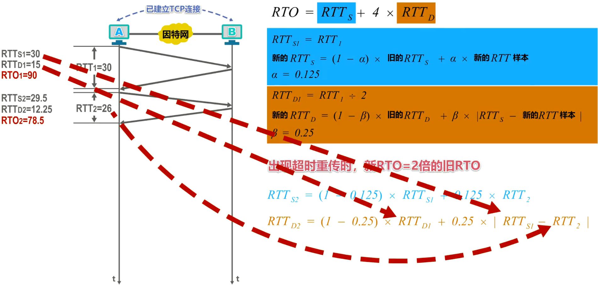

接下来我们举例说明 TCP 超时重传时间的计算，这是测量得到的第一个 RTT 样本 RTT 1，根据 RTTs 1 的计算公式可知 RTTs 1 的值，根据 RTT DE 的计算公式可知 RTT D1 的值，再根据 RTO 的计算公式可计算出 RTO 1 的值

这是测量得到的第二个 RTT 样本RTT 2。根据 RTTs 的计算公式和α的值，可写出计算 RTTs2 的表达式。将之前计算出的 RTTs1 的值和本次测量得到的 RTT 2 的值代入该式，可计算出 RTTs2 的值。根据 RTTD 的计算公式和贝塔的值，可写出计算 RTT 第二的表达式。将之前计算出的 RTT 第一 RTTs1 以及本次测量得到的 RTT 2 的值代入该式，可计算出 RTT D2的值。再根据 RTO 的计算公式可计算出 RTO 2 的值。

对于测量得到的第三个和第四个 RTT 样本，计算可得RTO3和RTO4的值

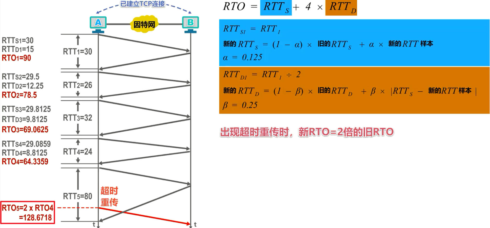

假设这是测量得到的第五个RTO样本，但是根据 RTO 4 的值可知，在收到确认之前就会产生超时重传。我们之前介绍过，若出现超时重传，则不采用上述公式计算 RTO，而是将新 RTO 的值取为旧 RTO 值的 2 倍，因此 RTO 5 的值取为 2 倍的 RTO 4 的值。

## 本节小结

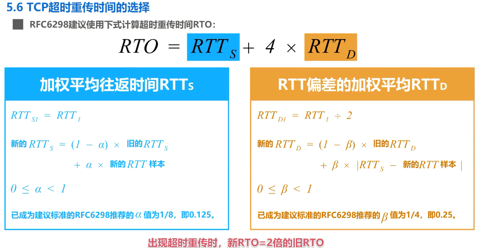

