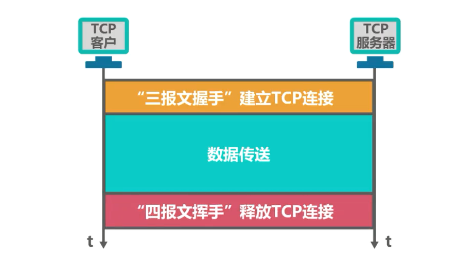
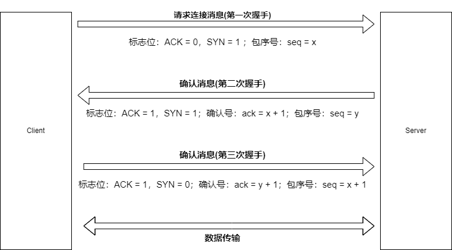
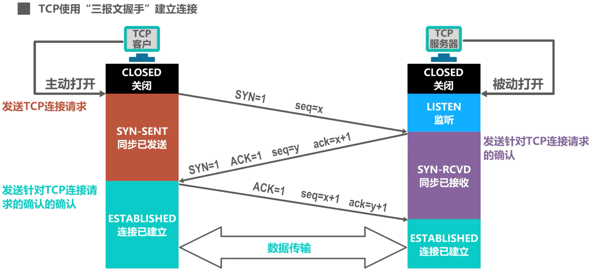
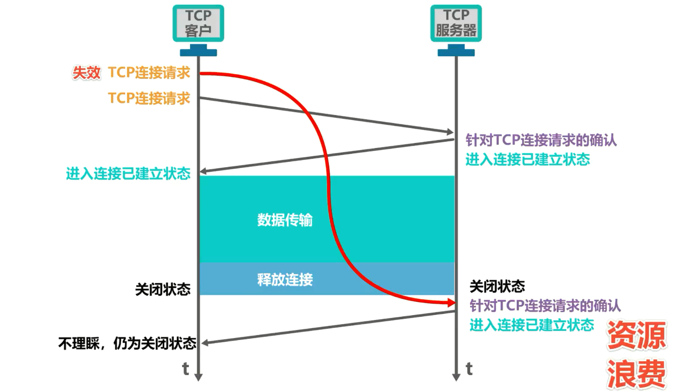
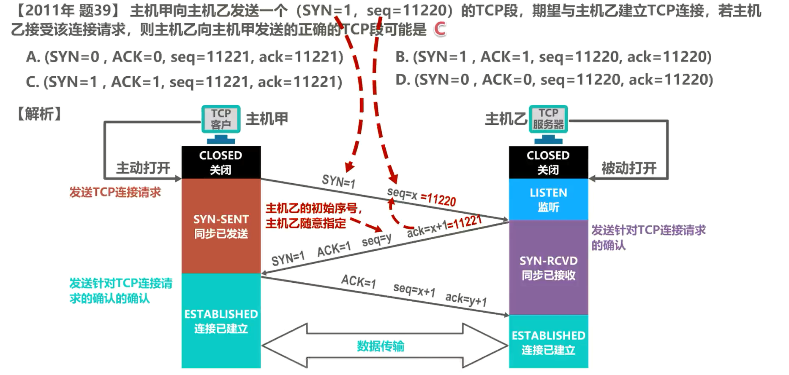
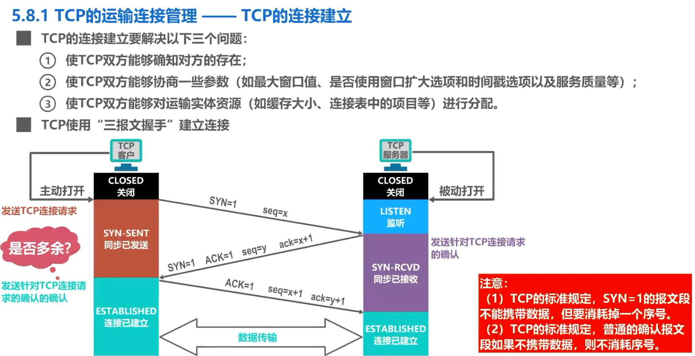

# TCP的运输连接管理—TCP的连接建立

TCP 是面向连接的协议，它基于运输连接来传送 TCP 报文段。 

TCP 运输连接的建立和释放是每一次面向连接的通信中必不可少的过程。 

TCP 运输连接有以下三个阶段：

- 第一个阶段是建立 TCP 连接，也就是通过三报文握手来建立 TCP 连接
- 第二个阶段是数据传送，也就是基于已建立的 TCP 连接进行可靠的数据传输
- 第三个阶段是释放连接，也就是在数据传输结束后，还要通过 4 报文挥手来释放 TCP 连接。

 TCP 的运输连接管理就是使运输连接的建立和释放都能正常的进行。

## TCP连接的建立

### TCP的连接建立要解决以下三个问题

- 第一是TCP双方能够确知对方的存在

- 第二使 TCP 双方能够协商一些参数，例如最大窗口值，是否使用窗口扩大选项和时间戳选项以及服务质量等
- 第三是 TCP 双方能够对运输实体资源，例如缓存大小、连接表中的项目等进行分配。

### 消息属性字段

- 序号-  seq (sequence number)：由于TCP数据包过大，对其进行分段，每一段记为1、2、3、4……，以便之后按顺序重组。设客户端发送来的一个数据包seq = x
- 确认号 - ack (acknowledge number)：存在于确认消息里，依据序号(seq)来编写——ack(确认号) = seq(序号) + 1 = 1 +1 =2，这表示
  1. 服务器期望确认收到seq = 1的数据包
  2. 服务器期望收到的下一个包的序号的seq = 2
- 标志位：称为状态控制码(code control flag)，说明了TCP数据包的类型，共计有6个标志位，各占1位(bit)，重点是以下4个标志位
  - ACK：即acknowledge，确认位——
    - 1：表示此消息是一个确认消息：如服务器返回给客户端的消息
    - 0：即说明此消息不是一个确认消息
  - RST：reset，重置位
    - 1：表示这个消息是一个释放连接的消息，如TCP连接出现错误(主机服务器崩溃)，就断开连接，以请求重新建立连接
    - 0：即说明此消息不是一个要释放连接的消息
  - SYN：synchronous，同步位
    - 1：
      - 表示这个消息是一个发起连接的消息，比如客户端请求发起一个连接时首先发送的消息
      - 确认接受连接消息：当服务器决定接受连接时，其返回的消息中SYN位也应置为1
    - 0：即不符合上述两种情况时，消息的SYN位置为0
  - FIN：final，终止位
    - 1：表示这个发送报文结束、完毕，要释放这个连接，即意味着TCP四次挥手断开连接要开始了
    - 0：即不要求释放连接

### TCP 使用三报文握手建立连接的具体过程

这是两台要基于 TCP 进行通信的主机，其中一台主机中的某个应用进程主动发起 TCP 连接建立，称为 TCP 客户，另一台主机中被动等待 TCP 连接建立的应用进程称为 TCP 服务器。我们可以将 TCP 建立连接的过程比喻为握手，握手需要在 TCP 客户和服务器之间交换 3 个 TCP 报文段。

最初，两端的 TCP 进程都处于**关闭状态**。

一开始， TCP 服务器进程首先创建传输控制块，用来存储 TCP 连接中的一些重要信息，例如 TCP 连接表指向发送和接收缓存的指针、指向重传队列的指针、当前发送和接收序号等。之后就准备接受 TCP 客户进程的连接请求。此时 TCP 服务器进程就要进入**监听状态**，等待 TCP 客户进程的连接请求。TCP 服务器进程是被动等待来自 TCP 客户进程的连接请求，而不是主动发起，因此称为**被动打开连接**。 

TCP 客户进程也是首先创建传输控制块，然后在打算建立 TCP 连接时，向 TCP 服务器进程发送 **TCP 连接请求报文段**，并进入**同步已发送状态**。 TCP 连接请求报文段首部中

- 同步位 **SYN 被设置为1**，表明这是一个 **TCP 连接请求报文段**
- 序号字段 seq被设置了一个初始值 x 作为TCP客户进程所选择的初始序号。(请注意，TCP规定 SYN 被设置为 1 的报文段**不能携带数据，但要消耗掉一个序号**。由于 TCP 连接建立是由 TCP 客户进程主动发起的，因此称为**主动打开连接**)

TCP 服务器进程收到 TCP 连接请求报文段后，如果同意建立连接，则向 TCP 客户进程发送 **TCP 连接请求确认报文段**，并进入**同步已接收状态**。该报文段首部中

- 同步位SYN和确认位 ACK都设置为1，表明这是一个**TCP连接请求确认报文段**
- 序号字段 seq 被设置了一个初始值y，作为 TCP 服务器进程所选择的初始序号
- 确认号字段 ack的值被设置成了 x + 1，这是**对 TCP 客户进程所选择的初始序号的确认**。(请注意，这个报文段也不能携带数据，因为它是SYN被设置为 1 的报文段，但同样要消耗掉一个序号)

TCP客户进程收到TCP连接请求确认报文段后，还要向TCP服务器进程发送一个**普通的TCP确认报文段**，并进入**连接已建立状态**。该报文段首部中的

- 确认位ACK被设置为1，表明这是一个**普通的TCP确认报文段**

- 序号字段seq被设置为 x + 1，这是因为TCP客户进程发送的第一个TCP报文段的序号为x，并且不携带数据但要消耗一个序号，因此第二个报文段的序号为 x + 1(而且收到的TCP服务端发来的TCP连接请求确认报文段当中的确认号字段ank为x + 1，表示服务端希望收到的是x + 1序号的报文)。(请注意， TCP 规定，普通的 TCP 确认报文段可以携带数据，但如果不携带数据，则不消耗序号。在这种情况下，所发送的**下一个数据报文段的序号仍是 x + 1**)

- 确认号字段 ack被设置为 y + 1，这是**对 TCP 服务器进程所选择的初始序号的确认**。 

TCP 服务器进程收到该确认报文段后，也进入**连接已建立状态**。现在 TCP 双方都进入了连接已建立状态，他们可以基于已建立好的 TCP 连接进行可靠的数据传输了。

### 两报文握手建立连接是否可行

我们可以从几个方面来解释：

**（一）确认双方的收发能力**

TCP 建立连接之前，需要确认客户端与服务器双方的收包和发包的能力。

*1.* 第一次握手：客户端发送网络包，服务端收到了。这样服务端就能得出结论：客户端的发送能力、服务端的接收能力是正常的。

*2.* 第二次握手：服务端发包，客户端收到了。这样客户端就能得出结论：服务端的接收、发送能力，客户端的接收、发送能力是正常的。不过此时服务器并不能确认客户端的接收能力是否正常。

*3.* 第三次握手：客户端发包，服务端收到了。这样服务端就能得出结论：客户端的接收、发送能力正常，服务器自己的发送、接收能力也正常。

所以，只有三次握手才能确认双方的接收与发送能力是否正常。

**（二）序列号可靠同步**

如果是两次握手，服务端无法确定客户端是否已经接收到了自己发送的初始序列号，如果第二次握手报文丢失，那么客户端就无法知道服务端的初始序列号，那 TCP 的可靠性就无从谈起。

**（三）阻止重复历史连接的初始化**

客户端由于某种原因发送了两个不同序号的 `SYN` 包，我们知道网络环境是复杂的，旧的数据包有可能先到达服务器。如果是两次握手，服务器收到旧的 `SYN` 就会立刻建立连接，那么会造成网络异常。

如果是三次握手，服务器需要回复 `SYN+ACK` 包，客户端会对比应答的序号，如果发现是旧的报文，就会给服务器发 `RST` 报文，直到正常的 `SYN` 到达服务器后才正常建立连接。

所以三次握手才有足够的上下文信息来判断当前连接是否是历史连接。

**（四）安全问题**

我们知道 TCP 新建连接时，内核会为连接分配一系列的内存资源，如果采用两次握手，就建立连接，那会放大 DDOS 攻击的。

TCP 作为一种可靠传输控制协议，其核心思想：既要保证数据可靠传输，又要提高传输的效率，而三次握手恰好可以满足以上两方面的需求！

### 举例说明两报文握手导致的问题

我们来举例说明。考虑这样一种情况， TCP 客户进程发出一个 TCP 连接请求报文段，但该报文段在某些网络节点长时间滞留了，这必然会造成该报文段的超时重传。假设重传的报文段被 TCP 服务器进程正常接收， TCP 服务器进程给 TCP 客户进程发送一个 TCP 连接请求确认报文段，并进入连接已建立状态。请注意，由于我们改为两报文握手，因此 TCP 服务器进程发送完 TCP 连接请求确认报文段后，进入的是连接已建立状态，而不像三报文握手那样进入同步已接收状态，并等待 TCP 客户进程发来针对 TCP 连接请求确认报文段的普通确认报文段。TCP客户进程收到TCP连接请求确认报文段后，进入TCP连接已建立状态，但不会给 TCP服务器进程发送针对该报文段的普通确认报文段，现在 TCP 双方都处于连接已建立状态，他们可以相互传输数据，之后可以通过 4 报文挥手来释放连接。

TCP 双方都进入了关闭状态一段时间后，之前滞留在网络中的那个失效的 TCP 连接请求报文段到达了 TCP 服务器进程， TCP 服务器进程会误认为这是 TCP 客户进程又发起了一个新的 TCP 连接请求，于是给 TCP 客户进程发送 TCP 连接请求，确认报文段并进入连接已建立状态，该报文段到达 TCP 客户进程。

由于 TCP 客户进程并没有发起新的 TCP 连接请求，并且处于关闭状态，因此不会理会该报文段。但 TCP 服务器进程已进入了连接已建立状态。他认为新的 TCP 连接已建立好了，并一直等待 TCP 客户进程发来数据，这将白白浪费 TCP 服务器进程所在主机的很多资源。

综上所述，采用三报文握手，而不是两报文握手来建立 TCP 连接，是为了**防止已失效的连接请求报文段突然又传送到了 TCP 服务器进程，因而导致错误**。

## 习题

解析：如图所示，这是本节课所介绍的 TCP 通过三报文握手建立连接的过程。根据提议，主机甲中的是 TCP 客户进程，主机乙中的是 TCP 服务器进程

主机甲中 TCP 客户进程向主机乙中 TCP 服务器进程发送的第一个 TCP 段，其首部中的同步位 SYN 的值为1，序号字段 seq的值就是题目所给的11220

主机乙中TCP服务器进程给主机甲中TCP客户进程发送的TCP连接请求确认报文段，其首部中的同步位SYN和确认位ACK的值都被设置为1，表明这是一个TCP连接请求确认报文段。确认号字段ack的值是对主机甲中TCP客户进程所选择初始序号 11220 的确认，因此为11221

至此，我们就已经可以选出正确答案为选项 C了。序号字段seq的值是主机乙中TCP服务器进程所选择的初始序号，可由TCP服务器进程随意指定，与其他报文段中的值无关。

在本题的正确选项 C 中，序号字段seq的值恰好与确认号字段ack的值同为11221，这正是本题迷惑大家的地方

## 本节小结

