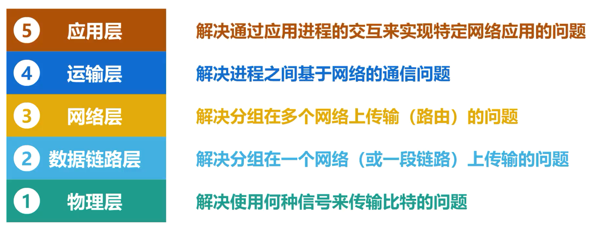
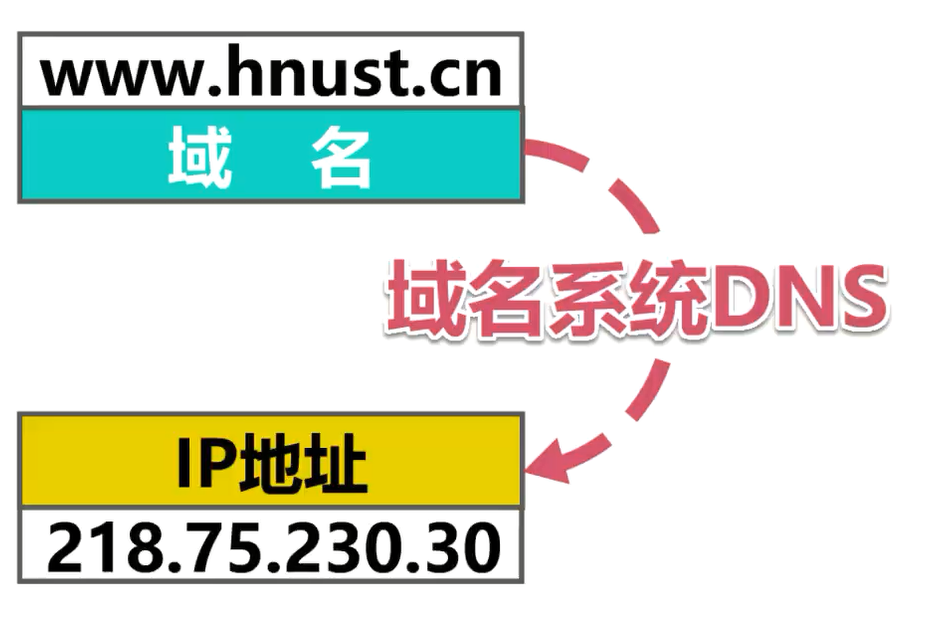
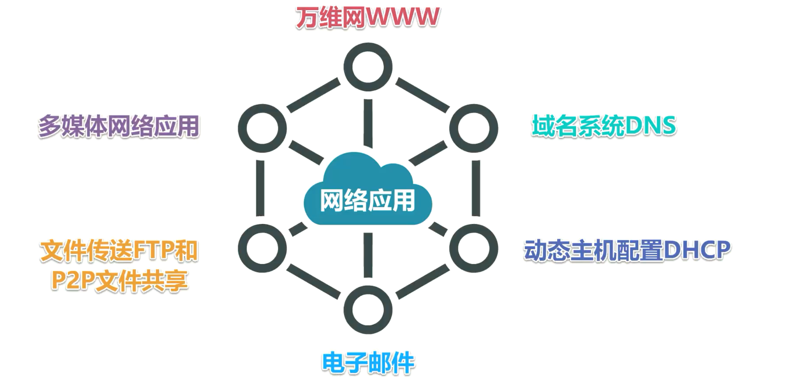
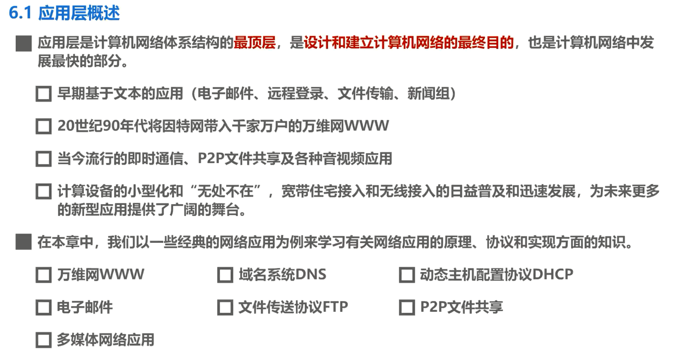

# 应用层概述

## 应用层概述

在之前的课程中，我们按计算机网络体系结构由低到高的顺序依次学习了物理层、数据链路层、网络层、运输层。

物理层——解决使用何种信号来传输比特的问题。

数据链路层——解决分组在一个网络或一段链路上传输的问题。

网络层——解决分组在多个网络上传输和路由的问题。

运输层——解决进程之间基于网络的通信问题。

应用层——享受其下各层提供的服务，解决通过应用进程的交互来实现特定网络应用的问题。

应用层是计算机网络体系结构的**最顶层**，其功能是**设计和建立计算机网络的最终目的**，也是计算机网络中发展最快的部分。

- 从早期基于文本的应用，例如电子邮件、远程登录、文件传输、新闻组等
- 20 世纪 90 年代将英特网带入千家万户的万维网
- 当今流行的即时通信、 P2P文件共享以及各种音视频应用
- 计算设备的小型化和无处不在，宽带住宅接入和无线接入的日益普及和迅速发展，为未来更多的新型网络应用提供了广阔的舞台。

在本章中，我们将以一些经典的网络应用为例，来学习有关网络应用的原理、协议和实现方面的知识。

例如，我们在浏览器的地址栏中输入某个网站的域名后，就可以访问该网站的内容。这就是推动英特网飞速发展的万维网应用，其相关的应用层协议为超文本传送协议HTTP ，用户在浏览器地址栏中输入的是见名知意的域名，而 TCP/IP 体系的网际层是用IP地址来标识目的主机。从域名到 ip 地址的转换工作有属于应用层范畴的域名系统，DNS 在后台帮用户自动完成，以方便用户的使用。

除了万维网应用和域名系统外，常见的应用还有动态主机配置DHCP、电子邮件、文件传送和P2P文件共享、多媒体网络应用等，我们将在本章的后续课程中分别介绍这些网络应用的相关协议和基本工作原理。

## 本节小结

