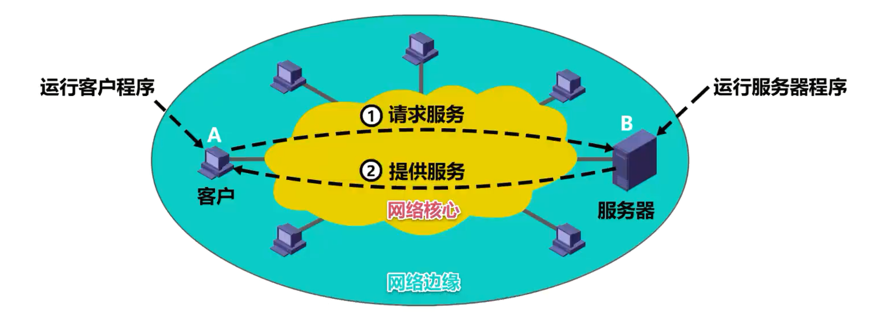
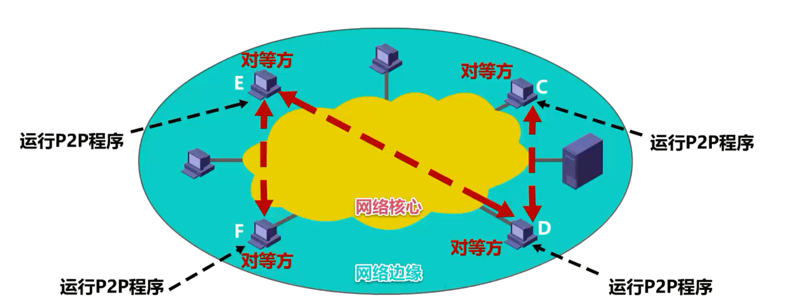
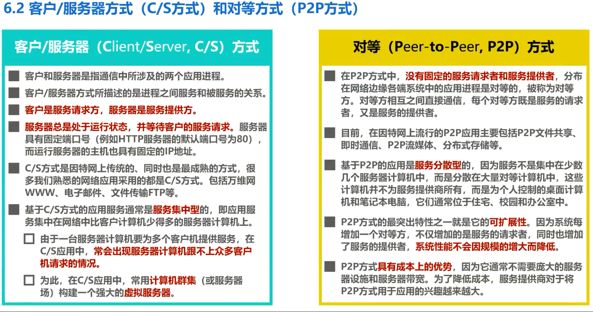

# 6.2 客户端-服务器方式(C/S方式)和对等方式(P2P方式)

## 网络应用程序在各种端系统上的组织方式

网络应用程序运行在处于网络边缘的不同端系统上，通过彼此间的通信来共同完成某项任务。

因此开发一种新的网络应用，首先要考虑的问题就是**网络应用程序在各种端系统上的组织方式**和**他们之间的关系**。目前流行的主要有以下两种：

- 客户/服务器方式(Client/Server,C/S)，即C/S方式

- 对等方式(Peer-to-Peer，P2P)，即P2P方式

## 客户/服务器方式(Client/Server,C/S)

### C/S定义

**客户和服务器**是指通信中所涉及的两个应用进程

**客户/服务器方式**所描述的是进程之间服务和被服务的关系

### 举例说明C/S方式

如图所示，处于网络边缘的主机A中运行的是客户程序，正在运行的客户程序称为客户进程，也可简称为客户。需要注意的是，运行客户进程的主机应称为客户计算机，但有时也简称为客户。

处于网络边缘的主机B中运行的是服务器程序，正在运行的服务器程序称为服务器进程，也可简称为服务器。需要注意的是，运行服务器进程的主机应称为服务器计算机，但有时也简称为服务器。

在客户/服务器方式下，客户向服务器请求服务，服务器收到服务请求后向客户提供服务。也就是说，**客户是服务的请求方，服务器是服务的提供方**，**服务器总是处于运行状态，并等待客户的服务请求**。**服务器具有固定的运输层端口号，例如 HTTP 服务器的默认端口号为80，而运行服务器的主机也具有固定的IP地址**。

C/S方式是因特网上传统的，同时也是最成熟的方式，很多我们熟悉的网络应用采用的都是C/S方式。包括万维网WWW、电子邮件、文件传输FTP等。

基于C/S方式的应用服务通常是**服务集中型**的，即应用服务集中在网络中比客户计算机少得多的服务器计算机上。

由于一台服务器计算机要为多个客户机提供服务，在 C/S 应用中**常会出现服务器计算机跟不上众多客户机请求的情况**。为此在C/S应用中，常用**计算机群集**(或服务器场)来构建一个强大的**虚拟服务器**。

## 对等方式

### P2P定义

在 P2P 方式中，**没有固定的服务请求者和服务提供者**，分布在网络边缘各端系统中的应用进程是对等的，被称为**对等方**。**对等方相互之间直接通信**，每个对等方既是服务的请求者，又是服务的提供者。

### 举例说明P2P

如图所示，处于网络边缘的主机C、D、E、F中运行着**同一种 P2P 程序**。例如某种网络下载工具软件， E和 F中的 P2P 进程互为对等方，C和 D 中的 P2P 进程互为对等方，而 E 中的 P2P 进程还和 D 中的 P2P 进程互为对等方。我们可以想象成 E 的 P2P 进程正在从F下载文件，与此同时还为D的 P2P 进程提供下载服务。

目前在因特网上流行的 P2P 应用主要包括 P2P 文件共享、即时通信、 P2P 流媒体、分布式存储等。

基于 P2P 的应用是**服务分散型**的，因为服务不是集中在少数几个服务器计算机中，而是分散在大量对等计算机中。这些计算机并不为服务提供商所有，而是为个人控制的桌面计算机和笔记本电脑，他们通常位于住宅、校园和办公室中。 

P2P 方式的最突出特性之一就是它的**可扩展性**。因为系统每增加一个对等方，不仅增加的是服务的请求者，同时也增加了服务的提供者，**系统性能不会因为规模的增大而降低**。

P2P 方式**具有成本上的优势**，因为它通常不需要庞大的服务器设施和服务器带宽。为了降低成本，服务提供商对于将 P2P 方式用于应用的兴趣越来越大。

## 本节小结

