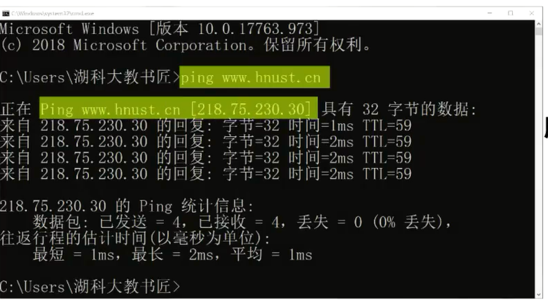
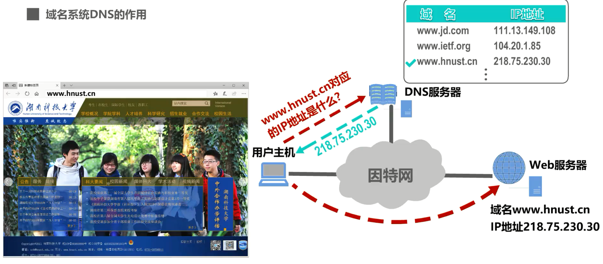
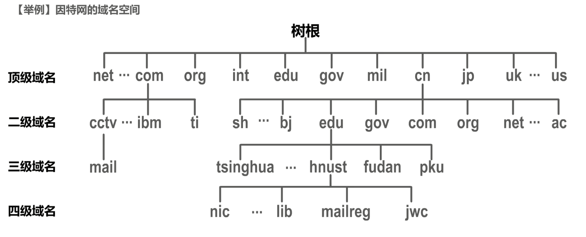
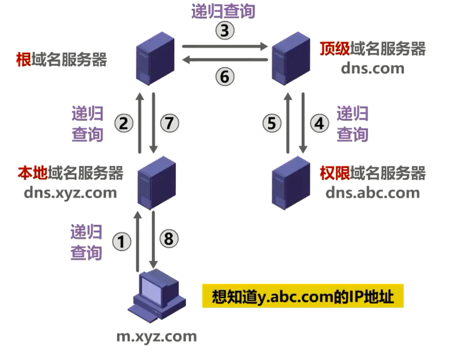
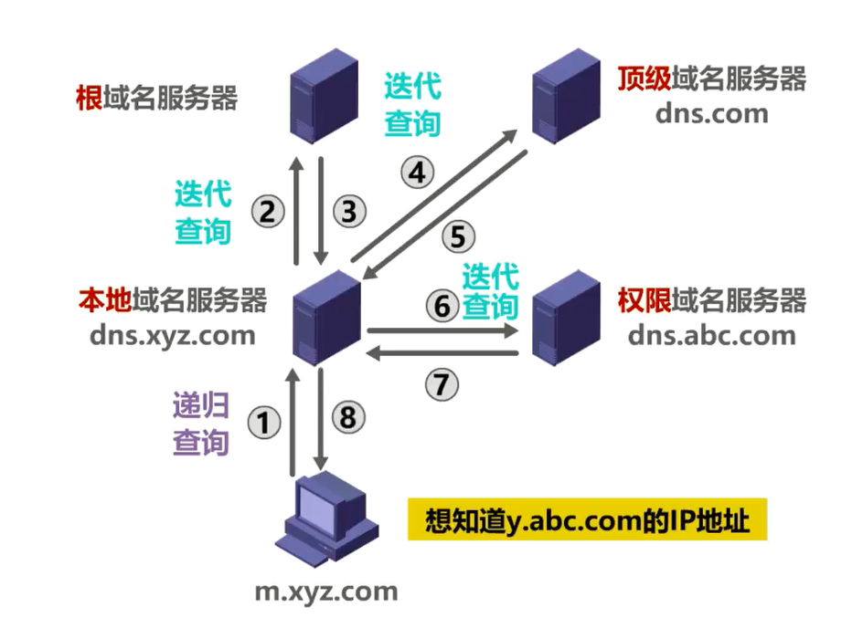
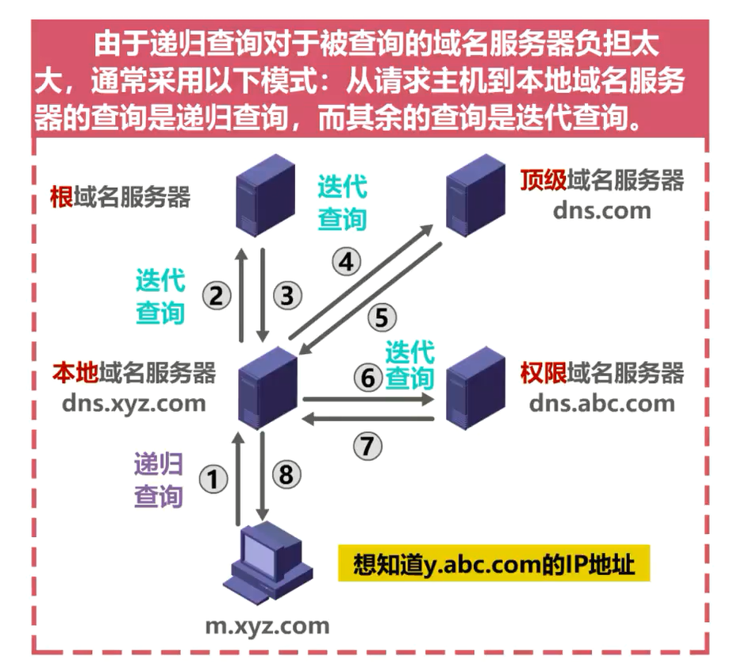
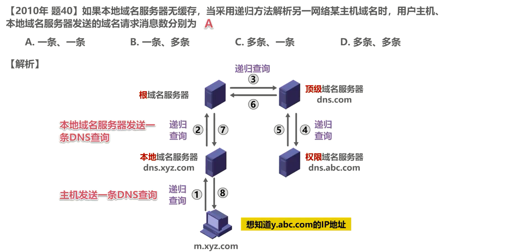
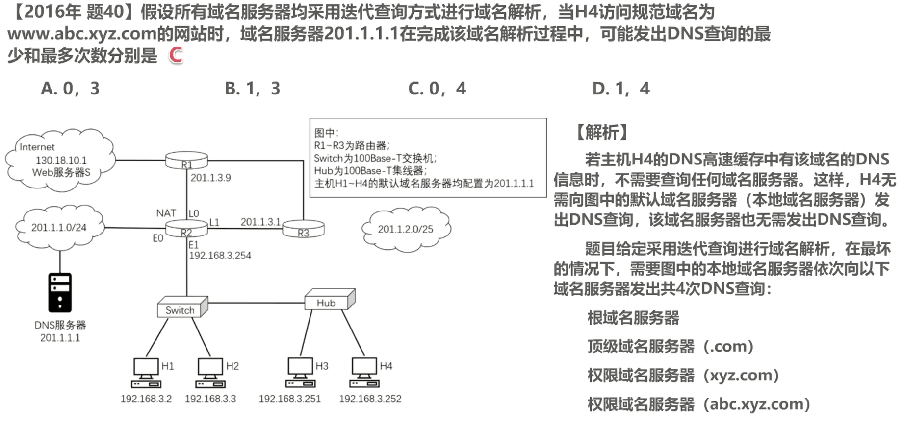

# 6.4 域名系统DNS(Domain Name System)

## 举例说明域名系统DNS的作用

如图所示，因特网中的某台主机要访问某台 Web 服务器，我们只需在用户主机中运行某个浏览器软件，在其地址栏中输入要访问的 Web 服务器的域名，并按下回车键，即可访问到 Web 服务器所提供的内容。这是大家最常用的一种网络应用。

接下来我们在用户主机中使用ping命令来测试一下用户主机与 Web 服务器的连通性。

可以看到，我们ping的是 Web 服务器的域名，但ping命令实际上ping的是外部服务器的 IP 地址，这与我们之前课程中所介绍的 TCP/IP 体系，采用 IP 地址进行寻址的知识是一致的。也就是说，即使不使用域名，也可以通过 IP 地址来寻址目的主机，但域名与 IP 地址相比便于人们记忆，因此，对于大多数网络应用，我们一般使用域名来访问目的主机，而不是直接使用 IP 地址来访问

对于本例，简单来说，当我们在浏览器地址栏中输入某个 Web 服务器的域名时，用户主机会首先**在自己的 DNS 的高速缓存中查找**该域名所对应的 IP 地址，如果没有找到，则会向**网络中的某台 DNS 服务器**查询。 DNS 服务器中有**域名和 IP 地址映射关系的数据库**，当 DNS 服务器收到 DNS 查询报文后，在其数据库中进行查询，之后将**查询结果发送给用户主机**，之后用户主机中的浏览器可以通过外部服务器的 IP 地址对其进行访问了。

因特网是否可以只使用一台 DNS 服务器？尽管理论上是可行的，但在实践中这种做法并不可取，因为因特网的规模很大，这样的域名服务器肯定会因为超负荷而无法正常工作，而且一旦域名服务器出现故障，整个因特网就会瘫痪。早在 1983 年，因特网就开始采用**层次结构的命名树**作为主机的名字，也就是我们所谓的域名，并使用分布式的域名系统。域名系统使**大多数域名都在本地解析，仅少量解析需要在因特网上通信**，因此系统效率很高。由于域名系统是分布式系统，即使单个域名服务器出现了故障，也不会妨碍整个系统的正常运行。

## 因特网域名系统所采用的层次树状结构的域名结构

域名的结构由若干个分量组成，各分量之间用点隔开，分别代表不同级别的域名。

- 每一级的域名都由英文字母和数字组成，不超过 63 个字符，不区分大小写字母。
- 级别最低的域名写在最左边，而级别最高的顶级域名写在最右边
- 完整的域名不超过 255 个字符。

域名系统既不规定一个域名需要包含多少个下级域名，也不规定每一级的域名代表什么意思。各级域名由企业上一级的域名管理机构管理，而最高的顶级域名则由因特网名称与数字地址分配机构ICANN进行管理。

### 举例说明域名树状结构

这是我校网络信息中心的域名：

- cn是**顶级域名**表示中国
- edu是在旗下注册的**二级域名**表示教育机构
- hnust是在edu下注册的**三级域名**表示湖南科技大学
-  nic 是由我校自行管理的**四级域名**，表示网络信息中心。

### 域名分类

#### 顶级域名分为以下三类

- **国家顶级域名nTLD**：采用ISO 3166的规定，如cn表示中国，us表示美国，uk表示英国

- **通用顶级域名gTLD**：最常见的通用顶级域名有 7 个，即com表示公司企业； net 表示网络服务机构；org表示非营利性组织；int表示国际组织；edu表示美国教育机构；gov表示美国政府部门； mil表示美国军事部门。

- **反向域arpa**：用于反向域名解析，即 IP 地址反向解析为域名。

#### 二级域名的分类

**在国家顶级域名下注册的二级域名均由该国自行确定**。例如，顶级域名为 jp的日本将其教育和企业机构的二级域名定为 ac 和co，而不用edu和com

**我国则将二级域名划分为以下两类**：

- 一类是类别域名：共 7 个， ac表示科研机构，com 表示工商、金融等企业；edu 表示教育机构；gov表示政府部门； net 表示提供网络服务的机构；mil表示军事机构；org表示非营利性组织。

- 另一类是行政区域名：共 34 个，适用于我国的各省、自治区、直辖市，例如bj为北京市， sh 为上海市，js 为江苏省等等。

需要注意的是，名称相同的域名，且等级未必相同。例如 com 是通用顶级域名，但我国顶级域名 cn 下也有一个名称为 com 的二级域名。

## 举例说明因特网的域名空间

因特网的域名空间实际上是一棵倒着生长的树，在最上面的是根，但没有对应的域名。

**根下面一级的节点就是顶级域名**。

**顶级域名可往下划分出二级域名**，例如，这是表示公司、企业的顶级域名com。下面划分有CCTV、IBM、 TI 等二级域名，分别表示中央电视台、 IBM 公司、 TI 公司。这是表示中国的顶级域名 cn 下面划分的二级域名，图中所示的域名分别表示上海、北京、教育机构、政府部门等

**二级域名再往下划分就是三级域名**，例如，这是表示中央电视台的二级域名CCTV下划分的三级域名 mail 表示邮件系统，这是表示我国教育机构的二级域名edu下划分的三级域名，图中所示的域名分别表示，清华大学、湖南科技大学、复旦大学、北京大学。

**三级域名再往下划分就是四级域名**，例如，这是表示湖南科技大学的三级域名hnust下划分的一些四级域名分别表示湖南科技大学的网络信息中心、图书馆、邮件系统、教务处。

上述这**种按等级管理的命名方法，便于维护域名的唯一性，并且也容易设计出一种高效的域名查询机制。需要注意的是，域名只是个逻辑概念，并不代表计算机所在的物理地点**。

## 域名服务器

域名和 IP 地址的映射关系必须保存在域名服务器中，供所有其他应用查询，显然，不能将所有信息都储存在一台域名服务器中。 **DNS 使用分布在各地的域名服务器来实现域名到 IP 地址的转换**。

### 域名服务器分类

域名服务器可以划分为以下 4 种不同类型

- 一类是**根域名服务器**（最上面的是根，但没有对应的域名），根域名服务器是最高层次的域名服务器，每个根域名服务器都知道**所有的顶级域名服务器的域名及其 IP 地址**。因特网上共有 **13 个不同 IP 地址的跟域名服务器**。尽管我们将这 13 个根域名服务器中的每一个都视为单个的服务器，但每台服务器实际上是有许多分布在世界各地的计算机构成的**服务器群集**。当本地域名服务器向根域名服务器发出查询请求时，路由器就把查询请求报文转发到离这个 DNS 客户最近的一个根域名服务器，这就加快了 DNS 的查询过程，同时也更合理的利用了因特网的资源。**根域名服务器通常并不直接对域名进行解析，而是返回该域名所属顶级域名的顶级域名服务器的 IP 地址**。
- 另一类是**顶级域名服务器**，这些域名服务器**负责管理在该顶级域名服务器注册的所有二级域名**，当收到 DNS 查询请求时，就给出相应的回答，**可能是最后的结果，也可能是下一级权限域名服务器的 IP 地址**
- 还有一类是**权限域名服务器**，这些域名服务器**负责管理某个区的域名**，每一个主机的域名都必须在某个权限域名服务器处注册登记，因此，权限域名服务器知道其管辖的域名与 IP 地址的映射关系。另外，权限域名服务器还知道其下级域名服务器的地址。
- 最后一类是**本地域名服务器**。本地域名服务器不属于上述的域名服务器的等级结构。当一个主机发出 DNS 请求报文时，这个报文就首先被送往该主机的本地域名服器。**本地域名服务器起着代理的作用，会将该报文转发到上述的域名服务器的等级结构中**。每一个因特网服务提供者，一个大学甚至一个大学里面的学院，都可以拥有一个本地域名服务器，它有时也称为**默认域名服务器**。本地域名服务器离用户较近，一般不会超过几个路由器的距离，也有可能就在同一个局域网中，**本地域名服务器的 IP 地址需要直接配置在需要域名解析的主机中**

## 域名解析的过程

接下来我们介绍域名解析的过程，包含以下两种查询方式，一种是递归查询，另一种是迭代查询。

> [DNS迭代查询和递归查询](https://zhuanlan.zhihu.com/p/61394192)

### 递归查询

首先来看递归查询，假设图中的主机想知道域名 y.abc.com 的 IP 地址，主机首先向其本地域名服务器进行递归查询。本地域名服务器收到递归查询的委托后，也采用递归查询的方式向某个根域名服务器查询。根域名服务器收到递归查询的委托后，也采用递归查询的方式向某个顶级域名服务器查询。顶级域名服务器收到递归查询的委托后，也采用递归查询的方式向某个权限域名服务器查询，当查询到域名所对应的 IP 地址后，查询结果会在之前受委托的各域名服务器之间传递，最终传回给用户主机。

### 迭代查询

再来看迭代查询，主机首先向企业本地域名服务器进行递归查询，本地域名服务器采用迭代查询，它先向某个根域名服务器查询，根域名服务器告诉我本地域名服务器下一次应查询的顶级域名服务器的 IP 地址。本地域名服务器向顶级域名服务器进行迭代查询，顶级域名服务器告诉本地域名服务器下一次应查询的全县域名服务器的 IP 地址。本地域名服务器向全县域名服务器进行迭代查询，全县域名服务器告诉本地域名服务器所查询的域名的 IP 地址，本地域名服务器最后把查询结果告诉主机。

由于递归查询对于被查询的域名服务器负担太大，通常采用以下模式，从请求主机到本地域名服机的查询采用递归查询方式，而其余的查询是迭代查询方式。

### 高速缓存

为了提高 DNS 的查询效率，并减轻根域名服务器的负担和减少因特网上的 DNS 查询报文数量，在域名服务器中广泛地使用了**高速缓存**，用来存放**最近查询过的域名以及从何处获得域名映射信息的记录**。

如图所示，如果不久前已经有用户查询过域名为 y.abc.com 的 IP 地址，则本地域名服务器的高速缓存中应该存有该域名对应的 IP 地址，当主机向本地域名服务器递归查询该域名时，本地域名服务器就没有必要再向某个根域名服务器进行迭代查询了，而是直接把高速缓存中存放的上次查询结果即该域名的 IP 地址告诉用户主机。

需要注意的是，由于域名到 IP 地址的映射关系并不是永久不变，为保持高速缓存中的内容正确，域名服务器**应为每项内容设置计时器并删除超过合理时间的项**，例如每个项目只存放 2 天。

不但在本地域名服务器中需要高速缓存，在用户主机中也很需要。许多用户主机在启动时从本地域名服务器下载域名和 IP 地址的全部数据库，维护存放自己最近使用的域名的高速缓存，并且只在从缓存中找不到域名时才向域名服务器查询。同理，主机也需要保持高速缓存中内容的正确性。

## 习题

答案是选项A。本题考察的内容就是我们刚刚才介绍过的采用递归查询方式进行域名解析的过程。这是主机给其本地域名服务器发送的一条 DNS 查询。由于题目给定本地域名服务器无缓存，因此本地域名服务器收到主机的委托查询后，会向某个根域名服务器发送一条 DNS 查询。

答案是选项C。我们来一起分析一下。若主机 H4 的 DNS 高速缓存中有该域名的 DNS 信息时，不需要查询任何域名服务器，这样 H4 无需向图中的默认域名服务器发出 DNS 查询，该域名服务器也无需发出 DNS 查询。题目给定，采用迭代查询方式进行域名解析。在最坏的情况下，需要图中的本地域名服务器依次向域名服务器发出共 4 次 DNS 查询。

第1次：.com的DNS服务器是哪个——问——根域名服务器——返回——.com顶级域名服务器地址

第2次：xyz.com的DNS服务器是哪个——问——顶级域名服务器 （知道.com下的二级域名xxx.com的地址及xxx.com权限域名服务器地址）——返回——最后的结果/下一级权限域名服务器的 IP 地址

第3次：abc.xyz.com的DNS服务器是哪个——问——权限域名服务器 （知道xyz.com下的三级域名的地址及下一级xxx.xyz.com的域名服务器地址） ——返回——最后的结果/下一级域名服务器的 IP 地址

第4次：www.abc.xyz.com的IP地址是哪个——问——权限域名服务器 abc.xyz.com——返回——www.abc.xyz.com的IP地址

## 本节小结

需要注意的是，DNS报文使用运输层的UDP 协议进行封装，运输层端口号为53。至于 DNS 报文的格式就不再赘述