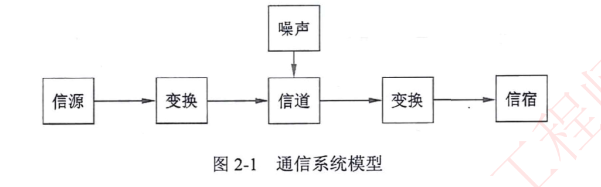
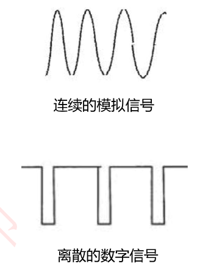
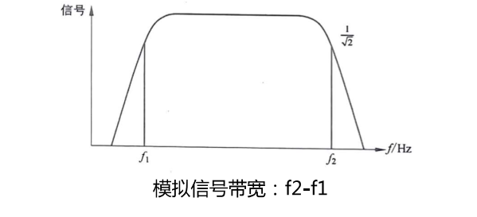
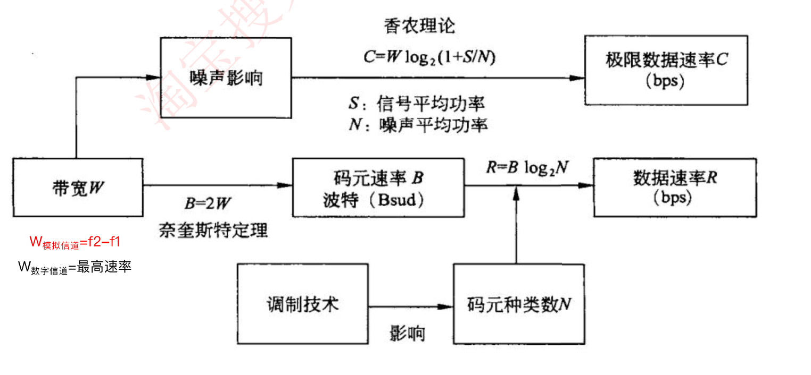
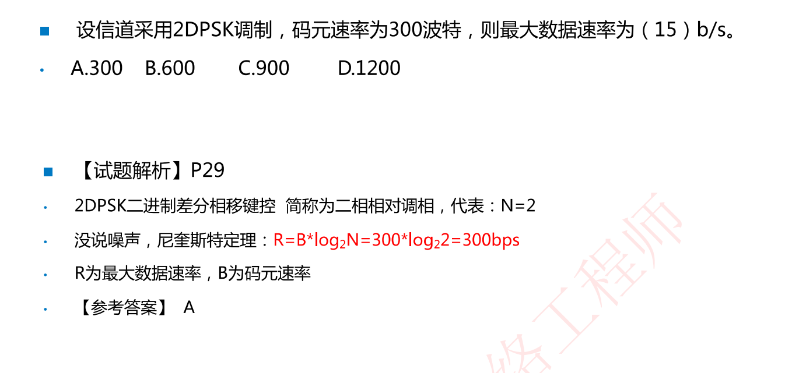
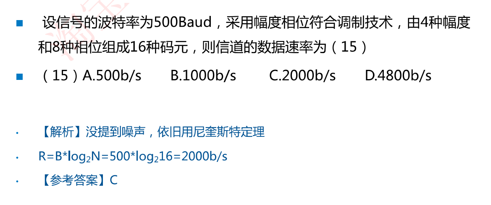
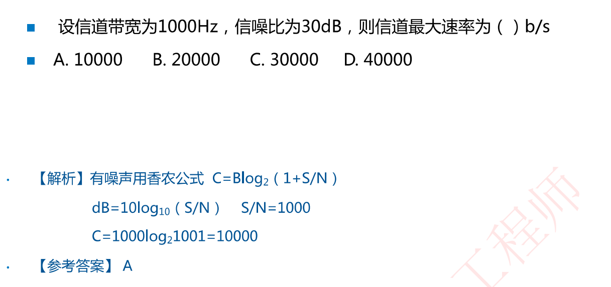
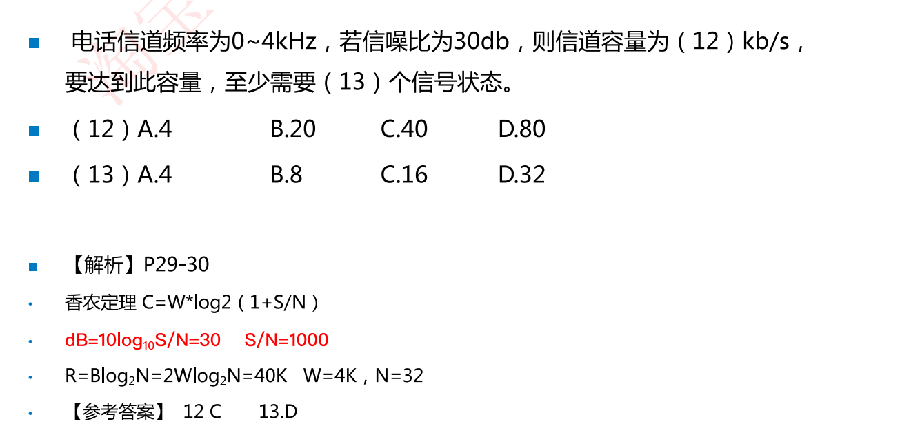

# 2.1 数据通信的基本概念(考查较少)

通信的目的就是**传递信息**。

通信中产生和发送信息的一端叫信源，接收信息的一端叫信宿，信源和信宿之间的通信线路称为信道。

通信系统模型，如下图所示

其中，信源可以产生模拟信号或数字信号，信道分为模拟信道和数字信道，噪声即信号传输过程中的干扰

# 2.2 信道特性

## 2.2.1 信道带宽W(常考)

模拟信道：**W = f2 - f1**(f2/f1分别表示：信道能通过的最高/最低频率，单位是赫兹Hz)

数字信道：数字信道是离散信道，带宽为信道能够达到的**最大传输速率**，单位是bit/s

​	数据传输速率：指每秒钟能够传输的二进制数据位数，单位为比特/秒(bit/s、b/s、bps)

**码元**：一个数字脉冲成为一个码元(可以理解为时钟周期的信号)

码元宽度：一个码元的时钟周期(T)，[频率的单位Hz意为 次/秒，周期的单位即为 秒/次]

**码元速率(波特率)**：单位时间内信道传送码元的个数。如码元宽度为T，则**码元速率(即波特率)B = 1/T，单位是波特Baud**

一个码元(一个包裹)携带的信息量n(位)与码元种类数(N)的关系是**n = log2N**

| 码元种类数(N) | 码元种类                                          | 携带信息量(能携带几位数据)(n) |
| ------------- | ------------------------------------------------- | ----------------------------- |
| 2             | 0、1共计2类码元                                   | 1(即每个码元携带1位信息)      |
| 4             | 00、01、10、11共计4类码元                         | 2(即每个码元携带2位信息)      |
| 8             | 000、001、010、011、100、101、110、111共计8类码元 | 3(即每个码元携带3位信息)      |

## 2.2.2 尼奎斯特定理和香农定理(高频考点、背住公式)

### 尼奎斯特定理==最大码元速率与信道带宽之间关系

尼奎斯特定理：在一个理想的(没有噪声环境)的信道中，若信道带宽为W，则最大码元速率为**B = 2W (Baud)**

极限数据速率：**R =B * n =  B * log2N = 2 W log2N** 

理解：每秒数据总量 = 每秒发送码元个数(B) * 每个码元携带的信息量位数(n)

理解：每秒包裹总重量 = 每秒发送包裹个数 \* 每个包裹重量     (码元速率 \* 每个码元携带信息量)

### 香农定理==噪声信道极限速率和信道带宽之间关系

香农定理：在一个噪声信道的极限速率和带宽之间的关系

- **极限速率公式**为：**C = W log2(1+S/N)**   其中S/N为信噪比，S为信号平均功率，N为噪声平均功率
- **分贝与信噪比的关系**为：**dB = 10 log10S/N** 
- 其中W为信道带宽，S为信号平均功率，N为噪声平均功率，S/N为信噪比(信噪比S/N是一个参数，一般不会分别给出)，一般需要根据分贝dB来求信噪比S/N 

例题：若一个信道，带宽为20Mb/s，信噪比为1，则极限速率为多少？

解答：极限速率根据香农定理：C = W log2(1+S/N) = 20Mb/s  \* log2(1+1) = 20Mb/s

例题：若一个信道，带宽为20Mb/s，信噪比为30dB，则信噪比S/N为多少？极限速率为多少 

解答：

​	根据分贝与信噪比的关系为：dB = 10 log10S/N 

​	则30 =10 log10S/N 故 S/N = 103 = 1000(这是求真数部分)，即信噪比为1000

​	根据极限速率公式C = W log2(1+S/N) = 20Mb/s  \* log2(1+1000) = 20Mb/s  \* log2(1001) 

​								≈ 20Mb/s  \* log2(1024) = 20 \* 10 = 200Mb/s

## 带宽/码元速率/数据速率/关系梳理

# 例题

下题非常重要↓

==至少需要的信号状态(边界条件)即令极限数据速率R = C即R = 2W * log2N = 40kb/s解得N = 32==