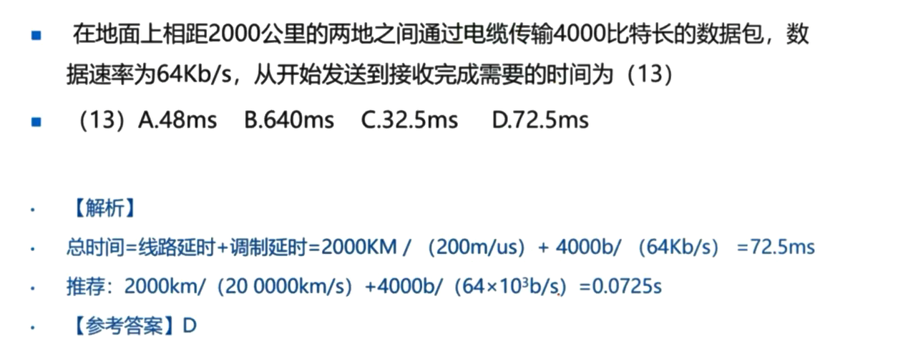
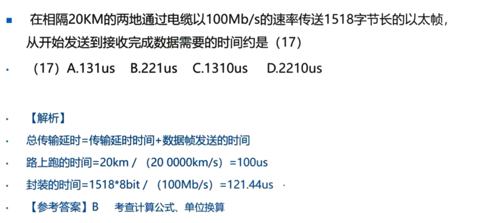

# 2.2 信道特性

## 2.2.3 误码率(考的少)

误码率是衡量数据通信系统在正常工作情况下**传输可靠性**的指标。

定义：传输**出错的码元数**占**传输总码元数**的比例，误码率越小，通信可靠性越高。

Pe=Ne/N，其中Ne表示出错数，N表示传送总数

计算机通信网络中，误码率一般要求低于10-6，即传输一百万个最多只能有一个出错

计算机网络的性能参数：数据延时<200ms，语音视频延时<50ms，抖动<20ms，丢包率<1%

## 2.2.4 信道延迟(中频考点)

**信道延迟**：与源端和宿端距离有关，也与具体信道中的传播速率有关

​	线路延迟：两地之间物理距离以及网线导致的延迟

​	调制延迟：把数据打包封装所使用的时间

​	**发送数据时间 = 线路延迟 + 调制延迟**

​	线路延迟 = 传输距离/传输速度        (路上跑的时间)

​	调制延迟 = 数据帧大小/传输速率      (排队上车的时间)

注：

- 光速：300m/μs = **30 0000km/s**

- 电缆中传播速度一般为光速的77%，即200m/μs = **20 0000km/s**
- 如500米同轴电缆时延大概为2.5μs
- 卫星信道的时延大约为**270ms**(来回双向的延迟)

### 例题(会做这两题就OK)

