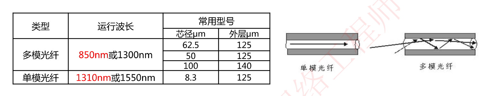
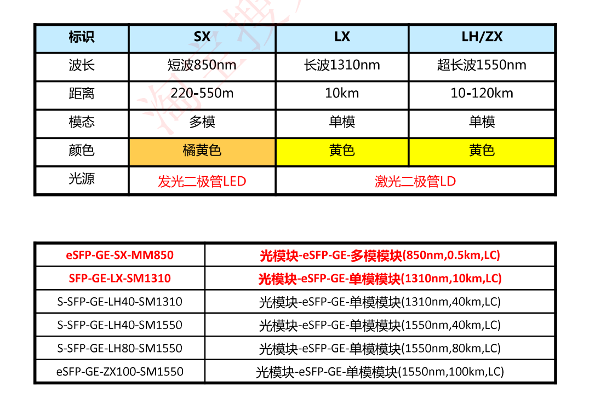
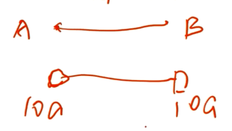

# 2.3 传输介质(双绞线和光纤)

## 双绞线

双绞线(即网线)：8根铜导线每2根扭在一起(百兆用4根，千兆必须用8根)

分类：直通线/交叉线，屏蔽(即屏蔽电磁干扰，成本更高)和非屏蔽双绞线

## 光纤(光纤本身无带宽之说)

光纤：利用光在**玻璃或塑料纤维**中的**全反射原理**而达成的光传导工具

光传导损耗比电缆传导的损耗低得多，光纤适合用于长距离的信息传递

光纤特点：重量轻，体积小、传输远（衰减小)、容量大、抗电磁干扰(本身是光信号，不产生电磁)

### 光纤分类

#### 单模光纤(SX)

当光纤的几何尺寸可以于光波长相比拟时，即纤芯的几何尺寸与光信号波长相差不大时一般为5~10um(细);

单模光纤只允许**一种模式在其中传播**，单模光纤具有极宽的带宽，特别适用于**大容量、长距离的光纤通信**(贵)

#### 多模光纤(LX)

多模光纤纤芯的几何尺寸远大于光波波长，一般为50um、62.5um(粗);

多模光纤允许**多种模式光信号传播**，仅用于较小容量、短距离的光纤传输通信（便宜)

#### 单模光纤与多模光纤对比(光纤本身无带宽之说，其带宽取决于光纤两端的光模块)

光纤本身无带宽之说，其带宽取决于光纤两端的光模块

#### 例题

