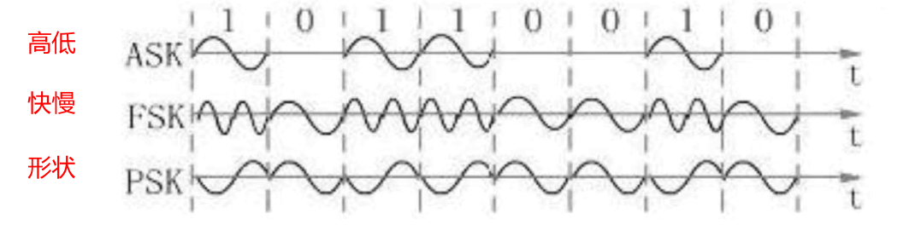
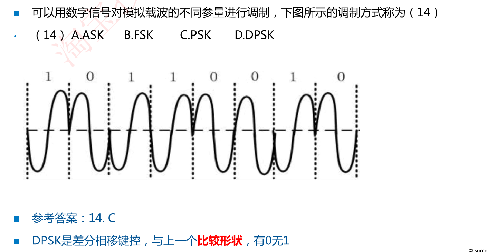
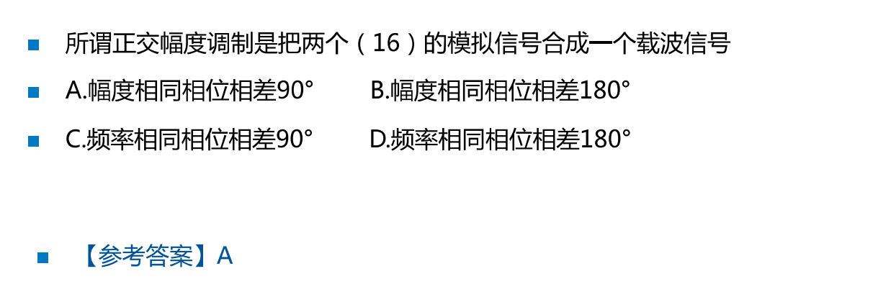
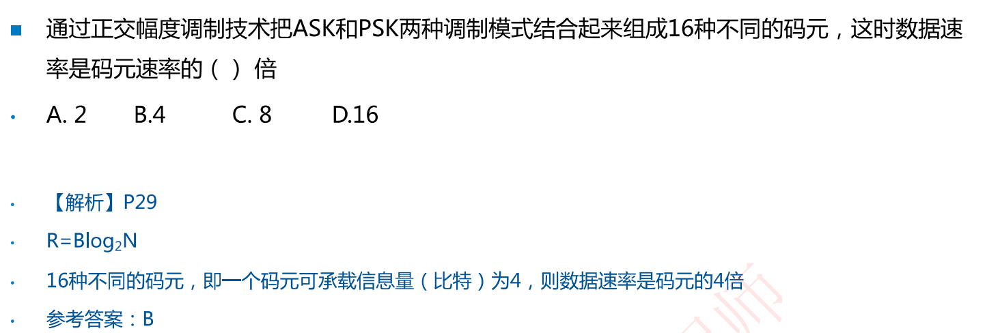
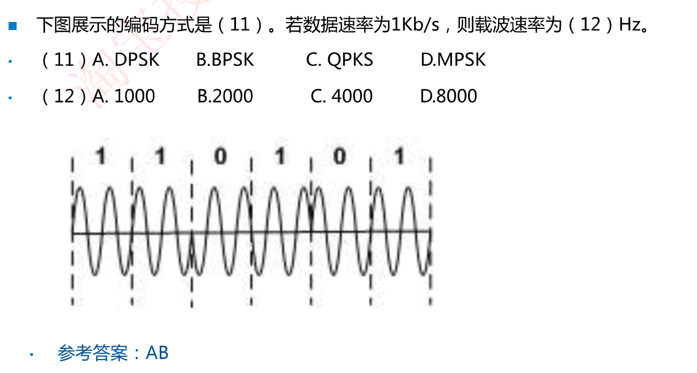
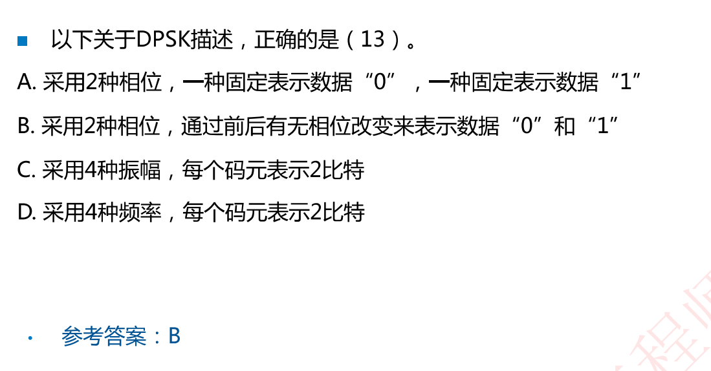
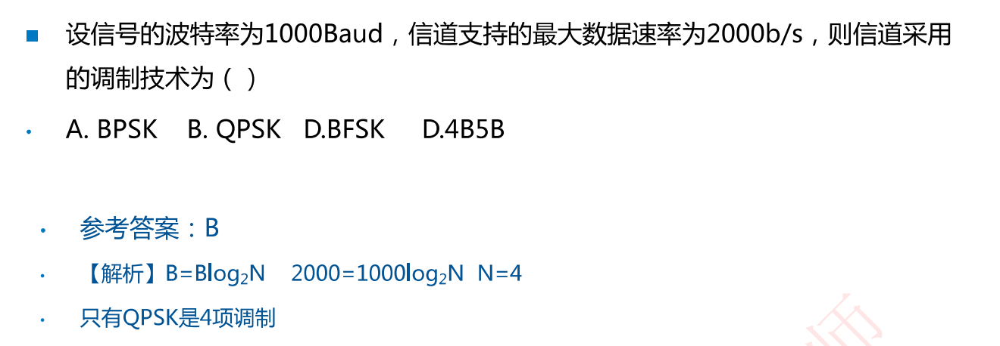

# 2.5 数字调制技术

调制：将**数字信号转换成模拟信号**称为调制

解调：将**模拟信号转换为数字信号**称为解调

幅度键控(ASK)：用载波的两个不同**振幅**表示0和1

频移键控(FSK)：用载波的两个不同**频率**表示O和1

相移键控（PSK ) ︰用载波的**起始相位**的变化表示0和1(初相位不同)

正交幅度调制(QAM)：把**两个幅度相同但相位差90°**的模拟信号合成一个模拟信号(用于5G、WiFi)

码元只取两个相位值叫2相调制，码元可取4个相位叫4相调制，则N=2，N=4

DPSK是2相(double)，QPSK是4相(quadra)=N码元数量

例题

解析：差分相移键控：与上一个波形比较形状，有变化表示0，无变化表示1

​			查分曼彻斯特：与上一个时钟周期比较起始位，有变化表示0，无变化表示1

正交即指90度

解析：1. 差分相移键控：与上一个波形比较形状，有变化表示0，无变化表示1

​			2. 码元的一个时钟周期内有2个载波，所以载波速率是码元速率的2倍，故载波速率为2000

解析：由题设可知：B = 1000 Baud，R = 2000b/s，问调制技术即问N是多少，没出现噪声就根据尼奎斯特定理求得N=4，D选项是编码技术，不是调制技术