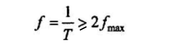
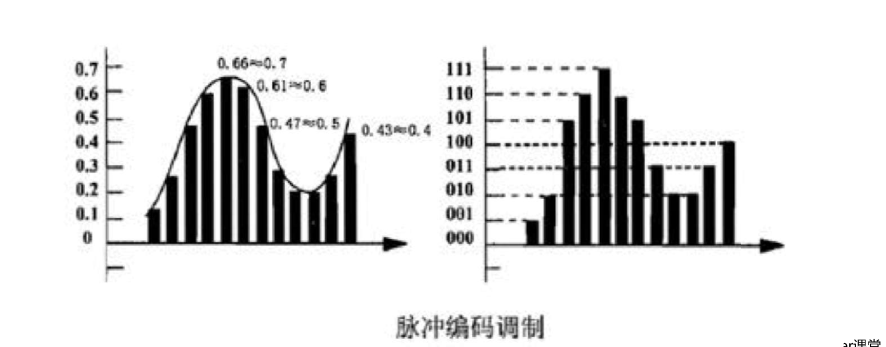
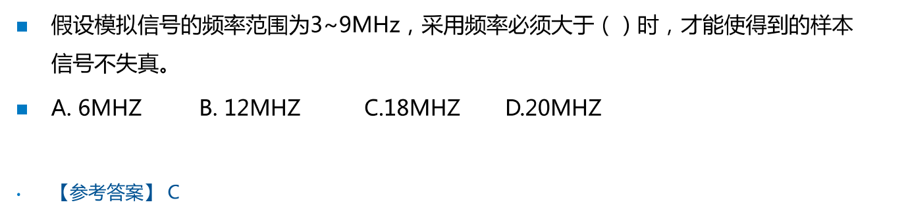
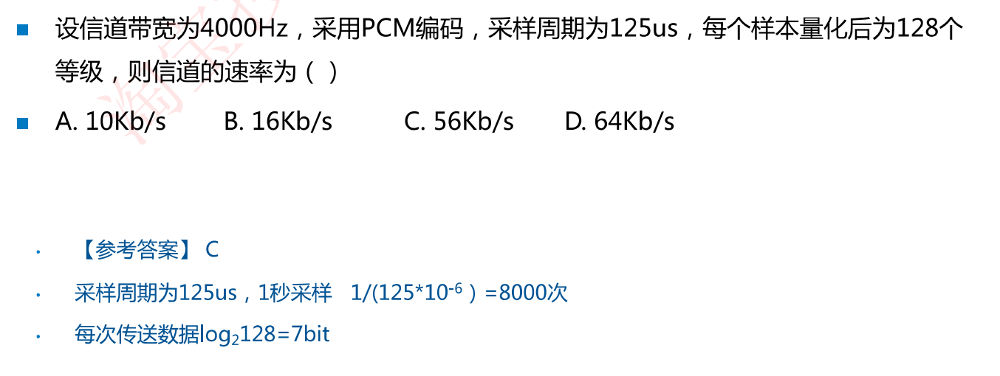
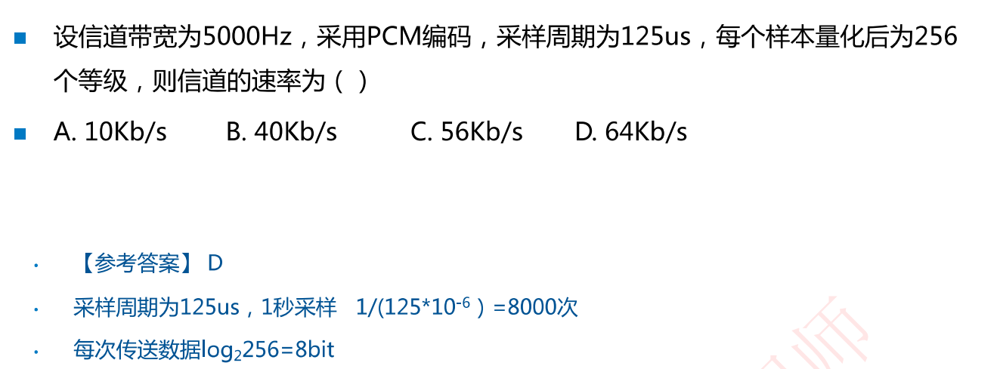

# 2.6 脉冲编码调制

解调:把模拟信号转换为数字信号的过程

常用的解调技术就是脉冲编码调制技术(Pulse Code Modulation,PCM）,简称脉码调制

## PCM数字化技术

PCM数字化过程3个步骤：**采样、量化和编码**

### 采样

采样：按照一定的时间间隔对模拟信号进行取样，把模拟信号的当前值作为样本。

**奈奎斯特采样定理**：如果模拟信号的最高频率为fmax，若以大于2fmax的采样频率对其进行采样，则采样得到的离散信号序列就能完整地恢复出原始信号。

### 量化

量化：把取样后得到的样本由连续值转换为离散值，离散值的个数(即码元种类数)决定了量化的精度

如图，把量化等级分为8级(即码元种类数)，用000-111这8个二进制数分别代表不同的电平幅度

### 编码

编码：把量化后的样本值变成相应的二进制代码，可以得到相应的二进制代码序列，其中每个二进制代码都可以用一个脉冲串来表示，这一组脉冲序列就代表了经PCM编码的模拟信号

**例如**：对声音信号数字化时，由于语音最高频率是4kHz，所以取样频率是8kHz(即每秒钟采样8000次，码元速率为8000Baud)。对语音样本用128个等级(128种码元)量化，因而每个样本用7bit[一个码元(一个包裹)携带的信息量n(位)与码元种类数(N)的关系是n = log2N]表示。在数字信道上传输这种数字化后的语音信号的速率是**7*8000=56 Kbps**【重点理解】

### ==例题==

自己理解：每秒传递8000个码元，每个码元携带7bit的数据，则信息速率即信道速率为8000*7 = 56Kb/s

