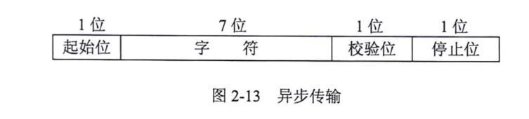
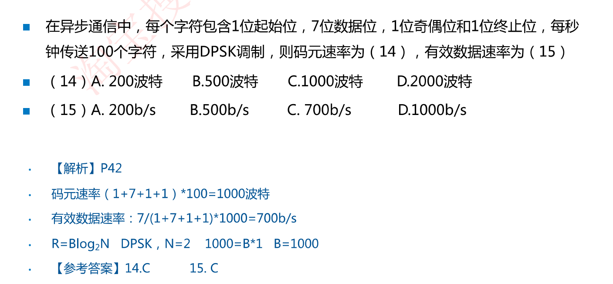

# 2.7 通讯和交换方式

### 3种按照通信方向分类的数据通信方式

- **单工通信**：信息只能在一个方向发送，发送方不能接收，接收方不能发送(电视、广播)
- **半双工通信**：通信的双方可以**交替**发送和接受信息，但不能同时接收或发送(对讲机、早期WiFi、HUB)
- **全双工通信**：通信双方可以同时进行双向的信息传送(电话、交换机)

### 2种数据传输方式

两种传输方式：异步传输和同步传输(了解即可，考试简单)

异步传输：把各个字符分开传输，在字符之间插入一位起始位(0)，在字符之后插入一位停止位(1)，起始位对接收方的时钟起置位作用。在字符和停止之间还要插入一位校验位，一般使用奇偶校验

同步传输：**比特分组（帧）要大得多**。不是独立发送每个字符，而是把他们组合起来一起发送。我们称这些组合为数据帧，或简称帧。数据帧的第一部分包含同步字符，用于通知接收方一个帧已经达到。帧的最后一部分是一个帧结束标记。

==例题==

### 3种数据交换的方式

#### 电路交换

**电路交换**∶将数据传输分为电路建立、数据传输和电路拆除3个过程。在数据传送之前需建立—条物理通路，在线路被释放之前，该通路将一直被用户完全占有（电话)

#### 报文交换

**报文交换**：报文从发送方传送到接收方采用存储转发的方式。报文中含有每一个小一跳节点，完整的报文在一个个节点间传送

#### 分组交换

**分组交换**：两种方式，数据报和虚电路( 13上17，17下18 )

数据报方式：每个分组被独立地处理，每个节点根据一个路由选择算法，为每个分组选择一条路径，使它们的目的地相同。（IP即采用数据报的分组方式)

虚电路方式：在数据传送之前，先建立起一条逻辑上的连接，每个分组都沿着一条路径传输。（X.25、FR、ATM只需知道这几种是虚电路方式即可)

##### 分组交换特点

- 减小了延迟，提高了吞吐量

- 分组交换可以按分组纠错，发现错误只需重发出错的分组，通信效率提高