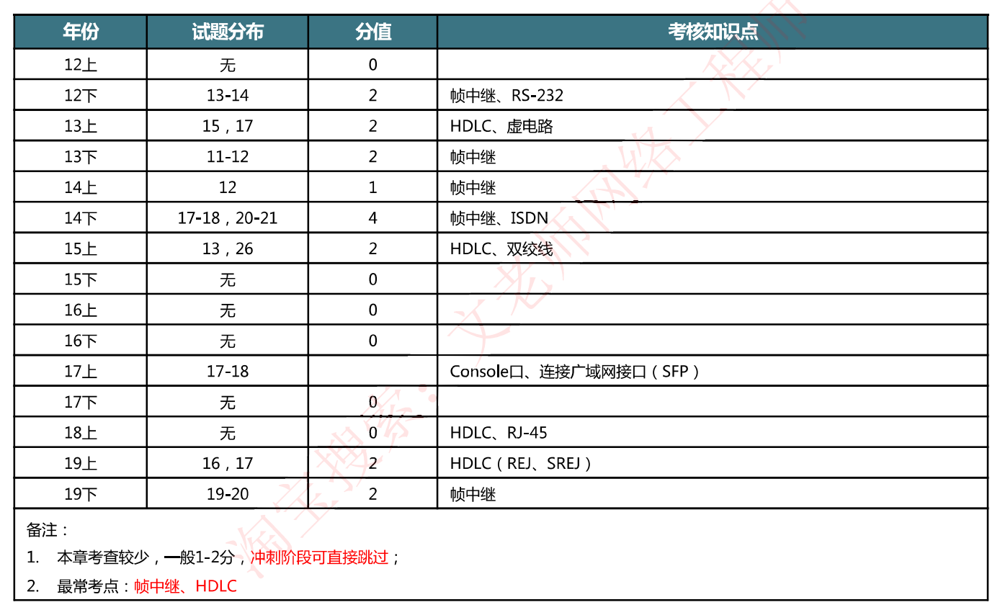
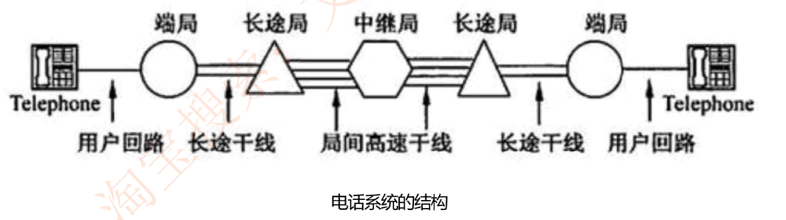
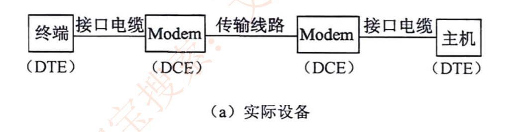
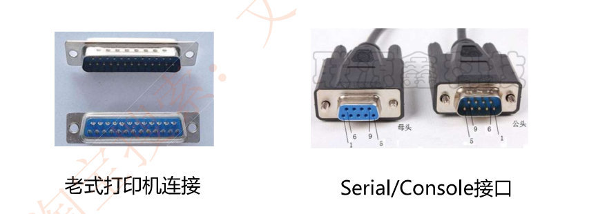
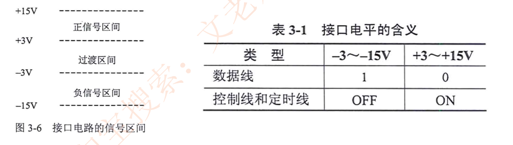
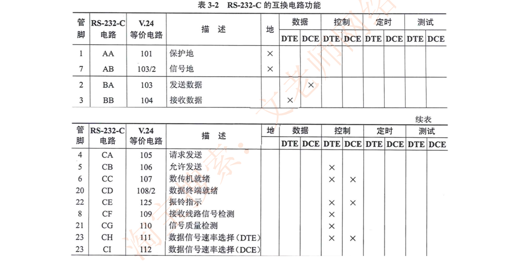
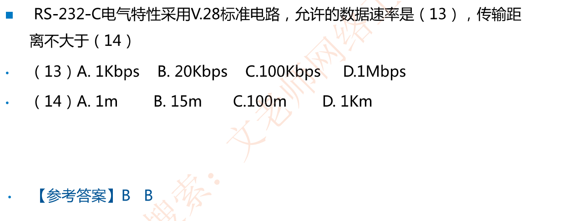
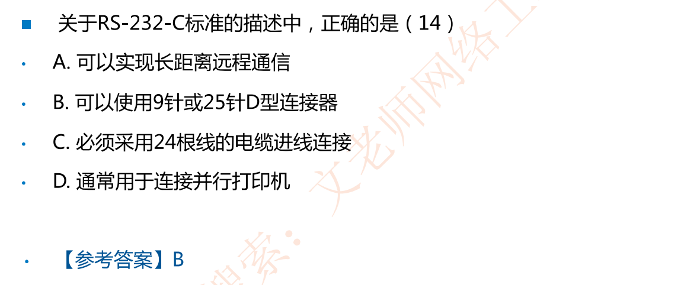

# 3-1 广域通信基础

# 历年试题分布

## 3.1 公共交换电话网 PSTN

在公共交换电话网(Public Switched Telephone Network,PSTN)是为了语音通信而建立的网络，从20世纪60年代开始又被用于数据传输。

电话网由3个部分组成︰本地回路、干线和交换机

千线和交换机一般采用数字传输和交换技术，而本地回路基本采用模拟线路

电话线联网时需要在发送端通过调制解调器把数字信号变换为模拟信号，接收端再通过调制解调器把模拟信号变换为数字信号

以下PSTN系统结构了解即可，目前已经淘汰

### 3.1.2 本地回路

DTE ( Data Terminal Equipment）**数据终端设备**，这种设备代表通信链路的端点

DCE ( Data Circuit Equipment）**数据电路设备**，用于信号变换器、自动呼叫等

常见DTE设备： PC/电话机

常见DCE设备：猫/调制解调器/Modem

### RS-232-C接口

下面以RS-232-C接口为例说明描述设备之间通信有关的技术特性。

#### 机械特性

机械特性描述DTE和DCE之间物理上的分界线，规定连机器的**几何形状、尺寸大小、引线数、引线排列方式及锁定装置等**。

RS-232-C没有正式规定连机器的标准，只有在其附录中建议使用**25针**的D型连接器，如连接老式打印机，也有很多使用其他连接器，特别是在微型机RS-232-C**串行接口**上，大多使用**9针**连接器。

#### 电气特性

 RS-232-C采用的**V.28**标准电路，传输速率**20kb/s**，最长**15米**

信号源产生3-15V的信号，±3V之间是信号电平过渡区

**3-15V表示1，-3-15V表示0**

#### 功能特性

对接口连线的功能给出明确定义，RSR-232-C采用的标准是**V.24**(电气特性采用的是V.28)

### 例题

