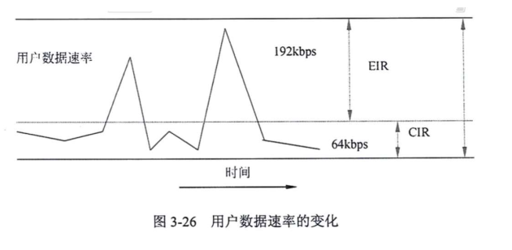
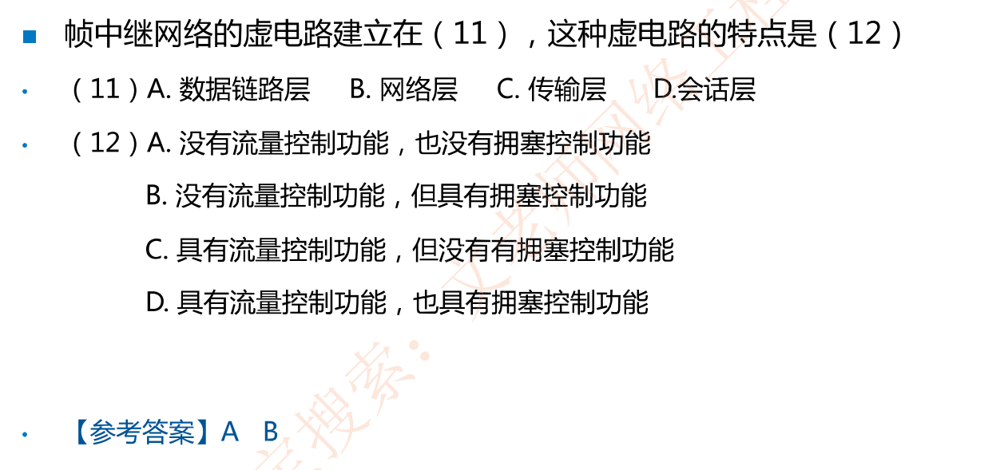
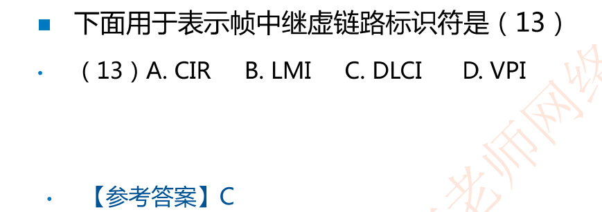
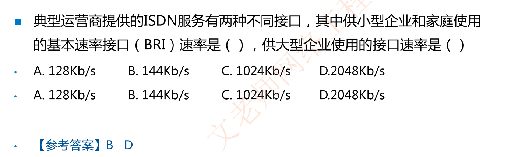

# 3-3 X.25与帧中继

## 3.2 X.25公共数据网(了解)

- X.25分为三个协议层，即**物理层、链路层和分组层**，分别对应OSI模型低三层

- X.25是一种**分组交换**技术，**面向连接**(同TCP)，建立**虚链路**

- X.25支持**差错控制和流量控制**，传输速率:**64kbps**

## 3.3 帧中继(Frame Rlay)(X.25升级版本，选择题常考)

- 帧中继在**第二层**(即数据链路层)建立虚链路，提供**虚链路服务**，本地标识DLCI

- 基于**分组交换**的透明传输，可提供**面向连接**的服务

- **只做检错和拥塞控制，没有流控和重传机制，开销很少**

- 既可以按需要提供带宽，也可以应对突发的数据传输   CIR：承诺速率          EIR：扩展速率
- 

- **帧长可变**，长度可达1600-4096字节，可以承载各种局域网的数据帧

- 可以达到很高的速率，**2-45Mbps**

- 不适合对延迟敏感的应用(语音、视频)

- 数据的丢失依赖于运营商对虚电路的配置

- 不保障可靠的提交

### 例题

## ISDN和ATM(记忆)

### ISDN

ISDN综合数字业务网，目的是以数字系统代替模拟电话系统(PSTN)，把音频、视频、数据业务放在一个网上统一传输

- 分为窄带ISDN和宽带ISDN，窄带ISDN提供两种用户接口

  - 基本速率**BRI**=2B+D=**144Kbps**

  - 基群速率**PRI**=30B+D=**2.048M**

### ATM

宽带ISDN，即ATM

- ATM是**信元交换**，信元为**53字节**固定长度

- ATM依然是以虚链路提供面向连接的服务

- ATM典型速率为**150M**

### 例题

# 章节总结

RS232接口物理特性（偶尔考)

数据链路层的差错控制技术（选上退下，选一退多)

HDLC协议（面向**位**、数据链路层协议、同步、帧定界符01111110)

**FR协议**（面向**连接**、DLCI标识虚电路、数据链路层协议、可突发、有拥塞控制无滑动窗口流量控制，有错误检测无重传)

ISDN基础(BRI和PRI接口_)

ATM（面向连接、虚电路、4类业务)