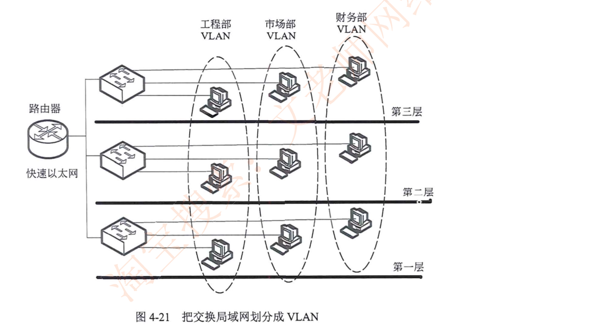
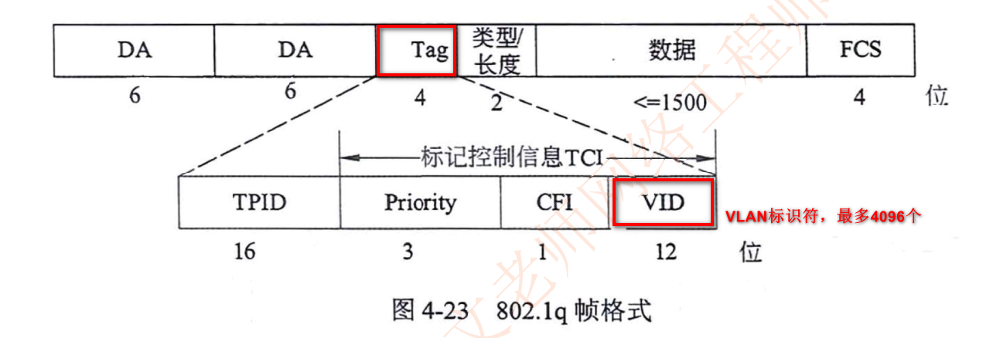
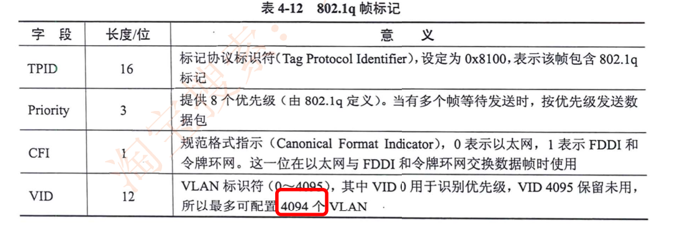
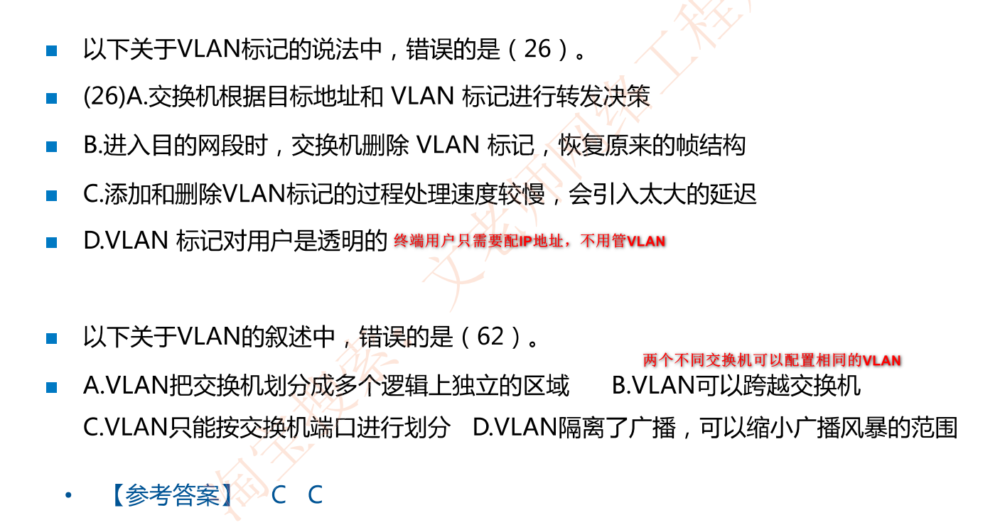
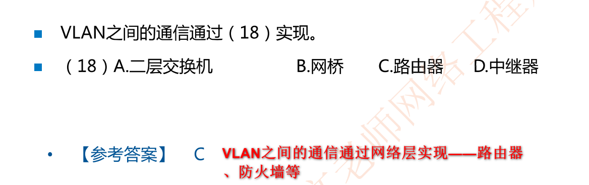

# 虚拟局域网VLAN(高频考点)

## 虚拟局域网VLAN简介

- 虚拟局域网(Virtual Local Area Netwok，VLAN)
- 根据管理功能、组织机构或应用类型对交换局域网进行分段而形成的**逻辑网络**
- **虚拟局域网工作站可以不属于同一物理网段，任何交换端口都可以分配给某个VLAN,属于同一VLAN的所有端口构成一个广播域。**
- 不同VLAN通信必须经过**三层设备**（路由器、三层交换机、防火墙等)

### 冲突域和广播域

- 冲突域和广播域，一个中继器和集线器是一个冲突域(同时只能有1个用户使用链路)
- **一个VLAN为一个广播域，交换机的一个接口为一个冲突域**(记住)

### VLAN的划分方式

VLAN划分：基于端口、基于MAC、基于策略、基于协议

## VLAN作用

**(1) 控制网络流量**。一个VLAN内部的通信（包括广播通信)不会转发到其他VLAN中去，从而有助于**控制广播风暴，减小冲突域**，提高网络带宽的利用率。

**(2)提高网络的安全性**。可以通过配置VLAN之间的路由来提供广播过滤、安全和流星控制等功能。不同VLAN之间的通信受到限制，提高了企业网络的安全性。

**(3)灵活的网络管理**。VLAN机制使得工作组可以突破地理位置的限制而根据管理功能来划分。如果根据MAC地址划分VLAN，用户可以在任何地方接入交换网络，实现移动办公。

## 交换机VLAN划分

- 静态划分VLAN：**基于交换机端口**(日常使用最多、比如一个端口划分为一个VLAN)
- 动态划分VLAN：**基于MAC地址**(提前录好MAC地址，分划在不同VLAN)、**基于策略**(校园网常用如学生在一个VLAN，老师在一个VLAN)、基于网络层协议、基于网络层地址

## 交换机的端口类型

- **Access接口**:只能传送单个VLAN数据，一般用于连接PC/摄像头等终端

- **Trunk接口**:能传送多个VLAN数据，一般用于交换机之间互联

- Hybrid接口:混合接口，包含access和trunk属性

- QinQ:双层标签，一般用于运营商城域网
  - 添加和删除VLAN标记的过程是由交换机中的**专用硬件自动实现的，处理速度很快**，不会引入太大的延迟。(如一个PC的流量进到交换机口要为该数据打上VLAN标签)

## 802.1Q  VLAN标签的标准(重点，经常考)

### 例题

