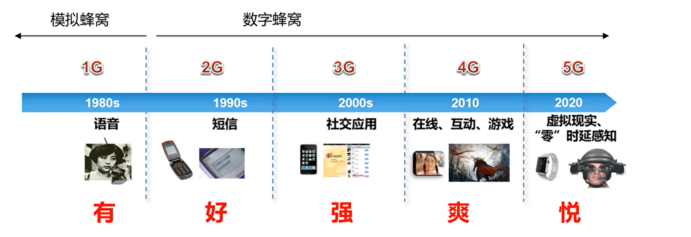
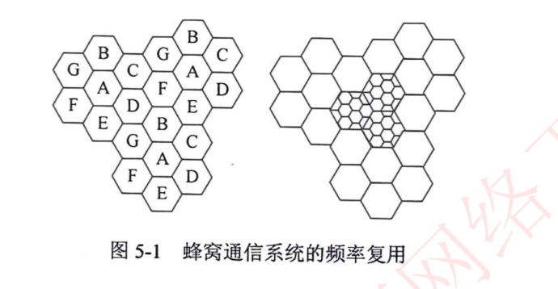
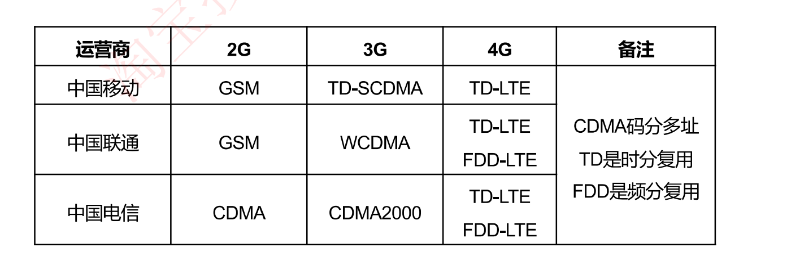
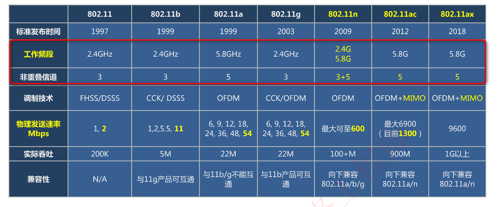
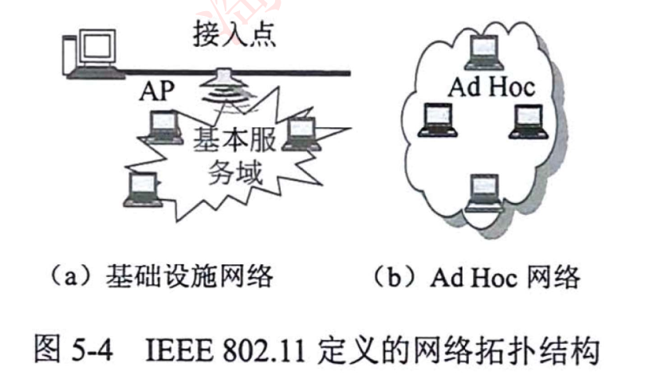
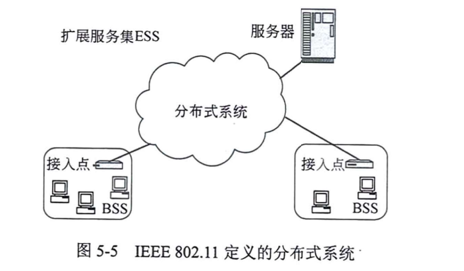
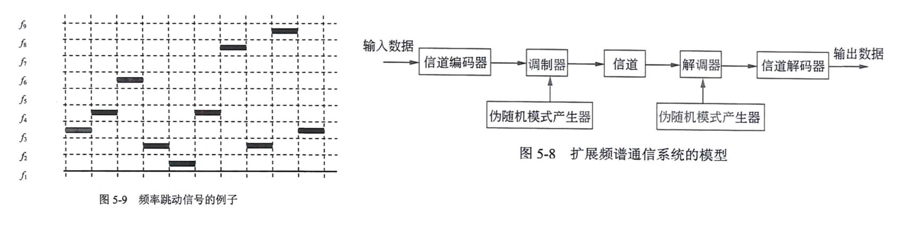
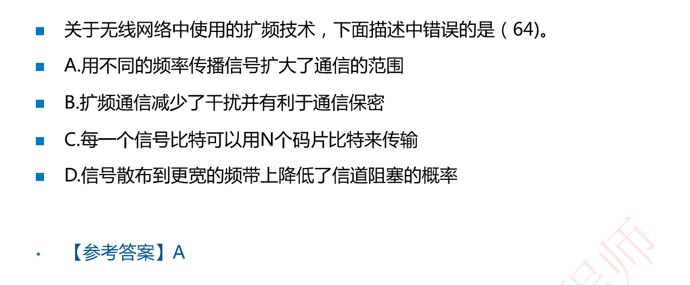
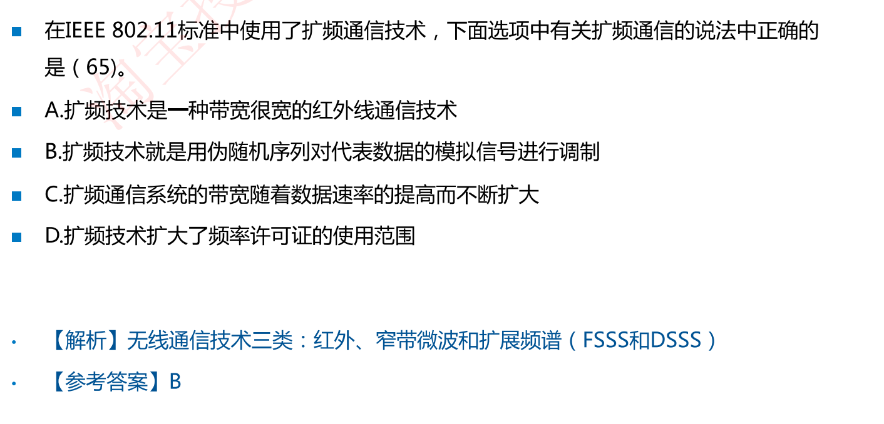

# 5-2 WLAN基础

## 移动通信基础

### 移动通信的发展历程（了解）

### 移动通信的制式（了解）

## 802.11标准（经常考选择）

WLAN(Wireless Local Area Network)：无线局域网，组成无线局域网的技术有很多，如蓝牙、红外、基于802.11协议的WLAN（即WiFi）

WiFi：即基于802.11协议的WLAN。所有802.11产品都会经过WiFi联盟测试，通过测试之后贴WiFi标志

802.11协议共计7个协议，教材上面只有5个

务必要记住各个802.11标准的**工作频段**，**不重叠信道**个数

## WLAN的网络分类（偶尔考选择）

WLAN有2种类型的网络

- 基础设施网络(Infrastructure Networking)通过无线接入点AP接入
- **特殊网络(Ad Hoc Networking)**：不通过无线AP，仅通过计算机之间的自组建网络，如军用/寝室打局域网游戏（考点，后续讲解）
- 分布式系统：通过一台服务器把很多个无线AP集中控制起来，形成大的无线网络

### 例题

## WLAN通信技术

无线网主要使用三种通信技术：**红外线、扩展频谱和窄带微波技术**（记住名字即可，使用最多的是扩展频谱技术，扩频技术主要有2种）

**扩展频谱通信**：将信号散布到更宽的带宽上以**减少发送阻塞和干扰**的机会

WLAN主要使用的有2种**扩展频谱技术**：频率跳动扩频FHSS和直接序列扩展频谱DSSS（**记住直接序列扩展频谱DSSS通过伪随机模式产生器生成伪随机数来实现扩频**）

### 例题

解析：A通信范围取决于功率；B**扩展频谱通信**：将信号散布到更宽的带宽上以**减少发送阻塞和干扰**的机会

解析：C带宽不能一直不断扩大；D频率许可证由国家法律规定