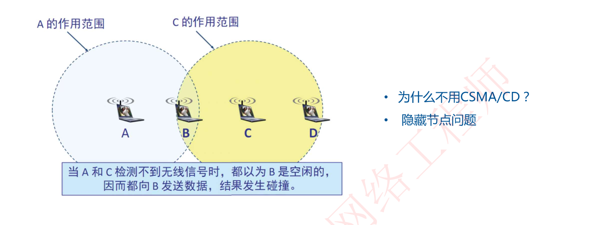
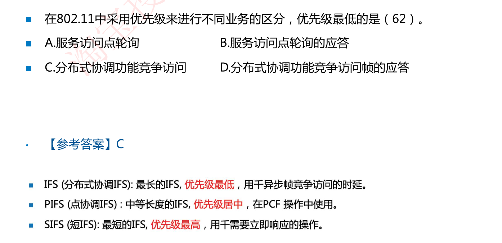
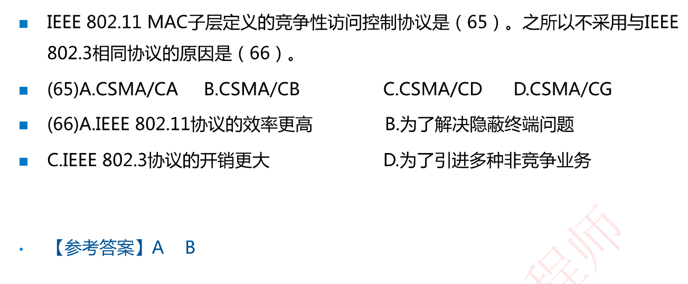
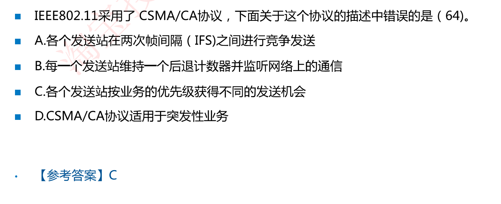

# 5-4 802.11的MAC层（考选择）

## 802.11MAC层简介

802.11无线协议标准为MAC子层定义了3种访问控制机制

- CSMA/CA（载波监听多点接入/冲突避免）分布式协调功能：大家争用访问
- 如何避免冲突——RST/CTS信道预约：要发生先打报告，其他终端记录信道占用时间
- PCF点协调功能：由AP集中轮询所有终端，将发送权限轮流交给各个终端（类似令牌环，有令牌才能发送）

### 为什么不用CSMA/CD？

有线连接使用CSMA/CD，其产生冲突很好检测：如果线路上有冲突，电平高低叠加就会发生变化，因而可以检测到冲突；

而在无线连接当中，存在隐藏节点问题：比如下图A、B、C三个终端，A、C的作用范围如下，A、C彼此看不到彼此。当A、C检测不到无线信号时，都以为B是空闲的，因而都向着B发送数据，结果产生碰撞

## 802.11三种帧间间隔（详见湖科大计网随机接入CSMA/CA协议）

**IFS(分布式协调IFS)**：最长的IFS，**优先级最低**，用于异步帧竞争访问的时延。

**PIFS(点协调IFS)**：中等长度的IFS，**优先级居中**，在PCF 操作中使用。

**SIFS (短IFS)**：最短的IFS，**优先级最高**，用千需要立即响应的操作。

## 例题

