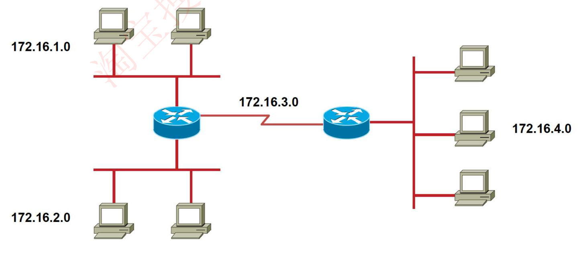
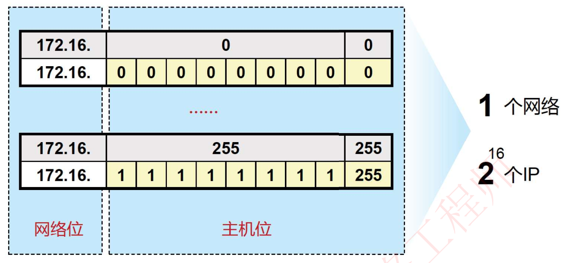
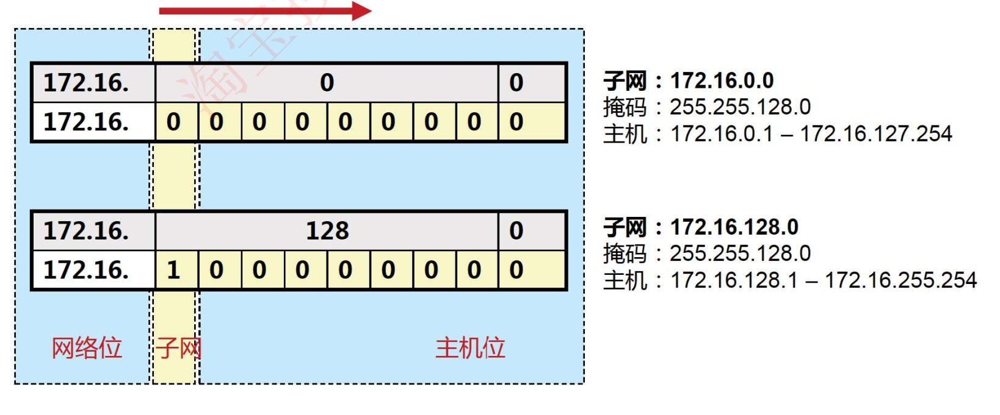
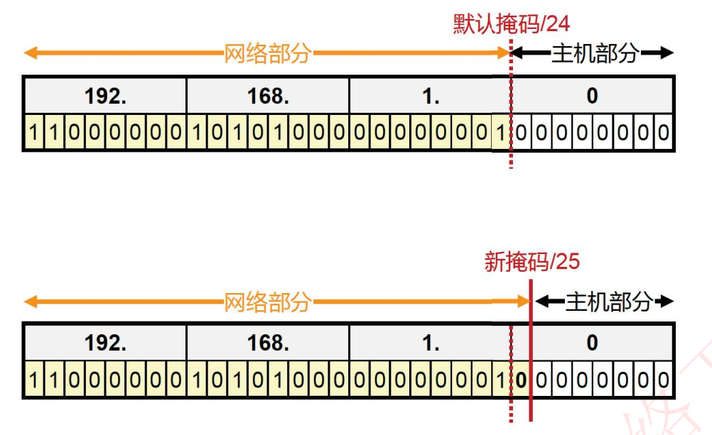
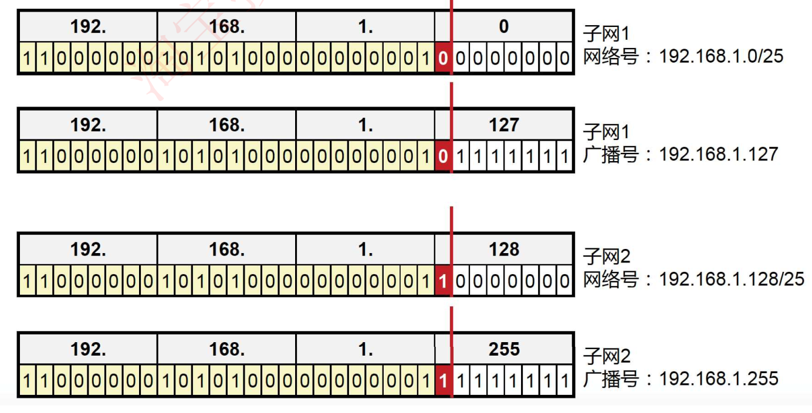
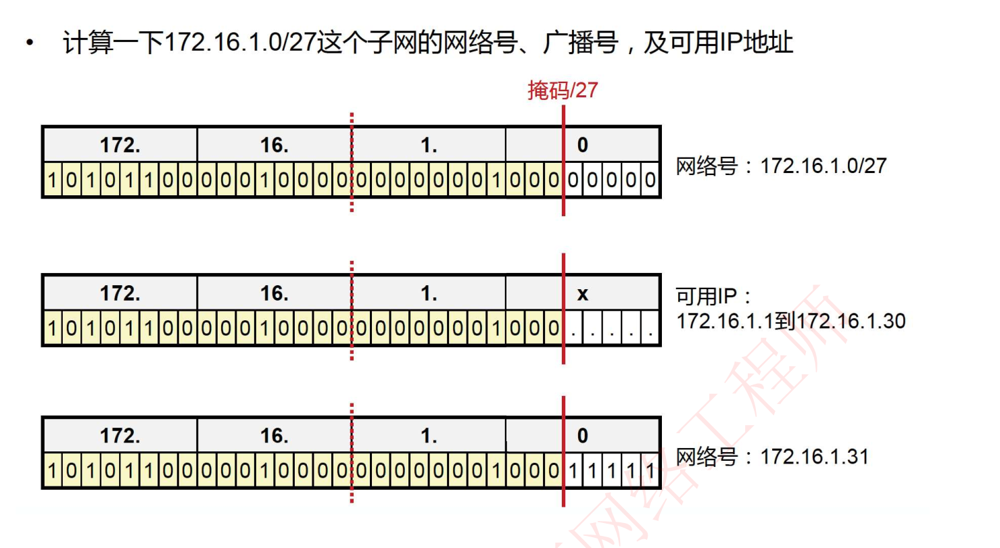
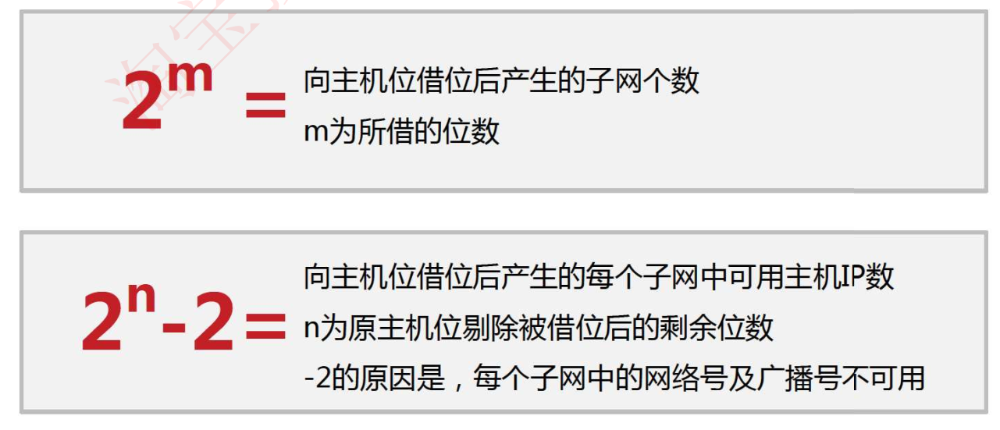
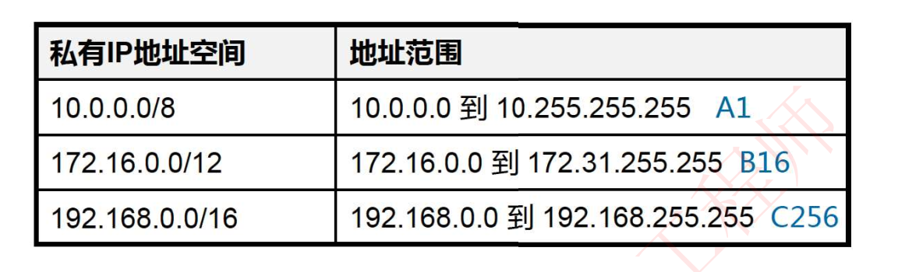

# 6-10 VLSM子网划分

## 划分子网的引入

假设一个公司网络内有500台主机

- 分配一个C类网络IP地址，则可分配给主机使用的IP地址共计2^8^-2=253个，不够用
- 分配一个B类网络IP地址，则可分配给主机使用的IP地址共计2^16^-2=65534个，又会造成极大浪费

为了解决一下问题：

- 标准ABC类网络问题
- IP地址空间浪费
- 一个广播域中PC数量庞大，造成广播风暴，网络可能被广播报文消耗大量资源

对一个`172.16.0.0/16`这样一个B类地址，还可以进行如下的子网划分

- 172.16.1.0/24
- 172.16.2.0/24
- 172.16.3.0/24
- ……

## 如何进行子网划分——网络位向主机位借位

假设我们有一个`172.16.0.0/16`这样一个B类地址，则对于`172.16.0.0`这个网络，拥有2^16^=65535个IP地址

**网络位向主机位借位**，从而使得网络部分的位数加长

### 子网划分示例

#### 示例1

将192.168.1.0/24这个C类地址进行子网划分，网络位向主机位借1位

可以分析两个子网的网络号、广播号

将192.168.1.0/24这个C类地址进行子网划分，网络位向主机位借1位

#### 示例2

### 子网数量及每个子网的主机数量

## 公有IP和私有IP

IPv4地址空间中有一部分特殊的地址，称之为私有IP地址，私有IP地址不能直接访问公网（因特网）的IP，只能在本地使用（RFC 1918文档定义）

若需访问则需在网络出口处做NAT网络地址转换，转换为公网IP

