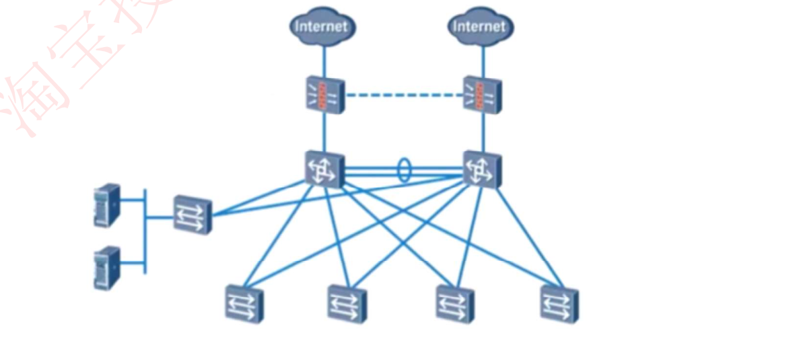
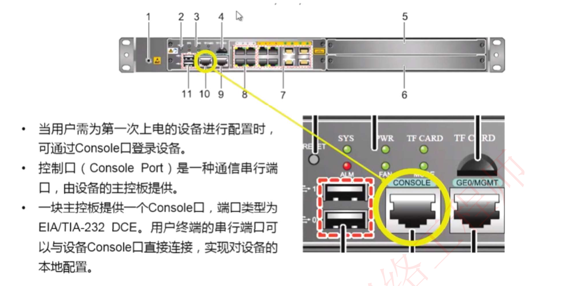
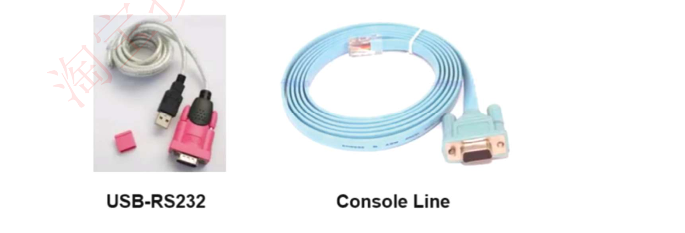
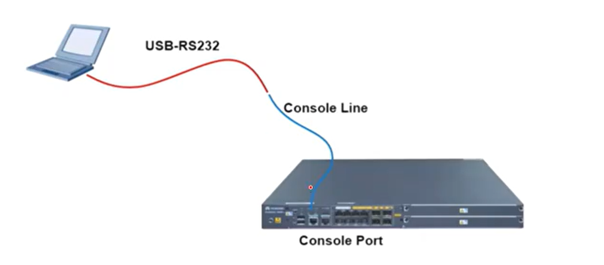
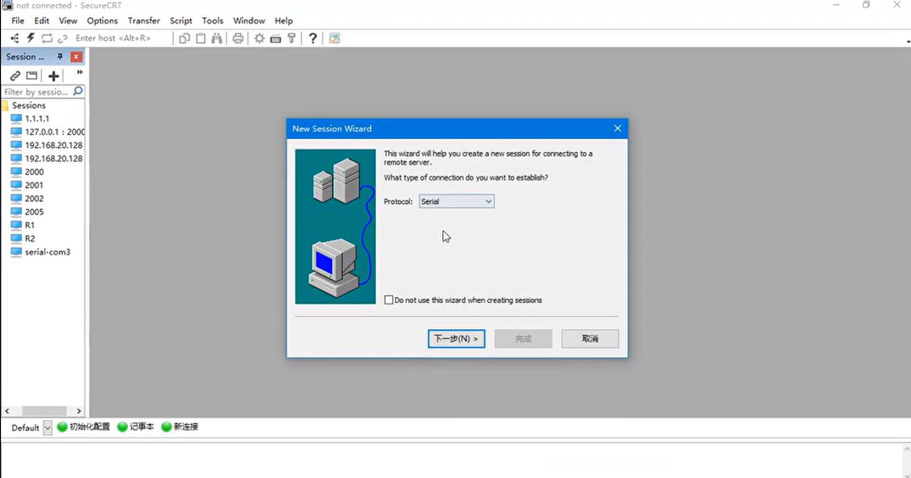
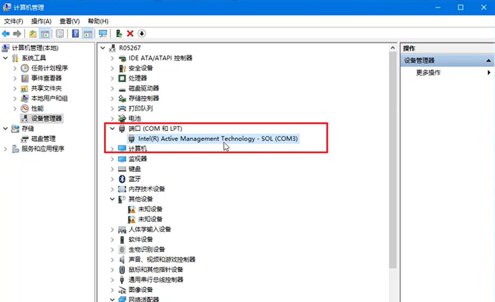
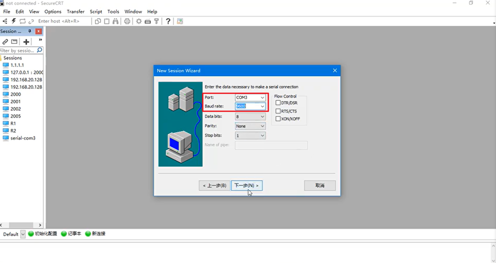
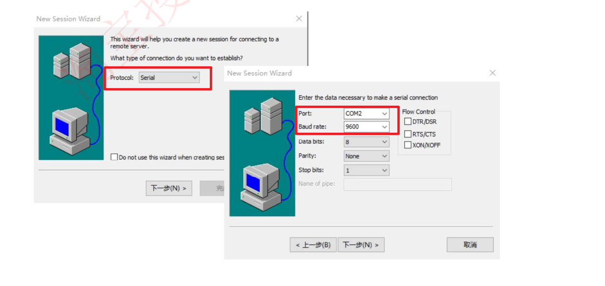
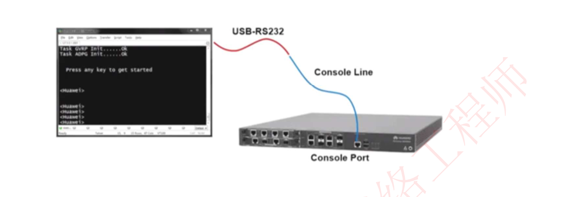
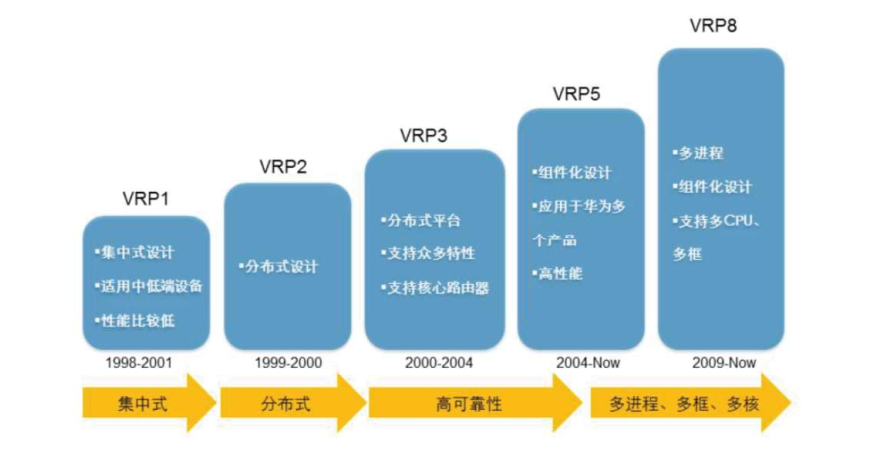

# 6-15 华为设备管理与VRP基础

## 前言

网络包含诸多设备：路由器、交换机、防火墙、负载均衡、流控

网络工程师完成规划设计，**设备调试**，网络优化，故障排除

掌握设备配置管理方法是基础

## 接口和线缆认识

### Console接口

当用户需为第一次上电的设备进行配置时，可通过Console口登录设备。

控制口( Console Port )是一种通信串行端口，由设备的主控板提供。

一块主控板提供一个Console口，端口类型为EIA/TIA-232 DCE。用户终端的串行端口可以与设备Console口直接连接，实现对设备的本地配置。

### 线缆认识

Console线缆一端为RJ45水晶头，一端为串口接头

- RJ45接口用于连接Console接口
- 另一端串口接头连接PC

现在大部分笔记本没有串口，因此时候用USB-RS232转接线（上图，网络工程师常备）线缆完成转接，连接效果如下图所示

## 登录和管理网络设备操作步骤

连接好线缆之后，PC上需要事先安装一个SecureCRT软件（网络工程师必备）

- 打开软件

- 新建连接

- 选择登录协议为Serial串行口

  

- 选择是哪一个串行口（计算机——管理——设备管理器——端口（COM和LPT）——展开显示即为我们当前连接的串行口）

- 填写串口、波特率（一般填写9600），其余默认

- 建立连接后，双击进入即可连接成功，进入后可以看到设备如交换机、路由器配置界面

### SecureCRT终端设置注意事项

## CLI(Command Line Interface)命令行界面

用户登录到交换机出现命令行提示符后，进入命令行接口CLI

命令行接口是用户与交换机进行交互的常用工具

## VRP——华为数通设备通用操作系统平台

通用路由平台VRP ( Versatile Routing Platform）是华为数据通信产品的通用操作系统平台，它以IP业务为核心，采用组件化的体系结构，在实现丰富功能及特性的同时，提供基于应用的可裁剪能力和可扩展能力。

VRP其实就是运行在华为产品上的操作系统，就像Windows系统与PC，IOS系统对于苹果终端。

VRP的最底层是Linux

华为一般网络设备使用VRP5，高端设备使用VRP8

### Mimi USB口登录

华为AR2200系列路由器还支持通过Mini USB口与主机USB口建立连接，实现对设备的调试和维护。在管理设备时，Console接口和Mini USB接口互斥，即同一时刻只能使用其中的1个接口连接到VRP。

## 总结与思考

如果路由器收到了网络中主机发送的广播，如何操作?

- 当路由器收到该广播报文时，路由器会根据数据包内容进行处理，可能会对必要广播报文（如请求路由器MAC地址的ARP广播）进行回应，但不会将该数据包转发到其他广播域。

华为数通设备目前使用的VRP版本是多少?

- 目前，大多数华为数通产品使用的是VRP5版本，少数产品如NE系列路由器使用的是VRP8版本。